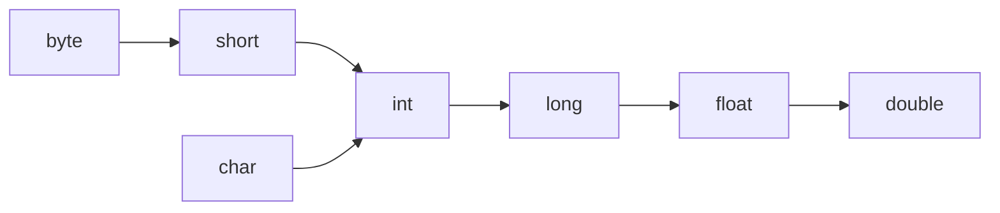

## 自动类型转换


当 java 程序在进行赋值或者运算时，精度小的类型自动转换为精度大的数据类型，这个就是自动类型转换。


数据类型按精度（容量）大小排序为：





自动类型转换注意和细节如下：

1. 有多种类型的数据混合运算时，系统首先自动将所有数据。转换成容量最大的那种数据类型，然后再进行计算。
2. 当我们把精度（容量）大的数据类型赋值给精度（容量）小的数据类型时，就会报错，反之就会进行自动类型转换。
3. `byte`, `short` 和  `char` 之间**不会**相互自动转换。
4. `byte` , `short` , `char` 他们三者可以计算，在计算时首先转换为 `int` 类型。

	当把具体数赋给 `byte` 类型时，应当先判断该数是否在 `byte` 范围 (-127-128) 内，如果在即可以。

5. `boolean` 不参与转换。
6. 自动提升原则：表达式结果的类型自动提升为操作数中最大的类型

## 强制类型转换


自动类型转换的逆过程，**将容量大的数据类型转换为容量小的数据类型**。使用时要加上强制转换符 `()`，但可能造成**精度降低或溢出，**格外要注意。


如：


```java
int i = (int)1.9;
System.out.println(i); // 1

int j = 129;
byte b1 = (byte)j;
System.out.println(b1); // -127
```


强制类型转换细节说明如下：

1. 当进行数据类型的大小从大到小时，就需要使用到强制转换
2. 强转符号只针对于最近的操作数有效，往往会使用小括号提升优先级

	```java
	//int x=(int)10*3.5+6*1.5; // error: incompatible types
	int y =(int)(10*3.5+6*1.5);
	```

3. `char` 类型可以保存  `int` 的常量值，但不能保存 `int` 的变量值，需要强转。

	```java
	char c1 = 100; // ok
	int m = 100; // ok
	char c2 = m; // error: incompatible types
	char c3 =(char)m; // ok
	System.out.println(c3); // 100 对应的字符: d
	```

4. `byte` 和 `short` ,  `char` 类型在进行运算时，当做 `int` 类型处理。
