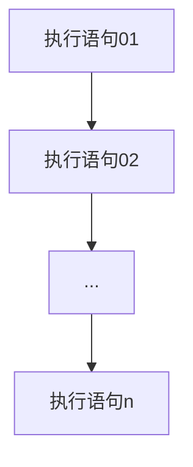

程序从上到下逐行地执行，中间没有任何判断和跳转。





Java 中定义变量时采用合法的前向引用。如：


```java
public class Test{
	int num1 = 12;
	int num2 = num1 + 2;
}
```


错误形式：


```java
public class Test{
	int num2 = num1 +2;//错误
	int num1 = 12;
}
```

