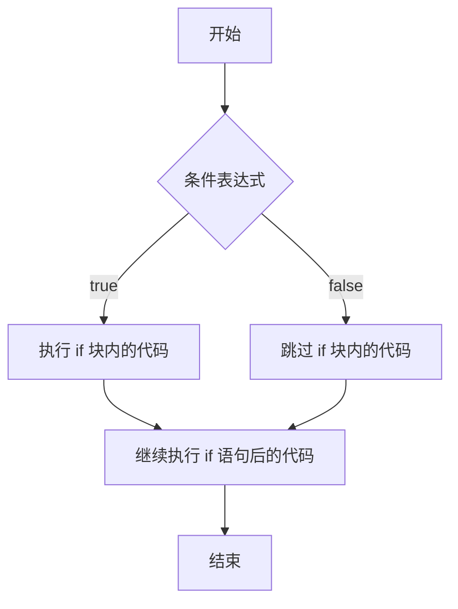
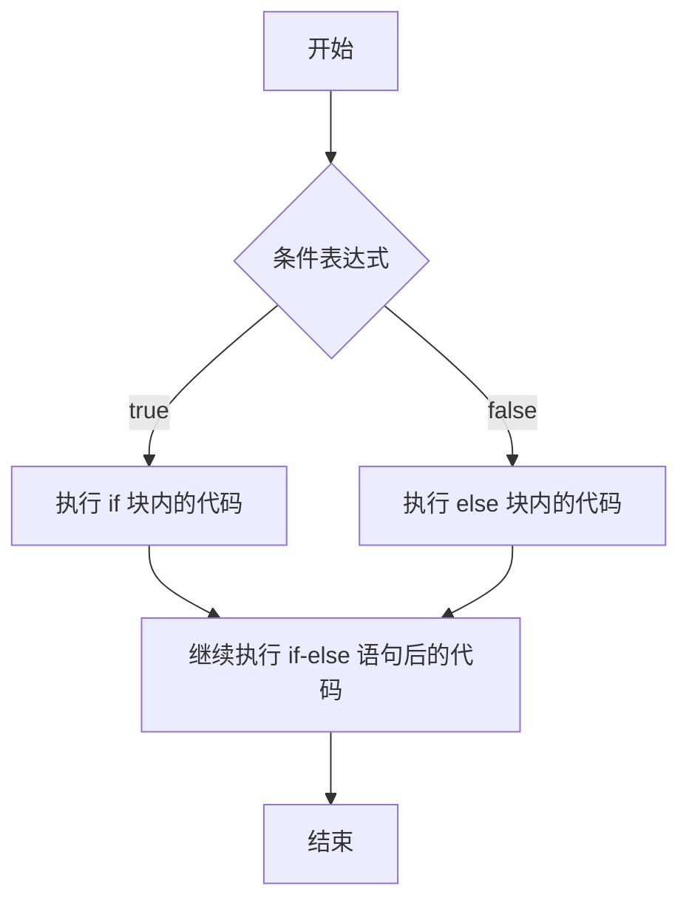
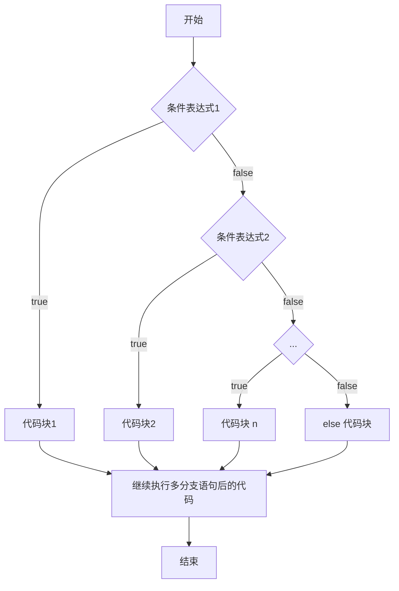

让程序有选择的的执行，分支控制有三种：

1. 单分支 `if`
2. 双分支 `if-else`
3. 多分支 `if-else if -....-else`

## 单分支


基本语法：


```java
if (condition) {
  // block of code to be executed if the condition is true
}
```


说明：当条件表达式为 `ture` 时，就会执行 `{}` 中的代码。如果为 `false` ，就不执行。特别说明，如果 `{}` 中只有一条语句，则可以不用`{}` ，但建议不要省略。





## 双分支


基本语法：


```java
if (condition) {
  // block of code to be executed if the condition is true
} else {
  // block of code to be executed if the condition is false
}
```


说明：当条件表达式成立，即执行代码块 1，否则执行代码块 2。如果执行代码块中只有一条语句，则 `{}` 可以省略，但不建议省略。





## 多分支


基本语法：


```java
if (condition1) {
  // block of code to be executed if condition1 is true
} else if (condition2) {
  // block of code to be executed if the condition1 is false and condition2 is true
} else {
  // block of code to be executed if the condition1 is false and condition2 is false
}
```


说明：

1. 多分支 可以没有 `else` ，如果所有的条件表达式都不成立，则一个执行入口都没有
2. 如果有 `else` ，如果所有的条件表达式都不成立，则默认执行 `else` 代码块。



