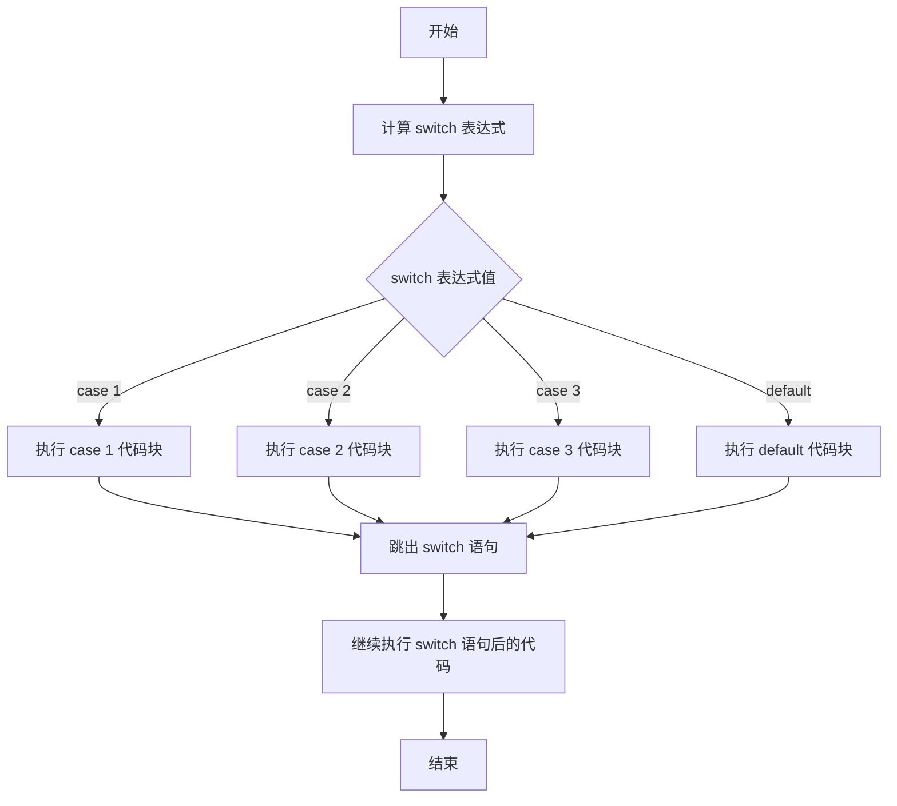

基本语法：


```java
switch(expression) {
  case x:
    // code block
    break;
  case y:
    // code block
    break;
  default:
    // code block
}
```


工作方式：

1. `switch` 表达式只被评估一次。
2. `expression` 的值与每个 `case` 的值进行比较。
3. 如果匹配，执行相关联的代码块。
4. 如果没有一个匹配，执行 `default`  。
5. `break` 和 `default` 关键字是可选的。




`switch` 注意事项和细节讨论：

1. 表达式数据类型，应和 `case` 后的常量类型一致，或者是可以自动转成可以相互比较的类型，比如 `expression` 是字符，而 `case` 后是 `int` 。
2. `switch(expression)` 中 `expression` 的返回值必须是：`byte` , `short` , `int` , `char` , `enum` , `String` 。

	```java
	double c = 1.1;
	switch(c){ // error
		case 1.1 : // error
			System.out.println("ok");
			break;
	```

3. `case`子句中的值必须是常量，而不能是变量
4. `default` 子句是可选的，当没有匹配的`case`时，执行`default`
5. `break` 语句用来在执行完一个 `case` 分支后使程序跳出 `switch` 语句块；如果没有写 `break` ，程序会顺序执行到 `switch` 结尾，除非遇到`break`  。
