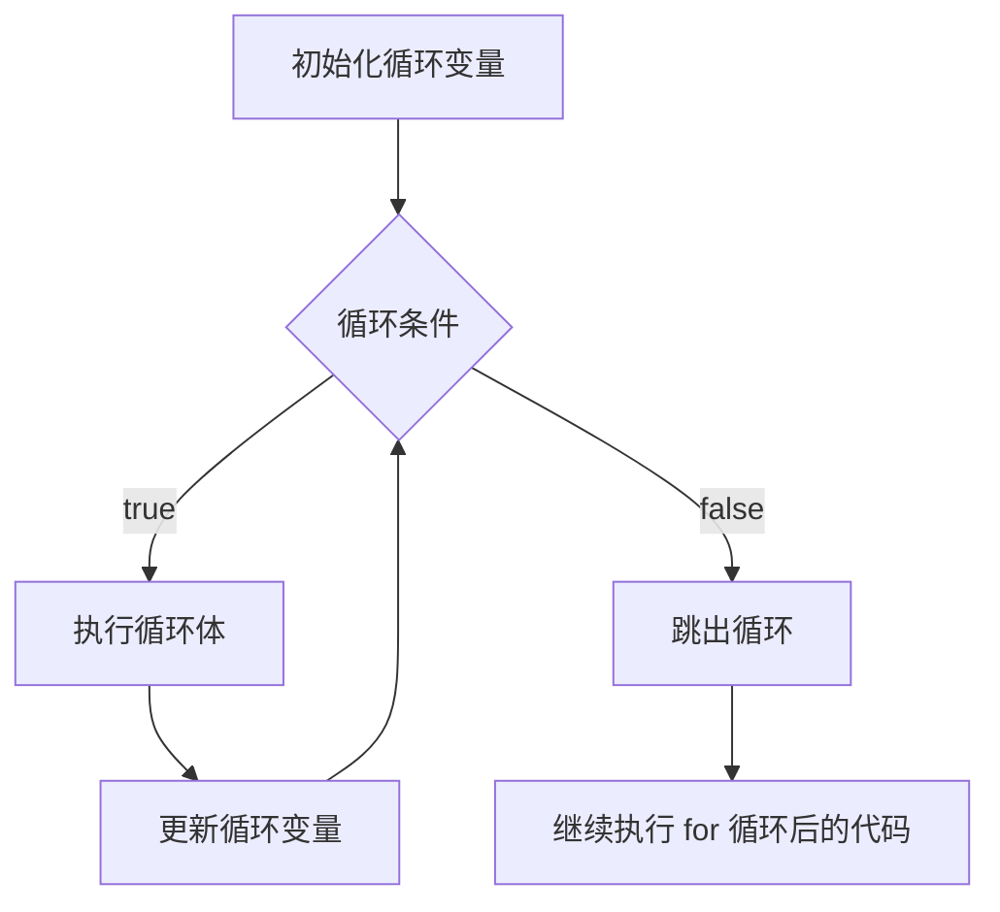

基本语法：


```java
for (statement 1; statement 2; statement 3) {
// code block to be executed
}
```

- `statement 1` 在代码块执行前执行（一次）。
- `statement 2` 定义了执行代码块的条件。
- `statement 3` 在代码块执行后执行（每次）。




注意事项和细节说明

1. 循环条件是返回一个布尔值的表达式
2. `For` 循环可省略为： `for (; statement 2; )` ，其中中的初始化和变量迭代可以写到其它地方，但是两边的分号不能省略。
3. 循环初始值可以有多条初始化语句，但要求类型一样，并且中间用逗号隔开，循环变量迭代也可以有多条变量迭代语句，中间用逗号隔开。
