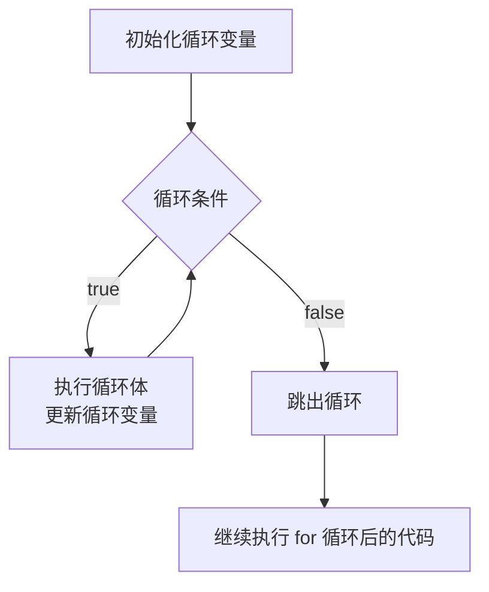

基本语法：


```java
while (condition) {
  // code block to be executed
  }
```


`while` 循环会在指定条件为 `true` 时循环执行循环体。



```mermaid
graph TD
    B[初始化循环变量]
    B --> C{循环条件}
    C -->|true| D[执行循环体
    更新循环变量]
    D --> C
    C -->|false| E[跳出循环]
    E --> G[继续执行 for 循环后的代码]
```


注意事项和细节说明

1. 循环条件是返回一个布尔值的表达式
2. `while` 循环是先判断再执行语句
