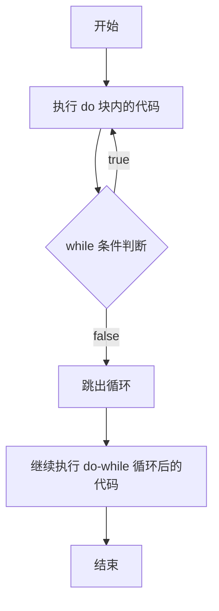

`do/while` 循环是 `while` 循环的一种变体。这种循环会在检查条件是否为真之前先执行一次代码块，然后只要条件为真就会重复循环。


基本语法：


```java
do {
  // code block to be executed
}
while (condition);
```





注意事项和细节说明：

1. 循环条件是返回一个布尔值的表达式
2. `do/while` 循环是先执行，再判断， 因此它至少执行一次
