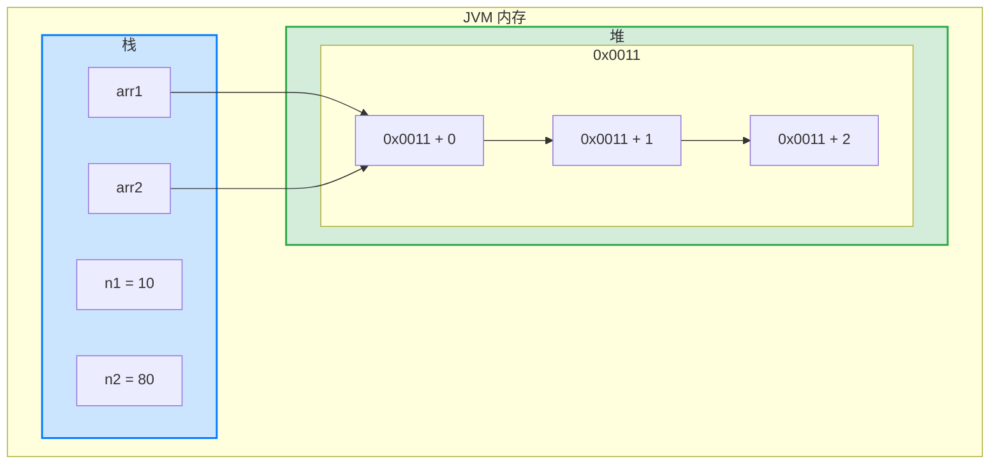

基本数据类型赋值，这个值就是具体的数据，而且相互不影响。


```java
int n1 = 10;
int n2 = n1;
n2 = 80;
System.out.println("n1 =" + n1); //10
System.out.println("n2 ="+ n2); //80
```


数组在默认情况下是引用传递，赋的值是地址。


```java
int[] arr1 = {1,2，3};
int[] arr2 = arr1;

arr2[0]= 10;
// arr1 = {10, 2, 3}
// arr2 = {10, 2, 3}
```


在 Java 中，基本类型（如 `int`）的常量和变量是存储在栈内存中的，而不是堆内存。常量 `n1` 的值 `10` 直接存储在栈内存中，而不是通过引用指向堆中的某个地址。上述赋值的内存图如下：




