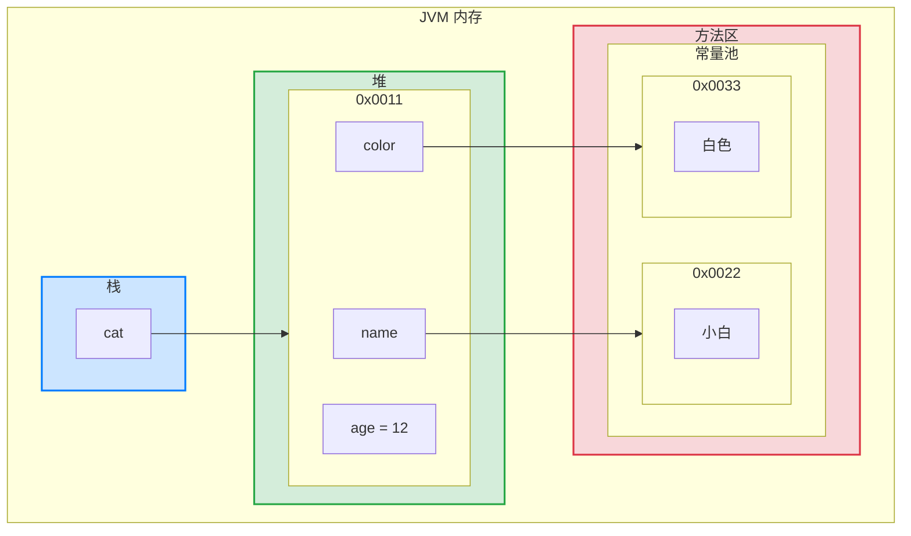

## 什么是 OOP


OOP 代表面向对象编程。


过程编程是关于编写对数据执行操作的过程或方法，而面向对象编程是关于创建同时包含数据和方法的对象。


面向对象编程比过程编程有几个优点：

1. OOP 更快，更容易执行。
2. OOP 为程序提供了一个清晰的结构。
3. OOP 有助于保持 Java 代码 DRY, ”Don't Repeat Yourself”，并使代码更容易维护，修改和调试 OOP 使得用更少的代码和更短的开发时间创建完全可重用的应用程序成为可能

> 💡 “Don't Repeat Yourself” (DRY) 原则是关于减少代码的重复。您应该提取应用程序通用的代码，并将它们放在一个地方并重复使用它们，而不是重复使用它们。


## **什么是类和对象**


类和对象是面向对象编程的两个主要方面。查看下图，了解类和对象之间的区别：


| class | objects |
| ----- | ------- |
| Fruit | Apple   |
|       | Banana  |
|       | Mango   |


另一个例子：


| class | objects |
| ----- | ------- |
| Car   | Volvo   |
|       | Audi    |
|       | Toyota  |


因此，类是对象的模板，对象是类的实例。当创建单个对象时，它们从类继承所有变量和方法。


## 类与对象


Java 中的所有内容都与类和对象以及其属性和方法相关联。例如：在现实生活中，汽车是一个物体。汽车具有属性，例如重量和颜色，以及方法，例如驱动和制动。类就像一个对象构造函数，或者一个用于创建对象的 “蓝图”。


### 创建一个类


要创建类，请使用关键字 `class`:


```java
class Cat {
	// 属性/成员变量
	String name;
	int age;
	String color;
}
```


在[标识符的命名规则和规范](/14f9f1fc15a380e6866ffdcbc0036b8a#14f9f1fc15a38086a152d78c68ec3379)一节中，类应该总是以大写的第一个字母开头，并且 java 文件的名称应该与类名匹配。


### 创建一个对象


在 Java 中，对象是从类创建的。我们已经创建了名为 `Cat` 的类，所以现在我们可以使用它来创建对象。要创建 `Cat` 对象，请指定类名，后跟对象名，并使用关键字 `new` :


```java
Cat cat1 = new Cat();
cat1.name = "小白";
cat1.age = 3;
cat1.color = "白色";
```


### 对象在内存中存在形式


如下图所示：





## 属性


类属性的另一个术语是字段 (field) 或成员变量。


属性是类的一个组成部分，一般是基本数据类型，也可是引用类型（对象，数组）。比如我们前面定义 `Cat` 类 的 `age` 就是属性。属性如果不赋值，有默认值，规则和数组一致。


## Java 内存的结构分析

1. 栈（Stack）
	- **存储内容**：主要用于存储基本数据类型（如`int`、`float`、`boolean`等）的局部变量和对象的引用（指向堆中的对象）。
	- **生命周期**：栈上的数据通常是方法调用时的局部变量，它们的生命周期与方法的执行同步。一旦方法执行完毕，栈上的数据也会被清除。
2. 堆（Heap）
	- **存储内容**：堆主要用于存储 Java 对象。无论是通过 `new` 关键字创建的对象还是数组，都会被分配到堆上。
	- **生命周期**：堆上的对象的生命周期由垃圾收集器管理。对象在不再被引用时会被标记为垃圾，并在垃圾回收时被清理。
3. 方法区（Method Area）
	- **存储内容**：方法区存储了类的结构信息，如运行时常量池、字段和方法数据、静态变量、即时编译器编译后的代码等。
	- **生命周期**：方法区（Method Area）在 Java 的内存模型中是一个特殊的区域，它的生命周期与 Java 虚拟机（JVM）的生命周期是相同的。
	- **常量池**：这里包括字符串常量池，存储了编译时生成的字符串常量和运行时动态生成的字符串（如果使用 `String.intern()` 方法）。常量池是方法区的一部分，专门用于存储编译期生成的各种字面量和符号引用。
