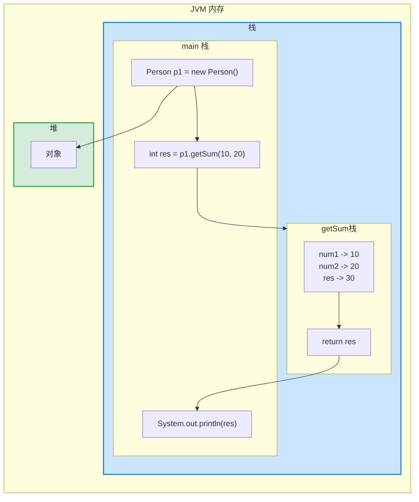

在某些情况下，我们要需要定义成员方法(简称方法)。比如人类：除了有一些属性外(（年龄，姓名）,我们人类还有一些行为比如：可以说话、跑步，通过学习，还可以做算术题。这时就要用**成员方法**才能完成。


例如，对于一个  `Person` 类，添加：

1. `speak` 成员方法,输出 “我是一个好人”。
2. 添加 `cal01` 成员方法，可以计算从 `1+...+1000` 的结果。
3. 添加 `cal02` 成员方法，该方法可以接收一个数 `n`，计算从 `1+...+n` 的结果。
4. 添加 `getSum` 成员方法，可以计算两个数的和。

```java
class Person {
	String name;
	int age;
	
	// 方法(成员方法)
	
	// 添加 speak 成员方法,输出 “我是一个好人”
	public void speak() {
		System.out.println("我是一个好人");
	}
	
	// 添加 cal01 成员方法,可以计算从 1+...+1000 的结果
	public void cal01() {
		int res = 0;
		for(int i = 1; i <= 1000; i++) {
			res += i;
		}
		System.out.println("cal01 方法 计算结果=" + res);
	}
	
	// 添加 cal02 成员方法,该方法可以接收一个数 n，计算从 1+..+n 的结果
	public void cal02(int n) {
	int res = 0;
	for(int i = 1; i <= n; i++) {
		res += i;
		}
	System.out.println("cal02 方法 计算结果=" + res);
	}
	
	// 添加 getSum 成员方法,可以计算两个数的和
	public int getSum(int num1, int num2) {
		int res = num1 + num2;
		return res;
	}
}
```


## 方法的调用机制原理


如图所示：





过程如下：

1. 当程序执行到方法时，会在栈中开辟一个独立的空间。
2. 当方法执行完毕，或者执行到 `return`语句时，就会返回到调用方法的地方。
3. 返回后，继续执行方法后面的代码。
4. 当 `main` 方法（位于栈中） 执行完毕，整个程序退出。
