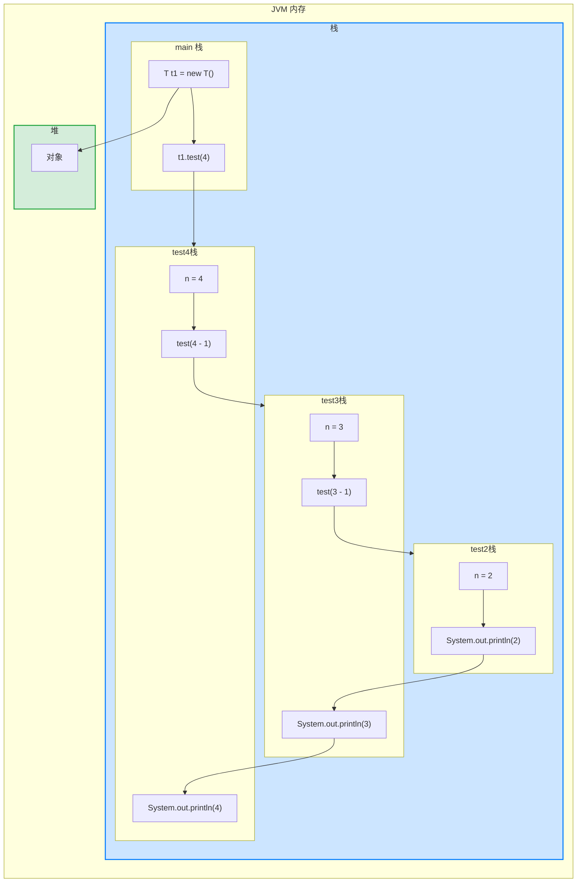

**递归就是方法自己调用自己，**每次调用时传入不同的变量。递归有助于编程者解决复杂问题，同时可以让代码变得简洁。


示例：


```java
public class Recursion01 {
	public static void main(String[] args) {
		T t1 = new T();
		t1.test(4); // 234
		}
	}

class T {
	public void test(int n) {
	if (n > 2) {
		test(n - 1);
		}
	System.out.println(n);
	}
}
```


运行示意图如下：




