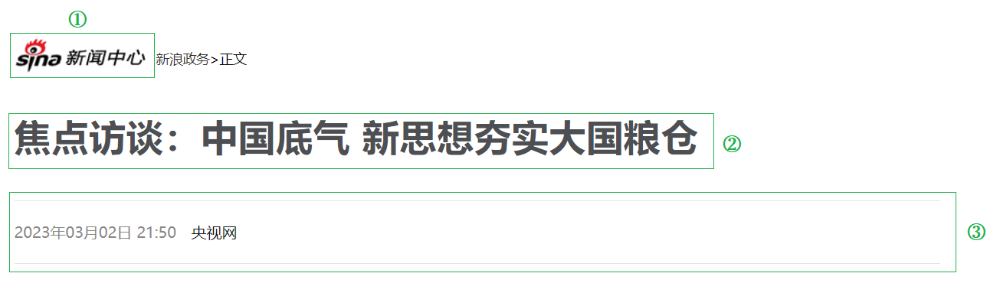
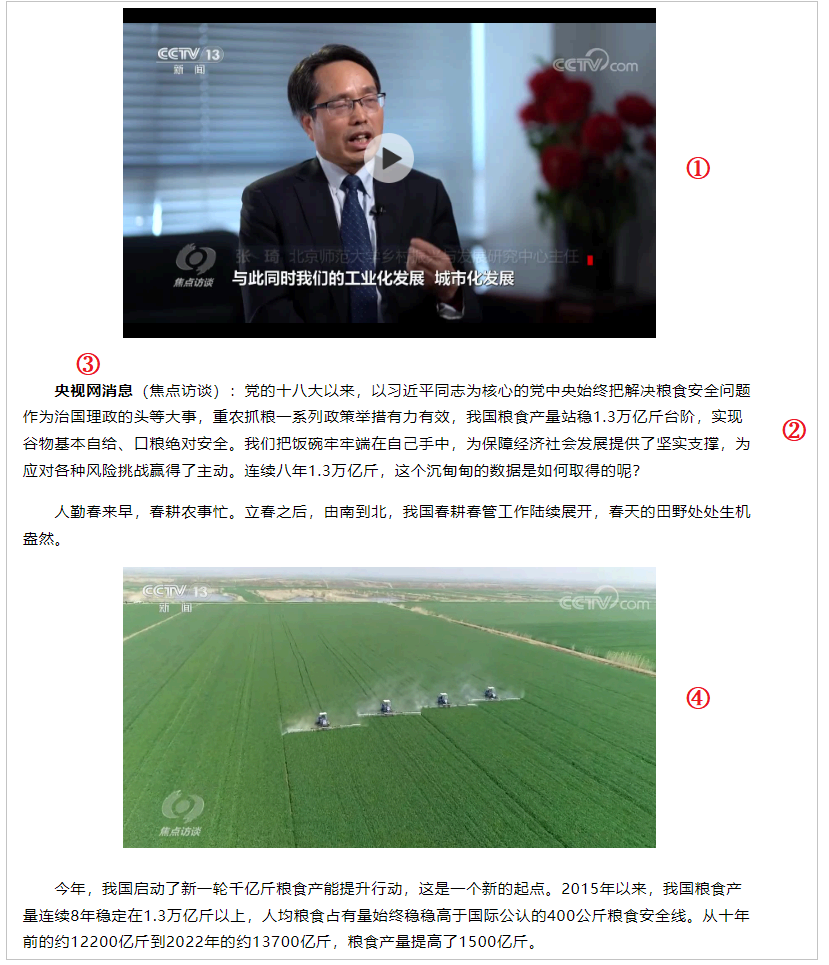
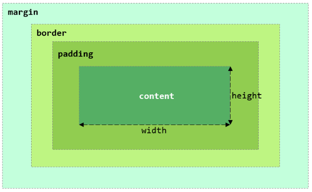
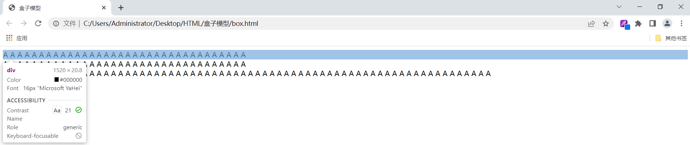
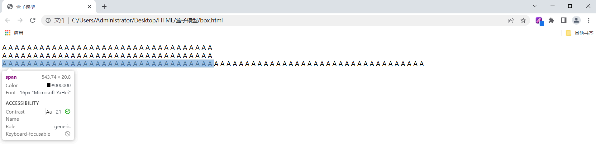
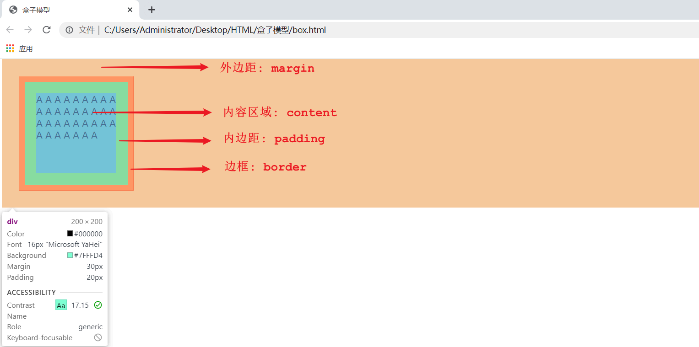
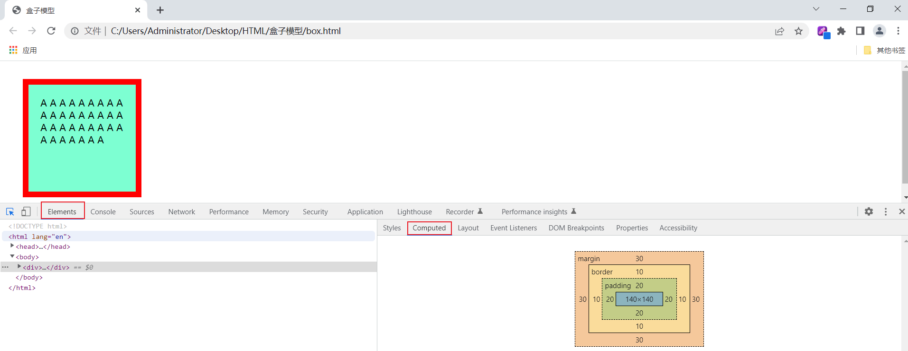

## ****前端开发介绍****


前端开发的主要职责是将数据以好看的样式呈现出来，即开发网页程序。


### ****网页的组成部分****


网页由以下部分组成：

- 文字、图片、音频、视频、超链接、表格等。

### ****网页的本质****


我们看到的网页背后本质是程序员编写的前端代码。


### ****前端代码到网页的转换****


前端代码通过浏览器解析和渲染转化为用户看到的网页。浏览器中负责解析和渲染的部分称为 **浏览器内核**。


不同的浏览器内核对相同的前端代码解析效果可能存在差异。为了解决这个问题，需要定义一套统一的标准，让各大浏览器厂商参照此标准实现，这就是 **Web 标准**。


### ****Web 标准****


Web 标准也称为网页标准，由一系列标准组成，大部分由 **W3C（World Wide Web Consortium，万维网联盟）** 负责制定。它主要由以下三部分组成：

- **HTML**：负责网页的结构（页面元素和内容）。
- **CSS**：负责网页的表现（页面元素的外观、位置等页面样式，如颜色、大小等）。
- **JavaScript**：负责网页的行为（交互效果）。

为了更加快速的开发，现在也出现了很多前端开发的高级技术，例如：Vue、ElementUI、Axios 等等。


## ****HTML & CSS****


### ****什么是 HTML？****


**HTML (HyperText Markup Language)**：超文本标记语言。

- **超文本**：超越了文本的限制，比普通文本更强大，可以定义图片、音频、视频等内容。
- **标记语言**：由标签构成的语言。

HTML 标签都是预定义好的。例如：`<h1>` 标签展示标题，`<a>` 展示超链接，`` 展示图片，`<video>` 展示视频。


HTML 代码直接在浏览器中运行，HTML 标签由浏览器解析。


### ****什么是 CSS？****


**CSS (Cascading Style Sheet)**：层叠样式表，用于控制页面的样式（表现）。


## ****HTML 快速入门****


HTML 有固定的基本结构：

- `<title>` 中定义标题，显示在浏览器的标题位置。
- `<body>` 中定义的内容，会呈现在浏览器的内容区域。

```html
<html>
     <head>
         <title>HTML 快速入门</title>
     </head>
     <body>
         <h1>Hello HTML</h1>
         
     </body>
 </html>
```


HTML 语法相对松散，主要体现在以下几个方面：


**1. 标签：**

- **允许部分标签不闭合：** HTML 允许一些标签不闭合，例如 `<br>` (换行符), `` (图片), `<input>` 等。 虽然 HTML5 规范中建议所有标签都应该闭合，但浏览器通常能正确解析没有闭合的这些标签。
- **可能出现嵌套错误：** 例如， `<div><span><div></span></div>` 这种嵌套错误，虽然是不规范的，但浏览器通常会尽力解析，而不是报错。

**2. 属性值：**

- **引号非强制：** 属性值可以使用单引号、双引号或不使用引号。例如： `<div class=myclass>`、`<div class="myclass">`、`<div class='myclass'>` 这三种写法都是有效的。
- **大小写不敏感：** 标签和属性名通常大小写不敏感，`<DIV>` 和 `<div>` 效果相同，`CLASS="myclass"` 和 `class="myclass"` 效果相同。

**3. 空格和换行：**

- **忽略多余空格和换行：** 在 HTML 中，多个空格和换行符通常会被浏览器解析成一个空格。这允许代码编写者在保持代码可读性的同时，不必担心因空格和换行符而影响页面的显示效果。

**4. 错误处理：**

- **容错性强：** 浏览器通常会尽力解析不规范的 HTML 代码，而不是直接报错。例如，如果出现未知的标签或属性，浏览器会尝试忽略它们，而不是停止解析。

## ****基础标签 & 样式****


以新浪网一则 [新闻页面](https://news.sina.com.cn/gov/xlxw/2023-03-03/doc-imyipzuy7321600.shtml) 为例讲解常见标签及样式的作用。


### ****新浪新闻 - 标题实现****


#### ****标题排版****





**分析**：

- 第一部分：图片，使用 `` 标签。
- 第二部分：标题，使用 `<h1>` - `<h6>` 标题标签。
- 第三部分：水平分割线，使用 `<hr>` 标签。

相关标签介绍如下：

- **图片标签** **``**
	- `src`: 指定图像的 URL（可以使用绝对路径或相对路径）。
		- **路径书写方式**：
			- **绝对路径**：
				- 绝对磁盘路径：`C:\\Users\\Administrator\\Desktop\\HTML\\img\\news_logo.png`
				- 绝对网络路径：`https://i2.sinaimg.cn/dy/deco/2012/0613/yocc20120613img01/news_logo.png`
			- **相对路径**：
				- `./`：当前目录，可以省略。
				- `../`：上一级目录。
	- `width`: 图像的宽度（像素或相对于父元素的百分比）。
	- `height`: 图像的高度（像素或相对于父元素的百分比）。
	- **注意**：一般只指定 `width` 和 `height` 的一个，另一个会自动等比例缩放。
- **标题标签** **`<h1>`** **-** **`<h6>`**
	- `<h1>` 为一级标题，字体最大；`<h6>` 为六级标题，字体最小。
- **水平分割线标签** **`<hr>`**

**代码实现**：


```html
<!DOCTYPE html>
<html lang="en">
<head>
    <meta charset="UTF-8">
    <meta http-equiv="X-UA-Compatible" content="IE=edge">
    <meta name="viewport" content="width=device-width, initial-scale=1.0">
    <title>焦点访谈：中国底气 新思想夯实大国粮仓</title>
</head>
<body>
     新浪政务 > 正文
    <h1>焦点访谈：中国底气 新思想夯实大国粮仓</h1>
    <hr>
    2023年03月02日 21:50 央视网
    <hr>
</body>
</html>
```


#### ****标题样式****


在网页开发中，我们经常需要控制文字的颜色。HTML 允许我们通过 CSS (层叠样式表) 来实现这一目标。新浪新闻的标题字体颜色为灰黑色，这就是通过 CSS 样式来控制的。接下来，我们将了解如何通过 CSS 修改字体颜色以及如何使用选择器使同一标签呈现不同的字体颜色。

- **CSS 引入方式**

	CSS 样式可以以多种方式引入到 HTML 中，不同的引入方式适用于不同的场景：


	| **引入方式** | **说明**                                          | **代码示例**                                      | **适用场景**                |
	| -------- | ----------------------------------------------- | --------------------------------------------- | ----------------------- |
	| **行内样式** | 直接在 HTML 标签中使用 `style` 属性，属性值是 CSS 属性和值的键值对。    | `<h1 style="color: red;">中国新闻网</h1>`          | 适用于少量、临时的样式修改，但维护性差。    |
	| **内嵌样式** | 在 HTML 文档的 `<head>` 部分使用 `<style>` 标签定义 CSS 样式。 | `<style> h1 {color: red;} </style>`           | 适用于小型项目或单页面应用，但样式复用性不高。 |
	| **外联样式** | 通过 `<link>` 标签引入外部 CSS 文件。                      | `<link rel="stylesheet" href="css/news.css">` | 企业开发中最常用的方式，便于维护和复用。    |

- **颜色表示**

	在 CSS 中，我们可以用多种方式来表示颜色：


	| **表示方式**    | **说明**                               | **取值示例**                                                                                     |
	| ----------- | ------------------------------------ | -------------------------------------------------------------------------------------------- |
	| **关键字**     | 使用预定义的颜色名称。                          | `red`、`green`、`blue` 等                                                                       |
	| **RGB 表示法** | 使用红、绿、蓝三原色的数值组合表示颜色，每个值的取值范围是 0-255。 | `rgb(0,0,0)`（黑色）、`rgb(255,255,255)`（白色）、`rgb(255,0,0)`（红色）                                   |
	| **十六进制表示法** | 使用 `#` 开头的十六进制数字表示颜色。                | `#000000` (黑色), `#ffffff`(白色), `#ff0000`(红色), `#cccccc`（浅灰色），简写如 `#000`、`#fff`、`#f00`、`#ccc` |


以下是一个使用内嵌样式设置标题字体颜色的 HTML 代码示例：


```html
HTML

<!DOCTYPE html>
<html lang="en">
<head>
    <meta charset="UTF-8">
    <meta http-equiv="X-UA-Compatible" content="IE=edge">
    <meta name="viewport" content="width=device-width, initial-scale=1.0">
    <title>焦点访谈：中国底气 新思想夯实大国粮仓</title>
    <!-- 方式二: 内嵌样式 -->
    <style>
        h1 {
            color: #4D4F53; /* 设置标题颜色为灰黑色 */
        }
    </style>
</head>
<body>
     新浪政务 > 正文
    <h1>焦点访谈：中国底气 新思想夯实大国粮仓</h1>
    <hr>
    2023年03月02日 21:50 央视网
    <hr>
</body>
</html>
```


这段代码中，我们使用了内嵌样式，通过 `h1 { color: #4D4F53; }` 将页面中所有 `<h1>` 标签的字体颜色设置为指定的灰黑色。


为了更精细地控制页面元素的样式，我们需要使用 CSS 选择器。

- **CSS 选择器**

	CSS 选择器的通用语法如下：


	```css
	选择器名 {
	   css样式名: css样式值;
	   css样式名: css样式值;
	}
	```


	以下是几种常见的 CSS 选择器：

	1. **元素（标签）选择器**: 直接使用 HTML 标签名作为选择器，可以选中所有该标签的元素。

		```css
		div {
		    color: red; /* 将所有 div 标签的字体颜色设置为红色 */
		}
		```

	2. **ID 选择器**: 使用 `#` 加元素 ID 作为选择器，可以选中页面中唯一一个具有该 ID 的元素。

		```css
		#did {
		    color: blue; /* 将 ID 为 "did" 的元素的字体颜色设置为蓝色 */
		}
		```

	3. **类选择器**: 使用 `.` 加元素 class 名作为选择器，可以选中所有 class 属性值包含该 class 名的元素。

		```css
		.cls {
		    color: green; /* 将所有 class 属性值包含 "cls" 的元素的字体颜色设置为绿色 */
		}
		```


以下代码展示了如何使用选择器来设置发布时间的字体颜色和大小：


```html
HTML

<!DOCTYPE html>
<html lang="en">
<head>
    <meta charset="UTF-8">
    <meta http-equiv="X-UA-Compatible" content="IE=edge">
    <meta name="viewport" content="width=device-width, initial-scale=1.0">
    <title>焦点访谈：中国底气 新思想夯实大国粮仓</title>
    <style>
        h1 {
            color: #4D4F53; /* 设置标题颜色为灰黑色 */
        }
        /* ID 选择器 */
        #time {
            color: #968D92; /* 设置发布时间颜色为浅灰色 */
            font-size: 13px; /* 设置发布时间字体大小为 13px */
        }
    </style>
</head>
<body>
     新浪政务 > 正文
    <h1>焦点访谈：中国底气 新思想夯实大国粮仓</h1>
    <hr>
    <span id="time">2023年03月02日 21:50</span> <span>央视网</span>
    <hr>
</body>
</html>
```


在这个例子中：

- 我们使用 `#time` 选择器选中了 `id` 为 `time` 的 `<span>` 标签，并将颜色设置为 `#968D92`，字体大小设置为 `13px`。
- `font-size` 属性用于设置字体大小，单位 `px` (像素) 不能省略。

通过 CSS 选择器，我们可以对页面中的不同元素应用不同的样式，使得网页的展示更加丰富和灵活。


#### ****超链接****


我们发现：新浪新闻标题部分，点击“新浪政务”跳转到新浪政务首页，点击“央视网”在新标签页打开央视网的新闻页面。使用 `<a>` 标签即可完成这样的功能。

- **超链接标签**：`<a>`
	- `href`: 指定资源访问的 URL。
	- `target`: 指定在何处打开资源链接。
		- `_self`: 默认值，在当前页面打开。
		- `_blank`: 在空白页面打开。

**实现**：


```html
<!DOCTYPE html>
<html lang="en">
<head>
    <meta charset="UTF-8">
    <meta http-equiv="X-UA-Compatible" content="IE=edge">
    <meta name="viewport" content="width=device-width, initial-scale=1.0">
    <title>焦点访谈：中国底气 新思想夯实大国粮仓</title>
    <style>
        h1 {
            color: #4D4F53;
        }

        #time {
            color: #968D92;
            font-size: 13px; /* 设置字体大小 */
        }
        a {
            color: black;
            text-decoration: none; /* 设置文本为一个标准的文本 , 去除掉 超链
接 下面默认的下划线 */
        }
    </style>
</head>
<body>
     <a href="<http://gov.sina.com.cn/>" target="_self">新浪政务</a>  > 正文
    <h1>焦点访谈：中国底气 新思想夯实大国粮仓</h1>
    <hr>
    <span id="time">2023年03月02日 21:50</span>
    <span>
    <a href="<https://news.cctv.com/2023/03/02/ARTIUCKFf9kE9eXgYE46ugx3230302.shtml>" target="_blank">央视网</a>
    </span>
    <hr>
</body>
</html>
```


代码解释：

- **`<a href="http://gov.sina.com.cn/" target="_self">新浪政务</a>`**: 创建一个链接到新浪政务的超链接，`target="_self"` 表示在当前页面打开链接。
- **`<a href="https://news.cctv.com/2023/03/02/ARTIUCKFf9kE9eXgYE46ugx3230302.shtml" target="_blank">央视网</a>`**: 创建一个链接到央视网的超链接，`target="_blank"` 表示在新标签页打开链接。
- `text-decoration: none;`: 去除超链接默认的下划线。

### ****新浪新闻 - 正文实现****


#### ****正文排版****





**分析**：整个正文部分的排版，主要分为四个部分：视频（或音频），文字段落，字体加粗和图片。


使用到的相关标签如下：

- **视频、音频标签**
	- **视频标签** **`<video>`**
		- `src`: 规定视频的 URL。
		- `controls`: 显示播放控件。
		- `width`: 播放器的宽度。
		- `height`: 播放器的高度。
	- **音频标签** **`<audio>`**
		- `src`: 规定音频的 URL。
		- `controls`: 显示播放控件。
- **段落标签**
	- **换行标签** **`<br>`**
		- 在 HTML 页面中，回车键实现的换行，浏览器不会解析，需要使用 `<br>` 标签。
	- **段落标签** **`<p>`**
- **文本格式标签**
	- `<b>`、`<i>`、`<u>`、`<s>`：实现加粗、倾斜、下划线、删除线效果，没有强调语义。
	- `<strong>`、`<em>`、`<ins>`、`<del>`：实现加粗、倾斜、下划线、删除线效果的同时，带有强调语义。

	| 效果  | 标签(无强调) | 标签(强调)     |
	| --- | ------- | ---------- |
	| 加粗  | `<b>`   | `<strong>` |
	| 倾斜  | `<i>`   | `<em>`     |
	| 下划线 | `<u>`   | `<ins>`    |
	| 删除线 | `<s>`   | `<del>`    |


**代码实现**：


```html
<!DOCTYPE html>
<html lang="en">
<head>
<meta charset="UTF-8">
<meta http-equiv="X-UA-Compatible" content="IE=edge">
<meta name="viewport" content="width=device-width, initial-scale=1.0">
<title>焦点访谈：中国底气 新思想夯实大国粮仓</title>
<style>
    h1 {
        color: #4D4F53;
    }

    #time {
        color: #968D92;
        font-size: 13px; /* 设置字体大小 */
    }
    a {
        color: black;
        text-decoration: none; /* 设置文本为一个标准的文本 */
    }
    p {
        text-indent: 35px; /* 设置首行缩进 */
        line-height: 40px; /* 设置行高 */
    }
    #plast {
        text-align: right; /* 对齐方式 */
    }
</style>
</head>
<body>
<!-- 标题 -->
 <a href="<http://gov.sina.com.cn/>" target="_self">新浪政务</a>  > 正文
<h1>焦点访谈：中国底气 新思想夯实大国粮仓</h1>
<hr>
<span id="time">2023年03月02日 21:50</span>
<span><a href="<https://news.cctv.com/2023/03/02/ARTIUCKFf9kE9eXgYE46ugx3230302.shtml>" target="_blank">央视网</a></span>
<hr>
<!-- 正文 -->
<!-- 视频 -->
<video src="video/1.mp4" controls width="950px"></video>
<!-- 音频 -->
<!-- <audio src="audio/1.mp3" controls></audio> -->
<p>
<strong>央视网消息</strong> （焦点访谈）：党的十八大以来，以习近平同志为核心
的党中央始终把解决粮食安全问题作为治国理政的头等大事，重农抓粮一系列政策举措有力有
效，我国粮食产量站稳1.3万亿斤台阶，实现谷物基本自给、口粮绝对安全。我们把饭碗牢牢端
在自己手中，为保障经济社会发展提供了坚实支撑，为应对各种风险挑战赢得了主动。连续八年
1.3万亿斤，这个沉甸甸的数据是如何取得的呢？
</p>
<p>
人勤春来早，春耕农事忙。立春之后，由南到北，我国春耕春管工作陆续展开，春天的田
野处处生机盎然。
</p>

<p>
    今年，我国启动了新一轮千亿斤粮食产能提升行动，这是一个新的起点。2015年以
来，我国粮食产量连续8年稳定在1.3万亿斤以上，人均粮食占有量始终稳稳高于国际公认的400
公斤粮食安全线。从十年前的约12200亿斤到2022年的约13700亿斤，粮食产量提高了1500亿
斤。
</p>

<p>
    中国式现代化一个重要的中国特色是人口规模巨大的现代化。我们粮食生产的发
展，意味着我们要立足国内，解决14亿多人吃饭的问题。仓廪实，天下安。保障粮食安全是一个永恒
的课题，任何时候都不能放松。在以习近平同志为核心的党中央坚强领导下，亿万中国人民辛勤
耕耘、不懈奋斗，我们就一定能够牢牢守住粮食安全这一“国之大者”，把中国人的饭碗牢牢端在
自己手中，夯实中国式现代化基础。
</p>
<p id="plast">
    责任编辑：王树淼 SN242
</p>
</body>
</html>
```


在这段代码中：

- `<video src="video/1.mp4" controls width="950px"></video>`: 一个视频播放器，显示一个名为 `1.mp4` 的视频，并且带有播放控件，宽度设置为 `950px`。
- `<audio src="audio/1.mp3" controls></audio>`: 一个音频播放器，显示一个名为 `1.mp3` 的视频，并且带有播放控件。
- `<p>...</p>`: 多个段落标签，包含新闻正文内容。
- `<strong>央视网消息</strong>`: 使用 `<strong>` 标签，表示该文本强调。
- 最后一个段落：`<p id="plast">...</p>` ，使用了 ID `plast` 用于样式控制。
- 在上述的正文排版实现中，还用到了几个CSS属性：
- `text-indent`: 设置段落的首行缩进。
- `line-height`: 设置行高。
- `text-align`: 设置对齐方式，取值：`left`、`center`、`right`。

**注意事项**：

- HTML 页面中无论输入多少空格，最多只显示一个。
- 可以使用空格占位符 `&nbsp;` 来生成空格。
- 其他占位符：

    | 显示结果 | 描述  | 占位符      |
    | ---- | --- | -------- |
    |      | 空格  | `&nbsp;` |
    | <    | 小于号 | `&lt;`   |
    | >    | 大于号 | `&gt;`   |
    | &    | 和号  | `&amp;`  |
    | "    | 引号  | `&quot;` |
    | '    | 撇号  | `&apos;` |


#### ****页面布局****


目前，新闻页面的基本排版，我们都已经完成了，但是，大家会看到，无论是标题部分，还是正文部分，都是铺满了整个浏览器。 而我们再来看看新浪新闻的原始页面，我们会看到新闻网页内容都是居中展示的，左边、右边都是一定的边距的。


要想完成这样一个页面布局，我们就需要介绍一下CSS中的盒子模型 。

- **盒子模型**：
	- 页面中所有元素（标签）都可以看作是一个盒子。
	- 盒子模型组成：内容区域（`content`）、内边距区域（`padding`）、边框区域（`border`）、外边距区域（`margin`）。
	- 盒子大小包括： `border`、`padding`、`content`，不包括 `margin`。

	


另一方面，实际开发网页中，会大量频繁的使用 `div` 和 `span` 这两个没有语义的布局标签。介绍如下：

- `<div>`：
	- 一行只显示一个（独占一行）。
	- 宽度默认是父元素的宽度，高度默认由内容撑开。
	- 可以设置宽高 (`width`、`height`)。
- `<span>`：
	- 一行可以显示多个。
	- 宽度和高度默认由内容撑开。
	- 不可以设置宽高 (`width`、`height`)。

`div` 和 `span` 的测试代码：


```html
<body>
    <div>
        A A A A A A A A A A A A A A A A A A A A A A A A A A A A A A A
        A A A
    </div>
    <div>
        A A A A A A A A A A A A A A A A A A A A A A A A A A A A A A A
        A A A
    </div>
    <span>
        A A A A A A A A A A A A A A A A A A A A A A A A A A A A A A A
        A A A
    </span>
    <span>
        A A A A A A A A A A A A A A A A A A A A A A A A A A A A A A A
        A A A
    </span>
</body>
```


浏览器打开后的效果：`div` 会独占一行，默认宽度为父元素 `body` 的宽度；`span` 一行会显示多个，用来组合行内元素，默认宽度为内容撑开的宽度








**盒子模型测试代码**：


```html
<!DOCTYPE html>
<html lang="en">
<head>
    <meta charset="UTF-8">
    <meta name="viewport" content="width=device-width, initial-scale=1.0">
    <title>盒子模型</title>
    <style>
        div {
            width: 200px;  /* 宽度 */
            height: 200px;  /* 高度 */
            box-sizing: border-box; /* 指定width height为盒子的高宽 */
            background-color: aquamarine; /* 背景色 */

            padding: 20px 20px 20px 20px; /* 内边距, 上 右 下 左 , 边距都一行, 可以简写: padding: 20px;*/
            border: 10px solid red; /* 边框, 宽度 线条类型 颜色 */
            margin: 30px 30px 30px 30px; /* 外边距, 上 右 下 左 , 边距都一行, 可以简写: margin: 30px; */
        }
    </style>
</head>
<body>
    <div>
        A A A A A A A A A A A A A A A A A A A A A A A A A A A A A A A A A A
    </div>
</body>
</html>
```

- `box-sizing: border-box`: 指定 `width`、`height` 为盒子的高宽。
- `padding`: 内边距，可以分别设置上、右、下、左。
- `border`: 边框，可以设置宽度、线条类型、颜色。
- `margin`: 外边距，可以分别设置上、右、下、左。

浏览器打开代码生成的页面，通过开发者工具，我们就可以看到盒子的大小，以及盒子各个组成部分（内容、内边距、边框、外边距）：





也可以通过开发者工具的“已计算 (computed)”，清晰的看到这个盒子，以及每一个部分的大小：





---


利用盒子模型，我们即可实现正文的居中显示。布局实现：

1. 将 `body` 中的新闻标题和正文部分用一个 `<div>` 标签包裹起来，设置宽度为 65%。
2. 通过 CSS 设置该 `div` 的外边距，左右外边距为 17.5%，上下外边距为 0。
	- 利用 `margin: 0 auto;`，即可设置上下外边距为 0，左右外边距自动居中。

```html
<!DOCTYPE html>
<html lang="en">
<head>
    <meta charset="UTF-8">
    <meta http-equiv="X-UA-Compatible" content="IE=edge">
    <meta name="viewport" content="width=device-width, initial-scale=1.0">
    <title>焦点访谈：中国底气 新思想夯实大国粮仓</title>
    <style>
        h1 {
            color: #4D4F53;
        }

        #time {
            color: #968D92;
            font-size: 13px; /* 设置字体大小 */
        }
        a {
            color: black;
            text-decoration: none; /* 设置文本为一个标准的文本 */
        }
        p {
            text-indent: 35px; /* 设置首行缩进 */
            line-height: 40px; /* 设置行高 */
        }
        #plast {
            text-align: right; /* 对齐方式 */
        }
        #center {
            width: 65%;
            /* margin: 0% 17.5% 0% 17.5% ; */ /* 外边距, 上 右 下 左 */
            margin: 0 auto;
        }
    </style>
</head>
<body>

    <div id="center">
        <!-- 标题 -->
         <a href="<http://gov.sina.com.cn/>" target="_self">新浪政务</a>  > 正文
        <h1>焦点访谈：中国底气 新思想夯实大国粮仓</h1>
        <hr>
        <span id="time">2023年03月02日 21:50</span>
        <span><a href="<https://news.cctv.com/2023/03/02/ARTIUCKFf9kE9eXgYE46ugx3230302.shtml>" target="_blank">央视网</a></span>
        <hr>
        <!-- 正文 -->
        <!-- 视频 -->
        <video src="video/1.mp4" controls width="950px"></video>
        <!-- 音频 -->
        <!-- <audio src="audio/1.mp3" controls></audio> -->
        <p>
        <strong>央视网消息</strong> （焦点访谈）：党的十八大以来，以习近平同志
为核心的党中央始终把解决粮食安全问题作为治国理政的头等大事，重农抓粮一系列政策举措有
力有效，我国粮食产量站稳1.3万亿斤台阶，实现谷物基本自给、口粮绝对安全。我们把饭碗牢
牢端在自己手中，为保障经济社会发展提供了坚实支撑，为应对各种风险挑战赢得了主动。连续
八年1.3万亿斤，这个沉甸甸的数据是如何取得的呢？
        </p>
        <p>
        人勤春来早，春耕农事忙。立春之后，由南到北，我国春耕春管工作陆续展开，春天
        的田野处处生机盎然。
        </p>
        
        <p>
            今年，我国启动了新一轮千亿斤粮食产能提升行动，这是一个新的起点。2015
        年以来，我国粮食产量连续8年稳定在1.3万亿斤以上，人均粮食占有量始终稳稳高于国际公认
        的400公斤粮食安全线。从十年前的约12200亿斤到2022年的约13700亿斤，粮食产量提高了
        1500亿斤。
        </p>
        
        <p>
            中国式现代化一个重要的中国特色是人口规模巨大的现代化。我们粮食生产的发
        展，意味着我们要立足国内，解决14亿多人吃饭的问题。仓廪实，天下安。保障粮食安全是一个
        永恒的课题，任何时候都不能放松。在以习近平同志为核心的党中央坚强领导下，亿万中国人民
        辛勤耕耘、不懈奋斗，我们就一定能够牢牢守住粮食安全这一“国之大者”，把中国人的饭碗牢牢
        端在自己手中，夯实中国式现代化基础。
        </p>
        <p id="plast">
            责任编辑：王树淼 SN242
        </p>
    </div>
</body>
</html>
```


### ****表格标签****


在网页中以表格（行、列）形式整齐展示数据。


**标签**：

- `<table>`: 定义整个表格，可以包裹多个 `<tr>`。
	- `border`: 规定表格边框的宽度。
	- `width`: 规定表格的宽度。
	- `cellspacing`: 规定单元格之间的空间。
- `<tr>`: 表格的行，可以包裹多个 `<td>`。
- `<td>`: 表格单元格(普通)，可以包裹内容，如果是表头单元格，可以使用 `<th>`。

**示例**：


```html
<!DOCTYPE html>
<html lang="en">
<head>
    <meta charset="UTF-8">
    <meta http-equiv="X-UA-Compatible" content="IE=edge">
    <meta name="viewport" content="width=device-width, initial-scale=1.0">
    <title>HTML-表格</title>
    <style>
        td {
            text-align: center; /* 单元格内容居中展示 */
        }
    </style>
</head>
<body>

    <table border="1px" cellspacing="0"  width="600px">
        <tr>
            <th>序号</th>
            <th>品牌Logo</th>
            <th>品牌名称</th>
            <th>企业名称</th>
        </tr>
        <tr>
            <td>1</td>
            <td>  </td>
            <td>华为</td>
            <td>华为技术有限公司</td>
        </tr>
        <tr>
            <td>2</td>
            <td>  </td>
            <td>阿里</td>
            <td>阿里巴巴集团控股有限公司</td>
        </tr>
    </table>
</body>
</html>
```


代码解释：

- `text-align: center;`: 设置单元格内容居中展示。
- 使用 `<table>` 标签包裹整个表格，每一行使用 `<tr>` 标签，每一个单元格使用 `<td>` 标签，表头单元格可以使用 `<th>` 标签(具有加粗居中展示的效果)。

### ****表单标签****


#### ****表单****


表单用于在网页中负责数据采集，如：注册、登录的表单。

- **表单标签**：`<form>`
- **表单属性**：
	- `action`: 规定表单提交时，向何处发送表单数据，即表单提交的 URL。
	- `method`: 规定用于发送表单数据的方式，常见为：`GET`、`POST`。
		- `GET`: 表单数据拼接在 URL 后面，如：`xxxxxxxxxxx?username=Tom&age=12`，URL 中携带的表单数据大小有限制。
		- `POST`: 表单数据在请求体中携带，大小没有限制。
- **表单项标签**：
	- `<input>`: 定义表单项，通过 `type` 属性控制输入形式。
	- `<select>`: 定义下拉列表。
	- `<textarea>`: 定义文本域。

**示例**：

1. **GET 方式提交的表单**

```html
<!DOCTYPE html>
<html lang="en">
<head>
    <meta charset="UTF-8">
    <meta http-equiv="X-UA-Compatible" content="IE=edge">
    <meta name="viewport" content="width=device-width, initial-scale=1.0">
    <title>HTML-表单</title>
</head>
<body>

    <form action="" method="get">
        用户名: <input type="text" name="username">
        年龄: <input type="text" name="age">
        <input type="submit" value="提交">
    </form>

</body>
</html>
```


这段代码创建了一个表单，使用 `GET` 方法提交数据。

1. **POST 方式提交的表单**

```html
<!DOCTYPE html>
<html lang="en">
<head>
    <meta charset="UTF-8">
    <meta http-equiv="X-UA-Compatible" content="IE=edge">
    <meta name="viewport" content="width=device-width, initial-scale=1.0">
    <title>HTML-表单</title>
</head>
<body>

    <form action="" method="post">
        用户名: <input type="text" name="username">
        年龄: <input type="text" name="age">
        <input type="submit" value="提交">
    </form>

</body>
</html>
```


这段代码创建了一个表单，使用 `POST` 方法提交数据。


**注意事项：**表单中的所有表单项，要想能够正常的采集数据，在提交的时候能提交到服务端，表单项必须指定 `name` 属性。


#### ****表单项****


在一个表单中，可以存在很多的表单项，而虽然表单项的形式各式各样，但是表单项的标签其实就只有三个，分别是：

- `<input>`: 表单项 , 通过 `type` 属性控制输入形式。

	| type取值                   | **描述**                |
	| ------------------------ | --------------------- |
	| text                     | 默认值，定义单行的输入字段         |
	| password                 | 定义密码字段                |
	| radio                    | 定义单选按钮                |
	| checkbox                 | 定义复选框                 |
	| file                     | 定义文件上传按钮              |
	| date/time/datetime-local | 定义日期/时间/日期时间          |
	| number                   | 定义数字输入框               |
	| email                    | 定义邮件输入框               |
	| hidden                   | 定义隐藏域                 |
	| submit / reset / button  | 定义提交按钮 / 重置按钮 / 可点击按钮 |

- `<select>`: 定义下拉列表
	- `<option>` 定义列表项
- `<textarea>`: 文本域
