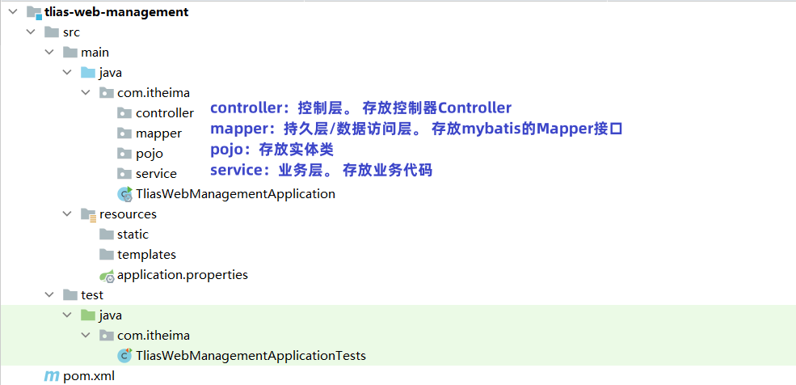

## ****需求说明与环境搭建****


### ******需求说明******

- **部门管理**：
	- 查询部门列表
	- 删除部门
	- 新增部门
	- 修改部门
- **员工管理**：
	- 查询员工列表（分页、条件）
	- 删除员工
	- 新增员工
	- 修改员工

### ******环境搭建******


1. **准备数据库表 (dept、emp)**

	```sql
	-- 部门管理
	create table dept
	(
	    id          int unsigned primary key auto_increment comment '主键ID',
	    name        varchar(10) not null unique comment '部门名称',
	    create_time datetime    not null comment '创建时间',
	    update_time datetime    not null comment '修改时间'
	) comment '部门表';
	
	insert into dept (id, name, create_time, update_time)
	values (1, '学工部', now(), now()),
	       (2, '教研部', now(), now()),
	       (3, '咨询部', now(), now()),
	       (4, '就业部', now(), now()),
	       (5, '人事部', now(), now());
	
	
	-- 员工管理(带约束)
	create table emp
	(
	    id          int unsigned primary key auto_increment comment 'ID',
	    username    varchar(20)      not null unique comment '用户名',
	    password    varchar(32) default '123456' comment '密码',
	    name        varchar(10)      not null comment '姓名',
	    gender      tinyint unsigned not null comment '性别, 说明: 1 男, 2 女',
	    image       varchar(300) comment '图像',
	    job         tinyint unsigned comment '职位, 说明: 1 班主任,2 讲师, 3 学工主管, 4 教研主管, 5 咨询师',
	    entrydate   date comment '入职时间',
	    dept_id     int unsigned comment '部门ID',
	    create_time datetime         not null comment '创建时间',
	    update_time datetime         not null comment '修改时间'
	) comment '员工表';
	
	INSERT INTO emp
	(id, username, password, name, gender, image, job, entrydate, dept_id, create_time, update_time)
	VALUES (1, 'jinyong', '123456', '金庸', 1, '1.jpg', 4, '2000-01-01', 2, now(), now()),
	       (2, 'zhangwuji', '123456', '张无忌', 1, '2.jpg', 2, '2015-01-01', 2, now(), now()),
	       (3, 'yangxiao', '123456', '杨逍', 1, '3.jpg', 2, '2008-05-01', 2, now(), now()),
	       (4, 'weiyixiao', '123456', '韦一笑', 1, '4.jpg', 2, '2007-01-01', 2, now(), now()),
	       (5, 'changyuchun', '123456', '常遇春', 1, '5.jpg', 2, '2012-12-05', 2, now(), now()),
	       (6, 'xiaozhao', '123456', '小昭', 2, '6.jpg', 3, '2013-09-05', 1, now(), now()),
	       (7, 'jixiaofu', '123456', '纪晓芙', 2, '7.jpg', 1, '2005-08-01', 1, now(), now()),
	       (8, 'zhouzhiruo', '123456', '周芷若', 2, '8.jpg', 1, '2014-11-09', 1, now(), now()),
	       (9, 'dingminjun', '123456', '丁敏君', 2, '9.jpg', 1, '2011-03-11', 1, now(), now()),
	       (10, 'zhaomin', '123456', '赵敏', 2, '10.jpg', 1, '2013-09-05', 1, now(), now()),
	       (11, 'luzhangke', '123456', '鹿杖客', 1, '11.jpg', 5, '2007-02-01', 3, now(), now()),
	       (12, 'hebiweng', '123456', '鹤笔翁', 1, '12.jpg', 5, '2008-08-18', 3, now(), now()),
	       (13, 'fangdongbai', '123456', '方东白', 1, '13.jpg', 5, '2012-11-01', 3, now(), now()),
	       (14, 'zhangsanfeng', '123456', '张三丰', 1, '14.jpg', 2, '2002-08-01', 2, now(), now()),
	       (15, 'yulianzhou', '123456', '俞莲舟', 1, '15.jpg', 2, '2011-05-01', 2, now(), now()),
	       (16, 'songyuanqiao', '123456', '宋远桥', 1, '16.jpg', 2, '2007-01-01', 2, now(), now()),
	       (17, 'chenyouliang', '123456', '陈友谅', 1, '17.jpg', NULL, '2015-03-21', NULL, now(), now());
	```

2. **创建 SpringBoot 工程**
	1. 引入必要的起步依赖：Spring Web, Lombok, Mybatis Framework, MySQL Driver。
	2. 创建项目工程目录结构：

		

3. **配置** **`application.properties`** **并准备实体类**
	- 在 `application.properties` 中配置数据库连接信息和 MyBatis 相关配置，例如：

		```plain text
		## 数据库连接
		spring.datasource.driver-class-name=com.mysql.cj.jdbc.Driver
		spring.datasource.url=jdbc:mysql://localhost:3306/tlias
		spring.datasource.username=root
		spring.datasource.password=1234
		## 开启 mybatis 的日志输出
		mybatis.configuration.log-impl=org.apache.ibatis.logging.stdout.StdOutImpl
		## 开启数据库表字段 到 实体类属性的驼峰映射
		mybatis.configuration.map-underscore-to-camel-case=true
		```

	- 创建实体类 `Dept` 和 `Emp`，分别对应数据库中的 `dept` 和 `emp` 表。
		- `dept` 表：

		```java
		package com.itheima.pojo;
		
		import lombok.AllArgsConstructor;
		import lombok.Data;
		import lombok.NoArgsConstructor;
		
		import java.time.LocalDateTime;
		
		@Data
		@NoArgsConstructor
		@AllArgsConstructor
		public class Dept {
		    private Integer id;
		    private String name;
		    private LocalDateTime createTime;
		    private LocalDateTime updateTime;
		}
		```

		- `emp`  表

		```java
		package com.itheima.pojo;
		
		import lombok.AllArgsConstructor;
		import lombok.Data;
		import lombok.NoArgsConstructor;
		
		import java.time.LocalDate;
		import java.time.LocalDateTime;
		
		@Data
		@NoArgsConstructor
		@AllArgsConstructor
		public class Emp {
		    private Integer id;
		    private String username;
		    private String password;
		    private String name;
		    private Short gender;
		    private String image;
		    private Short job;
		    private LocalDate entrydate;
		    private Integer deptId;
		    private LocalDateTime createTime;
		    private LocalDateTime updateTime;
		}
		```

4. **准备 Mapper、Service 和 Controller 基础结构**
	- 创建 `DeptMapper` 和 `EmpMapper` 接口，用于数据库操作。
		- `DeptMapper` 接口：

		```java
		package com.itheima.mapper;
		
		import org.apache.ibatis.annotations.Mapper;
		
		@Mapper
		public interface DeptMapper {
		}
		```

		- `EmpMapper` 接口:

		```java
		package com.itheima.mapper;
		
		import org.apache.ibatis.annotations.Mapper;
		
		@Mapper
		public interface EmpMapper {
		}
		```

	- 创建 `DeptService` 接口和 `DeptServiceImpl` 实现类，以及 `EmpService` 接口和 `EmpServiceImpl` 实现类，用于业务逻辑处理。
		- `DeptService` 接口：

		```java
		package com.itheima.service;
		
		public interface DeptService {
		}
		```

		- `DeptServiceImpl` 实现类：

		```java
		package com.itheima.service;
		
		public class DeptServiceImpl implements DeptService {
		}
		```

		- `EmpService` 接口：

		```java
		package com.itheima.service;
		
		public interface EmpService {
		}
		```

		- `EmpServiceImpl` 实现类：

		```java
		package com.itheima.service;
		
		public class EmpServiceImpl implements EmpService {
		}
		```

	- 创建 `DeptController` 和 `EmpController` 类，用于处理 HTTP 请求。
		- `DeptController` 类：

		```java
		package com.itheima.controller;
		
		import org.springframework.web.bind.annotation.RestController;
		
		@RestController
		public class DeptController {
		}
		```

		- `EmpController` 类：

		```java
		package com.itheima.controller;
		
		import org.springframework.web.bind.annotation.RestController;
		
		@RestController
		public class EmpController {
		}
		```


## ****开发规范****


**1.  开发规范 - REST**


前后端分离开发模式下，前后端根据提前定义好的接口文档进行开发。后端开发人员需要严格遵守接口文档进行功能开发，保证功能可以和前端对接。


**REST (Representational State Transfer)** 是一种软件架构风格。 通过 URL 定位资源，通过 HTTP 动词 (请求方式) 描述具体的操作。


**传统 URL 风格如下：**


```plain text
http://localhost:8080/user/getById?id=1 GET：查询id为1的用户
http://localhost:8080/user/saveUser POST：新增用户
http://localhost:8080/user/updateUser POST：修改用户
http://localhost:8080/user/deleteUser?id=1 GET：删除id为1的用户
```


**基于 REST 风格 URL 如下：**


```plain text
http://localhost:8080/users/1 GET：查询id为1的用户
http://localhost:8080/users POST：新增用户
http://localhost:8080/users PUT：修改用户
http://localhost:8080/users/1 DELETE：删除id为1的用户
```


在 REST 风格的 URL 中，通过四种请求方式，来操作数据的增删改查。

	- `GET`：查询
	- `POST`：新增
	- `PUT`：修改
	- `DELETE`：删除

**注意**：REST 是一种风格，是约定方式，不是规定，可以打破。 描述模块的功能通常使用复数，也就是加 s 的格式来描述。


**2.  开发规范 - 统一响应结果**

- 前后端工程在进行交互时，使用统一响应结果 `Result`。

```java
package com.itheima.pojo;

import lombok.AllArgsConstructor;
import lombok.Data;
import lombok.NoArgsConstructor;

@Data
@NoArgsConstructor
@AllArgsConstructor
public class Result {
    private Integer code;// 响应码，1 代表成功; 0 代表失败
    private String msg;  // 响应信息 描述字符串
    private Object data; // 返回的数据

    // 增删改 成功响应
    public static Result success() {
        return new Result(1, "success", null);
    }

    // 查询 成功响应
    public static Result success(Object data) {
        return new Result(1, "success", data);
    }

    // 失败响应
    public static Result error(String msg) {
        return new Result(0, msg, null);
    }
}
```

- `code`：响应码，1 代表成功，0 代表失败。
- `msg`：响应信息，描述字符串。
- `data`：返回的数据。
- `success()`：静态方法，返回成功响应。
- `success(Object data)`：静态方法，返回带数据的成功响应。
- `error(String msg)`：静态方法，返回失败响应。

**3.  开发流程**


1. 查看页面原型明确需求，根据页面原型和需求，进行表结构设计、编写接口文档。
2. 阅读接口文档。
3. 思路分析。
4. 功能接口开发。
5. 功能接口测试，通过 Postman 进行功能接口测试，测试通过后，再和前端进行联调测试。
6. 前后端联调测试，和前端开发人员开发好的前端工程一起测试。
