在完成了部门管理的功能开发之后，我们将进入到员工管理功能的开发。


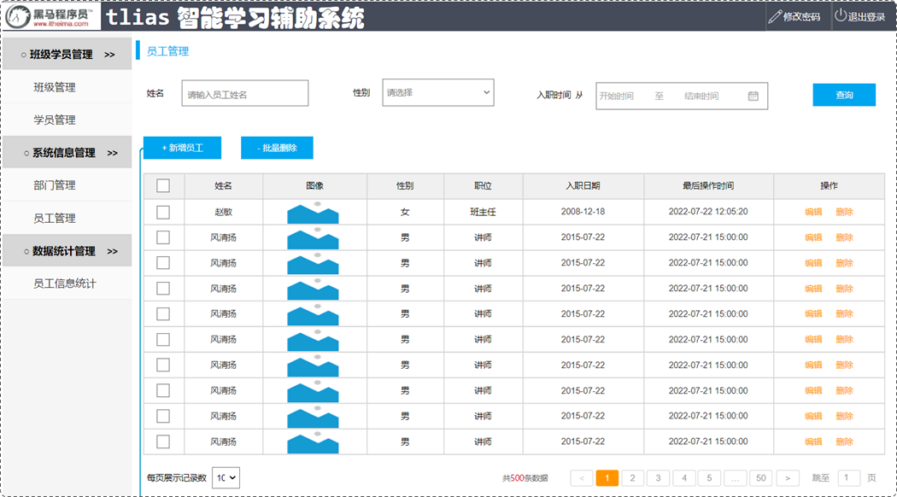


基于原型，员工管理功能可以分为：

1. 分页查询（本次完成）
2. 带条件的分页查询（本次完成）
3. 删除员工（本次完成）
4. 新增员工（后续完成）
5. 修改员工（后续完成）

下面从分页查询功能开始学习。


## ****分页查询****


### ****基础分页****


#### ****需求分析****


查询功能会将数据库中所有的数据查询并展示在页面上。但如果数据库中的数据量非常庞大（例如有十几万条），将所有数据一次性展示出来是不现实的。针对这种情况，可以采用分页的方式来解决。 每次只展示一页的数据，例如，一页显示 10 条数据。 如果用户需要查询更多数据，可以通过点击页码进行查询。


要从数据库中进行分页查询，我们要使用 `LIMIT` 关键字，格式为：`limit 开始索引 每页显示的条数`


开始索引的计算公式：开始索引 = (当前页码 - 1)  *  每页显示条数


基于页面原型，继续分析，得出以下结论：

1. 前端在请求服务端时，传递的参数
	- 当前页码 `page`
	- 每页显示条数 `pageSize`
2. 后端需要响应给前端的数据
	- 所查询到的数据列表（存储到 `List` 集合中）
	- 总记录数

后台给前端返回的数据包含：`List` 集合(数据列表)、`total`(总记录数)，而这两部分通常封装到 `PageBean` 对象中，并将该对象转换为 `json` 格式的数据响应回给浏览器。


```java
package com.itheima.pojo;

import lombok.AllArgsConstructor;
import lombok.Data;
import lombok.NoArgsConstructor;

import java.util.List;

@Data
@NoArgsConstructor
@AllArgsConstructor
public class PageBean {
    private Long total;
    private List rows;
}
```


#### ****接口文档****

- 基本信息
	- 请求路径：`/emps` 。
	- 请求方式：`GET` 。
	- 接口描述：该接口用于员工列表数据的条件分页查询。
- 请求参数

	参数格式：queryString


	参数说明：


	| 参数名称     | 是否必须 | 示例         | 备注                     |
	| -------- | ---- | ---------- | ---------------------- |
	| name     | 否    | 张          | 姓名                     |
	| gender   | 否    | 1          | 性别 , 1 男 , 2 女         |
	| begin    | 否    | 2010-01-01 | 范围匹配的开始时间(入职日期)        |
	| end      | 否    | 2020-01-01 | 范围匹配的结束时间(入职日期)        |
	| page     | 是    | 1          | 分页查询的页码，如果未指定，默认为1     |
	| pageSize | 是    | 10         | 分页查询的每页记录数，如果未指定，默认为10 |


	请求数据样例：


	```plain text
	/emps?name=张&gender=1&begin=2007-09-01&end=2022-09-01&page=1&pageSize=10
	```

- 响应数据

	参数格式：application/json


	参数说明：


	| 名称            | 类型        | 是否必须 | 备注                                        | 其他信息            |
	| ------------- | --------- | ---- | ----------------------------------------- | --------------- |
	| code          | number    | 必须   | 响应码, 1 成功 , 0 失败                          |                 |
	| msg           | string    | 非必须  | 提示信息                                      |                 |
	| data          | object    | 必须   | 返回的数据                                     |                 |
	| |- total      | number    | 必须   | 总记录数                                      |                 |
	| |- rows       | object [] | 必须   | 数据列表                                      | item 类型: object |
	| |- id         | number    | 非必须  | id                                        |                 |
	| |- username   | string    | 非必须  | 用户名                                       |                 |
	| |- name       | string    | 非必须  | 姓名                                        |                 |
	| |- password   | string    | 非必须  | 密码                                        |                 |
	| |- entrydate  | string    | 非必须  | 入职日期                                      |                 |
	| |- gender     | number    | 非必须  | 性别 , 1 男 ; 2 女                            |                 |
	| |- image      | string    | 非必须  | 图像                                        |                 |
	| |- job        | number    | 非必须  | 职位, 说明: 1 班主任,2 讲师, 3 学工主管, 4 教研主管, 5 咨询师 |                 |
	| |- deptId     | number    | 非必须  | 部门id                                      |                 |
	| |- createTime | string    | 非必须  | 创建时间                                      |                 |
	| |- updateTime | string    | 非必须  | 更新时间                                      |                 |


	响应数据样例：


	```json
	{
	   "code": 1,
	   "msg": "success",
	   "data": {
	     "total": 2,
	     "rows": [
	        {
	         "id": 1,
	         "username": "jinyong",
	         "password": "123456",
	         "name": "金庸",
	         "gender": 1,
	         "image": "https://web-framework.oss-cn-hangzhou.aliyuncs.com/2022-09-02-00-27-53B.jpg",
	         "job": 2,
	         "entrydate": "2015-01-01",
	         "deptId": 2,
	         "createTime": "2022-09-01T23:06:30",
	         "updateTime": "2022-09-02T00:29:04"
	       },
	       {
	         "id": 2,
	         "username": "zhangwuji",
	         "password": "123456",
	         "name": "张无忌",
	         "gender": 1,
	         "image": "https://web-framework.oss-cn-hangzhou.aliyuncs.com/2022-09-02-00-27-53B.jpg",
	         "job": 2,
	         "entrydate": "2015-01-01",
	         "deptId": 2,
	         "createTime": "2022-09-01T23:06:30",
	         "updateTime": "2022-09-02T00:29:04"
	       }
	     ]
	   }
	 }
	```


#### ****思路分析****


分页查询需要的数据，封装在 `PageBean` 对象中。`PageBean` 对象包含总记录数 `total` 和当前页数据列表 `rows`。


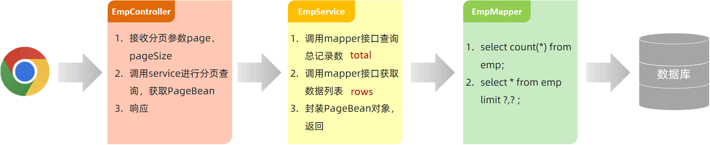


#### ****功能开发 ****


**1. EmpController**


```java
import com.itheima.pojo.PageBean;
import com.itheima.pojo.Result;
import com.itheima.service.EmpService;
import lombok.extern.slf4j.Slf4j;
import org.springframework.beans.factory.annotation.Autowired;
import org.springframework.web.bind.annotation.GetMapping;
import org.springframework.web.bind.annotation.RequestMapping;
import org.springframework.web.bind.annotation.RequestParam;
import org.springframework.web.bind.annotation.RestController;

@Slf4j
@RestController
@RequestMapping("/emps")
public class EmpController {
    @Autowired
    private EmpService empService;

    //条件分页查询
    @GetMapping
    public Result page(@RequestParam(defaultValue = "1") Integer page,
                       @RequestParam(defaultValue = "10") Integer pageSize) {
        //记录日志
        log.info("分页查询，参数：{},{}", page, pageSize);
        //调用业务层分页查询功能
        PageBean pageBean = empService.page(page, pageSize);
        //响应
        return Result.success(pageBean);
    }
}
```

- `@RestController`: 组合注解，包含了 `@Controller` 和 `@ResponseBody`，用于声明 RESTful 风格的控制器。
- `@RequestMapping("/emps")`: 将 HTTP 请求 `/emps` 映射到此类中的处理方法。
- `@GetMapping`: 处理 `GET` 请求。
- `@RequestParam(defaultValue = "1")`: 用于接收请求参数，并设置默认值。 `@RequestParam(defaultValue="默认值")` //设置请求参数默认值
- `@Slf4j`: Lombok 注解，自动生成 `log` 对象，用于日志记录。
- `Result.success(pageBean)`：返回成功的结果，并将 `pageBean` 对象作为数据部分。`Result` 通常是一个自定义的响应对象，用于封装返回码、消息和数据。

**2. EmpService**


```java
public interface EmpService {
    /**
     * 条件分页查询
     * @param page 页码
     * @param pageSize 每页展示记录数
     * @return
     */
    PageBean page(Integer page, Integer pageSize);
}
```


定义了 `EmpService` 接口，声明了 `page` 方法，用于分页查询。


**3. EmpServiceImpl**


```java
import com.itheima.mapper.EmpMapper;
import com.itheima.pojo.Emp;
import com.itheima.pojo.PageBean;
import com.itheima.service.EmpService;
import lombok.extern.slf4j.Slf4j;
import org.springframework.beans.factory.annotation.Autowired;
import org.springframework.stereotype.Service;

import java.time.LocalDate;
import java.util.List;

@Slf4j
@Service
public class EmpServiceImpl implements EmpService {
    @Autowired
    private EmpMapper empMapper;

    @Override
    public PageBean page(Integer page, Integer pageSize) {
        //1、获取总记录数
        Long count = empMapper.count();
        //2、获取分页查询结果列表
        Integer start = (page - 1) * pageSize; //计算起始索引 , 公式: (页码-1)*页大小
        List<Emp> empList = empMapper.list(start, pageSize);
        //3、封装PageBean对象
        PageBean pageBean = new PageBean(count, empList);
        return pageBean;
    }
}
```

- `@Service`: 用于声明业务逻辑组件。
- `@Autowired`: 自动注入 `EmpMapper` 对象。
- `Integer start = (page - 1) * pageSize;`：计算起始索引。
- `PageBean pageBean = new PageBean(count, empList);`：封装 `PageBean` 对象。

**4. EmpMapper**


```java
import org.apache.ibatis.annotations.Mapper;
import org.apache.ibatis.annotations.Select;

import java.util.List;

@Mapper
public interface EmpMapper {
    //获取总记录数
    @Select("select count(*) from emp")
    public Long count();

    //获取当前页的结果列表
    @Select("select * from emp limit #{start}, #{pageSize}")
    public List<Emp> list(Integer start, Integer pageSize);
}
```

- `@Mapper`: MyBatis 的注解，用于声明 Mapper 接口。
- `@Select`: MyBatis 的注解，用于执行查询 SQL 语句。
- `#{start}` 和 `#{pageSize}`： MyBatis 的占位符，用于传递参数。

#### ****功能测试****


功能开发完成后，重新启动项目，使用 `Postman`，发起 `GET` 请求。


```plain text
http://localhost:8080/emps?page=2&pageSize=10
```


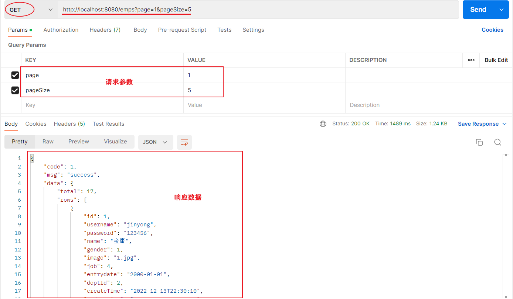


#### ****前后端联调****


打开浏览器，测试后端功能接口。


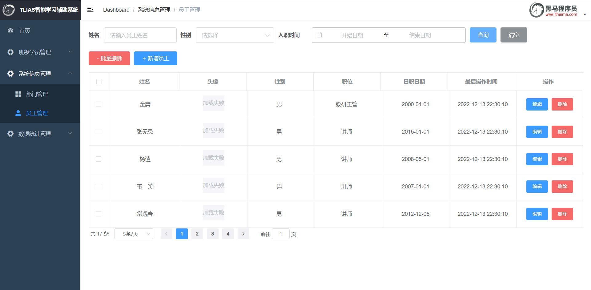


### ****分页插件****


前面已经完成了基础的分页查询，编写起来比较繁琐。


在 `Mapper` 接口中定义两个方法执行两条不同的 SQL 语句：

1. 查询总记录数
2. 指定页码的数据列表

在 `Service` 当中，调用 `Mapper` 接口的两个方法，分别获取：总记录数、查询结果列表，然后在将获取的数据结果封装到 `PageBean` 对象中。


**问题**："步骤固定"、"代码频繁"。在未来开发其他项目，只要涉及到分页查询功能（例：订单、用户、支付、商品），都必须按照以上操作完成功能开发。


**解决方案**：使用一些现成的分页插件完成。对于 Mybatis 来讲现在最主流的就是 PageHelper。


#### ****介绍****


PageHelper 是 Mybatis 的一款功能强大、方便易用的分页插件，支持任何形式的单标、多表的分页查询。


官网：[https://pagehelper.github.io/](https://pagehelper.github.io/)


在执行 `empMapper.list()` 方法时，就是执行：`select * from emp` 语句，怎么能够实现分页操作呢？


分页插件帮我们完成了以下操作：

1. 先获取到要执行的 SQL 语句：`select * from emp` 。
2. 把 SQL 语句中的字段列表，变为：`count(*)` 。
3. 执行 SQL 语句：`select count(*) from emp` 。
4. 再对要执行的 SQL 语句：`select * from emp` 进行改造，在末尾添加 `limit ? , ?` 。
5. 执行改造后的 SQL 语句：`select * from emp limit ? , ?` 。

#### ****代码实现****


当使用了 `PageHelper` 分页插件进行分页，就无需在 `Mapper` 中进行手动分页了。 在 `Mapper` 中我们只需要进行正常的列表查询即可。在 `Service` 层中，调用 `Mapper` 的方法之前设置分页参数，在调用 `Mapper` 方法执行查询之后，解析分页结果，并将结果封装到 `PageBean` 对象中返回。


**1. 在 pom.xml 引入依赖**


```xml
<dependency>
    <groupId>com.github.pagehelper</groupId>
    <artifactId>pagehelper-spring-boot-starter</artifactId>
    <version>1.4.2</version>
</dependency>
```


引入 `PageHelper` 的 `Spring Boot Starter` 依赖。


**2. EmpMapper**


```java
@Mapper
public interface EmpMapper {
    //获取当前页的结果列表
    @Select("select * from emp")
    public List<Emp> page(Integer start, Integer pageSize);
}
```


**3. EmpServiceImpl**


```java
@Override
public PageBean page(Integer page, Integer pageSize) {
    // 设置分页参数
    PageHelper.startPage(page, pageSize);
    // 执行分页查询
    Integer start = (page - 1) * pageSize;
    List<Emp> rows = empMapper.list(start, pageSize);
    // 获取分页结果
    Page<Emp> p = (Page<Emp>) empList;
    //封装PageBean
    PageBean pageBean = new PageBean(p.getTotal(), p.getResult());
    return pageBean;
}
```

- `PageHelper.startPage(page, pageSize);`: 设置分页参数，`page` 为页码，`pageSize` 为每页显示的记录数。 **注意：** 这个方法需要在执行查询 SQL 之前调用，它会对后续的 SQL 查询进行拦截，自动添加分页相关的 `LIMIT` 语句。
- `List<Emp> empList = empMapper.list(`start, pageSize`);`: 调用 `Mapper` 的方法执行查询。
- `Page<Emp> p = (Page<Emp>) empList;`: 将查询结果转换为 `Page` 对象，`Page` 对象包含了分页信息，如总记录数、总页数等。
- `PageBean pageBean = new PageBean(p.getTotal(), p.getResult());`: 封装 `PageBean` 对象。

#### ****测试****


功能开发完成后，重启项目工程，打开 `Postman`，发起 `GET` 请求，访问：`http://localhost:8080/emps?page=1&pageSize=5`


后端程序 SQL 输出：


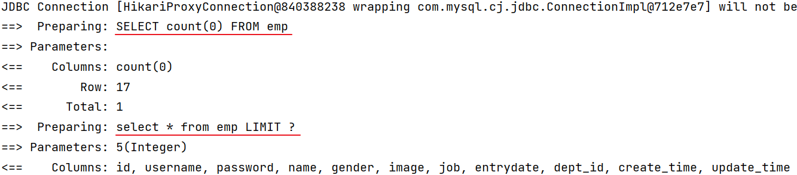


## ****分页查询（条件）****


完成了分页查询后，下面需要在分页查询的基础上，添加条件。


### ****需求分析****


通过员工管理的页面原型可以看到，员工列表页面的查询，不仅仅需要考虑分页，还需要考虑查询条件。 分页查询已经实现了，接下来，需要考虑在分页查询的基础上，再加上查询条件。


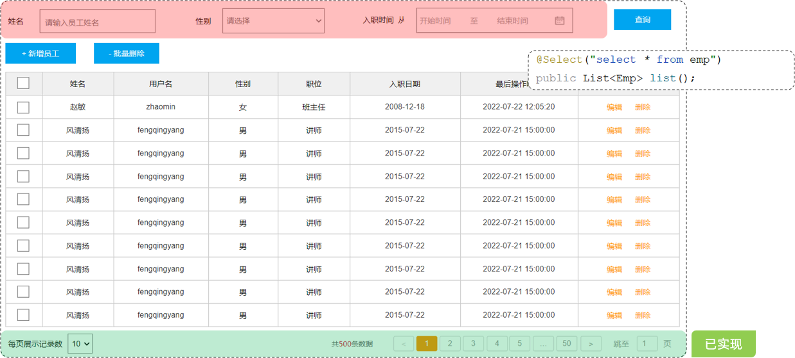


页面原型及需求中描述，搜索栏的搜索条件有三个，分别是：

- 姓名：模糊匹配
- 性别：精确匹配
- 入职日期：范围匹配

而且上述的三个条件，都是可以传递，也可以不传递的，也就是动态的。 需要使用前面学习的 Mybatis 中的动态 SQL 。


```sql
select *
from emp
where
  name like concat('%','张','%')   -- 条件1：根据姓名模糊匹配
  and gender = 1                   -- 条件2：根据性别精确匹配
  and entrydate = between '2000-01-01' and '2010-01-01'  -- 条件3：根据入职日期范围匹配
order by update_time desc;
```


### ****思路分析****


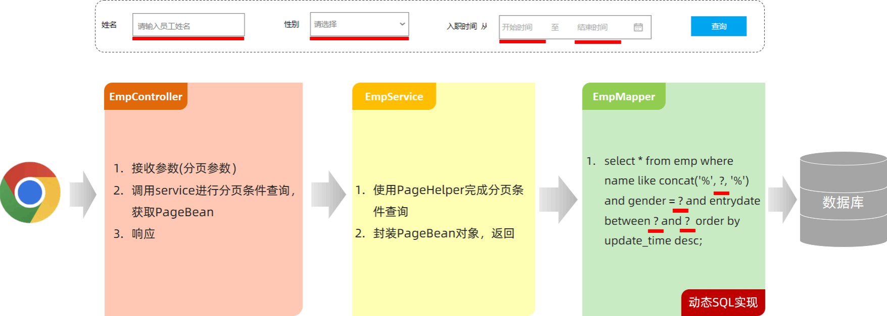


### ****功能开发****


**1. EmpController**


```java
@Slf4j
@RestController
@RequestMapping("/emps")
public class EmpController {
    @Autowired
    private EmpService empService;

    //条件分页查询
    @GetMapping
    public Result page(@RequestParam(defaultValue = "1") Integer page,
                       @RequestParam(defaultValue = "10") Integer pageSize,
                       String name, Short gender,
                       @DateTimeFormat(pattern = "yyyy-MM-dd") LocalDate begin,
                       @DateTimeFormat(pattern = "yyyy-MM-dd") LocalDate end) {
        //记录日志
        log.info("分页查询，参数：{},{},{},{},{},{}", page, pageSize, name, gender, begin, end);
        //调用业务层分页查询功能
        PageBean pageBean = empService.page(page, pageSize, name, gender, begin, end);
        //响应
        return Result.success(pageBean);
    }
}
```

- `@DateTimeFormat(pattern = "yyyy-MM-dd")`: 用于将字符串类型的日期参数转换为 `LocalDate` 类型。

**2. EmpService**


```java
public interface EmpService {
    /**
     * 条件分页查询
     * @param page     页码
     * @param pageSize 每页展示记录数
     * @param name     姓名
     * @param gender   性别
     * @param begin   开始时间
     * @param end     结束时间
     * @return
     */
    PageBean page(Integer page, Integer pageSize, String name, Short gender, LocalDate begin, LocalDate end);
}
```


**3. EmpServiceImpl**


```java
@Slf4j
@Service
public class EmpServiceImpl implements EmpService {
    @Autowired
    private EmpMapper empMapper;

    @Override
    public PageBean page(Integer page, Integer pageSize, String name, Short gender, LocalDate begin, LocalDate end) {
        //设置分页参数
        PageHelper.startPage(page, pageSize);
        //执行条件分页查询
        List<Emp> empList = empMapper.list(name, gender, begin, end);
        //获取查询结果
        Page<Emp> p = (Page<Emp>) empList;
        //封装PageBean
        PageBean pageBean = new PageBean(p.getTotal(), p.getResult());
        return pageBean;
    }
}
```


**4. EmpMapper**


```java
@Mapper
public interface EmpMapper {
    //获取当前页的结果列表
    public List<Emp> list(String name, Short gender, LocalDate begin, LocalDate end);
}
```


**5. EmpMapper.xml**


```xml
<?xml version="1.0" encoding="UTF-8" ?>
<!DOCTYPE mapper
        PUBLIC "-//mybatis.org//DTD Mapper 3.0//EN"
        "http://mybatis.org/dtd/mybatis-3-mapper.dtd">
<mapper namespace="com.itheima.mapper.EmpMapper">
    <!-- 条件分页查询 -->
    <select id="list" resultType="com.itheima.pojo.Emp">
        select * from emp
        <where>
            <if test="name != null and name != ''">
                name like concat('%',#{name},'%')
            </if>
            <if test="gender != null">
                and gender = #{gender}
            </if>
            <if test="begin != null and end != null">
                and entrydate between #{begin} and #{end}
            </if>
        </where>
        order by update_time desc
    </select>
</mapper>
```

- `<where>`: MyBatis 的动态 SQL 标签，用于简化 `WHERE` 子句的编写。如果 `where` 标签包含的任何条件都不成立，那么 `where` 标签会自动去除 `WHERE` 关键字。
- `<if test="name != null and name != ''">`: MyBatis 的动态 SQL 标签，用于判断条件是否成立。如果条件成立，则将标签内的 SQL 片段添加到 SQL 语句中。
- `concat('%',#{name},'%')`: MyBatis 的字符串拼接函数，用于实现模糊查询。
- `#{name}`、`#{gender}`、`#{begin}`、`#{end}`： MyBatis 的占位符，用于传递参数。

### ****功能测试****


功能开发完成后，重启项目工程，打开 `Postman`，发起 `GET` 请求。


```plain text
http://localhost:8080/emps?page=1&pageSize=10&name=张&gender=1&begin=2000-01-01&end=2020-12-31
```


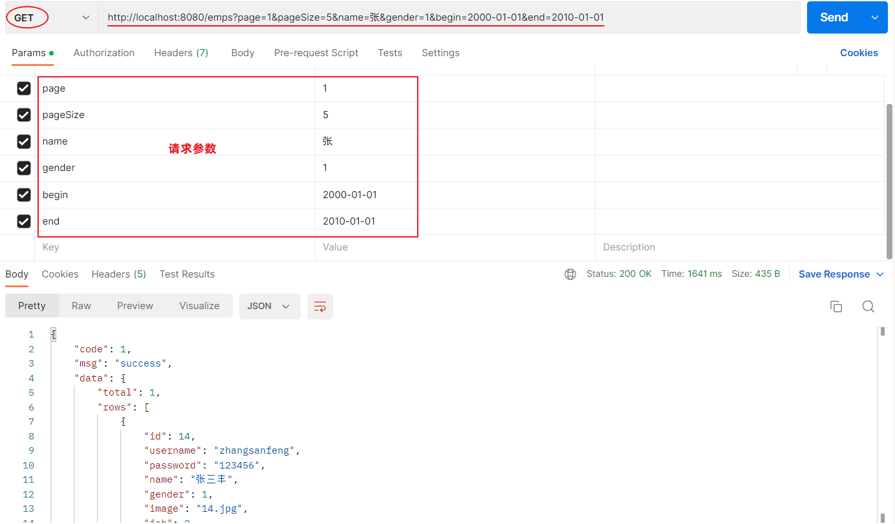


控制台 SQL 语句：


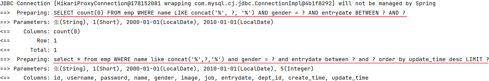


### ****前后端联调****


打开浏览器，测试后端功能接口。


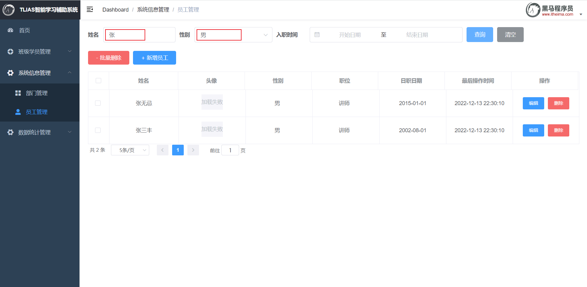


## ****删除员工****


查询员完成之后，继续开发新的功能：删除员工。


### ****需求****


当我们勾选列表前面的复选框，然后点击 "批量删除" 按钮，就可以将这一批次的员工信息删除掉了。也可以只勾选一个复选框，仅删除一个员工信息。


问题：我们需要开发两个功能接口吗？一个删除单个员工，一个删除多个员工


答案：不需要。 只需要开发一个功能接口即可（删除多个员工包含只删除一个员工）


### ****接口文档****

- 基本信息
	- 请求路径：`/emps/{ids}` 。
	- 请求方式：`DELETE` 。
	- 接口描述：该接口用于批量删除员工的数据信息。
- 请求参数

	参数格式：路径参数


	参数说明：


	| 参数名 | 类型       | 示例    | 是否必须 | 备注      |
	| --- | -------- | ----- | ---- | ------- |
	| ids | 数组 array | 1,2,3 | 必须   | 员工的id数组 |


	请求参数样例：


	```plain text
	/emps/1,2,3
	```

- 响应数据

	参数格式：application/json


	参数说明：


	| 参数名  | 类型     | 是否必须 | 备注                |
	| ---- | ------ | ---- | ----------------- |
	| code | number | 必须   | 响应码，1 代表成功，0 代表失败 |
	| msg  | string | 非必须  | 提示信息              |
	| data | object | 非必须  | 返回的数据             |


	响应数据样例：


	```json
	{
	     "code":1,
	     "msg":"success",
	     "data":null
	 }
	```


### ****思路分析****


接口文档规定：

- 前端请求路径：`/emps/{ids}`
- 前端请求方式：`DELETE`

问题 1：怎么在 controller 中接收请求路径中的路径参数？
答：使用 `@PathVariable` 注解。


问题 2：如何限定请求方式是 delete？
答：使用 `@DeleteMapping` 注解。


问题 3：在 Mapper 接口中，执行 delete 操作的 SQL 语句时，条件中的 id 值是不确定的是动态的，怎么实现呢？
答：使用 Mybatis 中的动态 SQL：`foreach` 标签。


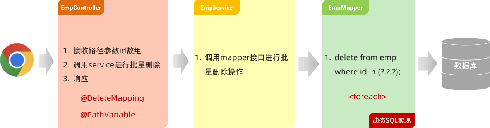


### ****功能开发****


**1. EmpController**


```java
@Slf4j
@RestController
@RequestMapping("/emps")
public class EmpController {
    @Autowired
    private EmpService empService;

    //批量删除
    @DeleteMapping("/{ids}")
    public Result delete(@PathVariable List<Integer> ids){
        empService.delete(ids);
        return Result.success();
    }

    //省略...
}
```

- `@DeleteMapping("/{ids}")`: 处理 `DELETE` 请求，并将路径参数 `{ids}` 映射到 `delete` 方法的 `ids` 参数。
- `@PathVariable`: 用于获取路径参数。

**2. EmpService**


```java
public interface EmpService {
    /**
     * 批量删除操作
     * @param ids id集合
     */
    void delete(List<Integer> ids);

    //省略...
}
```


**3. EmpServiceImpl**


```java
@Slf4j
@Service
public class EmpServiceImpl implements EmpService {
    @Autowired
    private EmpMapper empMapper;

    @Override
    public void delete(List<Integer> ids) {
        empMapper.delete(ids);
    }

    //省略...
}
```


**4. EmpMapper**


```java
@Mapper
public interface EmpMapper {
    //批量删除
    void delete(List<Integer> ids);

    //省略...
}
```


**5. EmpMapper.xml**


```xml
<?xml version="1.0" encoding="UTF-8" ?>
<!DOCTYPE mapper
        PUBLIC "-//mybatis.org//DTD Mapper 3.0//EN"
        "<http://mybatis.org/dtd/mybatis-3-mapper.dtd>">
<mapper namespace="com.itheima.mapper.EmpMapper">
    <!--批量删除员工-->
    <delete id="delete">
        delete from emp where id in
        <foreach collection="ids" item="id" open="(" close=")" separator=",">
            #{id}
        </foreach>
    </delete>

    <!-- 省略... -->
</mapper>
```

- `<delete>`: MyBatis 的标签，用于执行删除 SQL 语句。
- `<foreach>`: MyBatis 的动态 SQL 标签，用于遍历集合。
	- `collection="ids"`: 指定要遍历的集合。
	- `item="id"`: 指定集合中每个元素的名称。
	- `open="("`: 指定循环开始时的字符串。
	- `close=")"`: 指定循环结束时的字符串。
	- `separator=","`: 指定每个元素之间的分隔符。
	- `#{id}`: MyBatis 的占位符，用于传递集合中的每个元素。

### ****功能测试****


功能开发完成后，重启项目工程，打开 `Postman`，发起 `DELETE` 请求。


```plain text
http://localhost:8080/emps/2,3,5
```


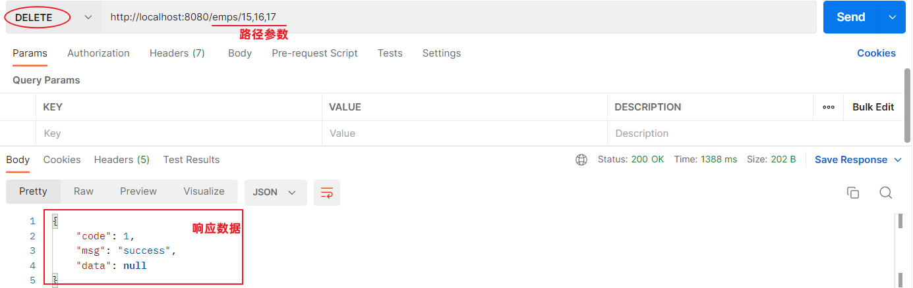


控制台 SQL 语句：


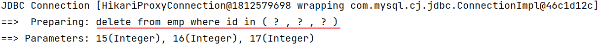


### ****前后端联调****


打开浏览器，测试后端功能接口。


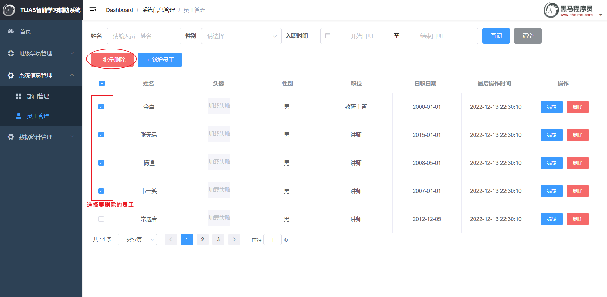

