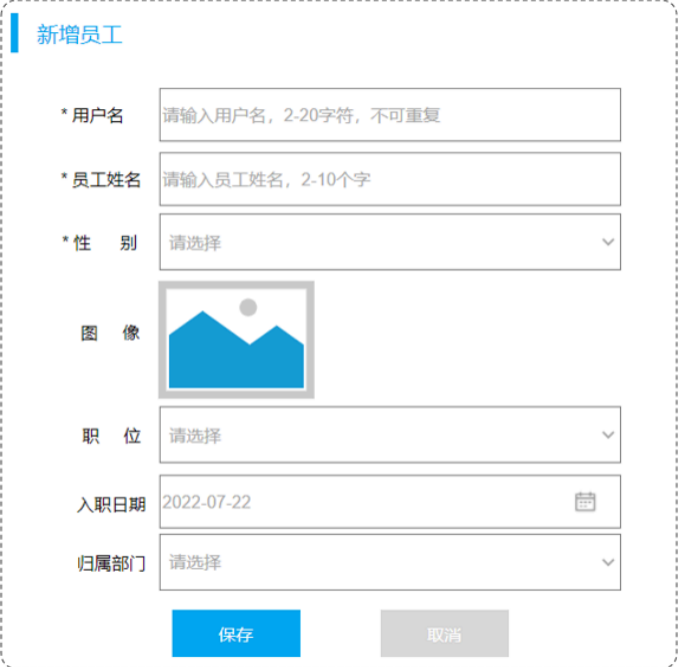
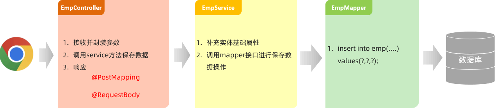
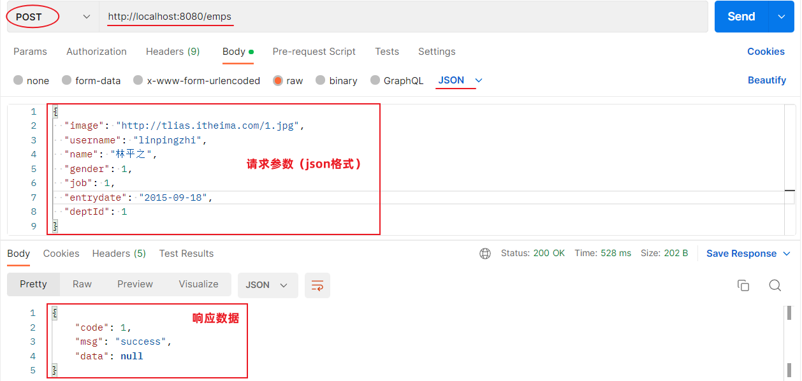
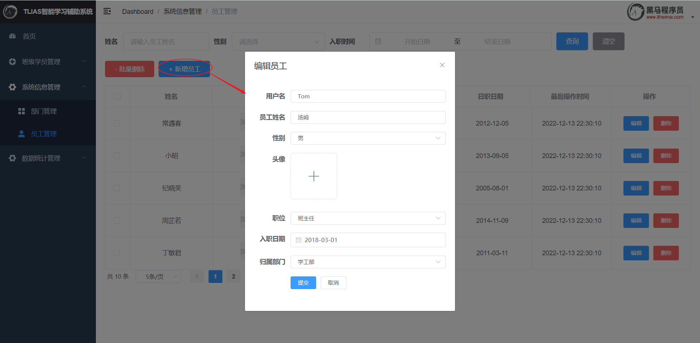

## ****需求****


保存员工的基本信息和上传的员工头像。目前先完成保存基本信息的功能。





## ****接口文档****

- 基本信息
	- 请求路径：`/emps` 。
	- 请求方式：`POST` 。
	- 接口描述：该接口用于添加员工的信息。
- 请求参数

	参数格式：application/json


	参数说明：


	| 名称        | 类型     | 是否必须 | 备注                                        |
	| --------- | ------ | ---- | ----------------------------------------- |
	| username  | string | 必须   | 用户名                                       |
	| name      | string | 必须   | 姓名                                        |
	| gender    | number | 必须   | 性别, 说明: 1 男, 2 女                          |
	| image     | string | 非必须  | 图像                                        |
	| deptId    | number | 非必须  | 部门id                                      |
	| entrydate | string | 非必须  | 入职日期                                      |
	| job       | number | 非必须  | 职位, 说明: 1 班主任,2 讲师, 3 学工主管, 4 教研主管, 5 咨询师 |


	请求数据样例：


	```json
	{
	   "image": "https://web-framework.oss-cn-hangzhou.aliyuncs.com/2022-09-03-07-37-38222.jpg",
	   "username": "linpingzhi",
	   "name": "林平之",
	   "gender": 1,
	   "job": 1,
	   "entrydate": "2022-09-18",
	   "deptId": 1
	 }
	```

- 响应数据

	参数格式：application/json


	参数说明：


	| 参数名  | 类型     | 是否必须 | 备注                |
	| ---- | ------ | ---- | ----------------- |
	| code | number | 必须   | 响应码，1 代表成功，0 代表失败 |
	| msg  | string | 非必须  | 提示信息              |
	| data | object | 非必须  | 返回的数据             |


	响应数据样例：


	```json
	{
	     "code":1,
	     "msg":"success",
	     "data":null
	 }
	```


## ****思路分析****


需要限定请求方式为 POST，并在 Controller 中接收 JSON 格式的请求参数。





## ****功能开发****

- **EmpController**

	```java
	@Slf4j
	@RestController
	@RequestMapping("/emps")
	public class EmpController {
	    @Autowired
	    private EmpService empService;
	    //新增
	    @PostMapping
	    public Result save(@RequestBody Emp emp){
	        //记录日志
	        log.info("新增员工, emp:{}",emp);
	        //调用业务层新增功能
	        empService.save(emp);
	        //响应
	        return Result.success();
	    }
	    //省略...
	}
	```

	- `@PostMapping`：用于将 HTTP 的 POST 请求映射到特定的处理方法上。
	- `@RequestBody`：将前端传递的 JSON 数据填充到 `Emp` 实体类中。
- **EmpService**

	```java
	public interface EmpService {
	    /**
	     * 保存员工信息
	     * @param emp
	     */
	    void save(Emp emp);
	
	    //省略...
	}
	```

- **EmpServiceImpl**

	```java
	@Slf4j
	@Service
	public class EmpServiceImpl implements EmpService {
	    @Autowired
	    private EmpMapper empMapper;
	    @Override
	    public void save(Emp emp) {
	        //补全数据
	        emp.setCreateTime(LocalDateTime.now());
	        emp.setUpdateTime(LocalDateTime.now());
	
	        //调用添加方法
	        empMapper.insert(emp);
	    }
	    //省略...
	}
	```

- **EmpMapper**

	```java
	@Mapper
	public interface EmpMapper {
	    //新增员工
	    @Insert("insert into emp (username, name, gender, image, job, entrydate, dept_id, create_time, update_time) " +
	            "values (#{username}, #{name}, #{gender}, #{image}, #{job}, #{entrydate}, #{deptId}, #{createTime}, #{updateTime});")
	    void insert(Emp emp);
	    //省略...
	}
	```


## ****功能测试****


使用 Postman 发送 POST 请求到 `http://localhost:8080/emps`，请求体为 JSON 格式的员工数据。


```json
{
  "image": "https://web-framework.oss-cn-hangzhou.aliyuncs.com/2022-09-03-07-37-38222.jpg",
  "username": "linpingzhi",
  "name": "林平之",
  "gender": 1,
  "job": 1,
  "entrydate": "2022-09-18",
  "deptId": 1
}
```





## ****前后端联调****


通过浏览器测试后端接口。




