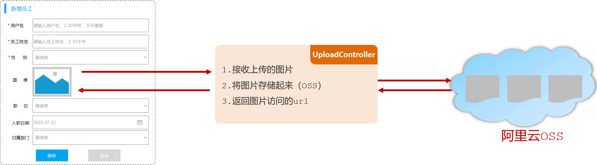

## ****简介****


文件上传是将本地文件（图片、视频、音频等）上传到服务器的过程。


完成文件上传功能涉及到两个部分：

1. 前端程序。
2. 服务端程序。

### ******前端程序******


上传文件的原始 form 表单，必须具备以下三点（上传文件页面三要素）：

- 表单必须有 file 域，用于选择要上传的文件
- 表单提交方式必须为 POST
- 表单的编码类型 enctype 必须要设置为：multipart/form-data

```html
<form action="/upload" method="post" enctype="multipart/form-data">
    姓名: <input type="text" name="username"><br>
    年龄: <input type="text" name="age"><br>
    头像: <input type="file" name="image"><br>
    <input type="submit" value="提交">
</form>
```


### ******服务端程序******


服务端定义 `Controller` 来处理 `/upload` 请求，接收提交的数据，包括 `username` (String), `age` (Integer), `image` (MultipartFile)。

- `MultipartFile`：Spring 提供的 API，用于接收上传的文件。
- `@RequestParam`：用于将请求参数绑定到方法参数，解决表单项名字和方法中形参名不一致的问题。

	```java
	public Result upload(String username,
	                     Integer age,
	                     @RequestParam("image") MultipartFile file)
	```

- **UploadController**

	```java
	@Slf4j
	@RestController
	public class UploadController {
	    @PostMapping("/upload")
	    public Result upload(String username, Integer age, MultipartFile image)  {
	        log.info("文件上传：{},{},{}",username,age,image);
	        return Result.success();
	    }
	}
	```


## ****本地存储****


将上传的文件保存在服务器的本地磁盘上。

1. 在服务器本地磁盘上创建 images 目录，用来存储上传的文件（例：E 盘创建 images 目录）
2. 使用 MultipartFile 类提供的 API 方法，把临时文件转存到本地磁盘目录下
- `getOriginalFilename()`: 获取原始文件名
- `transferTo(File dest)`: 将接收的文件转存到磁盘文件中

```java
@Slf4j
@RestController
public class UploadController {
    @PostMapping("/upload")
    public Result upload(String username, Integer age, MultipartFile image) throws IOException {
        log.info("文件上传：{},{},{}",username,age,image);
        //获取原始文件名
        String originalFilename = image.getOriginalFilename();
        //将文件存储在服务器的磁盘目录
        image.transferTo(new File("E:/images/"+originalFilename));
        return Result.success();
    }
}
```


**问题**：不同用户可能上传相同文件名的文件，导致文件被覆盖。


**解决方案：**保证每次上传文件时文件名都唯一的（使用UUID获取随机文件名）。


```java
@Slf4j
@RestController
public class UploadController {
    @PostMapping("/upload")
    public Result upload(String username, Integer age, MultipartFile image) throws IOException {
        log.info("文件上传：{},{},{}",username,age,image);
        //获取原始文件名
        String originalFilename = image.getOriginalFilename();
        //构建新的文件名
        String extname = originalFilename.substring(originalFilename.lastIndexOf("."));//文件扩展名
        String newFileName = UUID.randomUUID().toString()+extname;//随机名+文件扩展名
        //将文件存储在服务器的磁盘目录
        image.transferTo(new File("E:/images/"+newFileName));
        return Result.success();
    }
}
```


如果需要上传大文件，可以在 `application.properties` 进行如下配置：


```plain text
# ****配置单个文件最大上传大小****
spring.servlet.multipart.max-file-size=10MB
# ****配置单个请求最大上传大小(一次请求可以上传多个文件)****
spring.servlet.multipart.max-request-size=100MB
```


本地存储的缺点：

- 不安全：磁盘如果损坏，所有的文件就会丢失
- 容量有限：如果存储大量的图片，磁盘空间有限(磁盘不可能无限制扩容)
- 无法直接访问

解决方案：

- 自己搭建存储服务器，如：fastDFS 、MinIO
- 使用现成的云服务，如：阿里云，腾讯云，华为云

## ****阿里云 OSS****


阿里云对象存储 OSS（Object Storage Service），是一款海量、安全、低成本、高可靠的云存储服务。


### ****准备****

1. 注册阿里云账户并进行实名认证
2. 登录阿里云，通过控制台找到对象存储 OSS 服务
3. 开通 OSS 服务
4. 创建 Bucket（存储空间）

### ****入门****


安装 SDK ：

- [https://help.aliyun.com/zh/oss/developer-reference/getting-started?spm=a2c4g.11186623.0.0.3c38b919azzpsB#c9e86f54f3r3z](https://help.aliyun.com/zh/oss/developer-reference/getting-started?spm=a2c4g.11186623.0.0.3c38b919azzpsB#c9e86f54f3r3z)

参照阿里云 OSS 官方文档提供的 SDK 示例编写入门程序：

- [https://help.aliyun.com/zh/oss/user-guide/simple-upload?spm=5176.87240.400427.19.5b274614xizdBG](https://help.aliyun.com/zh/oss/user-guide/simple-upload?spm=5176.87240.400427.19.5b274614xizdBG)

### ****集成****


在案例中集成 OSS 对象存储服务，存储和管理案例中上传的图片。





**接口文档：**

	- 基本信息
		- 请求路径：`/upload` 。
		- 请求方式：`POST` 。
		- 接口描述：上传图片接口。
	- 请求参数

		参数格式：multipart/form-data


		参数说明：


		| 参数名称  | 参数类型 | 是否必须 | 示例 | 备注 |
		| ----- | ---- | ---- | -- | -- |
		| image | file | 是    |    |    |

	- 响应数据

		参数格式：application/json


		参数说明：


		| 参数名  | 类型     | 是否必须 | 备注                |
		| ---- | ------ | ---- | ----------------- |
		| code | number | 必须   | 响应码，1 代表成功，0 代表失败 |
		| msg  | string | 非必须  | 提示信息              |
		| data | object | 非必须  | 返回的数据，上传图片的访问路径   |


		响应数据样例：


		```json
		{
		     "code": 1,
		     "msg": "success",
		     "data": "https://web-framework.oss-cn-hangzhou.aliyuncs.com/2022-09-02-00-27-0400.jpg"
		 }
		```

1. 引入阿里云 OSS 上传文件工具类（由官方的示例代码改造而来）

	```java
	import com.aliyun.oss.OSS;
	import com.aliyun.oss.OSSClientBuilder;
	import org.springframework.stereotype.Component;
	import org.springframework.web.multipart.MultipartFile;
	import java.io.IOException;
	import java.io.InputStream;
	import java.util.UUID;
	@Component
	public class AliOSSUtils {
	    private String endpoint = "https://oss-cn-shanghai.aliyuncs.com";
	    private String accessKeyId = "LTAI5t9MZK8iq5T2Av5GLDxX";
	    private String accessKeySecret = "C0IrHzKZGKqU8S7YQcevcotD3Zd5Tc";
	    private String bucketName = "web-framework01";
	    /**
	     * 实现上传图片到OSS
	     */
	    public String upload(MultipartFile multipartFile) throws IOException {
	        // 获取上传的文件的输入流
	        InputStream inputStream = multipartFile.getInputStream();
	        // 避免文件覆盖
	        String originalFilename = multipartFile.getOriginalFilename();
	        String fileName = UUID.randomUUID().toString() + originalFilename.substring(originalFilename.lastIndexOf("."));
	        //上传文件到 OSS
	        OSS ossClient = new OSSClientBuilder().build(endpoint, accessKeyId, accessKeySecret);
	        ossClient.putObject(bucketName, fileName, inputStream);
	        //文件访问路径
	        String url = endpoint.split("//")[0] + "//" + bucketName + "." + endpoint.split("//")[1] + "/" + fileName;
	        // 关闭ossClient
	        ossClient.shutdown();
	        return url;// 把上传到oss的路径返回
	    }
	}
	```

2. 修改 UploadController 代码

	```java
	import com.itheima.pojo.Result;
	import com.itheima.utils.AliOSSUtils;
	import lombok.extern.slf4j.Slf4j;
	import org.springframework.beans.factory.annotation.Autowired;
	import org.springframework.web.bind.annotation.PostMapping;
	import org.springframework.web.bind.annotation.RestController;
	import org.springframework.web.multipart.MultipartFile;
	import java.io.IOException;
	@Slf4j
	@RestController
	public class UploadController {
	    @Autowired
	    private AliOSSUtils aliOSSUtils;
	    @PostMapping("/upload")
	    public Result upload(MultipartFile image) throws IOException {
	        //调用阿里云OSS工具类，将上传上来的文件存入阿里云
	        String url = aliOSSUtils.upload(image);
	        //将图片上传完成后的url返回，用于浏览器回显展示
	        return Result.success(url);
	    }
	}
	```

