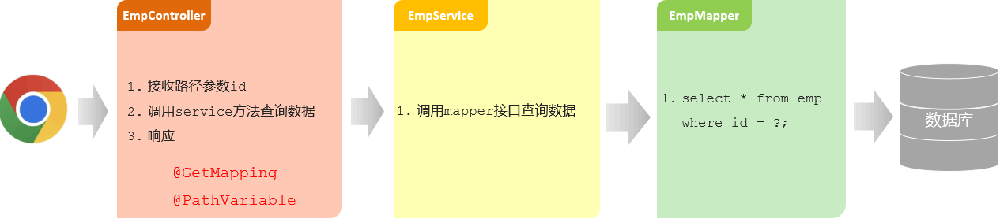
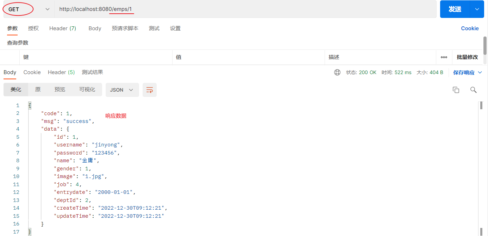
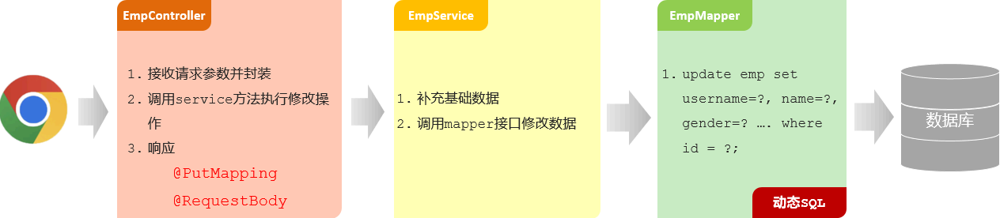
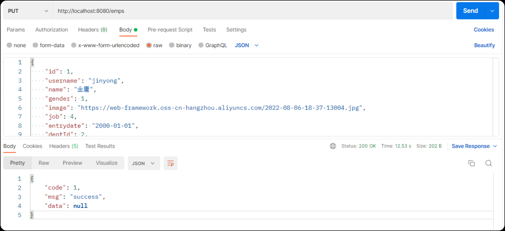
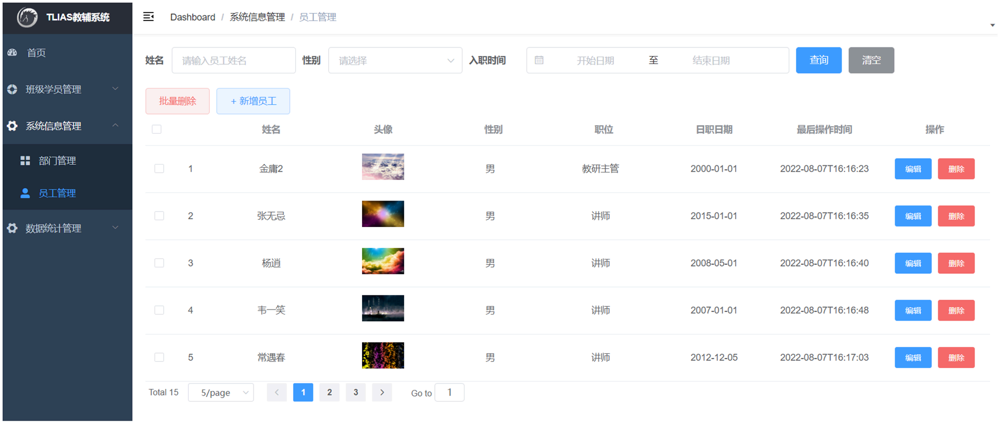

## ****查询回显****


### ****接口文档****

- 基本信息
	- 请求路径：`/emps/{id}` 。
	- 请求方式：`GET` 。
	- 接口描述：该接口用于根据主键ID查询员工的信息。
- 请求参数

	参数格式：路径参数


	参数说明：


	| 参数名 | 类型     | 是否必须 | 备注   |
	| --- | ------ | ---- | ---- |
	| id  | number | 必须   | 员工ID |


	请求参数样例：


	```plain text
	/emps/1
	```

- 响应数据

	参数格式：application/json


	参数说明：


	| 名称            | 类型     | 是否必须 | 默认值 | 备注                                        |
	| ------------- | ------ | ---- | --- | ----------------------------------------- |
	| code          | number | 必须   |     | 响应码, 1 成功 , 0 失败                          |
	| msg           | string | 非必须  |     | 提示信息                                      |
	| data          | object | 必须   |     | 返回的数据                                     |
	| |- id         | number | 非必须  |     | id                                        |
	| |- username   | string | 非必须  |     | 用户名                                       |
	| |- name       | string | 非必须  |     | 姓名                                        |
	| |- password   | string | 非必须  |     | 密码                                        |
	| |- entrydate  | string | 非必须  |     | 入职日期                                      |
	| |- gender     | number | 非必须  |     | 性别 , 1 男 ; 2 女                            |
	| |- image      | string | 非必须  |     | 图像                                        |
	| |- job        | number | 非必须  |     | 职位, 说明: 1 班主任,2 讲师, 3 学工主管, 4 教研主管, 5 咨询师 |
	| |- deptId     | number | 非必须  |     | 部门id                                      |
	| |- createTime | string | 非必须  |     | 创建时间                                      |
	| |- updateTime | string | 非必须  |     | 更新时间                                      |


	响应数据样例：


	```json
	{
	   "code": 1,
	   "msg": "success",
	   "data": {
	     "id": 2,
	     "username": "zhangwuji",
	     "password": "123456",
	     "name": "张无忌",
	     "gender": 1,
	     "image": "https://web-framework.oss-cn-hangzhou.aliyuncs.com/2022-09-02-00-27-53B.jpg",
	     "job": 2,
	     "entrydate": "2015-01-01",
	     "deptId": 2,
	     "createTime": "2022-09-01T23:06:30",
	     "updateTime": "2022-09-02T00:29:04"
	   }
	 }
	```


### ****实现思路****


根据 ID 查询员工信息用于页面回显展示。





### ****代码实现****

- **EmpMapper**

	```java
	@Mapper
	public interface EmpMapper {
	    //根据ID查询员工信息
	    @Select("select id, username, password, name, gender, image, job, entrydate, dept_id, create_time, update_time " +
	            "from emp " +
	            "where id = #{id}")
	    public Emp findById(Integer id);
	
	    //省略...
	}
	```

	- `@Select`：用于指定查询操作的 SQL 语句。
- **EmpService**

	```java
	public interface EmpService {
	    /**
	     * 根据ID查询员工
	     * @param id
	     * @return
	     */
	    public Emp getById(Integer id);
	
	    //省略...
	}
	```

- **EmpServiceImpl**

	```java
	@Slf4j
	@Service
	public class EmpServiceImpl implements EmpService {
	    @Autowired
	    private EmpMapper empMapper;
	    @Override
	    public Emp getById(Integer id) {
	        return empMapper.findById(id);
	    }
	
	    //省略...
	}
	```

- **EmpController**

	```java
	@Slf4j
	@RestController
	@RequestMapping("/emps")
	public class EmpController {
	    @Autowired
	    private EmpService empService;
	    //根据id查询
	    @GetMapping("/{id}")
	    public Result getById(@PathVariable Integer id){
	        Emp emp = empService.getById(id);
	        return Result.success(emp);
	    }
	
	    //省略...
	}
	```

	- `@GetMapping`：用于将 HTTP 的 GET 请求映射到特定的处理方法上。
	- `@PathVariable`：用于从 URI 中提取变量。

### ******功能测试******


打开 Postman 发送 `GET` 请求，请求路径：`http://localhost:8080/emps/1` 。





## ****修改员工****


### ****接口文档****

- 基本信息
	- 请求路径：`/emps` 。
	- 请求方式：`PUT` 。
	- 接口描述：该接口用于修改员工的数据信息。
- 请求参数

	参数格式：application/json


	参数说明：


	| 名称        | 类型     | 是否必须 | 备注                                        |
	| --------- | ------ | ---- | ----------------------------------------- |
	| id        | number | 必须   | id                                        |
	| username  | string | 必须   | 用户名                                       |
	| name      | string | 必须   | 姓名                                        |
	| gender    | number | 必须   | 性别, 说明: 1 男, 2 女                          |
	| image     | string | 非必须  | 图像                                        |
	| deptId    | number | 非必须  | 部门id                                      |
	| entrydate | string | 非必须  | 入职日期                                      |
	| job       | number | 非必须  | 职位, 说明: 1 班主任,2 讲师, 3 学工主管, 4 教研主管, 5 咨询师 |


	请求数据样例：


	```json
	{
	   "id": 1,
	   "image": "https://web-framework.oss-cn-hangzhou.aliyuncs.com/2022-09-03-07-37-38222.jpg",
	   "username": "linpingzhi",
	   "name": "林平之",
	   "gender": 1,
	   "job": 1,
	   "entrydate": "2022-09-18",
	   "deptId": 1
	 }
	```

- 响应数据

	参数格式：application/json


	参数说明：


	| 参数名  | 类型     | 是否必须 | 备注                |
	| ---- | ------ | ---- | ----------------- |
	| code | number | 必须   | 响应码，1 代表成功，0 代表失败 |
	| msg  | string | 非必须  | 提示信息              |
	| data | object | 非必须  | 返回的数据             |


	响应数据样例：


	```json
	{
	     "code":1,
	     "msg":"success",
	     "data":null
	 }
	```


### ****实现思路****


将修改后的数据更新到数据库中。





### ****代码实现****

- **EmpMapper**

	```java
	@Mapper
	public interface EmpMapper {
	    //修改员工信息
	    public void update(Emp emp);
	
	    //省略...
	}
	```

- **EmpMapper.xml**

	```xml
	<?xml version="1.0" encoding="UTF-8" ?>
	<!DOCTYPE mapper
	        PUBLIC "-//mybatis.org//DTD Mapper 3.0//EN"
	        "<http://mybatis.org/dtd/mybatis-3-mapper.dtd>">
	<mapper namespace="com.itheima.mapper.EmpMapper">
	    <!--更新员工信息-->
	    <update id="update">
	        update emp
	        <set>
	            <if test="username != null and username != ''">
	                username = #{username},
	            </if>
	            <if test="password != null and password != ''">
	                password = #{password},
	            </if>
	            <if test="name != null and name != ''">
	                name = #{name},
	            </if>
	            <if test="gender != null">
	                gender = #{gender},
	            </if>
	            <if test="image != null and image != ''">
	                image = #{image},
	            </if>
	            <if test="job != null">
	                job = #{job},
	            </if>
	            <if test="entrydate != null">
	                entrydate = #{entrydate},
	            </if>
	            <if test="deptId != null">
	                dept_id = #{deptId},
	            </if>
	            <if test="updateTime != null">
	                update_time = #{updateTime}
	            </if>
	        </set>
	        where id = #{id}
	    </update>
	    <!-- 省略... -->
	
	</mapper>
	```

- **EmpService**

	```java
	public interface EmpService {
	    /**
	     * 更新员工
	     * @param emp
	     */
	    public void update(Emp emp);
	
	    //省略...
	}
	```

- **EmpServiceImpl**

	```java
	@Slf4j
	@Service
	public class EmpServiceImpl implements EmpService {
	    @Autowired
	    private EmpMapper empMapper;
	    @Override
	    public void update(Emp emp) {
	        emp.setUpdateTime(LocalDateTime.now()); //更新修改时间为当前时间
	
	        empMapper.update(emp);
	    }
	
	    //省略...
	}
	```

- **EmpController**

	```java
	@Slf4j
	@RestController
	@RequestMapping("/emps")
	public class EmpController {
	    @Autowired
	    private EmpService empService;
	    //修改员工
	    @PutMapping
	    public Result update(@RequestBody Emp emp){
	        empService.update(emp);
	        return Result.success();
	    }
	
	    //省略...
	}
	```


### ****功能测试****


打开 Postman 发送 `PUT` 请求，请求路径：`http://localhost:8080/emps` 。请求数据：


```json
{
  "id": 1,
  "username": "linpingzhi",
  "name": "林平之",
  "gender": 1,
  "image": "https://web-framework.oss-cn-hangzhou.aliyuncs.com/2022-09-03-07-37-38222.jpg",
  "job": 1,
  "entrydate": "2022-09-18",
  "deptId": 1
}
```





### ******前后端联调测试******


打开浏览器，输入 `http://localhost:90` ，测试后端功能接口：




