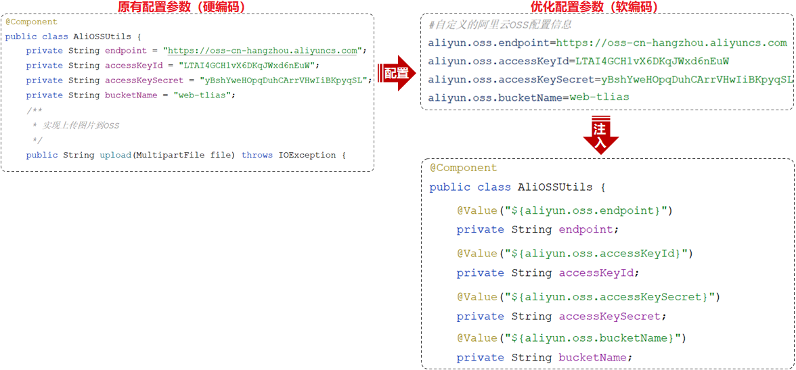
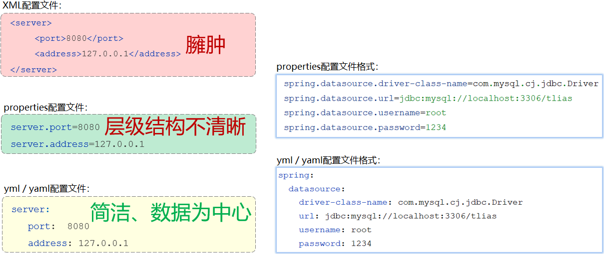

## ****参数配置化****


将阿里云 OSS 相关配置信息从硬编码改为配置在配置文件中。




- `application.properties`

	```plain text
	#自定义的阿里云OSS配置信息
	aliyun.oss.endpoint=https://oss-cn-hangzhou.aliyuncs.com
	aliyun.oss.accessKeyId=LTAI4GCH1vX6DKqJWxd6nEuW
	aliyun.oss.accessKeySecret=yBshYweHOpqDuhCArrVHwIiBKpyqSL
	aliyun.oss.bucketName=web-tlias
	```

- `@Value` 注解用于获取配置文件中的数据

	```java
	@Component
	public class AliOSSUtils {
	    @Value("${aliyun.oss.endpoint}")
	    private String endpoint;
	
	    @Value("${aliyun.oss.accessKeyId}")
	    private String accessKeyId;
	
	    @Value("${aliyun.oss.accessKeySecret}")
	    private String accessKeySecret;
	
	    @Value("${aliyun.oss.bucketName}")
	    private String bucketName;
	
	    //省略其他代码...
	 }
	```


## ****yml 配置文件****


SpringBoot 支持多种配置方式，包括 properties 和 yml 格式。


常见配置文件格式对比：





yml 格式的配置文件特点：

- 容易阅读
- 容易与脚本语言交互
- 以数据为核心，重数据轻格式

### ****yml 文件的基本语法****

- 大小写敏感。
- 数值前边必须有空格，作为分隔符。
- 使用缩进表示层级关系，缩进时，不允许使用 Tab 键，只能用空格（idea中会自动将Tab转换为空格）。
- 缩进的空格数目不重要，只要相同层级的元素左侧对齐即可。
- `#` 表示注释，从这个字符一直到行尾，都会被解析器忽略。

常见数据格式：

1. 定义对象或 Map 集合。

	```yaml
	user:
	  name: zhangsan
	  age: 18
	  password: 123456
	```

2. 定义数组、List 或 Set 集合。

	```yaml
	hobby:
	  - java
	  - game
	  - sport
	```


示例：properties 配置文件与 yml 配置文件相互转换。

- `application.properties`

	```plain text
	user.name=zhangsan
	user.age=18
	user.password=123456
	
	hobby[0]=java
	hobby[1]=game
	hobby[2]=sport
	```

- `application.yml`

	```yaml
	user:
	  name: zhangsan
	  age: 18
	  password: 123456
	
	hobby:
	  - java
	  - game
	  - sport
	```


## ****@ConfigurationProperties****


`@ConfigurationProperties` 注解可以将配置文件中配置项的值自动的注入到对象的属性中。


实现步骤：

1. 创建一个实现类，且实体类中的属性名和配置文件当中 key 的名字必须要一致，另外实体类当中的属性还需要提供 `getter` / `setter` 方法。
2. 需要将实体类交给 Spring 的 IOC 容器管理，成为 IOC 容器当中的 bean 对象。
3. 在实体类上添加 `@ConfigurationProperties` 注解，并通过 `prefix` 属性来指定配置参数项的前缀。
- **实体类：AliOSSProperties**

	```java
	import lombok.Data;
	import org.springframework.boot.context.properties.ConfigurationProperties;
	import org.springframework.stereotype.Component;
	/*阿里云OSS相关配置*/
	@Data
	@Component
	@ConfigurationProperties(prefix = "aliyun.oss")
	public class AliOSSProperties {
	    //区域
	    private String endpoint;
	    //身份ID
	    private String accessKeyId ;
	    //身份密钥
	    private String accessKeySecret ;
	    //存储空间
	    private String bucketName;
	}
	```

- **AliOSSUtils**

	```java
	import com.aliyun.oss.OSS;
	import com.aliyun.oss.OSSClientBuilder;
	import org.springframework.beans.factory.annotation.Autowired;
	import org.springframework.stereotype.Component;
	import org.springframework.web.multipart.MultipartFile;
	import java.io.IOException;
	import java.io.InputStream;
	import java.util.UUID;
	@Component //当前类对象由Spring创建和管理
	public class AliOSSUtils {
	    //注入配置参数实体类对象
	    @Autowired
	    private AliOSSProperties aliOSSProperties;
	
	
	    /**
	     * 实现上传图片到OSS
	     */
	    public String upload(MultipartFile multipartFile) throws IOException {
	        // 获取上传的文件的输入流
	        InputStream inputStream = multipartFile.getInputStream();
	        // 避免文件覆盖
	        String originalFilename = multipartFile.getOriginalFilename();
	        String fileName = UUID.randomUUID().toString() + originalFilename.substring(originalFilename.lastIndexOf("."));
	        //上传文件到 OSS
	        OSS ossClient = new OSSClientBuilder().build(aliOSSProperties.getEndpoint(),
	                aliOSSProperties.getAccessKeyId(), aliOSSProperties.getAccessKeySecret());
	        ossClient.putObject(aliOSSProperties.getBucketName(), fileName, inputStream);
	        //文件访问路径
	        String url =aliOSSProperties.getEndpoint().split("//")[0] + "//" + aliOSSProperties.getBucketName() + "." + aliOSSProperties.getEndpoint().split("//")[1] + "/" + fileName;
	        // 关闭ossClient
	        ossClient.shutdown();
	        return url;// 把上传到oss的路径返回
	    }
	}
	```


添加以下依赖：


```xml
<dependency>
    <groupId>org.springframework.boot</groupId>
    <artifactId>spring-boot-configuration-processor</artifactId>
</dependency>
```


`@ConfigurationProperties` 注解和 `@Value` 注解的区别：

- `@Value` 注解只能一个一个的进行外部属性的注入。
- `@ConfigurationProperties` 可以批量的将外部的属性配置注入到 bean 对象的属性中。
