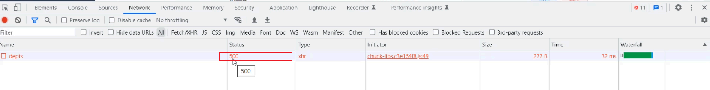
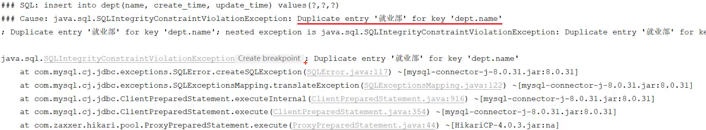
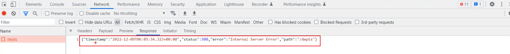
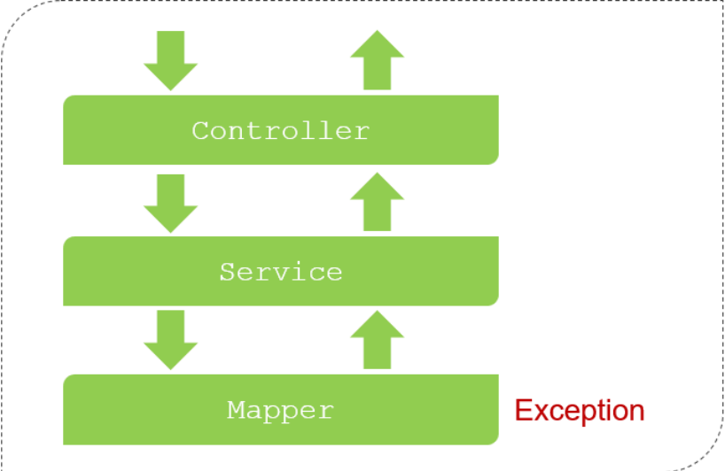
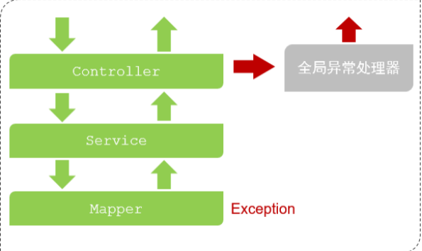
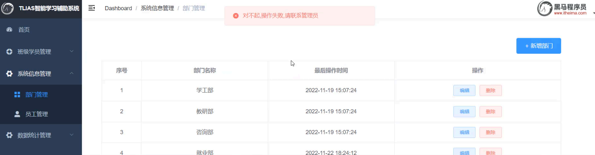

## ****当前问题****


在软件开发中，异常处理是至关重要的。如果没有进行适当的异常处理，系统在出现错误时可能会表现出各种不符合预期的行为。为了更好地理解异常处理的重要性，我们首先来考察一下，如果系统中出现异常，但我们没有做任何处理，会发生什么。


例如，当我们在一个系统中尝试添加一个已经存在的部门（如 "就业部"）时，由于数据库中 `dept` 表的 `name` 字段设置了唯一约束，因此会触发一个异常。


此时，观察浏览器的网络请求，可以看到状态码为 500，这表示服务器端发生了异常。





在 IDEA 中查看服务器端的错误信息，会发现是由于违反了 `dept` 表中 `name` 字段的唯一约束导致的。





再查看服务端给前端响应回来的数据，发现响应的数据是一个 JSON 格式的数据，但是不符合开发规范当中所提到的统一响应结果 `Result`。





当前案例项目中，当 `Mapper` 接口在操作数据库时出错，异常会向上抛给 `Service` 层。`Service` 层的异常会继续抛给 `Controller` 层。由于 `Controller` 层没有做任何异常处理，异常最终会抛给框架。框架会返回一个包含错误信息的 JSON 格式数据，但是这种格式不符合开发规范，导致前端无法正确解析和显示错误信息。





## ****解决方案****


针对上述问题，主要有两种解决方案：

- **方案一：在所有 Controller 的所有方法中进行** **`try...catch`** **处理**
	- 缺点：代码臃肿，维护困难，不推荐使用。
- **方案二：全局异常处理器**
	- 优点：简单、优雅，易于维护，推荐使用。

	


## ****全局异常处理器****


全局异常处理器是一种集中处理应用程序中所有异常的机制，它可以有效地减少代码冗余，提高代码的可维护性。


定义全局异常处理器非常简单，只需创建一个类，并添加 `@RestControllerAdvice` 注解。这个注解表示该类是一个全局异常处理器。


在全局异常处理器中，需要定义一个或多个方法来捕获特定类型的异常。这些方法需要使用 `@ExceptionHandler` 注解进行标记，并通过其 `value` 属性指定要捕获的异常类型。


下面是一个全局异常处理器的示例代码：


```java
@RestControllerAdvice
public class GlobalExceptionHandler {
    //处理异常
    @ExceptionHandler(Exception.class) //指定能够处理的异常类型
    public Result ex(Exception e){
        e.printStackTrace();//打印堆栈中的异常信息
        //捕获到异常之后，响应一个标准的Result
        return Result.error("对不起,操作失败,请联系管理员");
    }
}
```


**代码解释：**

- `@RestControllerAdvice`: 该注解组合了 `@ControllerAdvice` 和 `@ResponseBody`，表示该类用于处理所有 Controller 抛出的异常，并将处理结果转换为 JSON 格式返回。
- `@ExceptionHandler(Exception.class)`: 该注解用于指定处理特定类型的异常的方法。在这个例子中，`Exception.class` 表示该方法用于处理所有类型的 `Exception` 异常。
- `e.printStackTrace()`: 该方法用于将异常的堆栈信息打印到控制台，方便调试。
- `Result.error("对不起,操作失败,请联系管理员")`: 返回一个标准的 `Result` 对象，其中包含错误信息。

在上面的代码中，`@ExceptionHandler(Exception.class)` 注解指定了 `ex` 方法用于处理所有类型的 `Exception` 异常。当系统中发生任何 `Exception` 异常时，该方法都会被调用。在方法内部，首先使用 `e.printStackTrace()` 打印异常的堆栈信息，然后创建一个包含错误信息的 `Result` 对象，并将其返回给客户端。


现在，重新启动 SpringBoot 服务，再次尝试添加一个已存在的部门（如 "就业部"）。





可以看到，异常被全局异常处理器捕获，并返回了符合规范的错误信息，前端程序能够正常解析并显示该错误提示信息。


**总结：**


全局异常处理器的使用主要涉及以下两个注解：

- `@RestControllerAdvice`: 表示当前类为全局异常处理器。
- `@ExceptionHandler`: 指定可以捕获哪种类型的异常进行处理。

使用全局异常处理器可以有效地提高代码的可维护性，并提供一致的错误处理机制。

