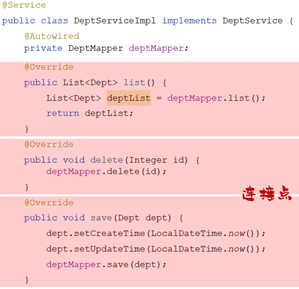
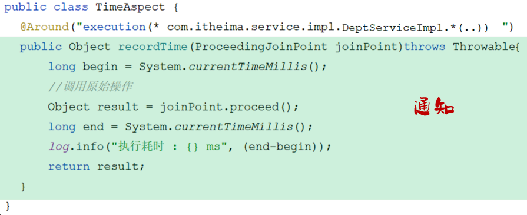
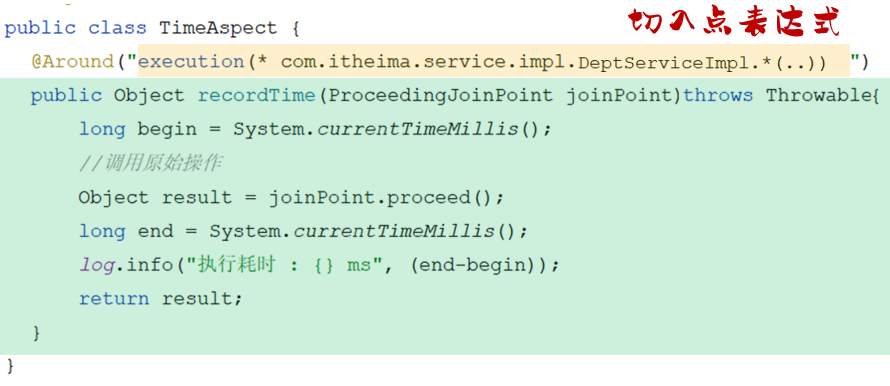
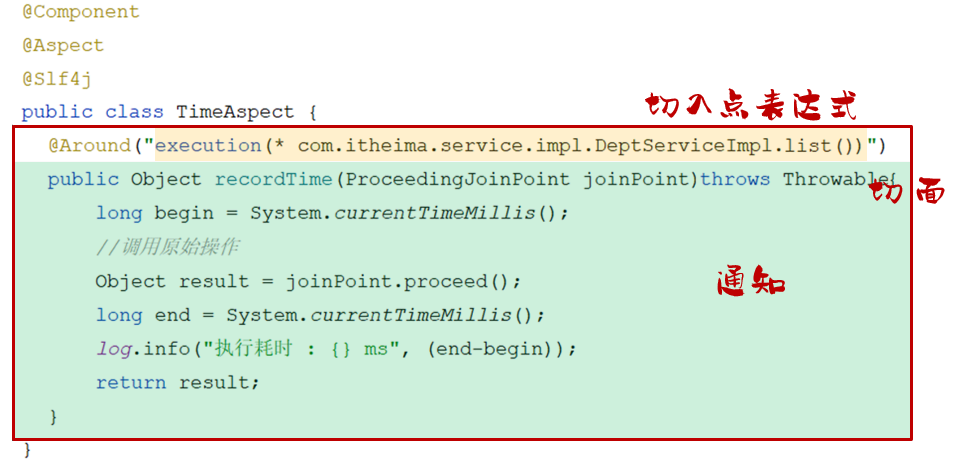
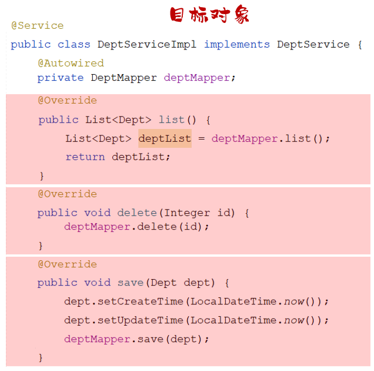

## ****AOP 概述****


AOP（Aspect Oriented Programming，面向切面编程）是一种编程思想，它允许开发者在不修改源代码的情况下，为现有的方法添加额外的功能。


**AOP 的作用：** 在程序运行期间在不修改源代码的基础上对已有方法进行增强。


**AOP 的优势：**

1. 减少重复代码
2. 提高开发效率
3. 维护方便

## ****AOP 快速入门****


**需求：** 统计各个业务层方法执行耗时。


**步骤：**

1. **导入依赖：** 在 `pom.xml` 中导入 AOP 的依赖。

	```xml
	<dependency>
	    <groupId>org.springframework.boot</groupId>
	    <artifactId>spring-boot-starter-aop</artifactId>
	</dependency>
	```

2. **编写 AOP 程序：** 创建一个切面类，使用 `@Aspect` 注解进行标识。

	```java
	@Component
	@Aspect // 当前类为切面类
	@Slf4j
	public class TimeAspect {
	    @Around("execution(* com.itheima.service.*.*(..))")
	    public Object recordTime(ProceedingJoinPoint pjp) throws Throwable {
	        // 记录方法执行开始时间
	        long begin = System.currentTimeMillis();
	        // 执行原始方法
	        Object result = pjp.proceed();
	        // 记录方法执行结束时间
	        long end = System.currentTimeMillis();
	        // 计算方法执行耗时
	        log.info(pjp.getSignature() + "执行耗时: {}毫秒", end - begin);
	        return result;
	    }
	}
	```


**代码解释：**

- `@Component` ：是将 `TimeAspect` 类标记为一个 Spring 组件，并自动将其实例化，纳入 Spring 容器的管理。
- `@Aspect`：将该类标记为一个切面。
- `@Around("execution(* com.itheima.service.*.*(..))")`：定义一个环绕通知，`execution(* com.itheima.service.*.*(..))` 是切入点表达式，表示 `com.itheima.service` 包下的所有类的所有方法。
- `ProceedingJoinPoint`：连接点对象，用于执行原始方法。
- `pjp.proceed()`：执行原始方法。
- `pjp.getSignature()`：获取方法签名。

## ****AOP 核心概念****

1. **连接点 (JoinPoint)**：指可以被 AOP 控制的方法，其中隐含了方法执行时的相关信息。

	连接点指的是可以被 AOP 控制的方法。例如：入门程序当中所有的业务方法都是可以被 AOP 控制的方法。


	

2. **通知 (Advice)**：指的是那些重复的逻辑，也就是共性功能，最终体现为一个方法。

	在入门程序中，我们需要统计各个业务方法的执行耗时。此时，我们需要在这些业务方法运行开始之前，先记录该方法运行的开始时间；在每一个业务方法运行结束的时候，再来记录该方法运行的结束时间。


	然而，在 AOP 当中，我们只需要将这部分重复的代码逻辑抽取出来单独定义。抽取出来的这一部分重复的逻辑，即为通知。


	

3. **切入点 (PointCut)**：用于匹配连接点的条件，通知仅会在切入点方法执行时被应用。

	在通知当中，我们所定义的共性功能到底要应用在哪些方法上呢？此时就涉及到了切入点 PointCut 概念。切入点指的是匹配连接点的条件。通知仅会在切入点方法运行时才会被应用。


	在 AOP 的开发当中，我们通常会通过一个切入点表达式来描述切入点。


	


	例如，若将切入点表达式改为 `DeptServiceImpl.list()` ，此时就代表仅有 `list` 这一方法是切入点。只有 `list` 方法在运行的时候才会应用通知。

4. **切面 (Aspect)**：描述了通知与切入点的对应关系（通知 + 切入点）。

	当通知和切入点结合在一起，就形成了一个切面。通过切面就能够描述当前 AOP 程序需要针对于哪个原始方法，在什么时候执行什么样的操作。


	


	切面所在的类，我们一般称为切面类（被 `@Aspect` 注解标识的类）。

5. **目标对象 (Target)**：指通知所应用的对象。

	目标对象指的就是通知所应用的对象，我们就称之为目标对象。


	

