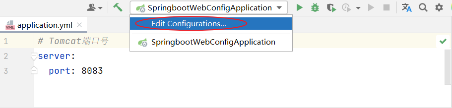
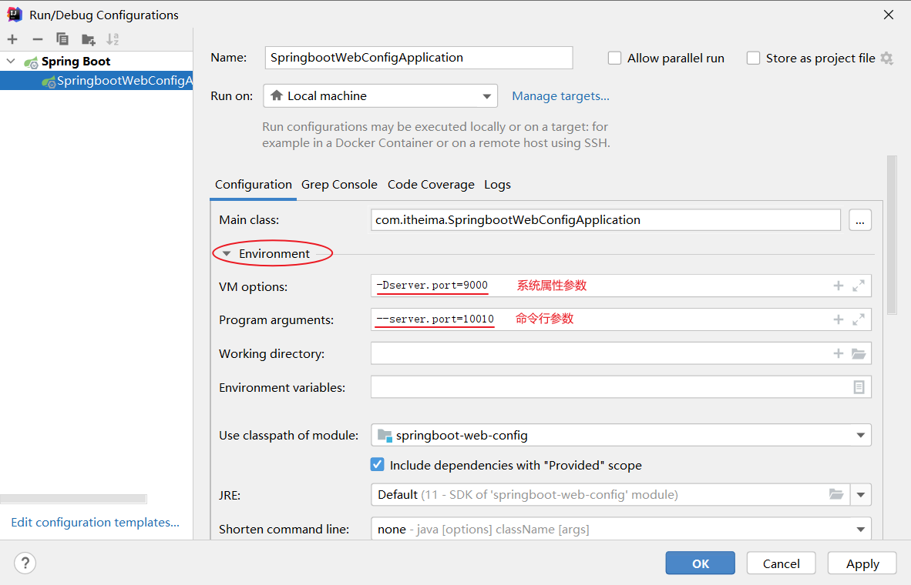

## ****配置优先级****


在 SpringBoot 项目中，配置属性的常见方式有：

- `application.properties`
- `application.yml`
- `application.yaml`
- Java 系统属性配置
	- `Dkey=value` 用于设置 Java 系统属性。
- 命令行参数
	- `--key=value` 用于设置命令行参数。

如果同时存在多个配置文件，且配置了同一个属性，则优先级如下（从低到高）：


`application.yaml` < `application.yml` < `application.properties` < Java 系统属性 < 命令行参数


**注意事项：**

- 推荐项目统一使用一种格式的配置文件，yml 是主流。
- SpringBoot 项目打包时，需要引入插件 `spring-boot-maven-plugin`。

## ****Java 系统属性和命令行配置方式****


### ****IDEA****

1. 编辑启动程序的配置信息：

	

2. 修改相关参数：

	


### ****Java 指令****


在项目已经打包上线后，可以通过以下方式设置 Java 系统属性和命令行参数：


```shell
java -Dserver.port=9000 -jar XXXXX.jar --server.port=100101
```

