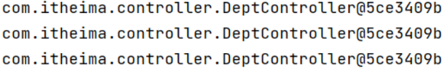
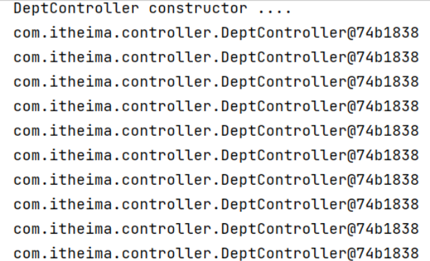

## ****获取 Bean****


SpringBoot 项目启动时会自动创建 IOC 容器，并将 Bean 对象都创建好，存放在 IOC 容器当中。


可以通过以下方式从 IOC 容器中获取 Bean 对象：

1. 根据 `name` 获取 Bean 。
2. 根据类型获取 Bean 。
3. 根据 `name` 获取 Bean（带类型转换）。

**代码示例：**

- 控制器：

	```java
	@RestController
	@RequestMapping("/depts")
	public class DeptController {
	
	    @Autowired
	    private DeptService deptService;
	
	    public DeptController(){
	        System.out.println("DeptController constructor ....");
	    }
	
	    @GetMapping
	    public Result list(){
	        List<Dept> deptList = deptService.list();
	        return Result.success(deptList);
	    }
	
	    @DeleteMapping("/{id}")
	    public Result delete(@PathVariable Integer id)  {
	        deptService.delete(id);
	        return Result.success();
	    }
	
	    @PostMapping
	    public Result save(@RequestBody Dept dept){
	        deptService.save(dept);
	        return Result.success();
	    }
	}
	```

- 测试类：

	```java
	@SpringBootTest
	class SpringbootWebConfig2ApplicationTests {
	    @Autowired
	    private ApplicationContext applicationContext; //IOC容器对象
	
	    //获取bean对象
	    @Test
	    public void testGetBean(){
	        //根据bean的名称获取
	        DeptController bean1 = (DeptController) applicationContext.getBean("deptController");
	        System.out.println(bean1);
	
	        //根据bean的类型获取
	        DeptController bean2 = applicationContext.getBean(DeptController.class);
	        System.out.println(bean2);
	
	        //根据bean的名称 及 类型获取
	        DeptController bean3 = applicationContext.getBean("deptController", DeptController.class);
	        System.out.println(bean3);
	    }
	}
	```


	**解释：**

	- `ApplicationContext` 接口代表 IOC 容器，可以通过 `@Autowired` 注入。
	- `getBean(String name)` 根据 Bean 的名称获取 Bean 对象。
	- `getBean(Class<T> requiredType)` 根据 Bean 的类型获取 Bean 对象。
	- `getBean(String name, Class<T> requiredType)` 根据 Bean 的名称和类型获取 Bean 对象。
	- 程序运行后控制台日志，输出的 bean 对象地址值是一样的：

	


**总结：** IOC 容器提供了多种方式来获取 Bean 对象，可以根据名称、类型或两者结合来获取。IOC 中的 Bean 对象默认是单例的。


## ****Bean 作用域****


默认情况下，IOC 容器中的 Bean 对象是单例模式。可以通过 `@Scope` 注解来设置 Bean 的作用域。


Spring 支持五种作用域：


| Bean 作用域 (Scope) | 描述                                  |
| ---------------- | ----------------------------------- |
| `singleton`      | 在容器内，相同名称的 Bean 只有一个实例 (单例)，这是默认行为。 |
| `prototype`      | 每次使用该 Bean 时，都会创建一个新的实例 (非单例)。      |
| `request`        | 在每个请求范围内，会创建一个新的实例 (Web 环境中)。       |
| `session`        | 在每个会话范围内，会创建一个新的实例 (Web 环境中)。       |
| `application`    | 在每个应用范围内，会创建一个新的实例 (Web 环境中)。       |


**代码示例：**

- 控制器：

	```java
	@Scope("prototype") //bean作用域为非单例
	@RestController
	@RequestMapping("/depts")
	public class DeptController {
	    @Autowired
	    private DeptService deptService;
	
	    public DeptController(){
	        System.out.println("DeptController constructor ....");
	    }
	    //省略其他代码...
	}
	```

- 测试类：

	```java
	@SpringBootTest
	class SpringbootWebConfig2ApplicationTests {
	
	    @Autowired
	    private ApplicationContext applicationContext; //IOC容器对象
	
	    //bean的作用域
	    @Test
	    public void testScope(){
	        for (int i = 0; i < 10; i++) {
	            DeptController deptController = applicationContext.getBean(DeptController.class);
	            System.out.println(deptController);
	        }
	    }
	}
	```


	**解释：**

	- `@Scope("prototype")` 将 `DeptController` Bean 的作用域设置为 `prototype`，每次获取该 Bean 都会创建一个新的实例。
	- 重启 SpringBoot 服务，再次执行测试方法，查看控制吧打印的日志：

		


**注意事项：**

- `singleton` 的 Bean，在容器启动时被创建，可以使用 `@Lazy` 注解来延迟初始化。
- `prototype` 的 Bean，每一次使用该 Bean 的时候都会创建一个新的实例。
- 实际开发当中，绝大部分的 Bean 是单例的，也就是说绝大部分 Bean 不需要配置 scope 属性。

**总结：** 可以通过 `@Scope` 注解灵活控制 Bean 的作用域，满足不同的需求。


## ****第三方 Bean****


如果需要管理的 Bean 对象来源于第三方（非自定义），由于其类文件的访问权限被限制为只读，以致无法通过 `@Component` 及其衍生注解声明 Bean 时，便需要使用 `@Bean` 注解。


**解决方案：**

1. 在配置类中定义 `@Bean` 标识的方法
2. 通过 `@Bean` 注解的 `name` 或 `value` 属性可以声明 Bean 的名称。如果不指定，默认 Bean 的名称就是方法名。
3. 如果第三方 Bean 需要依赖其它 Bean 对象，直接在 Bean 定义方法中设置形参即可，容器会根据类型自动装配。

**代码示例：**

- `pom.xml` 配置：

	```xml
	<!--Dom4j-->
	<dependency>
		<groupId>org.dom4j</groupId>
		<artifactId>dom4j</artifactId>
		<version>2.1.3</version>
	</dependency>
	```

- 待处理的 XML 文件：

	```xml
	<?xml version="1.0" encoding="UTF-8"?>
	<emp>
		<name>Tom</name>
		<age>18</age>
	</emp>
	```

- 配置类：

	```java
	@Configuration //配置类  (在配置类当中对第三方bean进行集中的配置管理)
	public class CommonConfig {
	    //声明第三方bean
	    @Bean //将当前方法的返回值对象交给IOC容器管理, 成为IOC容器bean
	          //通过@Bean注解的name/value属性指定bean名称, 如果未指定, 默认是方法名
	    public SAXReader reader(){
	        return new SAXReader();
	    }
	}
	```


	**解释：**

	- `@Configuration` 注解将 `CommonConfig` 声明为一个配置类。
	- `@Bean` 注解将 `reader()` 方法的返回值（`SAXReader` 对象）声明为一个 Bean，交给 IOC 容器管理。
- 测试类：

	```java
	@SpringBootTest
	class SpringbootWebConfig2ApplicationTests {
	
	    @Autowired
	    private SAXReader saxReader;
	
	    //第三方bean的管理
	    @Test
	    public void testThirdBean() throws Exception {
	        Document document = saxReader.read(this.getClass().getClassLoader().getResource("1.xml"));
	        Element rootElement = document.getRootElement();
	        String name = rootElement.element("name").getText();
	        String age = rootElement.element("age").getText();
	
	        System.out.println(name + " : " + age);
	    }
	
	    //省略其他代码...
	}
	```


**注意事项：**

- 通过 `@Bean` 注解的 `name` 或 `value` 属性可以声明 Bean 的名称。如果不指定，默认 Bean 的名称就是方法名。
- 如果第三方 Bean 需要依赖其他的 Bean 对象，可以直接在 Bean 定义方法中设置形参，容器会根据类型自动装配。

**总结：** 使用 `@Bean` 注解可以方便地将第三方 Bean 纳入 Spring 容器的管理。通过这种方式可以声明第三方Bean对象。

