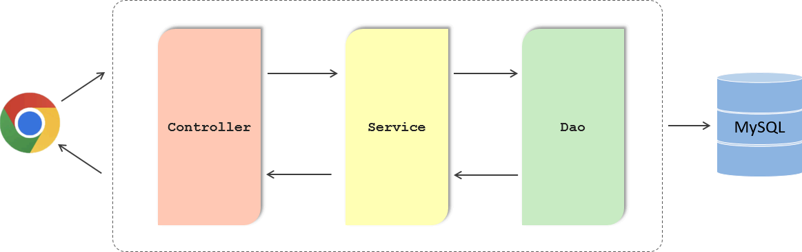
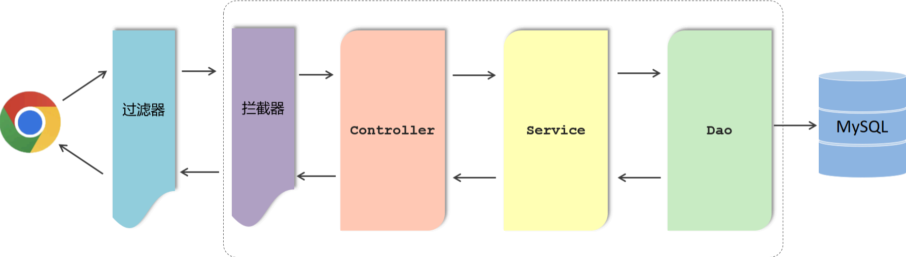
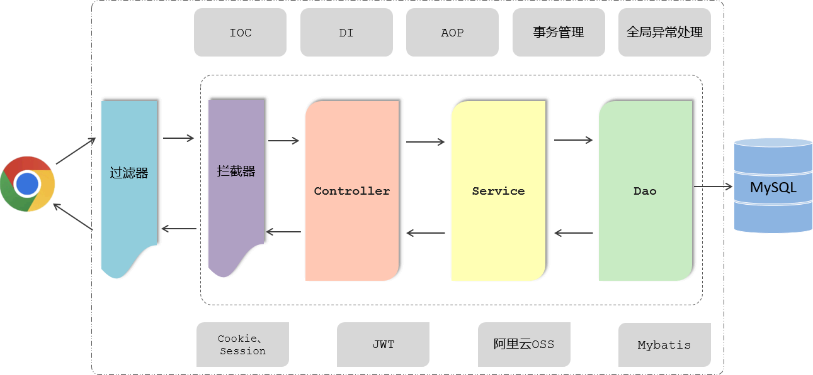
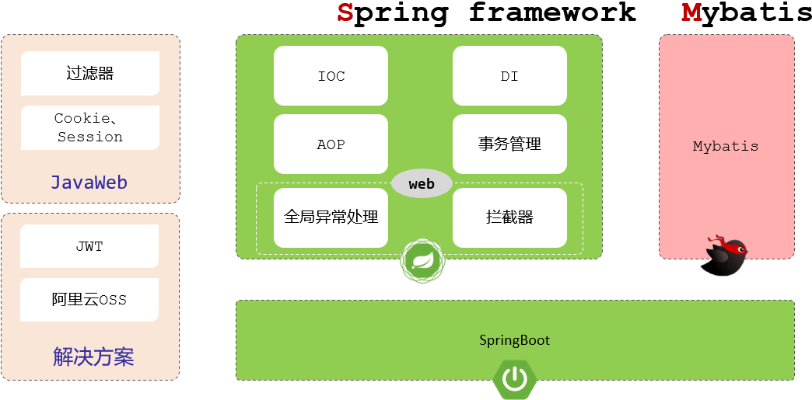
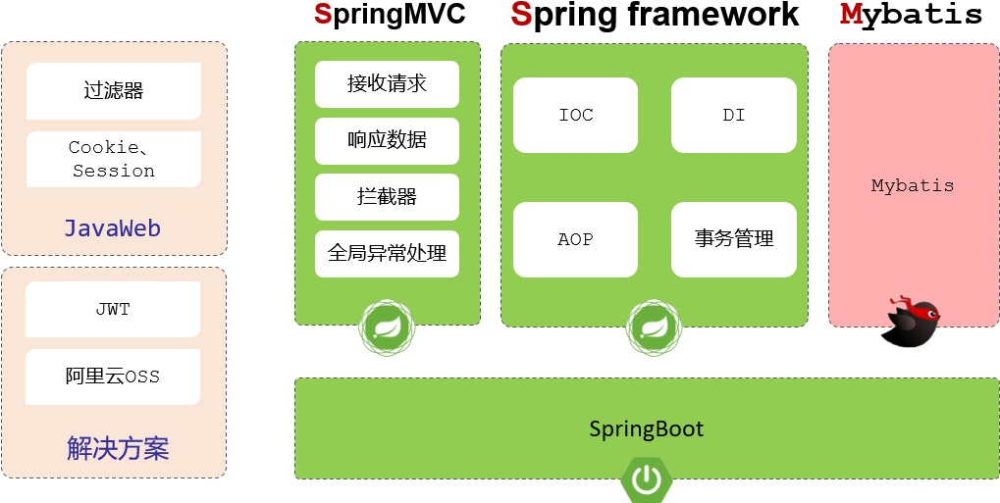

到目前为止，我们已经学习了基于 Spring Boot 进行 Web 后端开发的相关知识。下面对 Web 课程进行总结，回顾所学内容，并明确每个知识点所属的框架。

## ****三层架构****

Web 后端开发基本上都是基于标准的三层架构进行开发的。

- **Controller（控制器层）：** 负责接收请求，响应数据，不进行逻辑处理。
- **Service（业务层）：** 负责具体的业务逻辑处理。
- **DAO（数据访问层/持久层）：** 负责处理数据访问操作，完成数据库中数据的增删改查操作。

**请求流程：** 前端发起请求，首先到达 Controller，Controller 直接调用 Service 进行逻辑处理，Service 再调用 DAO 完成数据访问操作。

## ****通用业务处理****

在执行具体的业务处理之前，可能需要进行一些通用的业务处理，例如：统一的登录校验、统一的字符编码等。

**实现方案：** 借助于 Java Web 当中的三大组件之一的 **过滤器 Filter** 或者是 Spring 当中提供的 **拦截器 Interceptor** 来实现。

## ****Spring 框架核心****

为了实现三层架构层与层之间的解耦，我们学习了 Spring 框架当中的第一大核心：**IOC 控制反转** 与 **DI 依赖注入**。

- **IOC（控制反转）：** 指的是将对象创建的控制权由应用程序自身交给外部容器，这个容器就是 IOC 容器或 Spring 容器。
- **DI（依赖注入）：** 指的是容器为程序提供运行时所需要的资源。

除了 IOC 与 DI，我们还讲到了 **AOP 面向切面编程**，还有 Spring 中的 **事务管理**、**全局异常处理器**，以及传递会话技术 **Cookie**、**Session** 以及新的会话跟踪解决方案 **JWT 令牌**，**阿里云 OSS 对象存储服务**，以及通过 **Mybatis 持久层架构** 操作数据库等技术。

## ****技术归属****

我们在学习这些 Web 后端开发技术的时候，都是基于主流的 Spring Boot 进行整合使用的。现在来区分一下这些技术分别是哪个框架提供的核心功能：

- **Java Web 技术：** Filter 过滤器、Cookie、Session。
- **企业解决方案：** JWT 令牌、阿里云 OSS 对象存储服务。
- **Spring Framework 核心功能：** IOC 控制反转、DI 依赖注入、AOP 面向切面编程、事务管理、全局异常处理、拦截器。
- **持久层框架：** Mybatis (用于操作数据库)。

## ****SpringMVC****

Spring 框架的生态中，对 Web 程序开发提供了很好的支持，例如：全局异常处理器、拦截器。这些都是 Spring 框架中 Web 开发模块所提供的功能，而 Spring 框架的 Web 开发模块，也被称为 **SpringMVC**。

**注意：** SpringMVC 不是一个单独的框架，它是 Spring 框架的一部分，是 Spring 框架中的 Web 开发模块，是用来简化原始的 Servlet 程序开发的。

## ****SSM 框架****

外界俗称的 **SSM**，就是由：**SpringMVC、Spring Framework、Mybatis** 三块组成。

基于传统的 SSM 框架进行整合开发项目会比较繁琐，而且效率也比较低，所以在现在的企业项目开发当中，基本上都是直接基于 Spring Boot 整合 SSM 进行项目开发的。

