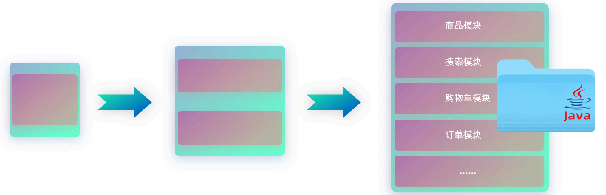
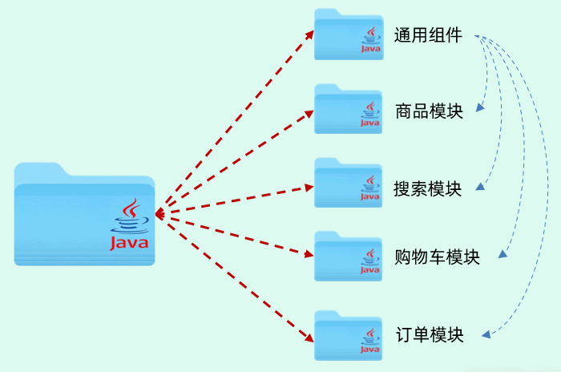
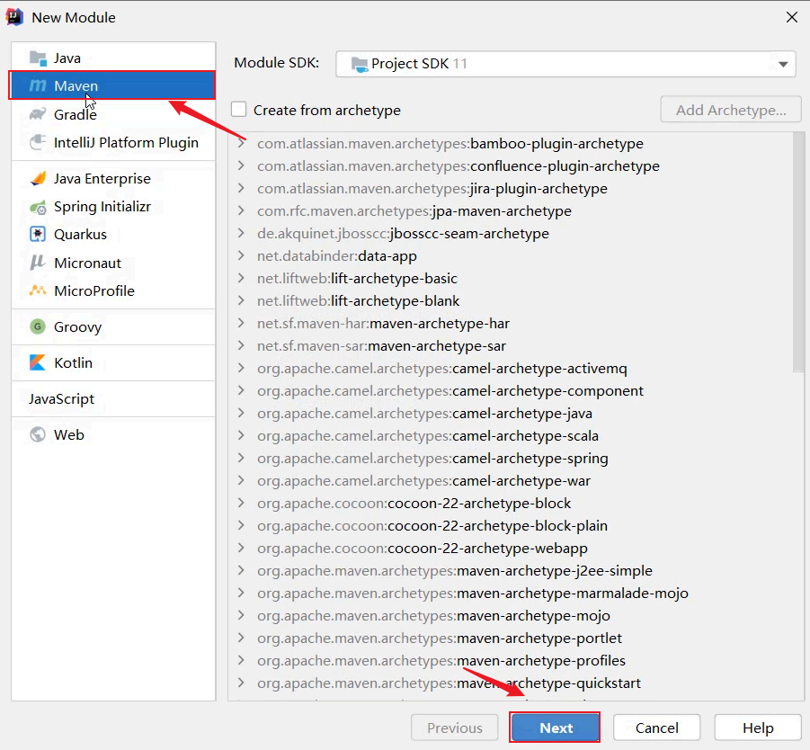
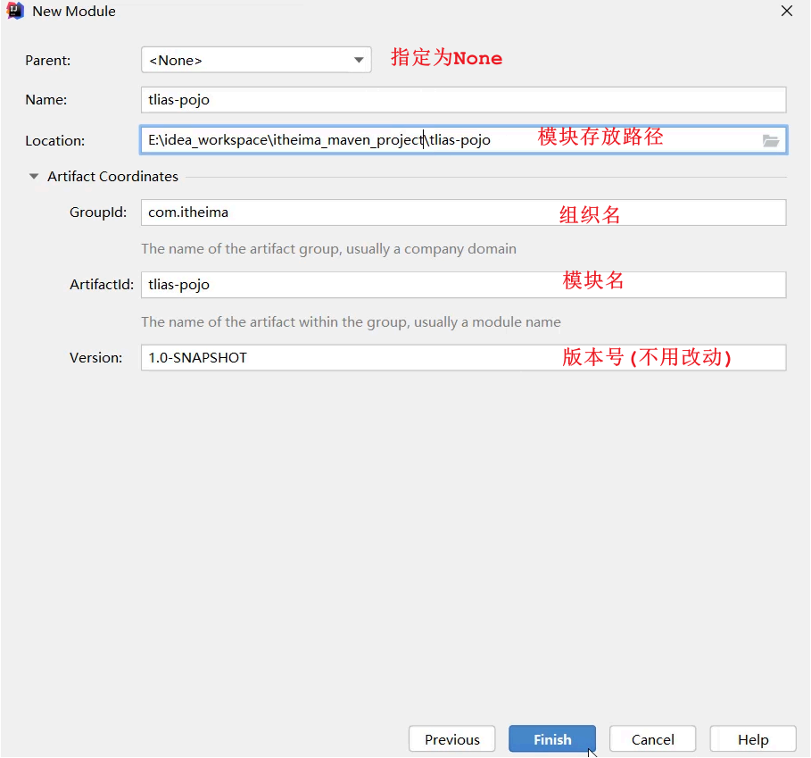

## ****介绍****


分模块设计指的是在设计 Java 项目时， 将一个 Java 项目拆分成多个模块进行开发。


### ****未分模块设计的问题****


如果不进行分模块设计，所有的业务代码都将写在一个 Java 项目中。 随着项目的业务扩张， 项目中的业务功能可能会越来越多。这会导致：

- **不方便项目的维护和管理**： 大型项目可能由几十甚至几百号开发人员共同操作，集中在一个 Java 项目中会使得项目管理和维护非常困难。
- **项目中的通用组件难以复用**： 如果项目当中定义了一些通用的工具类以及通用的组件，而公司还有其他的项目组，其他项目组也想使用我们所封装的这些组件和工具类，其实是非常不方便的，Java 项目包含了当前项目的所有业务代码，会造成里面所封装的一些组件难以复用。




### ****分模块设计****


在项目设计阶段，可以将一个大的项目拆分成若干个模块，每一个模块都是独立的。比如：商品模块、搜索模块、购物车模块、订单模块，还可以将项目当中的实体类、工具类以及我们定义的通用的组件都单独的抽取到一个模块当中。





如果当前模块需要用到这些实体类以及工具类或者这些通用组件，此时直接在订单模块当中引入工具类的坐标就可以了。这样就将一个项目拆分成了若干个模块，这就是分模块设计。


分模块设计就是将项目按照功能/结构拆分成若干个子模块，方便项目的管理维护、拓展，也方便模块键的相互调用、资源共享。


## ****实践****


### ****分析****


以之前开发的案例工程为例，除了部门管理、员工管理、登录认证等相关业务功能以外，还定义了一些实体类（`pojo` 包下存放的类，如 `PageBean`、`Result`）和一些通用的工具类（如 `Jwts`、阿里云 OSS 操作的工具类）。 如果当前公司的其他项目组也想使用这些公共组件，可以考虑以下方案：

- **方案一**：直接依赖当前项目 `tlias-web-management`。
	- **缺点**：
		- 项目包含所有业务代码，而想共享的资源仅仅是 `pojo` 下的实体类和 `utils` 下的工具类，全部依赖会影响性能。
		- 所有业务代码都对外公开，不安全。
- **方案二**：分模块设计
	- 将 `pojo` 包下的实体类抽取到一个 Maven 模块 `tlias-pojo` 中。
	- 将 `utils` 包下的工具类抽取到一个 Maven 模块 `tlias-utils` 中。
	- 其他业务代码放在 `tlias-web-management` 模块中，需要用到实体类 `pojo`、工具类 `utils` 时，直接引入对应的依赖即可。

### ****实现****


根据分析的思路，按照如下模块进行拆分：

1. **创建 Maven 模块** **`tlias-pojo`****，存放实体类**
	- 创建一个正常的 Maven 模块，模块名 `tlias-pojo`。

		


		

	- 在 `tlias-pojo` 中创建一个包 `com.itheima.pojo`（和原来案例项目中的 `pojo` 包名一致）。
	- 将原来案例项目 `tlias-web-management` 中的 `pojo` 包下的实体类，复制到 `tlias-pojo` 模块中。
	- 在 `tlias-pojo` 模块的 `pom.xml` 文件中引入依赖，如下代码所示：

		```xml
		<dependencies>
		    <dependency>
		        <groupId>org.projectlombok</groupId>
		        <artifactId>lombok</artifactId>
		        <version>1.18.24</version>
		    </dependency>
		</dependencies>
		```


		这段代码定义了 `tlias-pojo` 模块的依赖，这里引入了 Lombok，Lombok 能够以简单的注解形式来简化 java 代码。

	- 删除原有案例项目 `tlias-web-management` 的 `pojo` 包，然后在 `pom.xml` 中引入 `tlias-pojo` 的依赖，如下代码所示：

		```xml
		<dependency>
		    <groupId>com.itheima</groupId>
		    <artifactId>tlias-pojo</artifactId>
		    <version>1.0-SNAPSHOT</version>
		</dependency>
		```


		这段代码定义了 `tlias-web-management` 模块对 `tlias-pojo` 模块的依赖，指定了 `tlias-pojo` 的 groupId、artifactId 和 version。

2. **创建 Maven 模块** **`tlias-utils`****，存放相关工具类**
	- 创建一个正常的 Maven 模块，模块名 `tlias-utils`。
	- 在 `tlias-utils` 中创建一个包 `com.itheima.utils`（和原来案例项目中的 `utils` 包名一致）。
	- 将原来案例项目 `tlias-web-management` 中的 `utils` 包下的实体类，复制到 `tlias-utils` 模块中。
	- 在 `tlias-utils` 模块的 `pom.xml` 文件中引入依赖，如下代码所示：

		```xml
		<dependencies>
		    <!--JWT令牌-->
		    <dependency>
		        <groupId>io.jsonwebtoken</groupId>
		        <artifactId>jjwt</artifactId>
		        <version>0.9.1</version>
		    </dependency>
		    <!--阿里云OSS-->
		    <dependency>
		        <groupId>com.aliyun.oss</groupId>
		        <artifactId>aliyun-sdk-oss</artifactId>
		        <version>3.15.1</version>
		    </dependency>
		    <dependency>
		        <groupId>javax.xml.bind</groupId>
		        <artifactId>jaxb-api</artifactId>
		        <version>2.3.1</version>
		    </dependency>
		    <dependency>
		        <groupId>javax.activation</groupId>
		        <artifactId>activation</artifactId>
		        <version>1.1.1</version>
		    </dependency>
		    <!-- no more than 2.3.3-->
		    <dependency>
		        <groupId>org.glassfish.jaxb</groupId>
		        <artifactId>jaxb-runtime</artifactId>
		        <version>2.3.3</version>
		    </dependency>
		    <!--WEB开发-->
		    <dependency>
		        <groupId>org.springframework.boot</groupId>
		        <artifactId>spring-boot-starter-web</artifactId>
		        <version>2.7.5</version>
		    </dependency>
		    <dependency>
		        <groupId>org.projectlombok</groupId>
		        <artifactId>lombok</artifactId>
		        <version>1.18.24</version>
		    </dependency>
		</dependencies>
		```

	- 删除原有案例项目 `tlias-web-management` 的 `utils` 包，然后在 `pom.xml` 中引入 `tlias-utils` 的依赖，如下代码所示：

		```xml
		<dependency>
		    <groupId>com.itheima</groupId>
		    <artifactId>tlias-utils</artifactId>
		    <version>1.0-SNAPSHOT</version>
		</dependency>
		```


		这段代码定义了 `tlias-web-management` 模块对 `tlias-utils` 模块的依赖，指定了 `tlias-utils` 的 groupId、artifactId 和 version。


完成了模块的拆分，拆分出了 `tlias-pojo`、`tlias-utils`、`tlias-web-management`， 如果其他项目中需要用到 pojo，或者 utils 工具类，就可以直接引入依赖。


## ****总结****

1. **什么是分模块设计**： 将项目按照功能拆分成若干个子模块。
2. **为什么要分模块设计**： 方便项目的管理维护、扩展，也方便模块间的相互调用，资源共享。
3. **注意事项**： 分模块设计需要先针对模块功能进行设计，再进行编码。 不会先将工程开发完毕，然后进行拆分。
