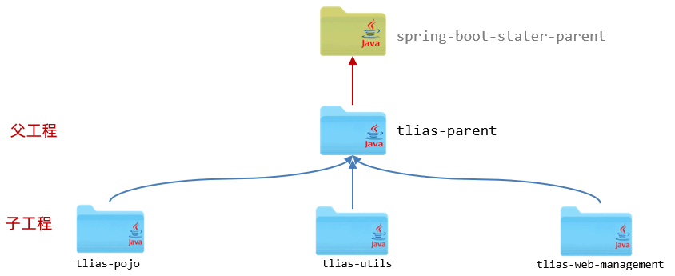
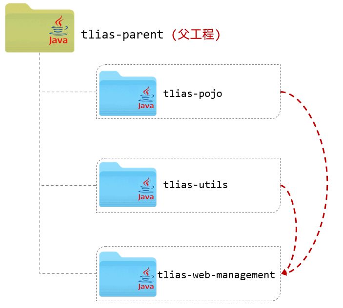
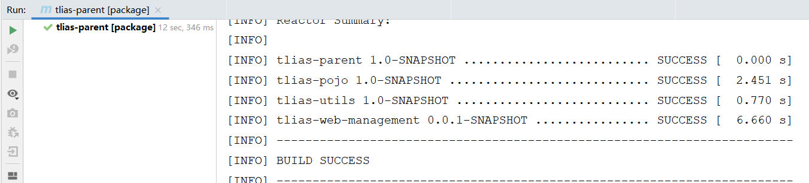

在案例项目分模块开发之后，`tlias-pojo`、`tlias-utils`、`tlias-web-management` 中都引入了一个依赖 Lombok 的依赖。 如果是做一个大型的项目，这三个模块当中重复的依赖可能会很多很多。 如果每一个 Maven 模块里面，我们都来单独的配置一次，功能虽然能实现，但是配置是比较繁琐的，Maven 的继承用来解决这问题的。


## ****继承****


可以再创建一个父工程 `tlias-parent`，然后让上述的三个模块 `tlias-pojo`、`tlias-utils`、`tlias-web-management` 都来继承这个父工程 。 然后再将各个模块中都共有的依赖，都提取到父工程 `tlias-parent` 中进行配置，只要子工程继承了父工程，依赖它也会继承下来，这样就无需在各个子工程中进行配置了。

- **概念**： 继承描述的是两个工程间的关系，与 Java 中的继承相似，子工程可以继承父工程中的配置信息，常见于依赖关系的继承。
- **作用**： 简化依赖配置、统一管理依赖。
- **实现**：

	```xml
	<parent>
	    <groupId>...</groupId>
	    <artifactId>...</artifactId>
	    <version>...</version>
	    <relativePath>....</relativePath>
	</parent>
	```


### ****继承关系****


#### ****思路分析****


`tlias-web-management` 是一个 Spring Boot 项目，而所有的 Spring Boot 项目都有一个统一的父工程，即 `spring-boot-starter-parent`。与 Java 语言类似，Maven 不支持多继承，一个 Maven 项目只能继承一个父工程。如果上述三个模块继承了 `spring-boot-starter-parent`，则无法继承自定义的父工程 `tlias-parent`。


Java 虽然不支持多继承，但是支持多重继承，例如：A 继承 B，B 继承 C。Maven 中也是如此，因此我们可以让这三个模块均继承 `tlias-parent`，而 `tlias-parent` 再继承 `spring-boot-starter-parent`。具体结构如下：





#### ****实现****

1. **创建 Maven 模块** **`tlias-parent`****，该工程为父工程，设置打包方式为** **`pom`****（默认** **`jar`****）。**

	父工程 `tlias-parent` 的 `pom.xml` 文件配置如下：


	```xml
	<parent>
	    <groupId>org.springframework.boot</groupId>
	    <artifactId>spring-boot-starter-parent</artifactId>
	    <version>2.7.5</version>
	    <relativePath/> <!-- lookup parent from repository -->
	</parent>
	<groupId>com.itheima</groupId>
	<artifactId>tlias-parent</artifactId>
	<version>1.0-SNAPSHOT</version>
	<packaging>pom</packaging>
	```


	这段代码定义了 `tlias-parent` 模块的父模块为 `spring-boot-starter-parent`，同时 `packaging` 指定了打包方式为 `pom`，表示这是一个父工程。


	**Maven 打包方式**：

	- `jar`： 普通模块打包，springboot 项目基本都是 jar 包（内嵌 tomcat 运行）
	- `war`： 普通 web 程序打包，需要部署在外部的 tomcat 服务器中运行
	- `pom`： 父工程或聚合工程，该模块不写代码，仅进行依赖管理
2. **在子工程的** **`pom.xml`** **文件中，配置继承关系。**

	这里是以 `tlias-utils` 为例，指定了其父工程。其他的模块，都是相同的配置方式。


	```xml
	<parent>
	    <groupId>com.itheima</groupId>
	    <artifactId>tlias-parent</artifactId>
	    <version>1.0-SNAPSHOT</version>
	    <relativePath>../tlias-parent/pom.xml</relativePath>
	</parent>
	```


	这段代码定义了 `tlias-utils` 模块的父模块为 `tlias-parent`，同时指定了自身的 `artifactId` 和 `version`。


	**注意**：

	- 在子工程中，配置了继承关系之后，坐标中的 `groupId` 是可以省略的，因为会自动继承父工程的 。
	- `relativePath` 指定父工程的 `pom` 文件的相对位置（如果不指定，将从本地仓库/远程仓库查找该工程）。
3. **在父工程中配置各个工程共有的依赖（子工程会自动继承父工程的依赖）。**

	此时，我们已经将各个子工程中共有的依赖（lombok），都定义在了父工程中，子工程中的这一项依赖，就可以直接删除了。删除之后，我们会看到父工程中配置的依赖 lombok，子工程直接继承下来了。


	```xml
	<dependencies>
	    <dependency>
	        <groupId>org.projectlombok</groupId>
	        <artifactId>lombok</artifactId>
	        <version>1.18.24</version>
	    </dependency>
	</dependencies>
	```


	这段代码定义了父工程 `tlias-parent` 的依赖，这里引入了 Lombok，子工程会自动继承这个依赖。


### ****版本锁定****


#### ****场景****


如果项目中各个模块中都公共的这部分依赖，可以直接定义在父工程中，从而简化子工程的配置。 然而在项目开发中，还有一部分依赖，并不是各个模块都共有的，可能只是其中的一小部分模块中使用到了这个依赖。


如果在 `tlias-web-management`、`tlias-web-system`、`tlias-web-report` 这三个子工程中，都使用到了 jwt 的依赖。 但是 `tlias-pojo`、`tlias-utils` 中并不需要这个依赖，此时，这个依赖，不会直接配置在父工程 `tlias-parent` 中，而是哪个模块需要，就在哪个模块中配置。


而由于是一个项目中的多个模块，那多个模块中，要使用的同一个依赖的版本要一致，这样便于项目依赖的统一管理。 比如：这个 jwt 依赖，我们都使用的是 `0.9.1` 这个版本。


如果项目要升级，要使用到 jwt 最新版本 `0.9.2` 中的一个新功能，那此时需要将依赖的版本升级到 `0.9.2`，那此时该怎么做呢 ？

1. 找到当前项目中所有的模块的 `pom.xml` 配置文件，看哪些模块用到了 jwt 的依赖。
2. 找到这个依赖之后，将其版本 `version`，更换为 `0.9.2`。

**问题**： 如果项目拆分的模块比较多，每一次更换版本，我们都得找到这个项目中的每一个模块，一个一个的更改。 很容易就会出现，遗漏掉一个模块，忘记更换版本的情况。


Maven 的版本锁定功能可以解决这个问题。


#### ****介绍****


在 Maven 中，可以在父工程的 `pom` 文件中通过 `<dependencyManagement>` 来统一管理依赖版本。


**父工程**：


```xml
<dependencyManagement>
    <dependencies>
        <dependency>
            <groupId>io.jsonwebtoken</groupId>
            <artifactId>jjwt</artifactId>
            <version>0.9.1</version>
        </dependency>
    </dependencies>
</dependencyManagement>
```


**子工程**：


```xml
<dependencies>
    <dependency>
        <groupId>io.jsonwebtoken</groupId>
        <artifactId>jjwt</artifactId>
    </dependency>
</dependencies>
```


**注意**：

- 在父工程中所配置的 `<dependencyManagement>` 只能统一管理依赖版本，并不会将这个依赖直接引入进来。 这点和 `<dependencies>` 是不同的。
- 子工程要使用这个依赖，还是需要引入的，只是此时就无需指定 `<version>` 版本号，由父工程统一管理。 变更依赖版本，只需在父工程中统一变更。

#### ****实现****


可以将 `tlias-utils` 模块中单独配置的依赖，将其版本统一交给 `tlias-parent` 进行统一管理。


**具体步骤如下**：

1. **`tlias-parent`** **中的配置**

	```xml
	<!--统一管理依赖版本-->
	<dependencyManagement>
	    <dependencies>
	        <!--JWT令牌-->
	        <dependency>
	            <groupId>io.jsonwebtoken</groupId>
	            <artifactId>jjwt</artifactId>
	            <version>0.9.1</version>
	        </dependency>
	    </dependencies>
	</dependencyManagement>
	```


	这段代码在父工程 `tlias-parent` 中使用 `<dependencyManagement>` 统一管理 jwt 依赖的版本。

2. **`tlias-utils`** **中的** **`pom.xml`** **配置**

	如果依赖的版本已经在父工程进行了统一管理，所以在子工程中就无需再配置依赖的版本了。


	```xml
	<dependencies>
	    <!--JWT令牌-->
	    <dependency>
	        <groupId>io.jsonwebtoken</groupId>
	        <artifactId>jjwt</artifactId>
	    </dependency>
	    <!--阿里云OSS-->
	    <dependency>
	        <groupId>com.aliyun.oss</groupId>
	        <artifactId>aliyun-sdk-oss</artifactId>
	    </dependency>
	    <dependency>
	        <groupId>javax.xml.bind</groupId>
	        <artifactId>jaxb-api</artifactId>
	    </dependency>
	    <dependency>
	        <groupId>javax.activation</groupId>
	        <artifactId>activation</artifactId>
	    </dependency>
	    <!-- no more than 2.3.3-->
	    <dependency>
	        <groupId>org.glassfish.jaxb</groupId>
	        <artifactId>jaxb-runtime</artifactId>
	    </dependency>
	    <!--WEB开发-->
	    <dependency>
	        <groupId>org.springframework.boot</groupId>
	        <artifactId>spring-boot-starter-web</artifactId>
	    </dependency>
	</dependencies>
	```


	这段代码在子工程 `tlias-utils` 中引入 jwt 依赖，但是没有指定版本，版本由父工程 `tlias-parent` 统一管理。


在 Spring Boot 项目中很多时候，引入依赖坐标，都不需要指定依赖的版本 `<version>`，是因为在父工程 `spring-boot-starter-parent` 中已经通过 `<dependencyManagement>` 对依赖的版本进行了统一的管理维护。


#### ****属性配置****


也可以通过自定义属性及属性引用的形式，在父工程中将依赖的版本号进行集中管理维护。 具体语法为：

1. **自定义属性**

	```xml
	<properties>
	    <lombok.version>1.18.24</lombok.version>
	</properties>
	```

2. **引用属性**

	```xml
	<dependency>
	    <groupId>org.projectlombok</groupId>
	    <artifactId>lombok</artifactId>
	    <version>${lombok.version}</version>
	</dependency>
	```


	接下来，就可以在父工程中，将所有的版本号，都集中管理维护起来。


	```xml
	<properties>
	    <maven.compiler.source>11</maven.compiler.source>
	    <maven.compiler.target>11</maven.compiler.target>
	    <lombok.version>1.18.24</lombok.version>
	    <jjwt.version>0.9.1</jjwt.version>
	    <aliyun.oss.version>3.15.1</aliyun.oss.version>
	    <jaxb.version>2.3.1</jaxb.version>
	    <activation.version>1.1.1</activation.version>
	    <jaxb.runtime.version>2.3.3</jaxb.runtime.version>
	</properties>
	<dependencies>
	    <dependency>
	        <groupId>org.projectlombok</groupId>
	        <artifactId>lombok</artifactId>
	        <version>${lombok.version}</version>
	    </dependency>
	</dependencies>
	<!--统一管理依赖版本-->
	<dependencyManagement>
	    <dependencies>
	        <!--JWT令牌-->
	        <dependency>
	            <groupId>io.jsonwebtoken</groupId>
	            <artifactId>jjwt</artifactId>
	            <version>${jjwt.version}</version>
	        </dependency>
	        <!--阿里云OSS-->
	        <dependency>
	            <groupId>com.aliyun.oss</groupId>
	            <artifactId>aliyun-sdk-oss</artifactId>
	            <version>${aliyun.oss.version}</version>
	        </dependency>
	        <dependency>
	            <groupId>javax.xml.bind</groupId>
	            <artifactId>jaxb-api</artifactId>
	            <version>${jaxb.version}</version>
	        </dependency>
	        <dependency>
	            <groupId>javax.activation</groupId>
	            <artifactId>activation</artifactId>
	            <version>${activation.version}</version>
	        </dependency>
	        <!-- no more than 2.3.3-->
	        <dependency>
	            <groupId>org.glassfish.jaxb</groupId>
	            <artifactId>jaxb-runtime</artifactId>
	            <version>${jaxb.runtime.version}</version>
	        </dependency>
	    </dependencies>
	</dependencyManagement>
	```


版本集中管理之后，要想修改依赖的版本，只需要在父工程中自定义属性的位置，修改对应的属性值即可。


**面试题：****`<dependencyManagement>`** **与** **`<dependencies>`** **的区别是什么?**

- `<dependencies>` 是直接依赖，在父工程配置了依赖，子工程会直接继承下来。
- `<dependencyManagement>` 是统一管理依赖版本，不会直接依赖，还需要在子工程中引入所需依赖（无需指定版本）。

## ****聚合****


分模块设计与开发之后，项目被拆分为多个模块，而模块之间的关系，可能错综复杂。 当前的案例项目，结构如下：





`tlias-web-management` 模块的父工程是 `tlias-parent`，该模块又依赖了 `tlias-pojo`、`tlias-utils` 模块。 如果要将 `tlias-web-management` 模块打包，是比较繁琐的。因为在进行项目打包时，Maven 会从本地仓库中来查找 `tlias-parent` 父工程，以及它所依赖的模块 `tlias-pojo`、`tlias-utils`，而本地仓库目前是没有这几个依赖的。


所以在打包 `tlias-web-management` 模块前，需要将 `tlias-parent`、`tlias-pojo`、`tlias-utils` 分别执行 `install` 生命周期安装到 Maven 的本地仓库，然后再针对于 `tlias-web-management` 模块执行 `package` 进行打包操作。


如果开发一个大型项目，拆分的模块很多，模块之间的依赖关系错综复杂，此时要进行项目的打包、安装操作，是非常繁琐的。 Maven 的聚合就是来解决这个问题的，通过 Maven 的聚合就可以轻松实现项目的一键构建（清理、编译、测试、打包、安装等）。


### ****介绍****


**聚合**： 将多个模块组织成一个整体，同时进行项目的构建。


**聚合工程**： 一个不具有业务功能的“空”工程，其有且仅有一个 `pom` 文件。（一般来说，继承关系中的父工程与聚合关系中的聚合工程是同一个）


**作用**： 快速构建项目。（无需根据依赖关系手动构建，直接在聚合工程上构建即可）


### ****实现****


在 Maven 中，可以在聚合工程中通过 `<moudules>` 设置当前聚合工程所包含的子模块的名称。 可以在 `tlias-parent` 中，添加如下配置，来指定当前聚合工程，需要聚合的模块：


```xml
<!--聚合其他模块-->
<modules>
    <module>../tlias-pojo</module>
    <module>../tlias-utils</module>
    <module>../tlias-web-management</module>
</modules>
```


这段代码定义了聚合工程 `tlias-parent` 需要聚合的子模块，包括 `tlias-pojo`、`tlias-utils` 和 `tlias-web-management`。


此时，要进行编译、打包、安装操作，就无需在每一个模块上操作了。 只需要在聚合工程上，统一进行操作就可以了。


**测试**： 执行在聚合工程 `tlias-parent` 中执行 `package` 打包指令。





此时 `tlias-parent` 中所聚合的其他模块全部都会执行 `package` 指令，这就是通过聚合实现项目的一键构建（一键清理 `clean`、一键编译 `compile`、一键测试 `test`、一键打包 `package`、一键安装 `install` 等）。


## ****继承与聚合对比****

- **作用**
	- 聚合用于快速构建项目。
	- 继承用于简化依赖配置，统一管理依赖。
- **相同点**
	- 聚合与继承的 `pom.xml` 文件打包方式均为 `pom`，通常会将两种关系制作到同一个 `pom` 文件中。
	- 聚合与继承均属于设计型模块，并无实际的模块内容。
- **不同点**
	- 聚合是在聚合工程中配置关系，聚合可以感知到参与聚合的模块有哪些。
	- 继承是在子模块中配置关系，父模块无法感知哪些子模块继承了自己。
