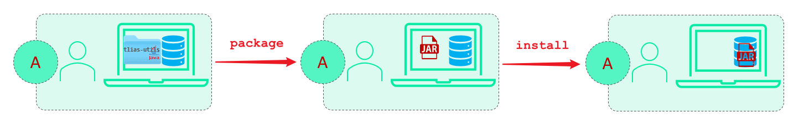
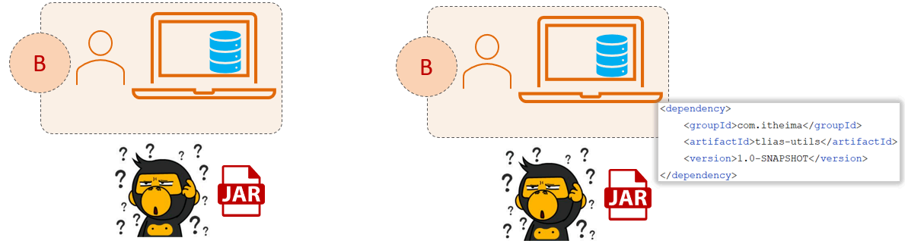
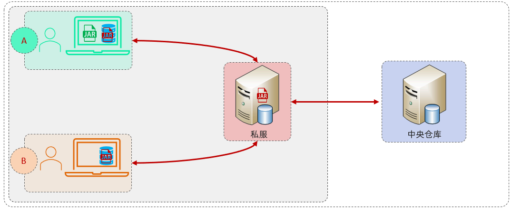
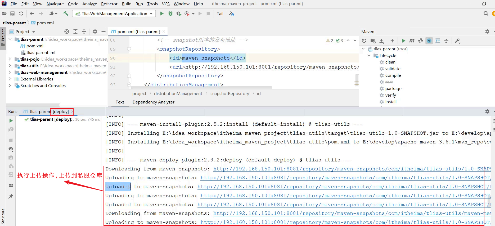

在多模块开发中，将拆分的模块在公司各个项目组之间进行资源共享，需要通过 Maven 的私服来实现。


## ****场景****


假设 A 团队开发了一个模块 `tlias-utils`，并安装到了 A 的本地仓库。现在 B 团队开发项目时，需要使用 `tlias-utils` 提供的工具类。





如果 B 团队在 Maven 项目的 `pom.xml` 文件中引入了 `tlias-utils` 的坐标，Maven 会按照以下顺序查找依赖：

1. 本地仓库：本地仓库中没有该依赖 jar 包。
2. 远程中央仓库：由于该模块是公司内部开发的，远程仓库中也没有该依赖。

因此，B 团队无法直接使用 A 团队本地仓库中的 jar 包。虽然可以将 A 本地仓库的 jar 包上传到中央仓库，但是中央仓库全球只有一个，普通开发者没有权限上传 jar 包。





Maven 的私服就是为了解决这个问题而出现的。私服是架设在公司局域网内部的一台服务器，是一种特殊的远程仓库。


A 团队连接私服后，可以将 jar 包直接上传到私服。B 团队的所有开发人员也连接同一台私服，就可以根据坐标信息从私服中下载依赖到自己的本地仓库，从而使用依赖提供的工具类。


如果项目需要使用其他第三方提供的依赖，且本地仓库没有，Maven 会自动连接私服下载。如果私服没有，私服会自动连接中央仓库下载依赖，并将下载的依赖存储在私服仓库和本地仓库中。


## ****介绍****


**私服：** 是一种特殊的远程仓库，它架设在局域网内，用于代理外部的中央仓库，解决团队内部的资源共享与资源同步问题。





**依赖查找顺序：**

1. 本地仓库
2. 私服仓库
3. 中央仓库

**注意事项：** 在企业项目中，一个项目/公司只需要一个私服即可。


## ****资源上传与下载****


### ****步骤分析****


资源上传与下载需要以下步骤：

1. 在 Maven 的 `settings.xml` 文件中配置访问私服的用户名和密码。
2. 在 Maven 的 `settings.xml` 文件中配置连接私服的地址（URL）。
3. 在项目的 `pom.xml` 文件中配置上传资源的位置（URL）。

配置完成后，执行 Maven 生命周期 `deploy` 即可将资源上传到私服仓库。


**私服仓库说明：**

- **RELEASE：** 存储自己开发的 RELEASE 发布版本的资源。
- **SNAPSHOT：** 存储自己开发的 SNAPSHOT 快照版本的资源。
- **Central：** 存储从中央仓库下载的依赖。

**项目版本说明：**

- **RELEASE (发布版本)：** 功能趋于稳定、当前更新停止，可以用于发行的版本，存储在私服中的 RELEASE 仓库中。
- **SNAPSHOT (快照版本)：** 功能不稳定、尚处于开发中的版本，即快照版本，存储在私服的 SNAPSHOT 仓库中。

### ****具体操作****


假设私服服务器地址为 `192.168.150.101:8081`。

1. 设置私服的访问用户名/密码

	在 Maven 安装目录下的 `conf/settings.xml` 文件中的 `<servers>` 标签中配置：


	```xml
	<server>
	    <id>maven-releases</id>
	    <username>admin</username>
	    <password>admin</password>
	</server>
	
	<server>
	    <id>maven-snapshots</id>
	    <username>admin</username>
	    <password>admin</password>
	</server>
	```


	**代码解释：**


	这段配置定义了两个服务器，分别用于 Release 版本和 Snapshot 版本的资源上传，`<id>` 标签定义服务器的唯一标识符，`<username>` 和 `<password>` 标签定义了访问私服的用户名和密码。

2. 设置私服依赖下载的仓库组地址

	在 Maven 安装目录下的 `conf/settings.xml` 文件中的 `<mirrors>` 和 `<profiles>` 标签中配置：


	```xml
	<mirror>
	    <id>maven-public</id>
	    <mirrorOf>*</mirrorOf>
	    <url><http://192.168.150.101:8081/repository/maven-public/></url>
	</mirror>
	```


	```xml
	<profile>
	    <id>allow-snapshots</id>
	        <activation>
	            <activeByDefault>true</activeByDefault>
	        </activation>
	    <repositories>
	        <repository>
	            <id>maven-public</id>
	            <url><http://192.168.150.101:8081/repository/maven-public/></url>
	            <releases>
	                <enabled>true</enabled>
	            </releases>
	            <snapshots>
	                <enabled>true</enabled>
	            </snapshots>
	        </repository>
	    </repositories>
	</profile>
	```


	**代码解释：**

	- `<mirror>` 标签定义了一个镜像，`<id>` 标签定义镜像的唯一标识符，`<mirrorOf>` 标签定义了要镜像的仓库， 表示所有仓库，`<url>` 标签定义了镜像的地址。
	- `<profile>` 标签定义了一个 Maven Profile，用于配置不同的环境，`<activation>` 标签定义了 Profile 的激活条件，`<activeByDefault>true</activeByDefault>` 表示默认激活该 Profile，`<repositories>` 标签定义了仓库列表，`<repository>` 标签定义了一个仓库，`<id>` 标签定义仓库的唯一标识符，`<url>` 标签定义仓库的地址，`<releases>` 和 `<snapshots>` 标签分别定义了是否启用 Release 版本和 Snapshot 版本。

	**作用：**


	这两个配置的作用是让 Maven 在下载依赖时，首先从私服仓库组中查找，如果私服仓库组中没有，则从中央仓库下载。

3. IDEA 的 Maven 工程的 `pom.xml` 文件中配置上传（发布）地址

	在 `tlias-parent` 项目的 `pom.xml` 文件中配置：


	```xml
	<distributionManagement>
	    <!-- release版本的发布地址 -->
	    <repository>
	        <id>maven-releases</id>
	        <url><http://192.168.150.101:8081/repository/maven-releases/></url>
	    </repository>
	    <!-- snapshot版本的发布地址 -->
	    <snapshotRepository>
	        <id>maven-snapshots</id>
	        <url><http://192.168.150.101:8081/repository/maven-snapshots/></url>
	    </snapshotRepository>
	</distributionManagement>
	```


	**代码解释：**


	`<distributionManagement>` 标签定义了项目发布相关的配置，`<repository>` 标签定义了 Release 版本的发布地址，`<snapshotRepository>` 标签定义了 Snapshot 版本的发布地址。`<id>` 标签的值需要和 settings.xml 中 server 的 id 对应。


配置完成后，在 `tlias-parent` 项目中执行 `deploy` 生命周期，将项目发布到私服仓库中。





通过日志可以看到，项目中的模块已经上传到了私服仓库中。


其他项目组的开发人员就可以直接通过依赖的坐标，引入对应的依赖，此时本地仓库没有，就会自动从私服仓库中下载。

