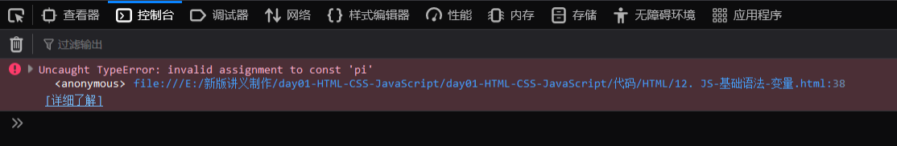
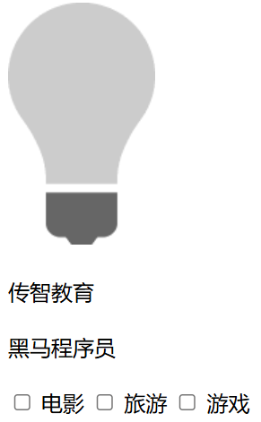
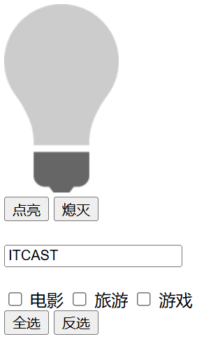

HTML 提供了网页的结构，CSS 负责美化，而 JavaScript 则赋予网页交互的能力，使其具有动态的“灵魂”。


## ****引入方式****


JavaScript 代码需要嵌入到 HTML 文件中才能生效。主要有两种引入方式：

1. **内部脚本：** 将 JavaScript 代码直接写在 HTML 页面中。
	- JavaScript 代码必须位于 `<script></script>` 标签之间。
	- `<script>` 标签可以出现在 HTML 文档的任何位置，但通常放在 `<body>` 元素的底部以提高页面加载速度。

	**代码示例：**


	```html
	<!DOCTYPE html>
	<html lang="en">
	<head>
	    <meta charset="UTF-8">
	    <meta http-equiv="X-UA-Compatible" content="IE=edge">
	    <meta name="viewport" content="width=device-width, initial-
	scale=1.0">
	    <title>JS-基本语法</title>
	</head>
	<body>
	
	</body>
	<script>
	    /* alert("JS"); */
	    //方式一: 弹出警告框
	    window.alert("hello js");
	</script>
	</html>
	```


	这段代码展示了 JavaScript 内部脚本的使用方法。通过 `<script>` 标签，将 `alert("Hello JavaScript")` 嵌入到 HTML 文档中，实现了弹窗效果。

2. **外部脚本：** 将 JavaScript 代码写在独立的 `.js` 文件中，然后在 HTML 页面中引入该文件。
	- 外部 JS 文件只包含 JavaScript 代码，不包含 `<script>` 标签。
	- 引入外部 JS 文件的 `<script>` 标签必须是双标签。

	**代码示例：**


	```html
	<script src="js/demo.js"></script>
	```


	这段代码展示了 JavaScript 外部脚本的引入方法。通过 `<script src="js/demo.js"></script>`，将外部文件 `demo.js` 中的 JavaScript 代码引入到 HTML 文档中。


## ****基础语法****


掌握了 JavaScript 的引入方式，接下来需要学习它的书写语法，主要包括以下几点：

- **区分大小写：** JavaScript 是区分大小写的，变量名、函数名等都需要注意大小写。
- **分号：** 每行结尾的分号可有可无，但建议保留以提高代码可读性。
- **代码块：** 大括号 `{}` 表示代码块。
- **注释：**
	- 单行注释：`// 注释内容`
	- 多行注释：`/* 注释内容 */`

**代码演示：**


```html
<!DOCTYPE html>
<html lang="en">
<head>
    <meta charset="UTF-8">
    <meta http-equiv="X-UA-Compatible" content="IE=edge">
    <meta name="viewport" content="width=device-width, initial-
scale=1.0">
    <title>JS-基本语法</title>
</head>
<body>

</body>
<script>
    /* alert("JS"); */
    //方式一: 弹出警告框
    // window.alert("hello js");
    // //方式二: 写入html页面中
    // document.write("hello js");
    //方式三: 控制台输出
    console.log("hello js");
</script>
</html>
```


**API 描述**

- `window.alert()`：警告框。
- `document.write()`：在 HTML 输出内容。
- `console.log()`：写入浏览器控制台。

这段代码演示了 JavaScript 的三种输出语句：`alert()`、`document.write()` 和 `console.log()`，分别用于弹出警告框、在 HTML 页面中写入内容和在控制台中输出信息。


### ****变量****


变量是编程语言中必不可少的概念，用于存储数据。在 JavaScript 中，主要通过以下三个关键字来声明变量：

- `var`：早期 ECMAScript 5 中用于变量声明的关键字。
- `let`：ECMAScript 6 中新增的用于变量声明的关键字，`let` 只在代码块内生效
- `const`：声明常量的，常量一旦声明，不能修改。

**声明变量的注意事项：**

- JavaScript 是一门弱类型语言，变量可以存放不同类型的值。
- 变量名需要遵循一定的规则：
	- 组成字符可以是任何字母、数字、下划线（`_`）或美元符号（`$`）。
	- 数字不能开头。
	- 建议使用驼峰命名。

**代码演示** **`var`** **关键字声明的变量**


```html
<!DOCTYPE html>
<html lang="en">
<head>
    <meta charset="UTF-8">
    <meta http-equiv="X-UA-Compatible" content="IE=edge">
    <meta name="viewport" content="width=device-width, initial-
scale=1.0">
    <title>JS-基础语法</title>
</head>
<body>

</body>
<script>
    //var定义变量
    var a = 10;
    a = "张三";
    alert(a);
</script>
</html>
```


**`var`** **关键字的特点**

- 作用域比较大，全局变量
- 可以重复定义

**代码演示** **`let`** **关键字声明的变量**


```html
<script>
    //let : 局部变量 ; 不能重复定义
    {
        let x = 1;
    }
    alert(x);
</script>
```


`let` 关键字声明的变量只在 `let` 关键字所在的代码块内有效，且不允许重复声明。


**代码演示** **`const`** **关键字声明的变量**


```html
<script>
    const pi = 3.14;
    pi = 3.15;
    alert(pi);
</script>
```


`const` 关键字用来声明常量，但是一旦声明，常量的值是无法更改的。上面的代码生成的页面，通过控制台可以发现已经报错了：





### ****数据类型和运算符****


JavaScript 是一种弱类型语言，但它仍然有数据类型。JavaScript 中的数据类型分为原始类型和引用类型，具体包括：


**数据类型：**


| 数据类型        | 描述                               |
| ----------- | -------------------------------- |
| `number`    | 数字（整数、小数、NaN）                    |
| `string`    | 字符串，单双引号皆可                       |
| `boolean`   | 布尔值，`true` 或 `false`             |
| `null`      | 对象为空                             |
| `undefined` | 当声明的变量未初始化时，该变量的默认值是 `undefined` |


**运算符：**


| 运算规则  | 运算符                                                                          |
| ----- | ---------------------------------------------------------------------------- |
| 算术运算符 | `+` , `-` , `*` , `/` , `%` , `++` , `--`                                    |
| 赋值运算符 | `=` , `+=` , `-=` , `*=` , `/=` , `%=`                                       |
| 比较运算符 | `>` , `<` , `>=` , `<=` , `!=` , `==` , `===` 注意 `==` 会进行类型转换，`===` 不会进行类型转换 |
| 逻辑运算符 | `&&` , `||` , `!`                                                            |
| 三元运算符 | `条件表达式 ? true_value: false_value`                                            |


**代码演示比较运算符**


```html
<!DOCTYPE html>
<html lang="en">
<head>
    <meta charset="UTF-8">
    <meta http-equiv="X-UA-Compatible" content="IE=edge">
    <meta name="viewport" content="width=device-width, initial-
scale=1.0">
    <title>JS-运算符</title>
</head>
<body>

</body>
<script>
     var age = 20;
     var _age = "20";
     var $age = 20;

     alert(age == _age);//true ，只比较值
     alert(age === _age);//false ，类型不一样
     alert(age === $age);//true ，类型一样，值一样
</script>
</html>
```


`==`：只比较值是否相等，不区分数据类型，哪怕类型不一致，`==` 也会自动转换类型进行值得比较


`===`：不光比较值，还要比较类型，如果类型不一致，直接返回 false


**需要注意的是：** 在 JavaScript 中，`0`、`null`、`undefined`、`""`、`NaN` 会被理解成 `false`，反之则理解成 `true`。


## ****函数****


函数是一段可以重复使用的代码块，用于执行特定的任务。JavaScript 中定义函数的语法如下：

1. **第一种定义格式：**

	```javascript
	function 函数名(参数1, 参数2...) {
	  要执行的代码
	}
	```

	- 形式参数不需要声明类型。
	- 返回值也不需要声明类型，直接 `return` 即可。

	**代码示例：**


	```javascript
	function add(a, b) {
	  return a + b;
	}
	
	let result = add(10, 20);
	alert(result);
	```

2. **第二种定义格式：**

	```javascript
	var functionName = function (参数1, 参数2...) {
	  //要执行的代码
	};
	```


**注意：** 在 JavaScript 中，函数的调用只需要名称正确即可，参数列表没有严格规定。多余的实参没有变量接受，但是不影响函数的正常调用。


## ****JavaScript 对象****


JavaScript 中有很多内置对象，主要可以分为以下三类：

- 基本对象：`Array`、`JSON` 和 `String`
- BOM 对象：与浏览器相关的对象
- DOM 对象：将 HTML 的每一个标签都封装成一个对象

### ****基本对象****


#### ****Array 对象****


`Array` 对象用于定义数组。常用的语法格式有两种：

- 方式 1：`var 变量名 = new Array(元素列表);`

	```javascript
	var arr = new Array(1, 2, 3, 4); // 1,2,3,4 是存储在数组中的数据（元素）
	```

- 方式 2：`var 变量名 = [ 元素列表 ];`

	```javascript
	var arr = [1, 2, 3, 4]; // 1,2,3,4 是存储在数组中的数据（元素）
	```


获取数组中的值：`arr[索引]`


**特点：**

- JavaScript 中数组的长度是可以变化的。
- JavaScript 是弱数据类型的语言，所以数组中可以存储任意数据类型的值。

**属性和方法：**

- `length`：设置或返回数组中元素的数量。
- `forEach()`：遍历数组中的每个有值得元素，并调用一次传入的函数。
- `push()`：将新元素添加到数组的末尾，并返回新的长度。
- `splice()`：从数组中删除元素。

**代码演示** **`forEach()`** **方法**


```javascript
var arr = [1,2,3,4];
arr[10] = 50;
//e是形参，接受的是数组遍历时的值
arr.forEach(function(e){
     console.log(e);
})
```


当然了，在 ES6 中，引入箭头函数的写法，语法类似 java 中 lambda 表达式


```javascript
arr.forEach((e) => {
     console.log(e);
})
```


#### ****String 对象****


`String` 对象的创建方式有两种：

- 方式 1：`var 变量名 = new String("...");`

	```javascript
	var str = new String("Hello String");
	```

- 方式 2：`var 变量名 = "...";`

	```javascript
	var str = 'Hello String';
	```


**属性和方法：**

- `length`：字符串的长度。
- `charAt()`：返回在指定位置的字符。
- `indexOf()`：检索字符串。
- `trim()`：去除字符串两边的空格。
- `substring()`：提取字符串中两个指定的索引号之间的字符。

#### ****JSON 对象****


**自定义对象：**


在 JavaScript 中自定义对象特别简单，其语法格式如下：


```javascript
var 对象名 = {
    属性名1: 属性值1,
    属性名2: 属性值2,
    属性名3: 属性值3,
    函数名称: function(形参列表){}
};
```


调用属性：`对象名.属性名`


调用函数：`对象名.函数名()`


**简化格式**


```javascript
var user = {
        name: "Tom",
        age: 10,
        gender: "male",
        eat(){
            console.log("用膳~");
        }
    }
```


**JSON 对象：**


JSON（JavaScript Object Notation）是一种轻量级的数据交换格式。其格式如下：


```json
{
  "key": value,
  "key": value,
  "key": value
}
```

- `key` 必须使用引号并且是双引号标记。
- `value` 可以是任意数据类型。

**JSON 对象和 JSON 字符串的转换：**

- `JSON.parse(jsonString)`：将 JSON 字符串转换为 JavaScript 对象。
- `JSON.stringify(jsonObject)`：将 JavaScript 对象转换为 JSON 字符串。

### ****BOM 对象****


BOM（Browser Object Model）是浏览器对象模型，JavaScript 将浏览器的各个组成部分封装成了对象。


**常用的 BOM 对象：**

- `Window`：浏览器窗口对象
- `Navigator`：浏览器对象
- `Screen`：屏幕对象
- `History`：历史记录对象
- `Location`：地址栏对象

对于上述5个对象，我们重点学习的是Window对象、Location对象这2个。

1. **Window 对象：**

	`window` 对象指的是浏览器窗口对象，是 JavaScript 的全部对象，所以对于 `window` 对象，可以直接使用，并且对于 `window` 对象的方法和属性，可以省略 `window.`。


	**Window 对象的常用方法：**

	- `alert()`：显示带有一段消息和一个确认按钮的警告框。
	- `confirm()`：显示带有一段消息以及确认按钮和取消按钮的对话框。
	- `setInterval()`：按照指定的周期（以毫秒计）来调用函数或计算表达式。
	- `setTimeout()`：在指定的毫秒数后调用函数或计算表达式。
2. **Location 对象：**

	`location` 是指代浏览器的地址栏对象，对于这个对象，常用的是 `href` 属性，用于获取或者设置浏览器的地址信息。


### ****DOM 对象****


DOM（Document Object Model）文档对象模型。也就是 JavaScript 将 HTML 文档的各个组成部分封装为对象。


**DOM 的作用：**

- 改变 HTML 元素的内容
- 改变 HTML 元素的样式（CSS）
- 对 HTML DOM 事件作出反应
- 添加和删除 HTML 元素

#### ******获取 DOM 对象******


HTML 中的 Element 对象可以通过 Document 对象获取，而 Document 对象是通过 window 对象获取的。document 对象提供的用于获取 Element 元素对象的 api 如下表所示：


| 函数                                | 描述                             |
| --------------------------------- | ------------------------------ |
| document.getElementById()         | 根据 id 属性值获取，返回单个Element对象      |
| document.getElementsByTagName()   | 根据标签名称获取，返回 Element 对象数组       |
| document.getElementsByName()      | 根据 name 属性值获取，返回 Element 对象数组  |
| document.getElementsByClassName() | 根据 class 属性值获取，返回 Element 对象数组 |


#### ****案例****


这里通过一个综合案例，演示了如何使用 DOM 操作来改变页面元素的内容和样式，通过案例加强对于上述 DOM 知识的掌握。


基本代码如下：


```html
<!DOCTYPE html>
<html lang="en">
<head>
    <meta charset="UTF-8">
    <meta http-equiv="X-UA-Compatible" content="IE=edge">
    <meta name="viewport" content="width=device-width, initial-scale=1.0">
    <title>JS-对象-DOM-案例</title>
</head>

<body>
      <br><br>

    <div class="cls">传智教育</div>   <br>
    <div class="cls">黑马程序员</div>  <br>

    <input type="checkbox" name="hobby"> 电影
    <input type="checkbox" name="hobby"> 旅游
    <input type="checkbox" name="hobby"> 游戏
</body>

<script>
  
</script>
</html>
```


生成页面如图：





**需求：**

1. 点亮灯泡。
2. 将所有的 `div` 标签的标签体内容后面加上：very good。
3. 使所有的复选框呈现被选中的状态。

**代码实现：**


```html
<script>
    let img = document.getElementById("h1");
    img.src = "img/on.gif";

    let divs = document.getElementsByClassName("cls");
    for (let index = 0; index < divs.length; index++) {
        const div = divs[index];
        div.innerHTML += "<font color='red'>ver good</font>";
    }

    let inputs = document.getElementsByName("hobby");
    for (let index = 0; index < inputs.length; index++) {
        const input = inputs[index];
        input.checked = true;
    }
</script>
```


**实现步骤：**

1. 点亮灯泡。
	1. 获取 `img` 标签对象。
	2. 修改 `img` 标签对象的 `src` 属性值，进行图片的切换。
2. 将所有的 `div` 标签的标签体内容后面加上：very good。
	1. 通过标签的名字 `div` 获取所有的 `div` 标签。
	2. 遍历所有的 `div` 标签。
	3. 获取 `div` 标签的原有内容，然后追加 `<font color='red'>very good</font>` , 并且替
	原内容。
3. 使所有的复选框呈现被选中的状态。
	1. 通过 `name` 属性值获取所有的 `checkbox` 标签。
	2. 遍历所有的 `checkbox` 标签。
	3. 设置每个`checkbox`标签的 `checked`  属性。

## ****JavaScript 事件****


### ****事件介绍****


HTML 事件是发生在 HTML 元素上的 “事情”，例如：

- 按钮被点击
- 鼠标移到元素上
- 输入框失去焦点

我们可以给这些事件绑定函数，当事件触发时，可以自动的完成对应的功能，这就是事件监听。JavaScript 事件是 js 非常重要的一部分。主要围绕两点来学习：

1. 事件绑定
2. 常用事件

### ****事件绑定****


JavaScript 对于事件的绑定提供了 2 种方式：

- **方式 1：** 通过 html 标签中的事件属性进行绑定。

	例如一个按钮，我们对于按钮可以绑定单机事件，可以借助标签的 `onclick` 属性，属性值
	指向一个函数。


	```html
	<input type="button" id="btn1" value="事件绑定1" onclick="on()">
	```

- **方式 2：** 通过 DOM 中 Element 元素的事件属性进行绑定。

	我们可以先通过 `id` 属性获取按钮对象，然后操作对象的 `onclick` 属性来绑定事件。


	```javascript
	document.getElementById('btn2').onclick = function(){
	    alert("按钮2被点击了...");
	}
	```


需要注意的是：事件绑定的函数，只有在事件被触发时，函数才会被调用。


### ****常见事件****


| 事件属性名         | 说明           |
| ------------- | ------------ |
| `onclick`     | 鼠标单击事件       |
| `onblur`      | 元素失去焦点       |
| `onfocus`     | 元素获得焦点       |
| `onload`      | 某个页面或图像被完成加载 |
| `onsubmit`    | 当表单提交时触发该事件  |
| `onmouseover` | 鼠标被移到某元素之上   |
| `onmouseout`  | 鼠标从某元素移开     |


### ****案例****


基础代码如下：


```html
<!DOCTYPE html>
<html lang="en">
<head>
    <meta charset="UTF-8">
    <meta http-equiv="X-UA-Compatible" content="IE=edge">
    <meta name="viewport" content="width=device-width, initial-scale=1.0">
    <title>JS-事件-案例</title>
</head>
<body>

     <br>

    <input type="button" value="点亮" > 
    <input type="button"  value="熄灭" >

    <br> <br>

    <input type="text" id="name" value="ITCAST" >
    <br> <br>

    <input type="checkbox" name="hobby"> 电影
    <input type="checkbox" name="hobby"> 旅游
    <input type="checkbox" name="hobby"> 游戏
    <br>

    <input type="button" value="全选" > 
    <input type="button" value="反选" >

</body>

</html>
```


生成页面如图：





**需求**：

1. 点击 “点亮”按钮 点亮灯泡，点击“熄灭”按钮 熄灭灯泡。
2. 输入框鼠标聚焦后，展示小写；鼠标离焦后，展示大写。
3. 点击 “全选”按钮使所有的复选框呈现被选中的状态，点击 “反选”按钮使所有的复选框呈现取消勾选的状态。

**代码实现**：


```html
<script>
    function on(){
        let img = document.getElementById("light");
        img.src = "img/on.gif";
    }

    function off(){
        let img = document.getElementById("light");
        img.src = "img/off.gif";
    }

    function lower(){
        let text = document.getElementById("name");
        text.value = text.value.toLowerCase();
    }

    function upper(){
        let text = document.getElementById("name");
        text.value = text.value.toUpperCase();
    }

    function checkAll(){
        let checkboxs = document.getElementsByName("hobby");
        for (let index = 0; index < checkboxs.length; index++) {
            const box = checkboxs[index];
            box.checked = true;
        }
    }

    function reverse(){
        let checkboxs = document.getElementsByName("hobby");
        for (let index = 0; index < checkboxs.length; index++) {
            const box = checkboxs[index];
            box.checked = false;
        }
    }
</script>
```


**实现步骤**：

1. 点击 【点亮】按钮点亮灯泡，点击【熄灭】按钮熄灭灯泡。
	1. 将【点亮】按钮和【熄灭】按钮都绑定单击事件。分别绑定函数 `on()` 和`off()` 。
	2. 在 js 中定义 `on()` 和 `off()` 函数：
		- `on()` 函数中，通过 `id` 获取 `img` 标签对象，然后通过 `img` 标签对象的 `src` 属性切换点亮的图片。
		- `off()` 函数中，通过 `id` 获取 `img` 标签对象，然后通过 `img` 标签对象的 `src` 属性切换熄灭的图片。
2. 输入框鼠标聚焦后，展示小写；鼠标离焦后，展示大写。
	1. 给 `input` 标签的 `onfocus` 和 `onblur` 事件分别绑定 `lower()` 和 `upper()` 函数。
	2. 在 js 中定义 `lower()` 和 `upper()` 函数：
		- 对于 `lower()` 函数，先通过 `id` 获取输入框对象，然后通过输入框的 `value` 属性来设置内容。通过字符串的 `toLowerCase()` 函数来进行小写转换。
		- 对于 `upper()` 函数，先通过 `id` 获取输入框对象，然后通过输入框的 `value` 属性来设置内容。通过字符串的 `toUpperCase()` 函数来进行大写转换。
3. 点击 “全选”按钮使所有的复选框呈现被选中的状态，点击 “反选”按钮使所有的复选框呈现取消勾选的状态。
	1. 给【全选】和【反选】按钮绑定单击事件，分别绑定函数 `checkAll()` 和 `reverse()` 。
	2. 在 js 中定义 `checkAll()` 和 `reverse()` 函数：
		- 对于 `checkAll()` 函数，首先通过 `name` 属性值为 `hobby` 来获取所有的复选框，然后
		遍历复选框，设置每个复选框的 `checked` 属性为 `true` 即可。
		- 对于 `reverse()` 函数，首先通过 `name` 属性值为 `hobby` 来获取所有的复选框，然后
		遍历复选框，设置每个复选框的 `checked` 属性为 `false` 即可。
