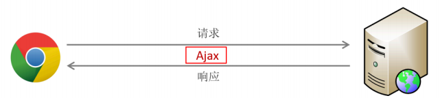
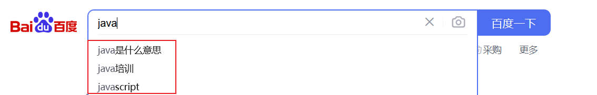
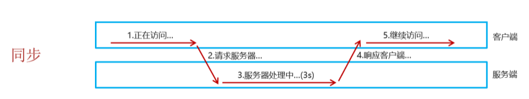
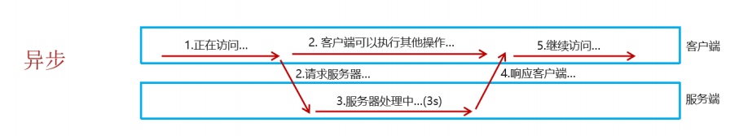
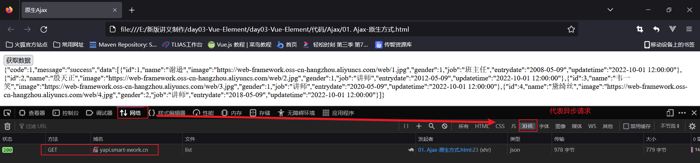
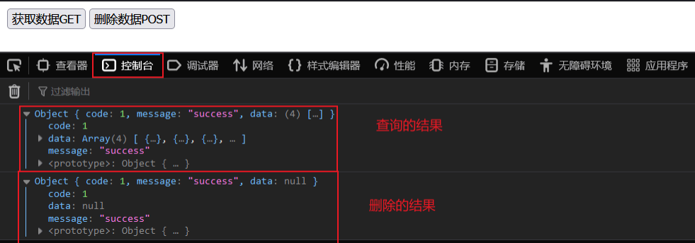
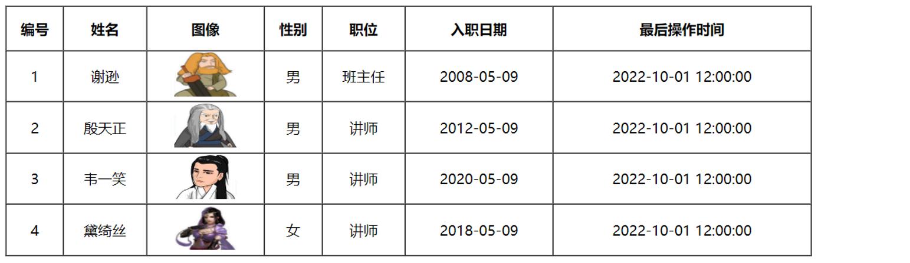
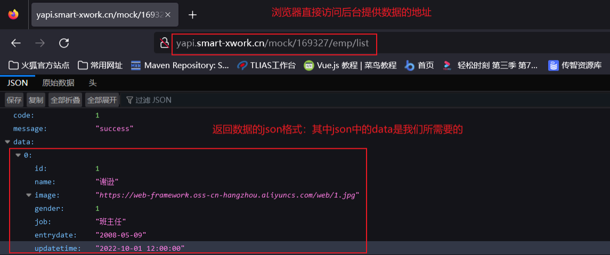

## ****Ajax 介绍****


### ****Ajax 概述****


在前端开发中，页面展示的数据通常来自后台服务器。由于前后端是独立的程序，因此需要一种技术来实现它们之间的数据交互。 **Ajax (Asynchronous JavaScript and XML)** 便是用于此目的。


Ajax 的主要作用：

- **与服务器进行数据交换**：允许前端向服务器发送请求并获取响应数据。
- **异步交互**：无需重新加载整个页面即可与服务器交换数据并更新部分网页。例如，搜索联想、用户名可用性校验等。

### ****Ajax 作用****

- **与服务器进行数据交互**：前端通过 Ajax 技术向后台服务器发起请求，服务器从数据库获取前端所需的数据，并将数据响应给前端，前端再将数据展示到页面上。

	

- **异步交互**：Ajax 允许在不重新加载整个页面的情况下更新部分页面内容，从而提高用户体验。例如，在百度搜索时，搜索框下方的联想词汇就是通过 Ajax 异步请求获取并更新的。

	


### ****同步异步****


Ajax 的局部刷新功能得益于其**异步**特性。与异步请求相对的是**同步请求**。

- **同步请求**：浏览器发送请求后，必须等待服务器响应完成后才能继续执行其他操作。在服务器处理请求期间，浏览器会进入“假死”状态。

	

- **异步请求**：浏览器发送请求后，无需等待服务器响应即可继续执行其他操作。

	


## ****原生 Ajax****


下面我们通过代码来演示 Ajax 的效果。首先采用原生的 Ajax 代码。


**服务器端**


因为我们暂时还没学过服务器端的代码，所以先使用已经提供好的服务器端请求地址：[https://mock.apifox.cn/m1/3128855-0-default/emp/list](https://mock.apifox.cn/m1/3128855-0-default/emp/list) 。该地址返回员工列表数据。可以直接通过浏览器访问该地址，返回 JSON 格式的数据。


**客户端**


原生 Ajax 请求的代码编写步骤：

1. **创建 HTML 文件，并绑定按钮的单击事件**。

	```html
	<!DOCTYPE html>
	<html lang="en">
	<head>
	    <meta charset="UTF-8">
	    <meta http-equiv="X-UA-Compatible" content="IE=edge">
	    <meta name="viewport" content="width=device-width, initial-scale=1.0">
	    <title>原生Ajax</title>
	</head>
	<body>
	    <input type="button" value="获取数据" onclick="getData()">
	    <div id="div1"></div>
	</body>
	<script>
	    function getData(){
	    }
	</script>
	</html>
	```


	这里创建了一个按钮，点击时会调用 `getData()` 函数。

2. **创建** **`XMLHttpRequest`** **对象**。这是原生 Ajax 的核心对象，用于与服务器交换数据。

	```javascript
	function getData(){
	    //1. 创建XMLHttpRequest 对象
	    var xmlHttpRequest  = new XMLHttpRequest();
	}
	```


	`XMLHttpRequest` 对象提供了与服务器交互的方法和属性。

3. **调用** **`open()`** **方法设置请求参数，调用** **`send()`** **方法发送请求**。

	```javascript
	function getData(){
	    //1. 创建XMLHttpRequest 对象
	    var xmlHttpRequest  = new XMLHttpRequest();
	    //2. 发送异步请求
	    xmlHttpRequest.open('GET','<http://yapi.smart-xwork.cn/mock/169327/emp/list>');
	    xmlHttpRequest.send();//发送请求
	}
	```


	`open()` 方法用于指定请求方式（GET）和 URL。`send()` 方法用于发送请求。

4. **绑定** **`onreadystatechange`** **事件，获取服务器响应的数据**。

	```javascript
	function getData(){
	    //1. 创建XMLHttpRequest 对象
	    var xmlHttpRequest  = new XMLHttpRequest();
	    //2. 发送异步请求
	    xmlHttpRequest.open('GET','<http://yapi.smart-xwork.cn/mock/169327/emp/list>');
	    xmlHttpRequest.send();//发送请求
	
	    //3. 获取服务响应数据
	    xmlHttpRequest.onreadystatechange = function(){
	        //此处判断 4表示浏览器已经完全接受到Ajax请求得到的响应， 200表示这是一个正确的Http请求，没有错误
	        if(xmlHttpRequest.readyState == 4 && xmlHttpRequest.status == 200){
	            document.getElementById('div1').innerHTML = xmlHttpRequest.responseText;
	        }
	    }
	}
	```


	`onreadystatechange` 事件会在 `XMLHttpRequest` 对象的 `readyState` 属性改变时被触发。`readyState` 为 4 表示请求已完成，`status` 为 200 表示请求成功。`responseText` 属性包含服务器返回的数据。


	**readyState的五个状态值**

	- 0：表示 XMLHttpRequest 对象已创建，但尚未初始化。
	- 1：表示 XMLHttpRequest 对象已初始化，但尚未发送请求。
	- 2：表示 XMLHttpRequest 对象已发送请求，但尚未收到响应头。
	- 3：表示 XMLHttpRequest 对象已收到部分响应数据。
	- 4：表示 XMLHttpRequest 对象已收到所有响应数据，请求已完成。

最后，在浏览器中打开 HTML 页面，点击按钮发送 Ajax 请求。可以通过浏览器的 F12 开发者工具抓包查看 Ajax 请求。在“网络”选项卡中，可以看到 XHR (XMLHttpRequest) 请求。





## ****Axios****


原生 Ajax 代码编写起来比较繁琐，因此可以使用更简单的 Ajax 库 **Axios**。Axios 对原生 AJAX 进行了封装，简化了书写。


### ****Axios 的基本使用****


Axios 的使用步骤：

1. 引入 Axios 文件：

	```html
	<script src="js/axios-0.18.0.js"></script>
	```

2. 使用 Axios 发送请求并获取响应结果。Axios 提供了多种 API，常用的有 `get` 和 `post`。
	- **发送 GET 请求**

		```javascript
		axios({
		    method:"get",
		    url:"<http://localhost:8080/ajax-demo1/aJAXDemo1?username=zhangsan>"
		}).then(function (resp){
		    alert(resp.data);
		})
		```


		`axios()` 函数用于发送异步请求。其参数为一个 JSON 对象，用于配置请求信息。

		- `method` 属性：设置请求方式，取值为 `get` 或 `post`。
		- `url` 属性：设置请求的资源路径。如果是 GET 请求，可以将请求参数拼接到 URL 后面，格式为：`url?参数名=参数值&参数名2=参数值2`。
		- `data` 属性：作为请求体被发送的数据。如果是 POST 请求，数据需要作为 `data` 属性的值。

		`then()` 方法用于指定请求成功后的回调函数。回调函数的 `resp` 参数是对响应数据进行封装的对象，通过 `resp.data` 可以获取到响应的数据。

	- **发送 POST 请求**

		```javascript
		axios({
		    method:"post",
		    url:"<http://localhost:8080/ajax-demo1/aJAXDemo1>",
		    data:"username=zhangsan"
		}).then(function (resp){
		    alert(resp.data);
		});
		```


### ****Axios 快速入门****


**后端实现**

- 查询所有员工信息服务器地址： [https://mock.apifox.cn/m1/3128855-0-default/emp/list](https://mock.apifox.cn/m1/3128855-0-default/emp/list)
- 根据员工 id 删除员工信息服务器地址： [https://mock.apifox.cn/m1/3128855-0-default/emp/deleteById](https://mock.apifox.cn/m1/3128855-0-default/emp/deleteById)

**前端实现**

1. 创建 `js` 文件夹，并将 `axios-0.18.0.js` 文件拷贝到 `js` 目录下。
2. 创建 `02. Ajax-Axios.html` 文件，引入 Axios 所依赖的 JS 文件，并提供两个按钮，绑定单击事件，分别用于点击时发送 Ajax 请求。

	```html
	<!DOCTYPE html>
	<html lang="en">
	<head>
	    <meta charset="UTF-8">
	    <meta http-equiv="X-UA-Compatible" content="IE=edge">
	    <meta name="viewport" content="width=device-width, initial-scale=1.0">
	    <title>Ajax-Axios</title>
	    <script src="js/axios-0.18.0.js"></script>
	</head>
	<body>
	    <input type="button" value="获取数据GET" onclick="get()">
	    <input type="button" value="删除数据POST" onclick="post()">
	</body>
	<script>
	    function get(){
	        //通过axios发送异步请求-get
	    }
	    function post(){
	        //通过axios发送异步请求-post
	    }
	</script>
	</html>
	```

3. 分别使用 Axios 的方法发送 GET 请求和 POST 请求。
	- **GET 请求**

		```javascript
		function get(){
		    //通过axios发送异步请求-get
		    axios({
		        method: "get",
		        url: "<http://yapi.smart-xwork.cn/mock/169327/emp/list>"
		    }).then(result => {
		        console.log(result.data);
		    })
		}
		```

	- **POST 请求**

		```javascript
		function post(){
		   // 通过axios发送异步请求-post
		    axios({
		        method: "post",
		        url: "<http://yapi.smart-xwork.cn/mock/169327/emp/deleteById>",
		        data: "id=1"
		    }).then(result => {
		        console.log(result.data);
		    })
		}
		```


在浏览器中打开 HTML 页面，通过 F12 开发者工具抓包，然后分别点击两个按钮，查看控制台输出。





### ****请求方法的别名****


Axios 针对不同的请求，提供了别名方式的 API：


| 方法                                   | 描述           |
| ------------------------------------ | ------------ |
| `axios.get(url [, config])`          | 发送 GET 请求    |
| `axios.delete(url [, config])`       | 发送 DELETE 请求 |
| `axios.post(url [, data[, config]])` | 发送 POST 请求   |
| `axios.put(url [, data[, config]])`  | 发送 PUT 请求    |


使用别名可以简化代码。例如，可以将上面的 GET 和 POST 请求代码改写为：


```javascript
axios.get("<http://yapi.smart-xwork.cn/mock/169327/emp/list>").then(result => {
    console.log(result.data);
})

axios.post("<http://yapi.smart-xwork.cn/mock/169327/emp/deleteById","id=1>").then(result => {
    console.log(result.data);
})
```


### ****案例****


**需求**：基于 Vue 和 Axios 完成数据的动态加载展示。

- 数据来源：[http://yapi.smart-xwork.cn/mock/169327/emp/list](https://mock.apifox.cn/m1/3128855-0-default/emp/list)




**分析**：


我们需要使用 Ajax 请求获取后台数据，并在页面加载完成后自动发送请求，展示数据。因此，可以使用 Vue 的 `mounted` 钩子函数发送 Ajax 请求。拿到数据后，使用 `v-for` 指令遍历数据，将数据显示在表格中。


**步骤**：

1. 创建文件，提前准备基础代码，包括表格以及 `vue.js` 和 `axios.js` 文件的引入。

	```html
	<!DOCTYPE html>
	<html lang="en">
	<head>
	    <meta charset="UTF-8">
	    <meta http-equiv="X-UA-Compatible" content="IE=edge">
	    <meta name="viewport" content="width=device-width, initial-scale=1.0">
	    <title>Ajax-Axios-案例</title>
	    <script src="js/axios-0.18.0.js"></script>
	    <script src="js/vue.js"></script>
	</head>
	<body>
	    <div id="app">
	        <table border="1" cellspacing="0" width="60%">
	            <tr>
	                <th>编号</th>
	                <th>姓名</th>
	                <th>图像</th>
	                <th>性别</th>
	                <th>职位</th>
	                <th>入职日期</th>
	                <th>最后操作时间</th>
	            </tr>
	            <tr align="center" >
	                <td>1</td>
	                <td>Tom</td>
	                <td>
	                    
	                </td>
	                <td>
	                    <span>男</span>
	                   <!-- <span>女</span>-->
	                </td>
	                <td>班主任</td>
	                <td>2009-08-09</td>
	                <td>2009-08-09 12:00:00</td>
	            </tr>
	        </table>
	    </div>
	</body>
	<script>
	    new Vue({
	       el: "#app",
	       data: {
	       }
	    });
	</script>
	</html>
	```

2. 在 Vue 的 `mounted` 钩子函数中编写 Ajax 请求，请求数据。

	```javascript
	mounted () {
	    //发送异步请求,加载数据
	    axios.get("<http://yapi.smart-xwork.cn/mock/169327/emp/list>").then(result => {
	    })
	}
	```

3. 将 Ajax 请求的数据绑定给 Vue 的 `data` 属性。

	


	由于服务器响应的 JSON 数据中的 `data` 属性才是我们需要展示的信息，因此需要将员工列表信息赋值给 Vue 的 `data` 属性。


	```javascript
	data: {
	    emps:[]
	},
	mounted () {
	    //发送异步请求,加载数据
	    axios.get("<http://yapi.smart-xwork.cn/mock/169327/emp/list>").then(result => {
	        this.emps = result.data.data;
	    })
	}
	```


	这里在 `data` 中声明了 `emps` 变量，用于存储员工列表数据。

4. 在 `<tr>` 标签上通过 `v-for` 指令遍历数据，展示数据。

	```html
	<tr align="center" v-for="(emp,index) in emps">
	    <td>{{index + 1}}</td>
	    <td>{{emp.name}}</td>
	    <td>
	        
	    </td>
	    <td>
	        <span v-if="emp.gender == 1">男</span>
	        <span v-if="emp.gender == 2">女</span>
	    </td>
	    <td>{{emp.job}}</td>
	    <td>{{emp.entrydate}}</td>
	    <td>{{emp.updatetime}}</td>
	</tr>
	```


	需要注意的是，图片的值需要使用 Vue 的属性绑定（`:`），男女的展示需要使用条件判断 (`v-if`)。


**完整代码**：


```html
<!DOCTYPE html>
<html lang="en">
<head>
    <meta charset="UTF-8">
    <meta http-equiv="X-UA-Compatible" content="IE=edge">
    <meta name="viewport" content="width=device-width, initial-scale=1.0">
    <title>Ajax-Axios-案例</title>
    <script src="js/axios-0.18.0.js"></script>
    <script src="js/vue.js"></script>
</head>
<body>
    <div id="app">
        <table border="1" cellspacing="0" width="60%">
            <tr>
                <th>编号</th>
                <th>姓名</th>
                <th>图像</th>
                <th>性别</th>
                <th>职位</th>
                <th>入职日期</th>
                <th>最后操作时间</th>
            </tr>
            <tr align="center" v-for="(emp,index) in emps">
                <td>{{index + 1}}</td>
                <td>{{emp.name}}</td>
                <td>
                    
                </td>
                <td>
                    <span v-if="emp.gender == 1">男</span>
                    <span v-if="emp.gender == 2">女</span>
                </td>
                <td>{{emp.job}}</td>
                <td>{{emp.entrydate}}</td>
                <td>{{emp.updatetime}}</td>
            </tr>
        </table>
    </div>
</body>
<script>
    new Vue({
       el: "#app",
       data: {
         emps:[]
       },
       mounted () {
          //发送异步请求,加载数据
          axios.get("<http://yapi.smart-xwork.cn/mock/169327/emp/list>").then(result => {
            console.log(result.data);
            this.emps = result.data.data;
          })
       }
    });
</script>
</html>
```

