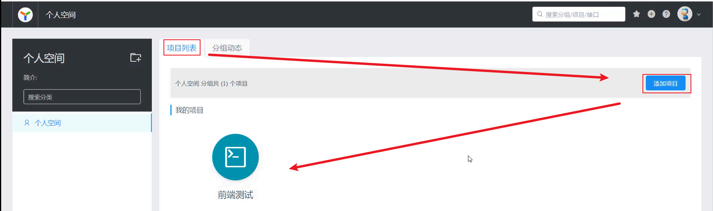

## ****前后台分离开发介绍****

在传统的开发模式中，前后端混合开发存在诸多问题，例如：

- **沟通成本高**：前后端修改互相依赖，沟通频繁。
- **分工不明确**：后端人员需要兼顾前后端代码，难以培养专业人才。
- **不便管理和维护**：代码耦合度高，更新和扩展困难。

为了解决这些问题，现在主流的开发方式是前后端分离开发。如下图所示，展示了前后端分离的架构：

前后端分离的核心思想是将前端和后端代码拆分成独立的工程，由专业的前端工程师和后端工程师分别负责。前端通过**异步请求**从后端获取数据。

那么，前后端如何协同工作呢？这就需要一份统一的**接口文档**。

**接口文档**是前后端开发人员共同遵守的规范，定义了接口的地址、参数、请求方式、响应数据格式等信息。接口文档通常由后端开发人员根据产品经理提供的产品原型和需求文档编写。

基于前后端分离的模式，后端开发流程如下：

1. **需求分析**：阅读需求文档，理解需求。
2. **接口定义**：根据需求，定义接口文档，包括接口地址、参数、响应数据类型等。
3. **前后端并行开发**：前后端工程师按照接口文档，分别开发前后端代码。
4. **测试**：前后端分别进行测试，确保符合接口文档的要求。
5. **前后端联调测试**：前端请求后端接口，进行集成测试。

## ****YAPI****

### ****YAPI介绍****

**YApi** 是一款高效、易用、功能强大的 API 管理平台，旨在为开发、产品、测试人员提供更优雅的接口管理服务。

YApi 提供了以下主要功能：

- **API接口管理**：根据需求撰写接口，包括接口的地址，参数，响应等等信息。
- **Mock服务**：模拟真实接口，生成接口的模拟测试数据，用于前端的测试。

### ****接口文档管理****

下面演示 YApi 是如何管理接口文档的：

首先登录 YAPI 的[官网](https://yapi.pro/)。

登录后，在个人空间中，选择项目列表->添加测试项目。

然后点击创建的项目，进入到项目中，紧接着先添加接口的分类。

然后我们选择当前创建的分类，创建接口信息。

紧接着，我们来到接口的编辑界面，对接口做生层次的定制，例如：接口的参数，接口的返回值等等。

添加接口的请求参数。

添加接口的返回值。

然后保存上述设置，紧接着我们可以来到接口的预览界面，查询接口的信息。

最后，我们还可以设置接口的 mock 信息。

来到接口的 Mock 设置窗口。

紧接着我们来到接口的预览界面，直接点击 Mock 地址。

我们发现浏览器直接打开，并返回如下数据：

如上步骤就是YAPI接口平台中对于接口的配置步骤。

