## ****前端工程化介绍****


目前的前端开发模式，比如直接在工程中导入 vue.js 和 axios.js 文件，存在以下问题：

- 每次开发都是从零开始，比较麻烦。
- 多个页面中的组件共用性不好。
- js、图片等资源没有规范化的存储目录，没有统一的标准，不方便维护。

因此，企业开发更倾向于前端工程化的方式，其主要特点包括：

- **模块化**：将 js 和 css 等做成可复用的模块。
- **组件化**：将 UI 组件、css 样式、js 行为封装成一个个组件，便于管理。
- **规范化**：提供一套标准的目录接口和编码规范，所有开发人员遵循。
- **自动化**：项目的构建、测试、部署全部自动完成。

前端工程化本质上是在企业级前端项目开发中，将前端开发所需的工具、技术、流程、经验进行规范化和标准化，从而提升开发效率，降低开发难度。接下来我们将学习 Vue 官方提供的脚手架来完成前端工程化。


## ****前端工程化入门****


### ****环境准备****


前端工程化依赖于 Vue 官方提供的脚手架 Vue-cli，它可以快速生成 Vue 项目模板，并提供以下功能：

- 统一的目录结构
- 本地调试
- 热部署
- 单元测试
- 集成打包上线

Vue-cli 的运行需要依赖 NodeJS 环境。因此，需要先 [安装 NodeJS](/1949f1fc15a38048b897dcba40209108)，然后才能 [安装 Vue-cli](/1949f1fc15a38048b897dcba40209108#1949f1fc15a3800695d4ead2281aea8d)。


### ******Vue项目简介******


环境准备好了，接下来我们需要通过 Vue-cli 创建一个 vue 项目，然后再学习一下 vue 项目的目录结构。Vue-cli 提供了如下 2 种方式创建 vue 项目:

- 命令行：直接通过命令行方式创建vue项目

	```bash
	vue create vue-project01
	```

- 图形化界面：通过命令先进入到图形化界面，然后再进行vue工程的创建

	```bash
	vue ui
	```


	图形化界面如下：


	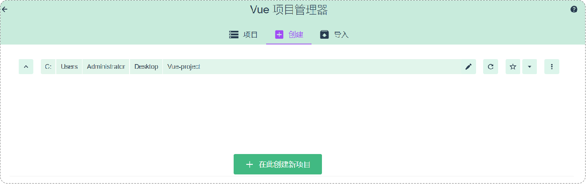


#### ******创建 vue 项目******


此处我们通过第二种图形化界面方式给大家演示。


首先，我们再桌面创建 vue 文件夹，然后双击进入文件夹，来到地址目录，输入 cmd，然后进入到 vue 文件夹的 cmd 窗口界面，如下图所示：


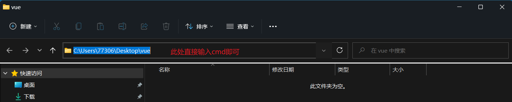


然后进入如下界面：


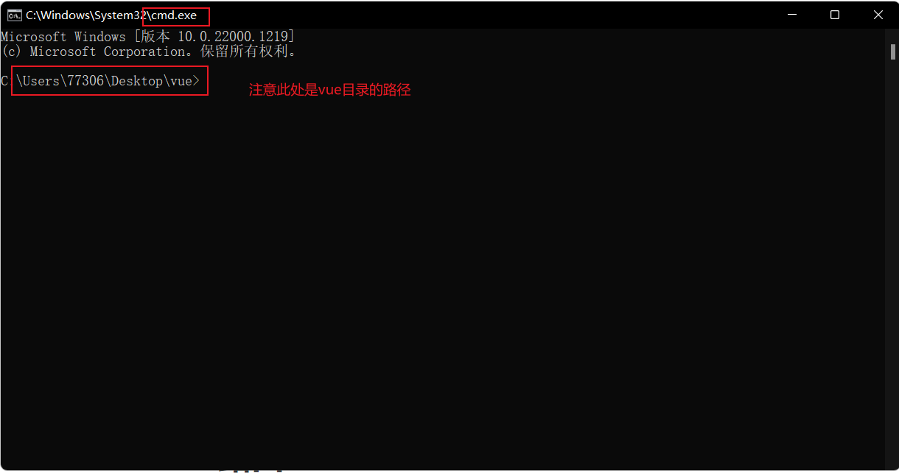


然后再当前目录下，直接输入命令`vue ui`进入到vue的图形化界面，如下图所示：


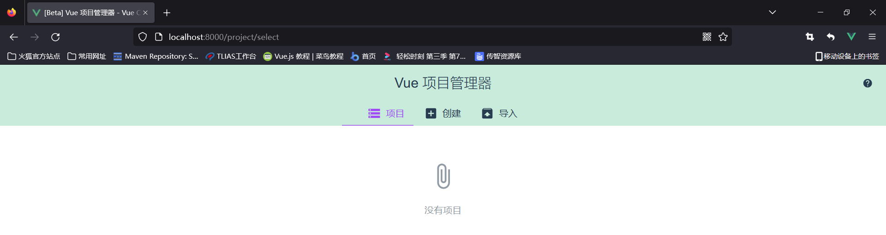


然后我们选择创建按钮，在vue文件夹下创建项目，如下图所示：


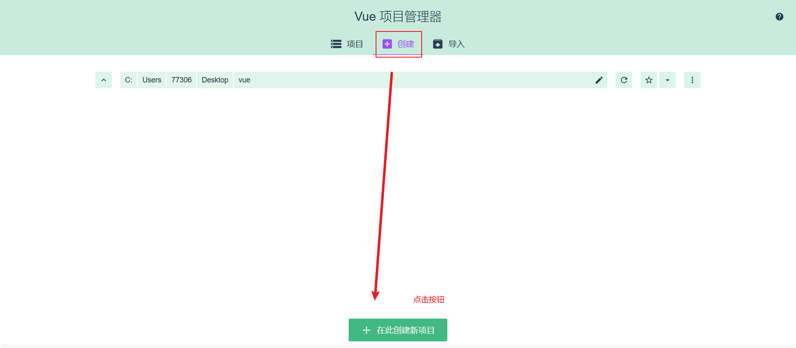


然后来到如下界面，进行vue项目的创建


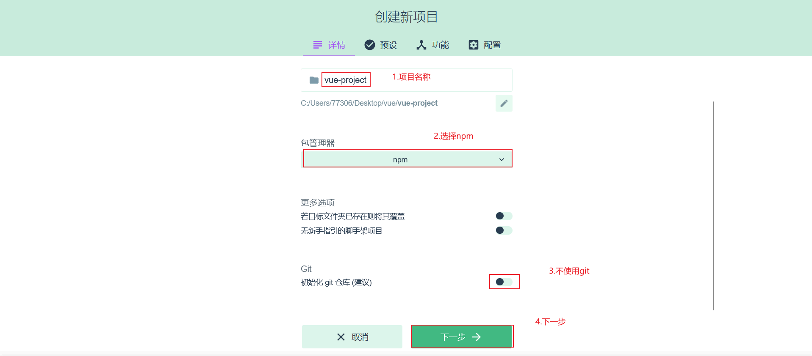


然后预设模板选择手动，如下图所示：


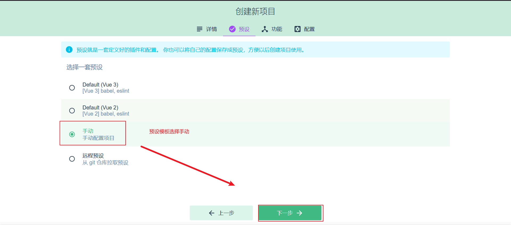


然后再功能页面开启路由功能，如下图所示：


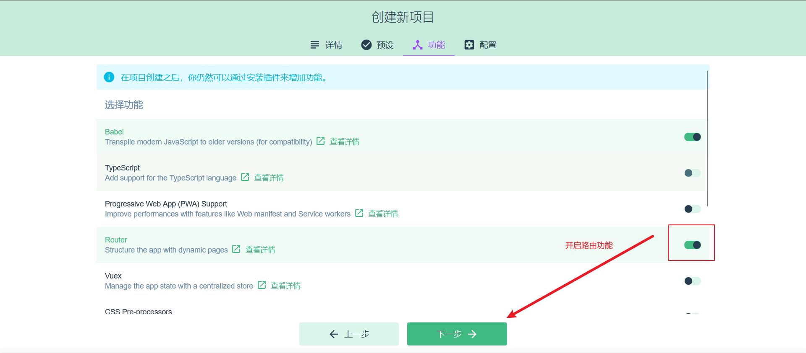


然后再配置页面选择语言版本和语法检查规范，如下图所示：


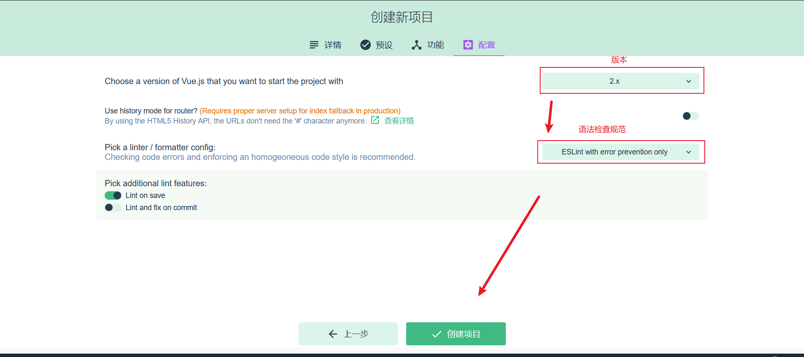


然后创建项目，进入如下界面：


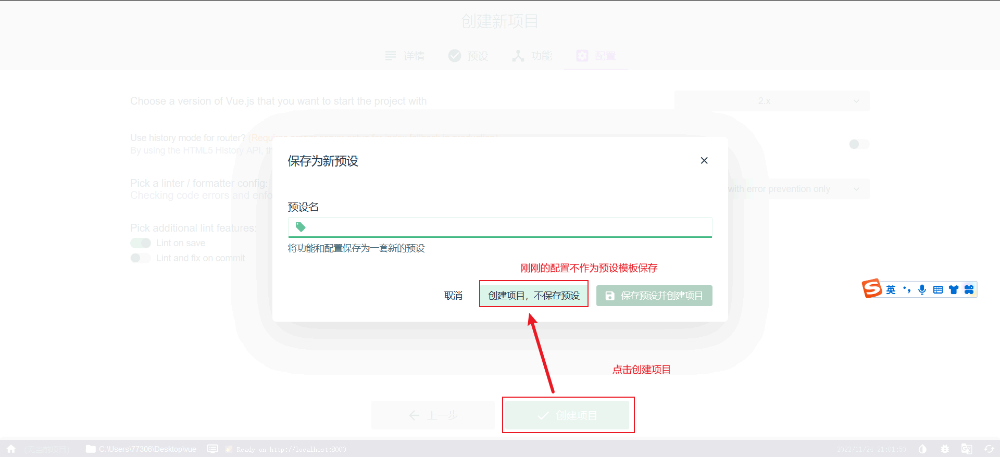


最后我们只需要等待片刻，即可进入到创建创建成功的界面，如下图所示：


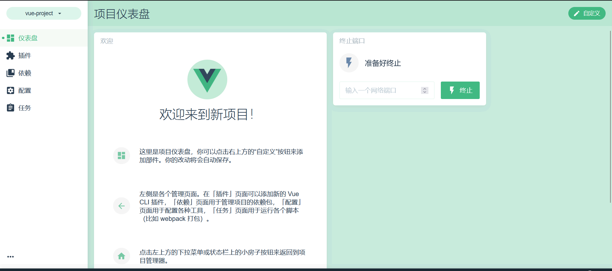


到此，vue项目创建结束


#### ******vue项目目录结构介绍******


我们通过VS Code打开之前创建的vue文件夹，打开之后，呈现如下图所示页面：


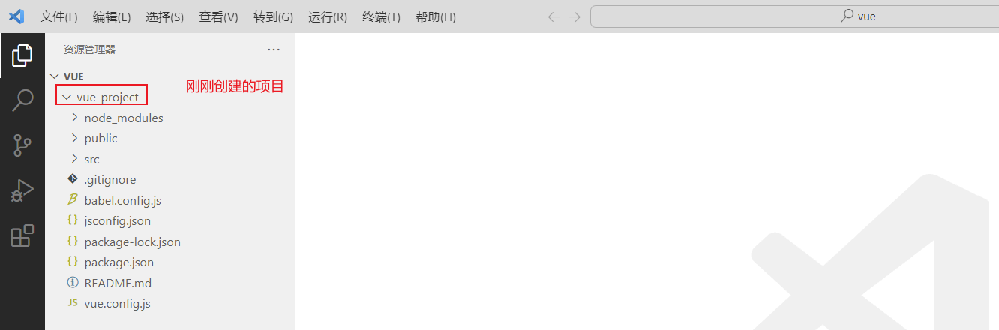


vue项目的标准目录结构以及目录对应的解释如下图所示:


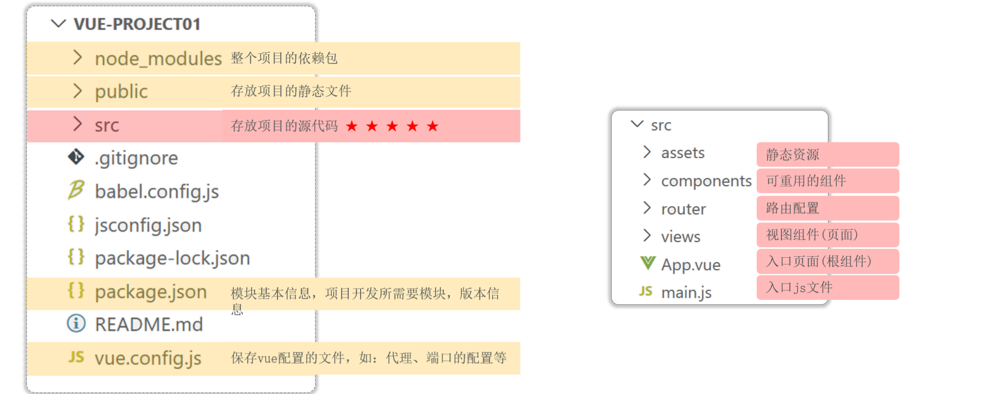


其中我们平时开发代码就是在**src目录**下。


#### ******运行vue项目******


那么vue项目开发好了，我们应该怎么运行vue项目呢？主要提供了2种方式

- 第一种方式：通过VS Code提供的图形化界面 ，如下图所示：（注意：NPM脚本窗口默认不显示，可以参考本节的最后调试出来）

	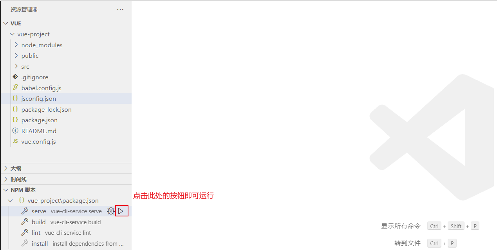


	点击之后，我们等待片刻，即可运行，在终端界面中，我们发现项目是运行在本地服务的8080端口，我们直接通过浏览器打开地址


	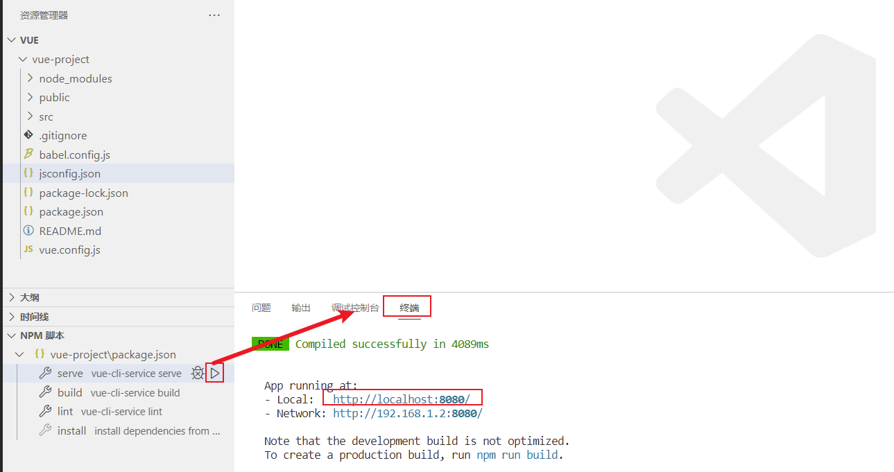


	最终浏览器打开后，呈现如下界面，表示项目运行成功


	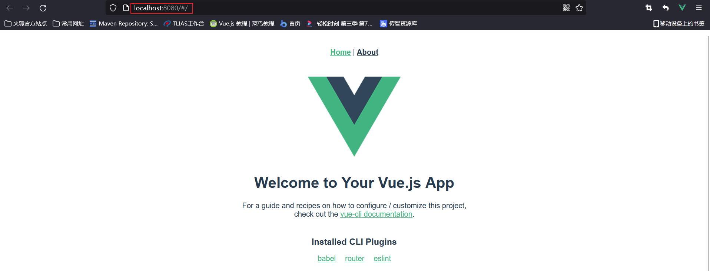


	其实此时访问的是 **src/App.vue**这个根组件，此时我们打开这个组件，修改代码：添加内容Vue


	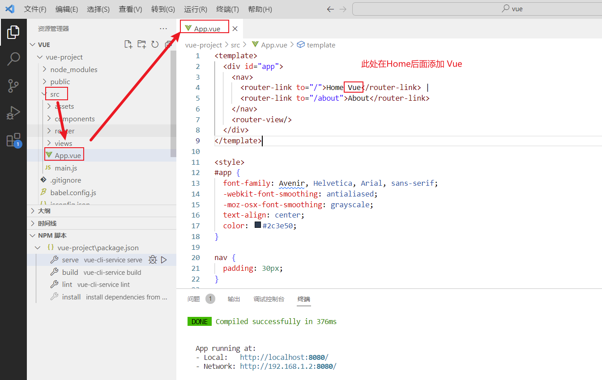


	只要我们保存更新的代码，我们直接打开浏览器，不需要做任何刷新，发现页面呈现内容发生了变化，如下图所示：


	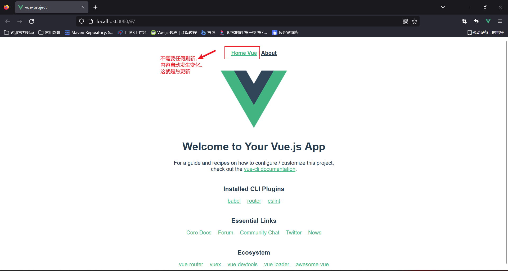


	这就是我们 vue 项目的热更新功能


	对于 8080 端口，经常被占用，所以我们可以去修改默认的 8080 端口。我们修改 `vue.config.js` 文件的内容，添加如下代码：


	```javascript
	devServer:{
	     port:7000
	 }
	```


	如下图所示，然后我们关闭服务器，并且重新启动，


	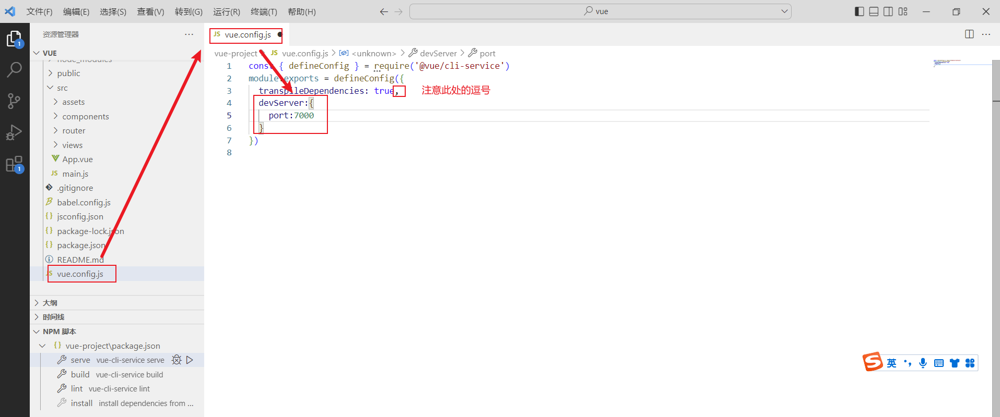


	重新启动如下图所示：


	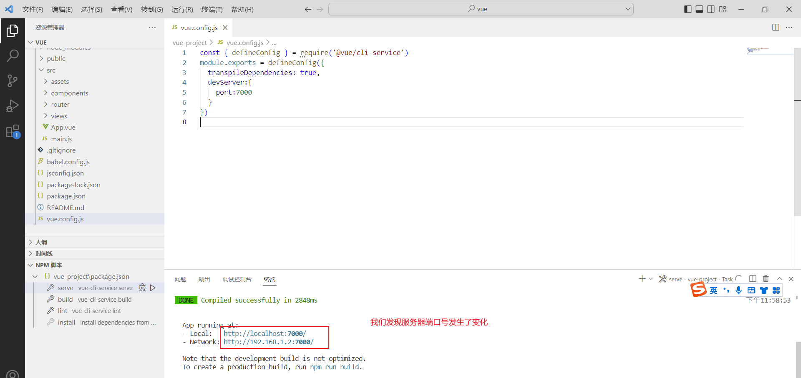


	端口更改成功，可以通过浏览器访问7000端口来访问我们之前的项目

- 第二种方式：命令行方式

	直接基于cmd命令窗口，在vue目录下，执行输入命令`npm run serve`即可，如下图所示：


	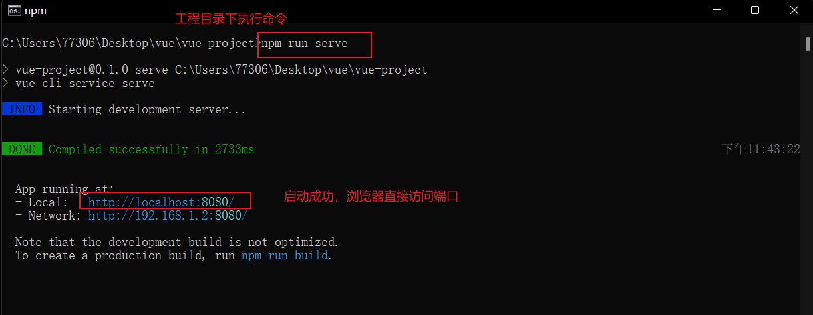


补充：NPM脚本窗口调试出来


第一步：通过**设置/用户设置/扩展/MPM**更改NPM默认配置，如下图所示


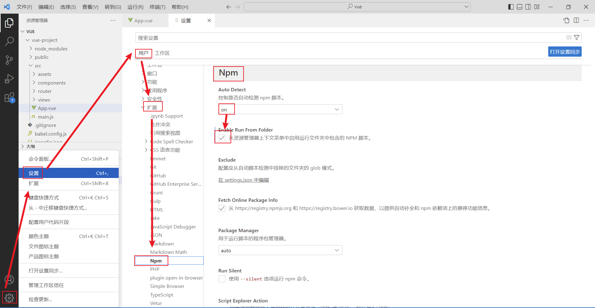


然后重启VS Code，并且**双击打开package.json文件**，然后点击**资源管理器处的3个小点**，**勾选npm脚本选项**，如图所示


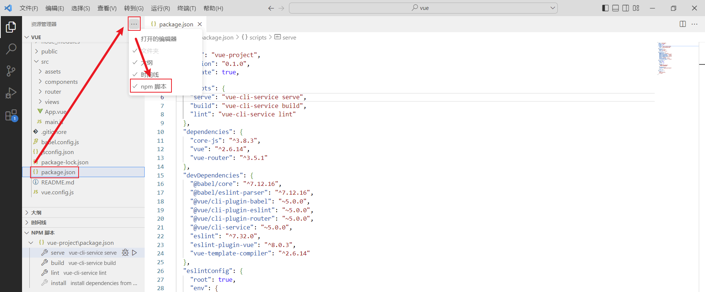


然后就能都显示NPM脚本小窗口了。


### ******Vue项目开发流程******


我们访问的首页是 `index.html`，但是打开 `public/index.html` 文件后发现，里面没有什么代码，但是能够呈现内容丰富的首页。这是因为 `index.html` 文件默认引入了入口函数 `main.js` 文件。


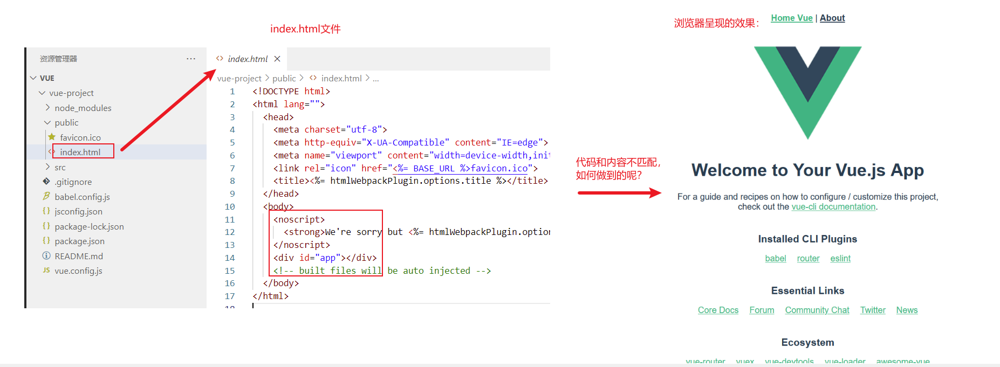


**`src/main.js`****文件**


```javascript
import Vue from 'vue'
 import App from './App.vue'
 import router from './router'
 
 Vue.config.productionTip = false
 
 new Vue({
   router,
   render: h => h(App)
 }).$mount('#app')
```


上述代码中，包括如下几个关键点：

- `import`：导入指定文件，并且重新起名。例如上述代码 `import App from './App.vue'` 导入当前目录下得 `App.vue` 并且起名为 `App`
- `new Vue()`：创建 Vue 对象
- `$mount('#app')`：将 Vue 对象创建的 DOM 对象挂在到 `id=app` 的这个标签区域中，作用和之前学习的 Vue 对象的 `el` 属性一致。
- `router`：路由，详细在后面的小节讲解
- `render`：主要使用视图的渲染的。

在 `public/index.html` 中，删除 `div` 的 `id=app` 属性，打开浏览器，发现之前访问的首页一片空白，这样就证明了，我们 `main.js` 中通过代码挂在到 `index.html` 的 `id=app` 的标签区域的。


首页内容呈现涉及到 `render` 中的 `App`，而 `App` 对象是 `.vue` 结尾的 Vue 组件。Vue 的组件文件包含三个部分：

- `template`：模板部分，主要是 HTML 代码，用来展示页面主体结构的。
- `script`：JS 代码区域，主要是通过 JS 代码来控制模板的数据来源和行为的。
- `style`：CSS 样式部分，主要通过 CSS 样式控制模板的页面效果的。

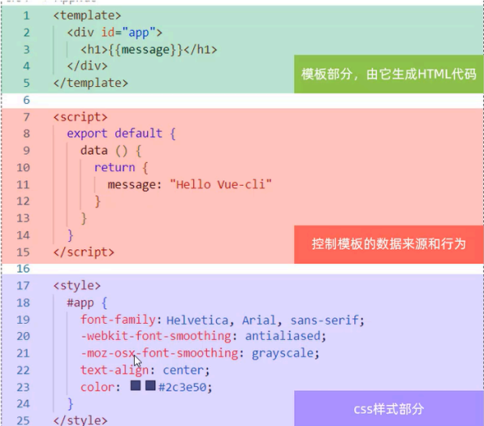

