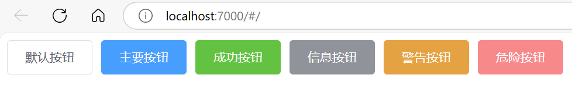
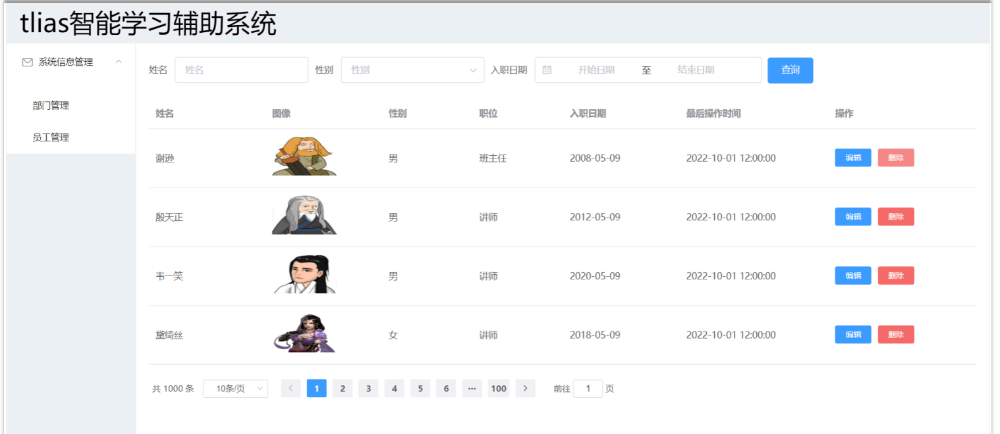
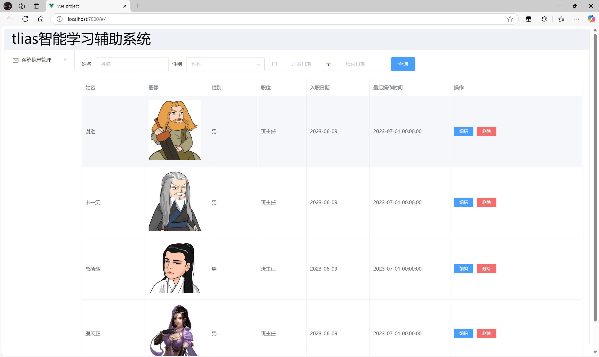

## ****Element 介绍****


Element UI 是一套基于 Vue.js 的前端组件库，由饿了么公司前端团队提供，主要用于快速构建美观的页面。与侧重于 VM 开发的 Vue 不同，Element UI 侧重于 V (视图) 的开发。


**Element UI 提供了丰富的组件，例如：**

- 超链接
- 按钮 (如下图所示，Element UI 提供的按钮样式更加美观)
- 图片
- 表格

学习 Element UI 的重点在于学会如何从官网复制组件代码到自己的页面中，并进行适当修改。Element UI 官网地址是：[https://element.eleme.cn/#/zh-CN](https://element.eleme.cn/#/zh-CN)


## ****快速入门****


#### ****步骤 1：安装 Element UI 组件库****


在当前项目下新建终端，然后在命令行输入以下命令安装 Element UI：


```bash
npm install element-ui@2.15.3
```


#### ****步骤 2：在 main.js 中引入 Element UI****


在 `main.js` 入口文件中引入 Element UI 组件库：


```javascript
import ElementUI from 'element-ui';
import 'element-ui/lib/theme-chalk/index.css';

Vue.use(ElementUI);
```


**代码解释：**

- `import ElementUI from 'element-ui';`: 导入 Element UI 组件库。
- `import 'element-ui/lib/theme-chalk/index.css';`: 导入 Element UI 的样式文件，`theme-chalk` 是一种主题风格。
- `Vue.use(ElementUI);`: 将 Element UI 注册为 Vue 的插件，这样就可以在项目中使用 Element UI 提供的组件了。

#### ****步骤 3：创建 Vue 组件文件****


在 `src/views` 目录下创建一个 Vue 组件文件（例如 `ElementView.vue`，并尽量使用驼峰命名），并编写基本组件语法：


```html
<template>
  
</template>

<script>
export default {
	
};
</script>

<style>

</style>
```


#### ****步骤 4：从 Element UI 官网复制组件代码****


在 Element UI 官网上找到需要的组件（例如按钮），复制组件代码到 Vue 组件文件中。


```html
<template>
  <el-row>
    <el-button>默认按钮</el-button>
    <el-button type="primary">主要按钮</el-button>
    <el-button type="success">成功按钮</el-button>
    <el-button type="info">信息按钮</el-button>
    <el-button type="warning">警告按钮</el-button>
    <el-button type="danger">危险按钮</el-button>
  </el-row>
</template>

<script>
export default {};
</script>

<style>
</style>
```


#### ****步骤 5：在 App.vue 中引入自定义组件****


在默认访问的根组件 `src/App.vue` 中引入自定义组件：


（在 VsCode 中，只需在 `src/App.vue` 中键入 `<e`  即可自动提示 `<elment-view>`  ，直接键盘 Enter 键后，再输入 `>`  即可自动补全 Close Tag 。）


```html
<template>
  <div id="app">
    <element-view></element-view>
  </div>
</template>

<script>
import ElementView from './views/Element/ElementView.vue';
export default {
  components: { ElementView },
};
</script>

<style>
</style>
```


**代码解释：**

- `import ElementView from './views/Element/ElementView.vue'`: 导入自定义的 `ElementView` 组件。
- `components: { ElementView }`: 将 `ElementView` 组件注册为 `App.vue` 的子组件，这样就可以在 `App.vue` 的模板中使用 `<element-view>` 标签了。

#### ****步骤 6：运行项目****


运行 Vue 项目，在浏览器中访问之前的 7000 端口，即可看到效果。





## ****案例****


### ****案例需求****


建立如图所示的“tlias智能学习辅助系统”：





**需求说明：**

1. 制作类似格式的页面（上面是标题，左侧栏是导航，右侧是数据展示区域）。
2. 右侧需要展示搜索表单。
3. 右侧表格数据是动态展示的，数据来自于后台。

**数据 Mock 地址：** [https://mock.apifox.cn/m1/3128855-0-default/emp/list](https://mock.apifox.cn/m1/3128855-0-default/emp/list) ，返回的 JSON 数据的 `data` 属性中包含人员列表信息。


### ****案例分析****


将页面拆分为三个部分：顶部标题、左侧导航栏、右侧核心内容展示区域。


**主要步骤：**

1. 创建页面，完成页面的整体布局规划。
2. 分别针对三个部分进行各自组件的具体实现。
3. 针对右侧核心内容展示区域，需要使用异步加载数据，以表格渲染数据。

### ****代码实现****


#### ****环境搭建****

1. 在 VS Code 中，在 `views` 目录下创建 `tlias/EmpView.vue` 组件，并编写组件的基本模板代码。
2. 修改 `App.vue` 组件，引入 `emp-view` 组件，并注释掉之前的 `element-view` 组件。

	```html
	<template>
	  <div id="app">
	    <emp-view></emp-view>
	  </div>
	</template>
	
	<script>
	import EmpView from './views/tlias/EmpView.vue';
	export default {
	  components: { EmpView },
	};
	</script>
	
	<style>
	</style>
	```


#### ****整体布局****


从 Element UI 官网的布局组件中找到合适的布局代码，拷贝到 `EmpView.vue` 组件的 `template` 模块中。


```html
<el-container style="height: 900px; border: 1px solid #eee ">
  <el-header style="font-size: 40px;  background-color: rgb(238, 241, 246)">tlias智能学习辅助系统</el-header>
  <el-container>
    <el-aside width="200px">Aside</el-aside>
    <el-main>Main</el-main>
  </el-container>
</el-container>
```


#### ****顶部标题****


修改顶部文本内容，并提供背景色的 CSS 样式。


```html
<el-header style="font-size:40px;background-color: rgb(238, 241, 246)">tlias 智能学习辅助系统</el-header>
```


#### ****左侧导航栏****


从 Element UI 官网的布局组件中找到左侧导航栏的案例，拷贝代码到 `EmpView.vue` 组件的 `<el-aside>` 标签中，并进行适当修改。


```html
<el-aside width="200px">
  <el-menu>
    <el-submenu index="1">
      <template slot="title"><i class="el-icon-message"></i>系统信息管理</template>
      <el-menu-item-group>
        <el-menu-item index="1-1">部门管理</el-menu-item>
        <el-menu-item index="1-2">员工管理</el-menu-item>
      </el-menu-item-group>
    </el-submenu>
  </el-menu>
</el-aside>
```


#### ****右侧核心内容****


**表格编写：**

1. 从 Element UI 官网找到表格组件，复制代码到布局容器的主题区域，即 `<el-main>` 标签内。

	```html
	<el-main>
	  <el-table :data="tableData" border style="width: 100%">
	    <el-table-column prop="date" label="日期" width="180">
	    </el-table-column>
	    <el-table-column prop="name" label="姓名" width="180">
	    </el-table-column>
	    <el-table-column prop="address" label="地址"> </el-table-column>
	  </el-table>
	</el-main>
	```

2. 拷贝表格的数据模型。

	```javascript
	data() {
	  return {
	    tableData: [
	      {
	        date: "2016-05-02",
	        name: "王小虎",
	        address: "上海市普陀区金沙江路 1518 弄",
	      },
	    ],
	  };
	},
	```

3. 修改表格，添加列，修改列名，并清空数据模型。

	```html
	<el-main>
	  <el-table :data="tableData" border style="width: 100%">
	    <el-table-column
	      prop="name"
	      label="姓名"
	      width="180"
	    ></el-table-column>
	    <el-table-column
	      prop="image"
	      label="图像"
	      width="180"
	    ></el-table-column>
	    <el-table-column
	      prop="gender"
	      label="性别"
	      width="140"
	    ></el-table-column>
	    <el-table-column
	      prop="job"
	      label="职位"
	      width="140"
	    ></el-table-column>
	    <el-table-column
	      prop="entrydate"
	      label="入职日期"
	      width="180"
	    ></el-table-column>
	    <el-table-column
	      prop="updatetime"
	      label="最后操作时间"
	      width="230"
	    ></el-table-column>
	    <el-table-column label="操作">
	      <el-button type="primary" size="mini">编辑</el-button>
	      <el-button type="danger" size="mini">删除</el-button>
	    </el-table-column>
	  </el-table>
	</el-main>
	```


	```javascript
	data() {
	  return {
	    tableData: [],
	  };
	},
	```


**表单编写**：

1. 从 Element UI 官网找到类似的表单示例，拷贝代码到 `table` 组件的上方。

	```html
	<el-form :inline="true" :model="searchForm" class="demo-form-inline">
	  <el-form-item label="姓名">
	    <el-input v-model="searchForm.name" placeholder="姓名"></el-input>
	  </el-form-item>
	  <el-form-item label="性别">
	    <el-select v-model="searchForm.gender" placeholder="性别">
	      <el-option label="男" value="1"></el-option>
	      <el-option label="女" value="2"></el-option>
	    </el-select>
	  </el-form-item>
	  <el-form-item>
	    <el-button type="primary" @click="onSubmit">查询</el-button>
	  </el-form-item>
	</el-form>
	```

2. 在 `data` 中定义 `searchForm` 的数据模型。

	```javascript
	data() {
	  return {
	    tableData: [],
	    searchForm: {
	      name: '',
	      gender: ''
	    }
	  }
	}
	```

3. 在 `methods` 中定义 `onSubmit` 函数。

	```javascript
	methods: {
	  onSubmit: function() {
	    console.log(this.searchForm);
	  }
	}
	```

4. 添加日期表单。

	```html
	<el-form-item label="入职日期">
	  <el-date-picker
	    v-model="searchForm.entrydate"
	    type="daterange"
	    range-separator="至"
	    start-placeholder="开始日期"
	    end-placeholder="结束日期">
	  </el-date-picker>
	</el-form-item>
	```

5. 在 `searchForm` 中定义 `entrydate` 属性。

	```javascript
	searchForm: {
	  name: '',
	  gender: '',
	  entrydate: []
	}
	```


**分页工具栏：**

1. 从 Element UI 官网找到类似的分页条案例代码。

	```html
	<el-pagination
	    @size-change="handleSizeChange"
	    @current-change="handleCurrentChange"
	    :page-sizes="[50, 100, 150, 200]"
	    :page-size="50"
	    layout="total, sizes, prev, pager, next, jumper"
	    :total="400"
	  >
	  </el-pagination>
	```

2. 声明 `handleSizeChange` 和 `handleCurrentChange` 函数。

	```javascript
	methods: {
	    handleSizeChange: function(val) {
	        alert(`每页 ${val} 条`);
	    },
	    handleCurrentChange: function(val) {
	        alert(`前往 ${val} 页`);
	    }
	  },
	```


#### ****异步数据加载****


**异步加载数**

1. 安装 `axios`：在当前项目新建终端，并输入一下命令：

	```bash
	npm install axios
	```

2. 在 `EmpView.vue` 组件页面导入 `axios`：

	```bash
	import axios from 'axios';
	```

3. 在 `mounted` 钩子函数（与 `data` `methods` 平级）中发送 axios 请求，并将响应数据赋值给 `tableData`。

	```javascript
	mounted() {
	  axios.get("https://mock.apifox.cn/m1/3128855-0-default/emp/list")
	    .then(resp => {
	      this.tableData = resp.data.data; //响应数据赋值给数据模型
	    });
	}
	```


	**代码解释：**

	- `mounted()`: Vue 组件的生命周期钩子函数，在组件挂载到 DOM 后执行。
	- `axios.get("http://yapi.smart-xwork.cn/mock/169327/emp/list")`: 使用 axios 发送 GET 请求，获取员工列表数据。
	- `.then(resp => { ... })`: 当请求成功时，执行 `then` 方法中的回调函数。
	- `this.tableData = resp.data.data`: 将响应数据中的员工列表赋值给 `tableData` 数据模型，这样表格就可以显示员工数据了。

**性别内容展示修复：**


使用 `<template>` 标签自定义列的内容，通过 `slot-scope` 属性的 `row` 获取当前行的数据。


```html
<el-table-column prop="gender" label="性别" width="140">
  <template slot-scope="scope">
    {{ scope.row.gender == 1 ? "男" : "女" }}
  </template>
</el-table-column>
```


#### ****4.4.3.6.3 图片内容展示修复****


使用 `<template>` 标签自定义列的内容，使用 `` 标签展示图片。


```html
<el-table-column prop="image" label="图像" width="180">
  <template slot-scope="scope">
    <!-- 动态更新 -->
    
  </template>
</el-table-column>
```


完成了以上步骤，就可以实现一个包含顶部标题、左侧导航栏、右侧表单和表格的页面，并且表格数据是动态从后台加载的。




