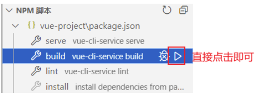
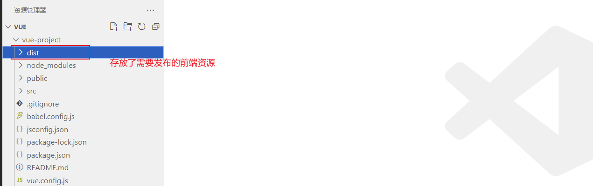
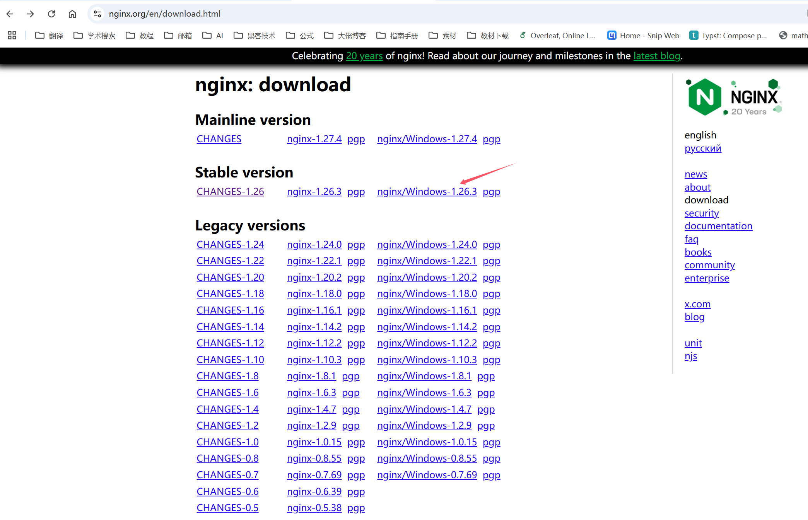
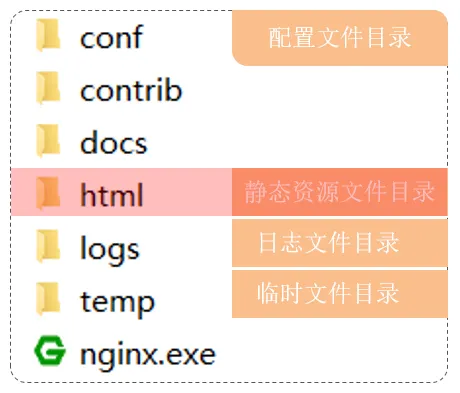
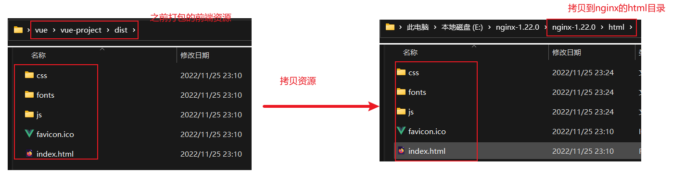
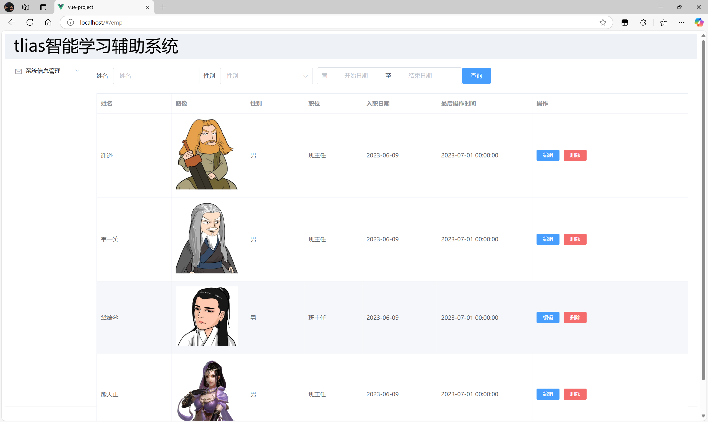
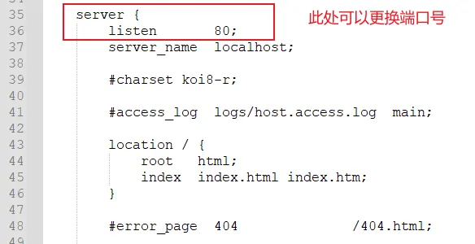

当我们的前端工程开发完成后，需要将其发布到服务器上，以便用户可以访问。这个过程主要分为两步：

1. 前端工程打包
2. 通过 nginx 服务器发布前端工程

## ****前端工程打包****


首先，我们需要对前端工程进行打包。打包的目的是将开发环境下的代码进行优化和压缩，以便在生产环境中更高效地运行。


通常，我们可以使用构建工具（如 Webpack、Vite 等）提供的命令来完成打包。以 VS Code 为例，可以直接点击 NPM 脚本中提供的 build 按钮来执行打包命令。





打包完成后，会在工程目录下生成一个 `dist` 目录，用于存放需要发布的前端资源。





## ****部署前端工程****


### ****nginx 介绍****


Nginx 是一款高性能的 Web 服务器/反向代理服务器及电子邮件代理服务器。它具有占用内存少、并发能力强等特点，被广泛应用于各大互联网公司。


Nginx 在 Windows 中的安装非常方便，只需解压即可。打开 nginx 官网的 [下载页面](https://nginx.org/en/download.html) ，下载稳定版本即可。





将下载好的压缩文件拷贝到无中文的目录下，然后解压。





Nginx 的主要目录结构如下：

- `html`：用于存放静态资源，如 HTML、CSS、JavaScript、图片等。**我们需要将打包后的前端资源放到这个目录中**。
- `conf`：用于存放 Nginx 的配置文件 `nginx.conf`。**如果需要修改 Nginx 的端口号，需要修改这个文件**。
- `nginx.exe`：Nginx 的可执行文件，双击即可启动 Nginx 服务器。

### ****部署****


现在，我们将之前打包的前端工程 `dist` 目录下的内容拷贝到 Nginx 的 `html` 目录下。





然后，双击 Nginx 目录下的 `nginx.exe` 文件来启动 Nginx。


Nginx 服务器的默认端口号是 80，所以启动成功后，在浏览器中直接访问 `http://localhost:80` 即可。其中 80 端口可以省略，即访问 `http://localhost`。





至此，我们的前端工程就成功发布了。


**PS:** 如果 80 端口被占用，我们需要通过 `conf/nginx.conf` 配置文件来修改端口号。





**重点：** Nginx 的配置文件是 `nginx.conf`，我们需要修改这个文件来改变 Nginx 的默认配置，例如端口号。


下面是一个简单的 `nginx.conf` 示例，展示如何修改端口号：


```plain text
## ****nginx.conf****

http {
    server {
        listen       8080; ## 修改端口号为 8080
        server_name  localhost;

        location / {
            root   html;
            index  index.html index.htm;
        }
    }
}
```


**代码解释：**

- `listen 8080;`：这行代码指定了 Nginx 监听的端口号。默认情况下，Nginx 监听 80 端口。如果 80 端口被占用，你可以将其修改为其他未被占用的端口号，例如 8080。
