## ****初识 Maven****


### ****什么是 Maven****


Maven 是 Apache 旗下的一个开源项目，它是一个用于管理和构建 Java 项目的工具。Apache 软件基金会是一个非盈利性组织，专门为支持开源项目而生。


### ****Maven 的作用****


Maven 主要有以下三个作用：

1. **依赖管理：** 方便快捷地管理项目依赖的资源（jar 包），避免版本冲突问题。
2. **统一项目结构：** 提供标准、统一的项目结构。
	- **标准项目结构：**
		- `src/main/java`: Java 源代码目录
		- `src/main/resources`: 配置文件信息目录
		- `src/test/java`: 测试代码目录
		- `src/test/resources`: 测试配置文件信息目录
3. **项目构建：** 提供标准的、跨平台的自动化项目构建方式（编译、测试、打包、发布）。

## ****Maven 概述****


### ****Maven 介绍****


Maven 是一个项目管理和构建工具，它基于**项目对象模型 (Project Object Model, POM)** 的概念，通过一小段描述信息来管理项目的构建、报告和文档。


### ****Maven 模型****


Maven 的核心模型包括：

1. **项目对象模型 (Project Object Model, POM)**
	- 将项目抽象成一个对象模型，每个项目都有自己的坐标。
		- **坐标：** 资源的唯一标识，通过坐标可以定位到所需资源 (jar 包) 位置。
2. **依赖管理模型 (Dependency)**
	- 使用坐标来描述当前项目依赖哪些第三方 jar 包。
3. **构建生命周期/阶段 (Build lifecycle & phases)**
	- 用于完成标准化构建流程。Maven 提供了编译、打包等插件来完成构建过程中的各个阶段。

	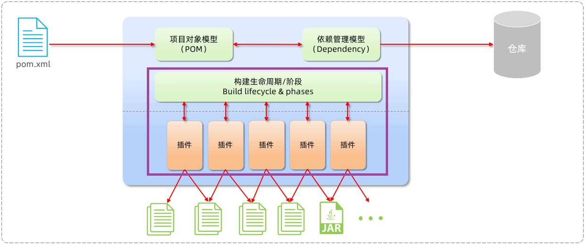


### ****Maven 仓库****


仓库用于存储资源，管理各种 jar 包。本质上就是一个目录(文件夹)，用来存储开发中所有依赖(就是 jar包)和插件。


Maven 仓库分为三种：

1. **本地仓库：** 自己计算机上的一个目录，用来存储 jar 包。
2. **中央仓库：** 由 Maven 团队维护的全球唯一的仓库，可以在 `https://repo1.maven.org/maven2/` 访问。
3. **远程仓库 (私服)：** 一般由公司团队搭建的私有仓库。

**Jar 包查找顺序：** 本地仓库 -> 远程仓库 -> 中央仓库


### ****Maven 安装****


#### ****下载****


从 Maven 官网下载：[https://maven.apache.org/download.cgi](https://maven.apache.org/download.cgi)


#### ****安装步骤****

1. **解压安装：** 将下载的安装包解压到没有中文、特殊字符的路径下。
	- **目录结构：**
		- `bin`: 存放可执行命令（如 `mvn` 命令）。
		- `conf`: 存放 Maven 的配置文件（`settings.xml`）。
		- `lib`: 存放 Maven 依赖的 jar 包。
2. **配置本地仓库：**
	1. 在计算机上新建一个目录作为本地仓库。如可在 Maven 的安装目录下新建 `mvn_repo`  作为本地仓库。
	2. 修改 `conf/settings.xml` 配置文件：
		- 找到 `<localRepository>` 标签，将注释取消，并修改标签体内容为本地仓库的路径。

		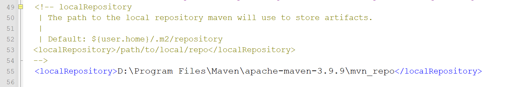

3. **配置阿里云私服：**
	1. 修改 `conf/settings.xml` 配置文件：
		- 在 `<mirrors>` 标签下添加 `<mirror>` 子标签，配置阿里云的镜像仓库。
		- 课件中给出了添加阿里云仓库配置的示例代码。

		```xml
		<mirror>
		    <id>alimaven</id>
		    <name>aliyun maven</name>
		    <url>http://maven.aliyun.com/nexus/content/groups/public</url>
		    <mirrorOf>central</mirrorOf>
		</mirror>
		```


	**代码解释：**

	- `<id>`: 镜像的唯一标识符。
	- `<name>`: 镜像的名称，用于描述。
	- `<url>`: 镜像的 URL 地址，指向阿里云的 Maven 仓库。
	- `<mirrorOf>`: 指定该镜像替代的仓库，`central` 表示替代中央仓库。
	- **重点：** 阿里云仓库可以加速依赖下载，提高构建效率。
4. **配置环境变量：**
	1. 新建系统变量 `MAVEN_HOME`，值为 Maven 的解压安装目录。
	2. 在 `Path` 环境变量中添加 `%MAVEN_HOME%\\bin`。
5. **验证安装：** 打开 DOS 命令提示符，输入 `mvn -v`，出现 Maven 版本信息表示安装成功。

	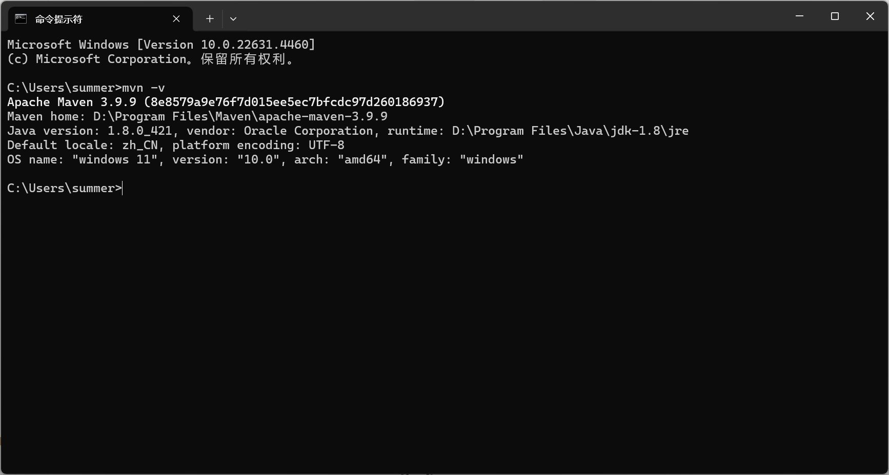


## ****IDEA 集成 Maven****


### ****配置 Maven 环境****


#### ****当前工程设置****

1. 打开 IDEA，选择 `File -> Settings -> Build, Execution, Deployment -> Build Tools -> Maven`。

	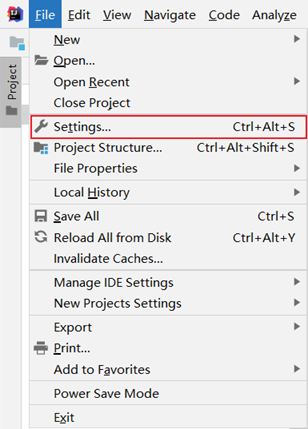


	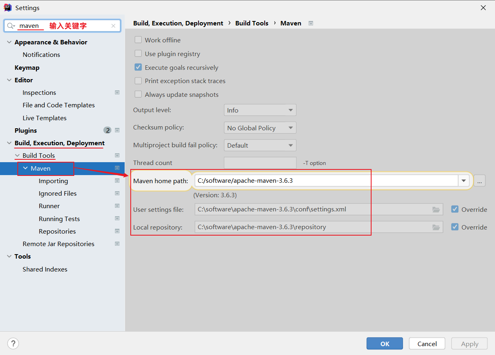

2. 设置 IDEA 使用本地安装的 Maven，并修改配置文件及本地仓库路径。
	- `Maven home path`: 指定 Maven 的安装目录。
	- `User settings file`: 指定 `settings.xml` 配置文件的存放路径。
	- `Local repository`: 指定 Maven 的本地仓库的路径。

	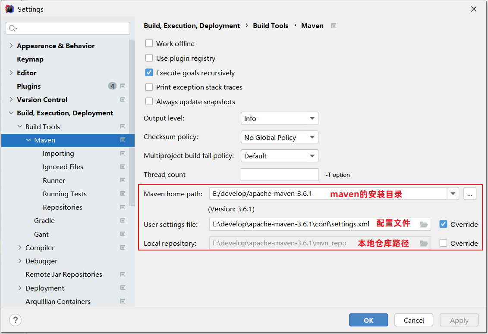

3. 配置工程的编译版本为 11（Maven 默认使用的编译版本为 5）。

	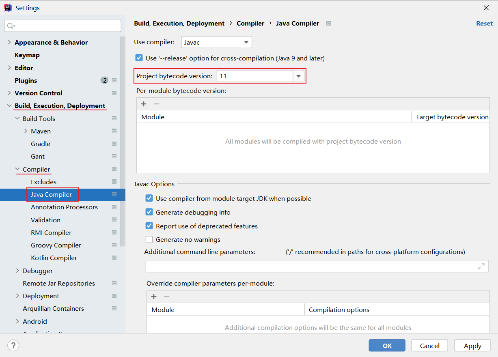


上述配置的 Maven 环境，只是针对于当前工程的，如果我们再创建一个 project，又恢复成默
认的配置了。 要解决这个问题， 我们就需要配置全局的 Maven 环境。


#### ****全局设置****

1. 进入 IDEA 欢迎页面 (`File -> Close Project`)。
2. 打开 `All Settings`，选择 `Build, Execution, Deployment -> Build Tools -> Maven`。

	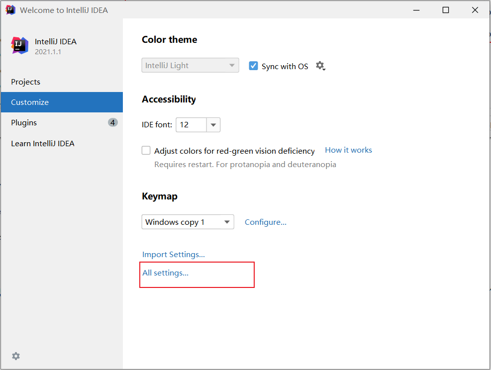


	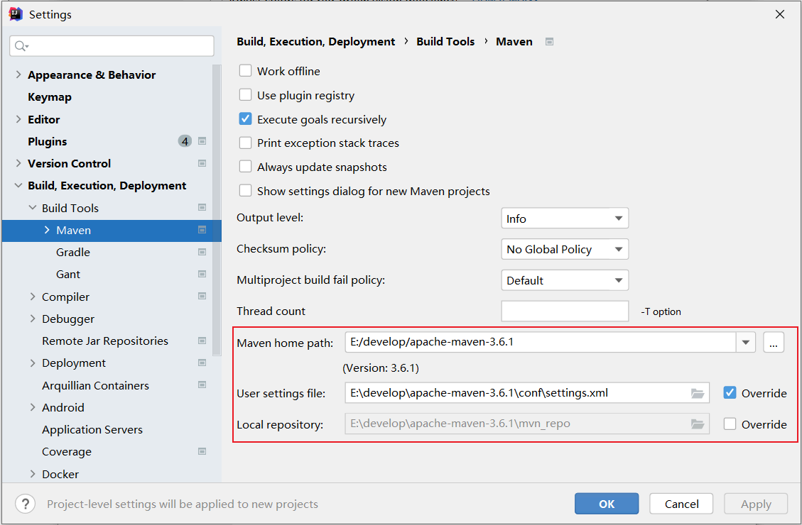

3. 配置 Maven 的全局环境信息和编译版本。
	- **注意：** 全局设置会应用于以后创建的所有项目。

### ****Maven 项目****


#### ****创建 Maven 项目****

1. 创建一个空项目。

	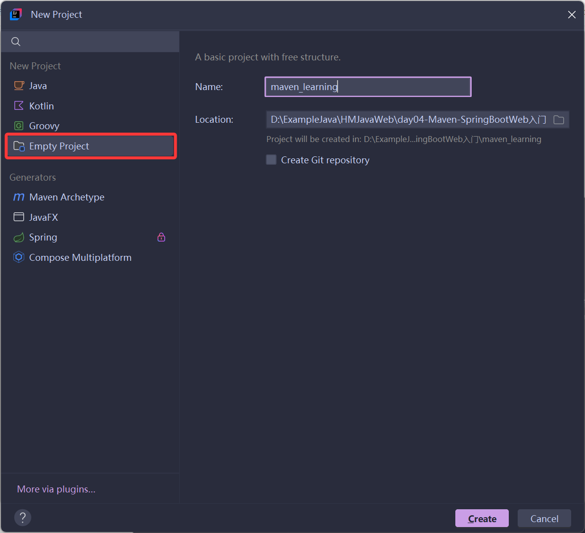

2. 创建模块，选择 `Maven Archetype` ，然后 `Archetype` 中下拉选择后缀为 `quickstart` 。随后填写模块名称，坐标信息（`groupId`，`artifactId`，`version`）。

	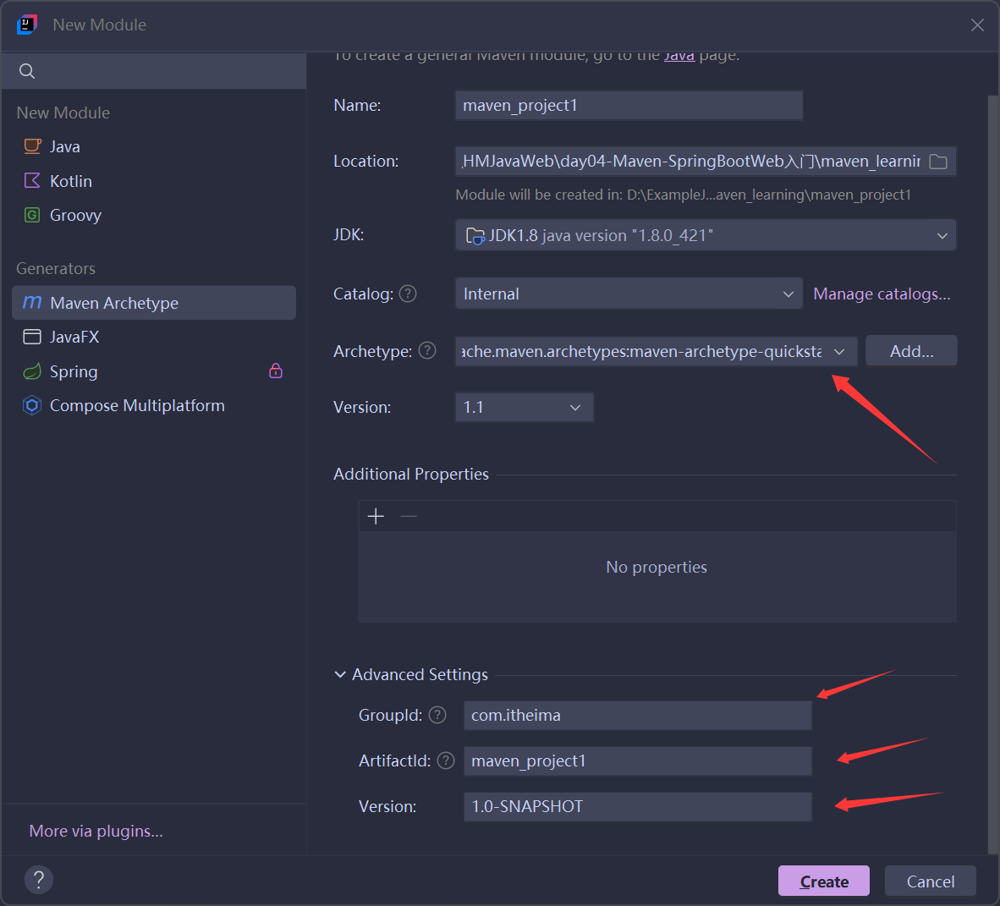

3. 在 Maven 工程下，创建 `HelloWorld` 类。

	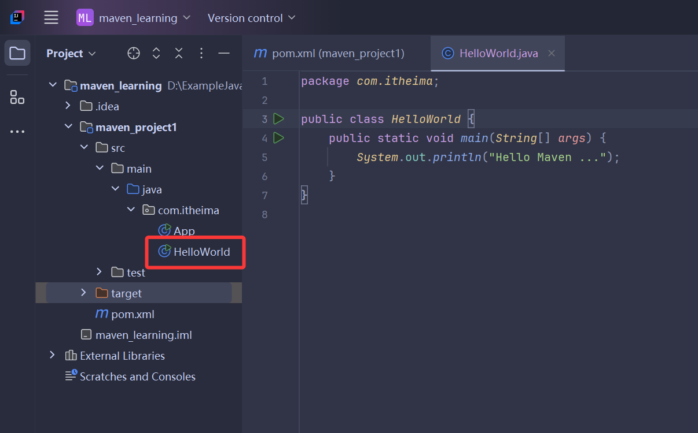

	- **Maven 项目的目录结构：**
		- `src/main/java`: 源代码 java 文件目录
		- `src/main/resources`: 源代码配置文件目录
		- `src/test/java`: 测试代码 java 目录
		- `src/test/resources`: 测试代码配置文件目录
		- `target`: 编译、打包生成文件存放目录
4. 编写 `HelloWorld` 类，并运行。

```java
public class HelloWorld {
    public static void main(String[] args) {
        System.out.println("Hello Maven ...");
    }
}
```


#### ****POM 配置详解****


**POM (Project Object Model)** 指的是项目对象模型，使用 `pom.xml` 文件来实现。

- `<project>`: POM 文件的根标签，表示当前 Maven 项目。
- `<modelVersion>`: 声明项目描述遵循哪一个 POM 模型版本，目前是 `4.0.0`。
- 坐标 (`groupId`、`artifactId`、`version`): 定位项目在本地仓库中的位置。
- `<packaging>`: Maven 项目的打包方式，通常设置为 `jar` 或 `war`（默认值：`jar`）。

#### ****Maven 坐标详解****


Maven 中的坐标是资源的唯一标识，通过该坐标可以唯一定位资源位置。

- `groupId`: 定义当前 Maven 项目隶属组织名称（通常是域名反写，例如：`com.itheima`）。
- `artifactId`: 定义当前 Maven 项目名称（通常是模块名称，例如 `order-service`、`goods-service`）。
- `version`: 定义当前项目版本号。

	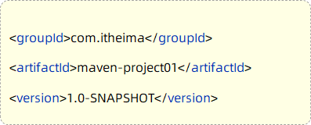


### ****导入 Maven 项目****

- **方式 1：** 使用 Maven 面板，快速导入项目。
	- 打开 IDEA，选择右侧 Maven 面板，点击 `+` 号，选中对应项目的 `pom.xml` 文件，双击即可。

	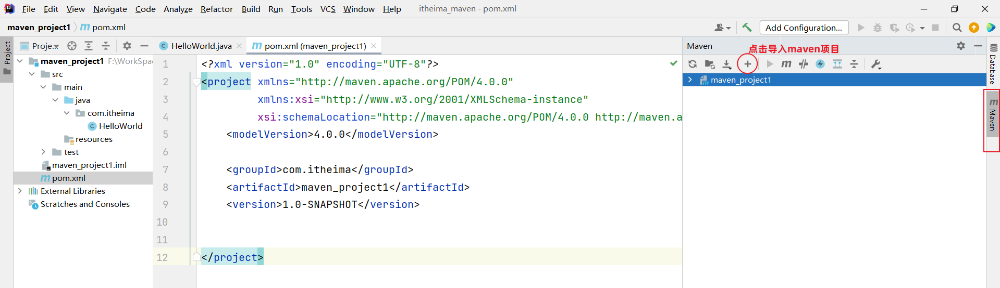

- **方式 2：** 使用 IDEA 导入模块项目。
	- `File -> Project Structure -> Modules -> + -> Import Module`，找到要导入工程的 `pom.xml`。

	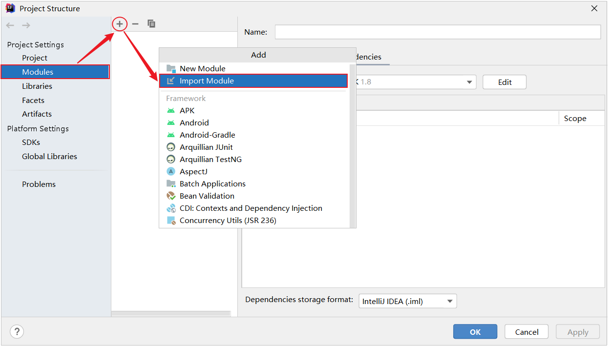


## ****依赖管理****


### ****依赖配置****


依赖指当前项目运行所需要的 jar 包。一个项目中可以引入多个依赖。

- **配置步骤：**
	1. 在 `pom.xml` 中编写 `<dependencies>` 标签。
	2. 在 `<dependencies>` 标签中使用 `<dependency>` 引入坐标。
	3. 定义坐标的 `groupId`、`artifactId`、`version`。
- 示例代码：

	```xml
	<dependencies>
	    <!-- 第1个依赖 : logback -->
	    <dependency>
	        <groupId>ch.qos.logback</groupId>
	        <artifactId>logback-classic</artifactId>
	        <version>1.2.11</version>
	    </dependency>
	    <!-- 第2个依赖 : junit -->
	    <dependency>
	        <groupId>junit</groupId>
	        <artifactId>junit</artifactId>
	        <version>4.12</version>
	    </dependency>
	</dependencies>
	```

- **注意事项：**
	1. 如果引入的依赖在本地仓库中不存在，将会连接远程仓库/中央仓库，然后下载依赖。
	2. 如果不知道依赖的坐标信息，可以到 Maven [中央仓库](https://mvnrepository.com/) 中搜索。
- 添加依赖的几种方式：
	1. 利用中央仓库搜索。
	2. 利用 IDEA 工具搜索：使用快捷键 `Alt+Insert` 。
	3. 快速导入依赖。

### ****依赖传递****


#### ****依赖具有传递性****


依赖传递是指 A 依赖 B，B 依赖 C，那么 A 也会间接依赖 C。


**依赖类型：**

1. 直接依赖：在当前项目中通过依赖配置建立的依赖关系。
2. 间接依赖：被依赖的资源如果依赖其他资源，当前项目间接依赖其他资源。

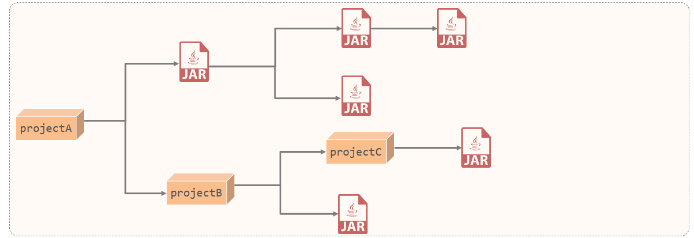


比如以上图中：

- projectA 依赖了 projectB 。对于 projectA 来说，projectB 就是直接依赖。
- projectB 依赖了 projectC 及其他 ja r包。 那么此时，在projectA 中也会将 projectC 的依赖传递下来。对于 projectA 来说，projectC 就是间接依赖。

#### ****排除依赖****


排除依赖是指主动断开依赖的资源（被排除的资源无需指定版本）。

- **使用场景：** 当 A 依赖 B，B 依赖 C，但 A 不想依赖 C 时，可以使用排除依赖。

排除依赖的示例：


maven-projectA 依赖了 maven-projectB，maven-projectB 依赖了 Junit。基于依赖的传递性，所以maven-projectA 也依赖了 Junit 。maven-projectA 可修改其 `pom.xml` 文件排除依赖：


```xml
<dependency>
    <groupId>com.itheima</groupId>
    <artifactId>maven-projectB</artifactId>
    <version>1.0-SNAPSHOT</version>
    <!--排除依赖, 主动断开依赖的资源-->
    <exclusions>
        <exclusion>
            <groupId>junit</groupId>
            <artifactId>junit</artifactId>
        </exclusion>
    </exclusions>
</dependency>
```

- **代码解释：**
	- `<exclusions>`: 用于排除传递性依赖。
	- `<exclusion>`: 指定要排除的依赖的 `groupId` 和 `artifactId`。
	- **重点：** 排除依赖可以解决依赖冲突，避免引入不需要的依赖。

### ****依赖范围****


可以通过 `<scope>` 标签设置依赖的作用范围，限制依赖的使用范围。


| scope 值     | 主程序 | 测试程序 | 打包（运行） | 范例          |
| ----------- | --- | ---- | ------ | ----------- |
| compile（默认） | Y   | Y    | Y      | log4j       |
| test        | -   | Y    | -      | junit       |
| provided    | Y   | Y    | -      | servlet-api |
| runtime     | -   | Y    | Y      | jdbc 驱动     |

- **作用范围：**
	1. 主程序范围有效（`main` 文件夹范围内）。
	2. 测试程序范围有效（`test` 文件夹范围内）。
	3. 是否参与打包运行（`package` 指令范围内）。
- **重点：** 依赖范围可以控制依赖在不同环境下的可用性，减小打包体积。

### ****生命周期****


#### ****介绍****


Maven 的生命周期就是为了对所有的构建过程进行抽象和统一。描述了一次项目构建，经历哪些阶段。Maven 对项目构建的生命周期划分为 3 套（相互独立）：


1. **clean：** 清理工作。
2. **default：** 核心工作。如：编译、测试、打包、安装、部署等。
3. **site：** 生成报告、发布站点等。

三套生命周期又包含如下具体的阶段：


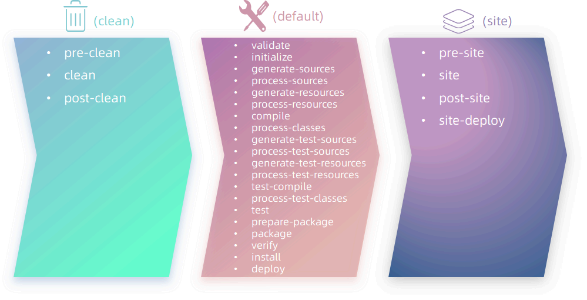

- **常用阶段：**
	- `clean`: 移除上一次构建生成的文件。
	- `compile`: 编译项目源代码。
	- `test`: 使用合适的单元测试框架运行测试 (junit)。
	- `package`: 将编译后的文件打包，如：jar、war 等。
	- `install`: 安装项目到本地仓库。
- **生命周期顺序：** `clean -> validate -> compile -> test -> package -> verify -> install -> site -> deploy`。
- **重点：** 在同一套生命周期中，执行后面的生命周期时，前面的生命周期都会执行。

	**思考**：当运行 `package` 生命周期时，`clean`、`compile` 生命周期会不会运行？


	`clean` 不会运行，`compile` 会运行。 因为 `compile` 与 `package` 属于同一套生命周期，而 `clean` 与 `package` 不属于同一套生命周期。


#### ****执行****

- **方式一：** 在 IDEA 工具右侧的 Maven 工具栏中，选择对应的生命周期，双击执行。

	选择对应的生命周期，双击执行：


	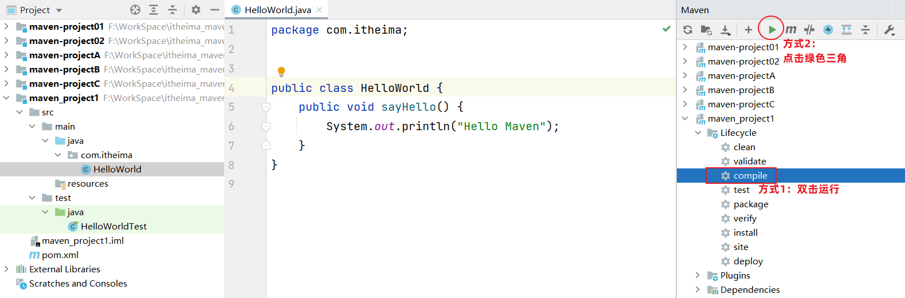

- **方式二：** 在 DOS 命令行中，通过 Maven 命令执行。

	**基本命令：**

	- **`mvn help:help`**: 显示 Maven 帮助信息，可以查看 Maven 版本、插件版本等。
	- **`mvn clean`**: 清理项目，删除 `target` 目录，该目录包含了编译后的类、打包的文件等。
	- **`mvn compile`**: 编译项目的源代码。
	- **`mvn test-compile`**: 编译测试代码。
	- **`mvn test`**: 运行单元测试。
	- **`mvn package`**: 将项目打包成可分发的格式，例如 JAR、WAR、EAR 等，具体取决于 `pom.xml` 文件中的配置。
	- **`mvn install`**: 将打包后的构件安装到本地 Maven 仓库，以便其他项目可以依赖它。
	- **`mvn deploy`**: 将打包后的构件发布到远程 Maven 仓库，通常用于共享给团队或公开发布。
	- **`mvn site`**: 生成项目的站点文档。

## ****附录****


### ****更新依赖索引****


有时候给 IDEA 配置完 Maven 仓库信息后，在 IDEA 中依然搜索不到仓库中的 jar 包。这是因为仓库中的 jar 包索引尚未更新到 IDEA 中。这个时候我们就需要更新 IDEA 中 Maven 的索引了。


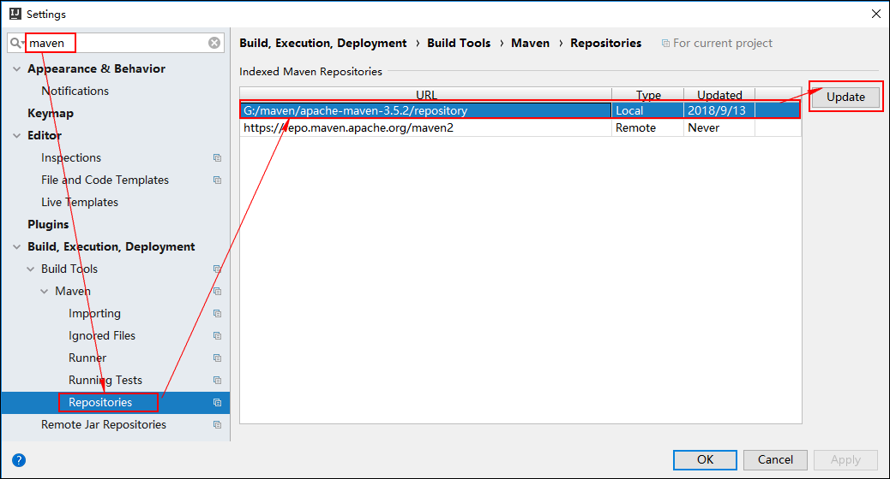


### ****清理 Maven 仓库****


初始情况下，本地仓库没有任何 jar 包，此时会从私服去下载（如果没有配置，就直接从中央仓库去下载），可能由于网络的原因，jar 包下载不完全，这些不完整的 jar 包都是以 `lastUpdated` 结尾。此时，Maven 不会再重新帮你下载，需要你删除这些以 `lastUpdated` 结尾的文件，然后 Maven 才会再次自动下载这些 jar 包。


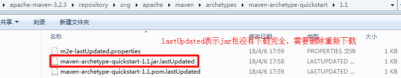


如果本地仓库中有很多这样的以 `lastUpadted` 结尾的文件，可以定义一个批处理文件，在其中
编写如下脚本来删除：


**批处理脚本示例：**`del_lastUpdated.bat`


```bash
set REPOSITORY_PATH=E:\\develop\\apache-maven-3.6.1\\mvn_repo
rem 正在搜索...
del /s /q %REPOSITORY_PATH%\\*.lastUpdated
rem 搜索完毕
pause
```

- **代码解释：**
	- `set REPOSITORY_PATH=...`: 设置本地仓库的路径。
	- `del /s /q ...`: 删除指定路径下所有以 `.lastUpdated` 结尾的文件。
	- `pause`: 暂停批处理脚本的执行，等待用户按下任意键继续。
	- **重点：** 清理 Maven 仓库可以解决依赖下载不完整的问题。
