Spring Boot 旨在简化 Java 开发，其核心特点是简化配置和快速开发。Spring Boot 建立在 Spring Framework 之上，通过自动配置和起步依赖，可以快速构建独立的、生产级别的 Spring 应用。


## ****SpringBoot快速入门****


### ****需求****


开发一个 Web 应用，当浏览器发起 `/hello` 请求时，服务器返回字符串 "Hello World ~"。


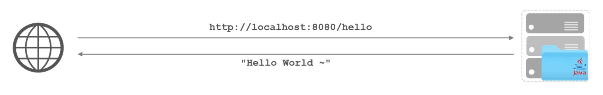


### ****开发步骤****

1. 创建 Spring Boot 工程项目。
2. 定义 `HelloController` 类，添加 `hello` 方法，并添加注解。
3. 测试运行。

#### ****创建 Spring Boot 工程****


由于使用的 Idea (2024.3) 社区版中没有 Spring Initializr ，因此需要借助其他插件辅助生成 SpringBoot 项目。


下载如图所示插件：

- SpringBoot-Gen：可以选择 SpringBoot 生成服务地址（官方：start.spring.io 或者自定义）。
- Start Spring Boot Project：重定向官方：start.spring.io 。

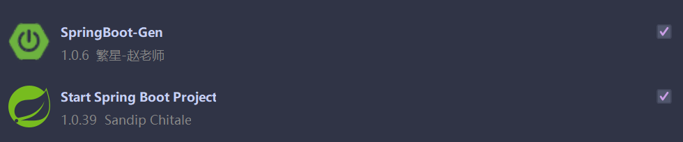


由于官方生成服务已不推荐 Java 8，因此采用 SpringBoot-Gen 插件使用阿里云（https://start.aliyun.com）生成服务地址：


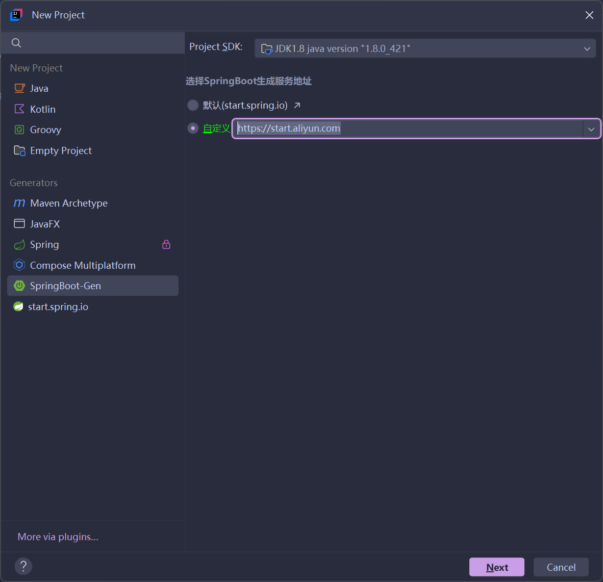


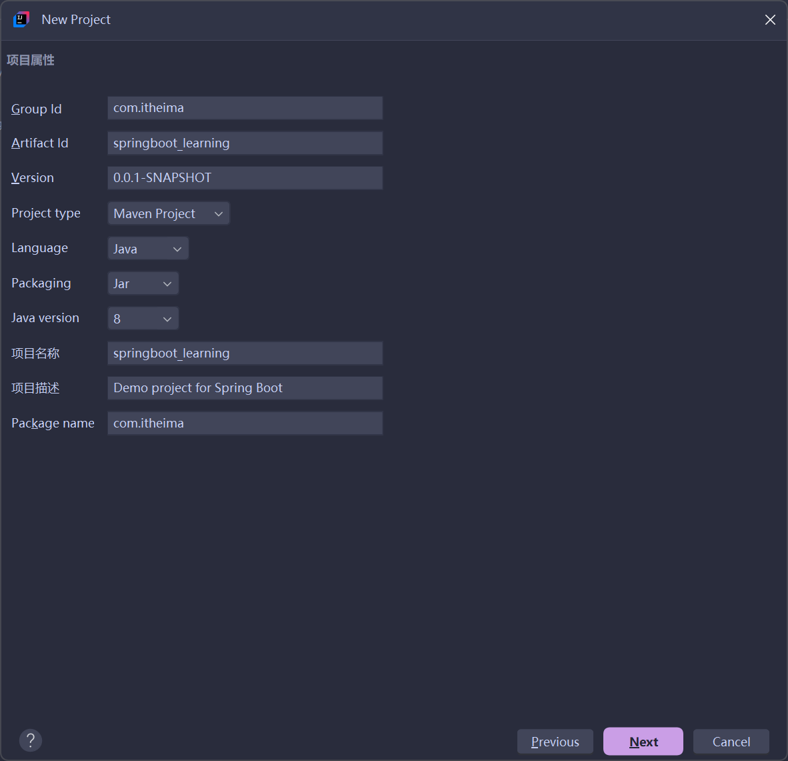


勾选 Spring Web：


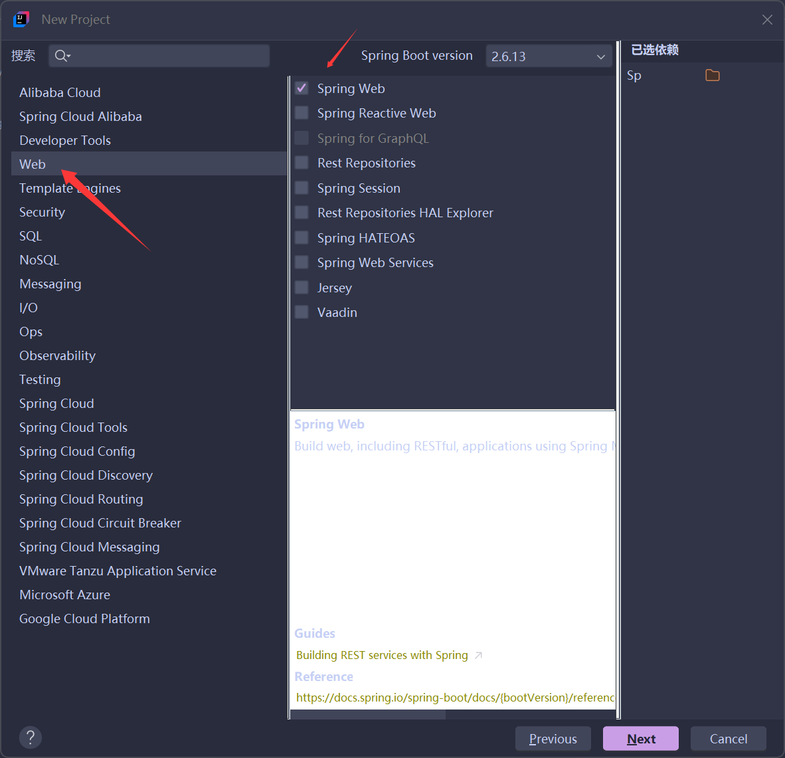


最后点击创建即可。


#### ****定义请求处理类****


在 `com.itheima.controller` 包下创建一个 `HelloController` 类，代码如下：


```java
package com.itheima.controller;

import org.springframework.web.bind.annotation.RequestMapping;
import org.springframework.web.bind.annotation.RestController;

@RestController
public class HelloController {
    @RequestMapping("/hello")
    public String hello() {
        System.out.println("Hello World ~");
        return "Hello World ~";
    }
}
```


**代码解释：**

- `@RestController`: 这是一个组合注解，相当于 `@Controller` + `@ResponseBody`，表明该类是一个控制器，并且所有方法的返回值都会直接作为响应体返回，而不是解析为视图。
- `@RequestMapping("/hello")`: 这是一个RequestMapping注解，将 HTTP 请求 `/hello` 映射到 `hello()` 方法。当浏览器访问 `http://localhost:8080/hello` 时，`hello()` 方法会被调用。

**注意：**采用插件生成的新项目下存在 `com.itheima.demos.web`  包，该包下的 `BasicController`  类同样将 HTTP 请求 `/hello` 映射到 `hello()` 方法，因此项目运行时会报错。此时将 `HelloController` 类下的 `/hello` 改为其他请求，如 `/helloworld` 。


#### ****运行测试****


运行 Spring Boot 自动生成的引导类（包含 `main` 方法的类），启动应用。然后在浏览器中输入 `http://localhost:8080/hello`，即可看到 "Hello World ~" 的返回。


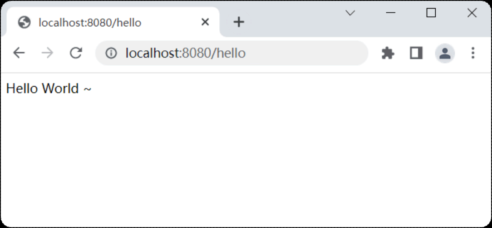


### ****Web 分析****


浏览器通过 IP 地址和端口号定位到服务器上的应用程序，并通过请求资源位置 `/hello` 获取数据。Web 资源是指通过网络可以访问到的资源，通常是指存放在服务器上的数据。


网络编程的三要素：

- IP：网络中计算机的唯一标识。
- 端口：计算机中运行程序的唯一标识。
- 协议：网络中计算机之间交互的规则，例如 HTTP 协议。

浏览器和服务器之间的数据交互使用 HTTP 协议。


## ****HTTP 协议****


### ****HTTP - 概述****


HTTP（Hyper Text Transfer Protocol，超文本传输协议）是浏览器与服务器之间数据传输的规则。HTTP 协议要求浏览器在向服务器发送请求数据时，或是服务器在向浏览器发送响应数据时，都必须按照固定的格式进行数据传输。


HTTP 协议的特点：

- 基于 TCP 协议：面向连接，安全。
- 基于请求-响应模型：一次请求对应一次响应。
- HTTP 协议是无状态协议：对于数据没有记忆能力，每次请求-响应都是独立的。

由于 HTTP 协议的无状态特性，请求之间无法共享数据，为了解决这个问题，Java 提出了使用会话技术（Cookie、Session）来解决。


### ****HTTP - 请求协议****


HTTP 请求协议包含：请求行、请求头、请求体。


HTTP 请求方式：


| 请求方式    | 说明                                                   |
| ------- | ---------------------------------------------------- |
| GET     | 获取资源。向特定的资源发出请求。                                     |
| POST    | 传输实体主体。向指定资源提交数据进行处理请求（例：上传文件），数据被包含在请求体中。           |
| OPTIONS | 返回服务器针对特定资源所支持的 HTTP 请求方式。                           |
| HEAD    | 获得报文首部。类似于 GET 方法，但是不要求返回数据。                         |
| PUT     | 传输文件。类似 FTP 协议，文件内容包含在请求报文的实体中，然后请求保存到 URL 指定的服务器位置。 |
| DELETE  | 删除文件。请求服务器删除 Request-URI 所标识的资源。                     |
| TRACE   | 追踪路径。回显服务器收到的请求，主要用于测试或诊断。                           |
| CONNECT | 要求用隧道协议连接代理。HTTP/1.1 协议中预留给能够将连接改为管道方式的代理服务器。        |


常用的 HTTP 请求方式是 GET 和 POST。


#### ****GET 请求协议****


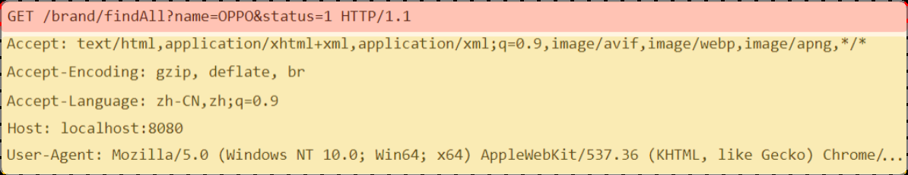


请求行：HTTP 请求中的第一行数据，由请求方式、资源路径、协议/版本组成。

- 请求方式：GET
- 资源路径：`/brand/findAll?name=OPPO&status=1`
- 请求路径：`/brand/findAll`
- 请求参数：`name=OPPO&status=1`
- 协议/版本：`HTTP/1.1`

请求头：从第二行开始，格式为 `key: value` 形式。常见的 HTTP 请求头有：

- Host：表示请求的主机名。
- User-Agent：浏览器版本。
- Accept：表示浏览器能接收的资源类型。
- Accept-Language：表示浏览器偏好的语言。
- Accept-Encoding：表示浏览器可以支持的压缩类型。
- Content-Type：请求主体的数据类型。
- Content-Length：数据主体的大小（单位：字节）。

请求体：存储请求参数。

- GET 请求的请求参数在请求行中，故不需要设置请求体。

#### ****POST 请求协议****


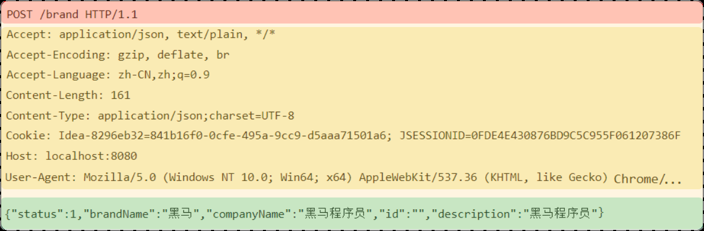


请求行：包含请求方式、资源路径、协议/版本。

- 请求方式：POST
- 资源路径：`/brand`
- 协议/版本：`HTTP/1.1`

请求头：格式为 `key: value` 形式。


请求体：存储请求参数。请求体和请求头之间有一个空行隔开。


#### ****GET 请求和 POST 请求的区别****


| 区别     | GET 请求               | POST 请求     |
| ------ | -------------------- | ----------- |
| 请求参数   | 请求参数在请求行中。           | 请求参数在请求体中。  |
| 请求参数长度 | 请求参数长度有限制。           | 请求参数长度没有限制。 |
| 安全性    | 安全性低，请求参数暴露在浏览器地址栏中。 | 安全性相对高。     |


### ****HTTP - 响应协议****


#### ****格式介绍****


HTTP 响应的数据也分为 3 部分：响应行、响应头、响应体。


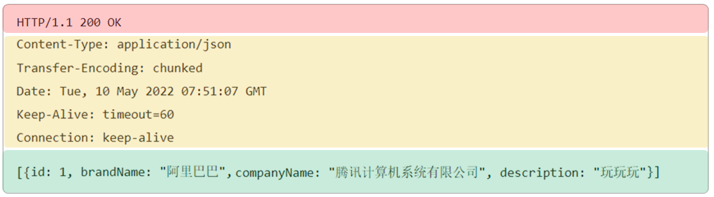


响应行：响应数据的第一行。由协议及版本、响应状态码、状态码描述组成。

- 协议/版本：HTTP/1.1
- 响应状态码：200
- 状态码描述：OK

响应头：响应数据的第二行开始。格式为 `key: value` 形式。常见的 HTTP 响应头有：

- Content-Type：表示该响应内容的类型。
- Content-Length：表示该响应内容的长度（字节数）。
- Content-Encoding：表示该响应压缩算法。
- Cache-Control：指示客户端应如何缓存。
- Set-Cookie：告诉浏览器为当前页面所在的域设置 cookie。

响应体：响应数据的最后一部分。存储响应的数据。响应体和响应头之间有一个空行隔开。


#### ****响应状态码****


| 状态码 | 分类     | 说明                                            |
| --- | ------ | --------------------------------------------- |
| 1xx | 响应中    | 临时状态码。表示请求已经接受，告诉客户端应该继续请求或者如果已经完成则忽略。        |
| 2xx | 成功     | 表示请求已经被成功接收，处理已完成。                            |
| 3xx | 重定向    | 重定向到其它地方，让客户端再发起一个请求以完成整个处理。                  |
| 4xx | 客户端错误  | 处理发生错误，责任在客户端，如：客户端的请求一个不存在的资源，客户端未被授权，禁止访问等。 |
| 5xx | 服务器端错误 | 处理发生错误，责任在服务端，如：服务端抛出异常，路由出错，HTTP 版本不支持等。     |


常见的响应状态码：

- 200 OK：客户端请求成功。
- 404 Not Found：请求资源不存在。
- 500 Internal Server Error：服务端发生不可预期的错误。

### ****HTTP - 协议解析****


通过自定义的服务器代码，了解服务器针对 HTTP 协议的解析机制。新建一个名为 `http_sever_demo` 的 SpringBoot 项目，创建 `com.itheima`  包，并创建如下 `Server.java` 类：


```java
package com.itheima;

import java.io.*;
import java.net.ServerSocket;
import java.net.Socket;
import java.nio.charset.StandardCharsets;

public class Server {
    public static void main(String[] args) throws IOException {
        ServerSocket ss = new ServerSocket(8080); // 监听指定端口
        System.out.println("server is running...");
        while (true) {
            Socket sock = ss.accept();
            System.out.println("connected from " + sock.getRemoteSocketAddress());
            Thread t = new Handler(sock);
            t.start();
        }
    }
}

class Handler extends Thread {
    Socket sock;

    public Handler(Socket sock) {
        this.sock = sock;
    }

    public void run() {
        try (InputStream input = this.sock.getInputStream();
             OutputStream output = this.sock.getOutputStream()) {
            handle(input, output);
        } catch (Exception e) {
            try {
                this.sock.close();
            } catch (IOException ioe) {
            }
            System.out.println("client disconnected.");
        }
    }

    private void handle(InputStream input, OutputStream output) throws IOException {
        BufferedReader reader = new BufferedReader(new InputStreamReader(input, StandardCharsets.UTF_8));
        BufferedWriter writer = new BufferedWriter(new OutputStreamWriter(output, StandardCharsets.UTF_8));
        // 读取HTTP请求:
        boolean requestOk = false;
        String first = reader.readLine();
        if (first.startsWith("GET / HTTP/1.")) {
            requestOk = true;
        }
        for (; ; ) {
            String header = reader.readLine();
            if (header.isEmpty()) { // 读取到空行时, HTTP Header读取完毕
                break;
            }
            System.out.println(header);
        }
        System.out.println(requestOk ? "Response OK" : "Response Error");
        if (!requestOk) {// 发送错误响应:
            writer.write("HTTP/1.0 404 Not Found\\r\\n");
            writer.write("Content-Length: 0\\r\\n");
            writer.write("\\r\\n");
            writer.flush();
        } else {// 发送成功响应:
            //读取html文件，转换为字符串
            InputStream is = Server.class.getClassLoader().getResourceAsStream("html/a.html");
            BufferedReader br = new BufferedReader(new InputStreamReader(is));
            StringBuilder data = new StringBuilder();
            String line = null;
            while ((line = br.readLine()) != null) {
                data.append(line);
            }
            br.close();
            int length = data.toString().getBytes(StandardCharsets.UTF_8).length;
            writer.write("HTTP/1.1 200 OK\\r\\n");
            writer.write("Connection: keep-alive\\r\\n");
            writer.write("Content-Type: text/html\\r\\n");
            writer.write("Content-Length: " + length + "\\r\\n");
            writer.write("\\r\\n"); // 空行标识Header和Body的分隔
            writer.write(data.toString());
            writer.flush();
        }
    }
}
```


**代码解释：**


这段代码实现了一个简单的 Web 服务器，使用了 `ServerSocket` 和 `Socket` 来监听端口并处理客户端请求。

- `ServerSocket ss = new ServerSocket(8080);`: 创建 ServerSocket 实例，监听 8080 端口，等待客户端连接。
- `Socket sock = ss.accept();`: 接受客户端连接，返回 Socket 实例，用于与客户端进行通信。
- `Handler` 类：继承自 Thread 类，用于处理客户端请求。
- `BufferedReader reader = new BufferedReader(new InputStreamReader(input, StandardCharsets.UTF_8));`: 创建 BufferedReader 实例，用于读取客户端发送的 HTTP 请求。
- `BufferedWriter writer = new BufferedWriter(new OutputStreamWriter(output, StandardCharsets.UTF_8));`: 创建 BufferedWriter 实例，用于向客户端发送 HTTP 响应。
- 代码首先读取 HTTP 请求的请求行，判断是否为 `GET / HTTP/1.x`。然后循环读取请求头，直到读取到空行为止。
- 如果请求有效，则读取 `html/a.html` 文件内容，并构建 HTTP 响应，将文件内容作为响应体发送给客户端。

运行该代码，浏览器输入：[http://localhost:8080](http://localhost:8080/) 就会访问到 ServerSocket 程序：

- ServerSocket 程序会读取服务器上html/a.html文件，并把文件数据发送给浏览器。
- 浏览器接收到 `a.html` 文件中的数据后进行解析，显示以下内容：

	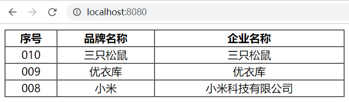


因此，服务器是可以采用 Java 完成编写，并接受页面发送的请求和响应数据给前端浏览器。在实际开发中，往往使用流行的 Web 服务器而不是重新开发，如：**Tomcat 。**


## ****Web 服务器 - Tomcat****


### ****简介****


#### ****服务器概述****


服务器硬件：提供计算服务的设备，需要具备承担服务并且保障服务的能力。


服务器软件：基于 `ServerSocket` 编写的程序，本质是一个运行在服务器设备上的应用程序。


#### ****Web 服务器****


Web 服务器是一个应用程序（软件），对 HTTP 协议的操作进行封装，使得程序员不必直接对协议进行操作，让 Web 开发更加便捷。主要功能是 "提供网上信息浏览服务"。


Web 服务器软件使用步骤：

1. 准备静态资源。
2. 下载安装 Web 服务器软件。
3. 将静态资源部署到 Web 服务器上。
4. 启动 Web 服务器使用浏览器访问对应的资源。

#### ****Tomcat****


Tomcat 服务器软件是一个免费的开源的 web 应用服务器，是 Apache 软件基金会的一个核心项目。Tomcat 支持 Servlet/JSP 少量 JavaEE 规范，所以是一个开源免费的轻量级 Web 服务器。（JavaEE 规范：Java Enterprise Edition (Java 企业版)，指 Java 企业级开发的技术规范总和，包含 13 项技术规范。）


因为 Tomcat 支持 Servlet/JSP 规范，所以 Tomcat 也被称为 Web 容器、Servlet 容器。JavaWeb 程序需要依赖 Tomcat 才能运行。


### ****基本使用****


#### ****下载****


从官方网站下载：[https://tomcat.apache.org/download-90.cgi](https://tomcat.apache.org/download-90.cgi)。选择 zip 文件（Windows 操作系统）。


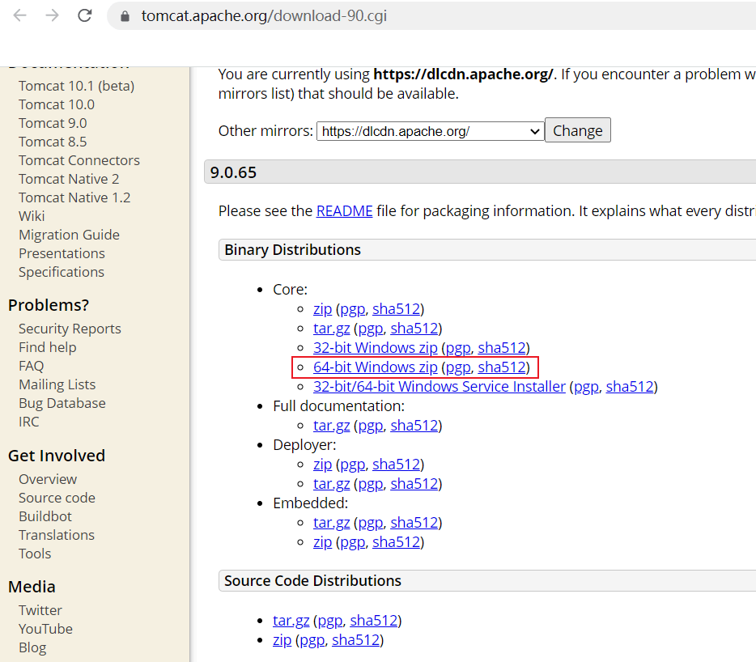


#### ****安装与卸载****


**安装**：Tomcat 是绿色版，直接解压即安装。解压到不包含中文和空格的目录。


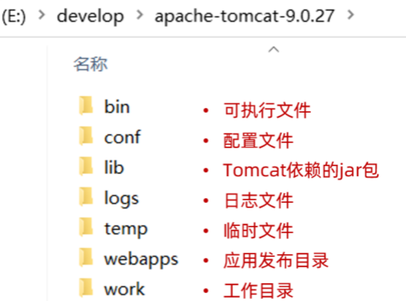


bin 目录包含可执行文件，webapps 目录是项目部署目录。


**卸载**：直接删除目录即可。


#### ****启动与关闭****


**启动 Tomcat**：双击 `tomcat解压目录/bin/startup.bat` 文件即可启动 Tomcat。Tomcat 的默认端口为 8080，所以在浏览器的地址栏输入：`http://127.0.0.1:8080` 即可访问 Tomcat 服务器。


描述性说明：展示 Tomcat 启动成功的截图。


**关闭 Tomcat**：

1. 强制关闭：直接 X 掉 Tomcat 窗口（不建议）。
2. 正常关闭：`bin\\shutdown.bat`。
3. 正常关闭：在 Tomcat 启动窗口中按下 Ctrl+C。

#### ****常见问题****


问题 1：Tomcat 启动时，窗口一闪而过。检查 `JAVA_HOME` 环境变量是否正确配置。


问题 2：端口号冲突。换 Tomcat 端口号。修改 `conf/server.xml` 文件。


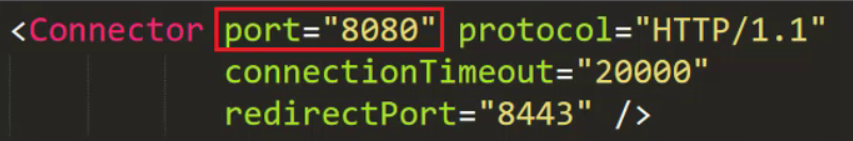


### ****入门程序解析****


#### ****Spring 官方骨架****


Spring 官方骨架，可以理解为 Spring 官方为程序员提供一个搭建项目的模板。可以通过访问：[https://start.spring.io/](https://start.spring.io/)，进入到官方骨架页面。


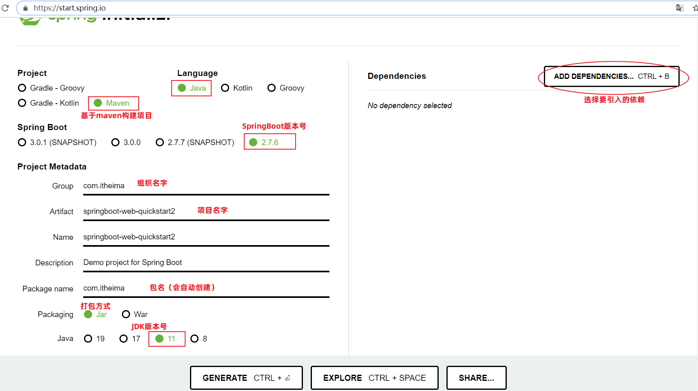


#### ****起步依赖****


打开 `pom.xml` 文件，我们可以看到 SpringBoot 项目中引入了 web 依赖和 test 依赖：


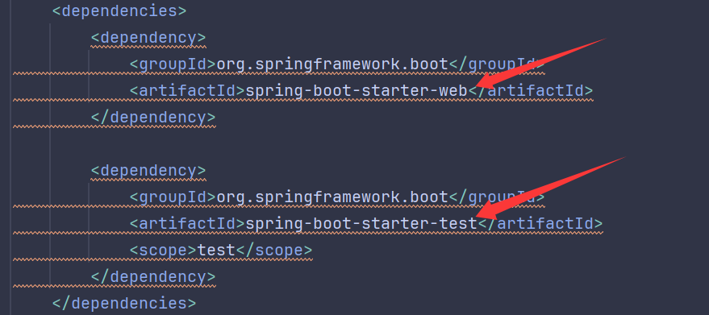


`spring-boot-starter-web` 和 `spring-boot-starter-test` 在 Spring Boot 中又称为：起步依赖。起步依赖以 `spring-boot-starter-` 作为开头。


起步依赖包含了 Web 应用开发所需要的常见依赖和单元测试所需要的常见依赖。


#### ****Spring Boot 父工程****


每一个 Spring Boot 工程都有一个父工程，依赖的版本号在父工程中统一管理。


#### ****内嵌 Tomcat****


SpringBoot 中引入了 web 运行环境（`spring-boot-starter-web` 起步依赖），其内部已经集成了内置的 Tomcat 服务器。


描述性说明：展示 IDEA 开发工具右侧的 maven 面板中 Tomcat 依赖的截图。
描述性说明：展示 Spring Boot 引导类启动时命令行输出的日志，其中占用 8080 端口的是 Tomcat。

