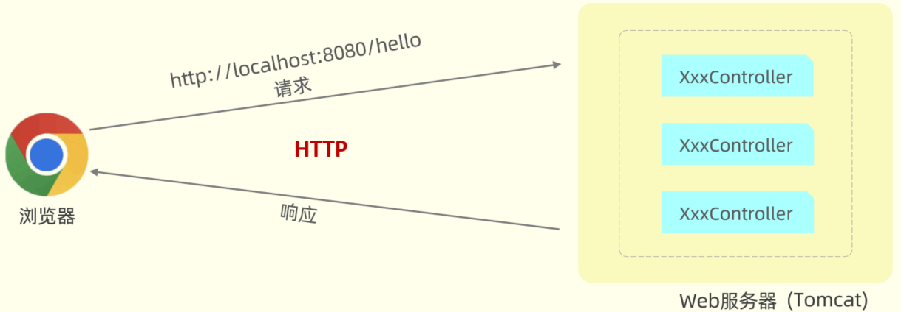
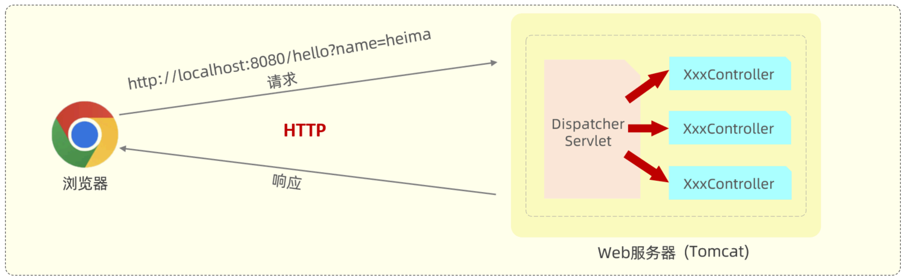
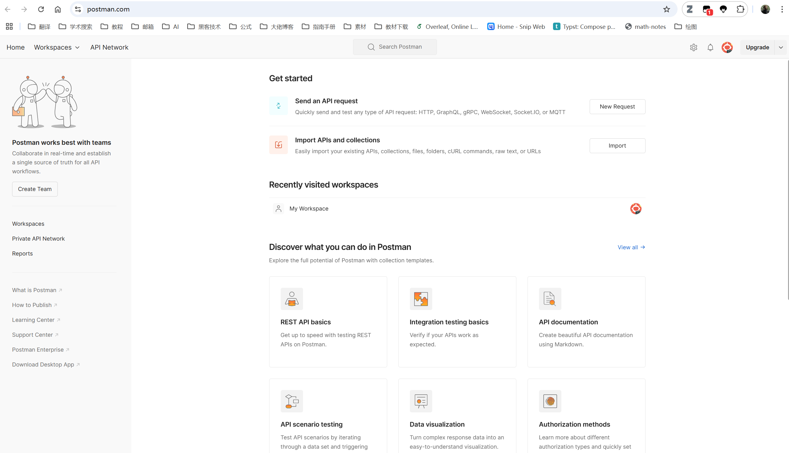

在 SpringBoot Web 应用中，浏览器发起请求，由后端 Web 服务器（内置 Tomcat）接收。我们定义的 Controller 接收请求并生成响应，整个过程遵循 HTTP 协议。





Tomcat 是一个 Servlet 容器，支持 Servlet 规范。SpringBoot 内置了一个核心 Servlet 程序 `DispatcherServlet`，作为核心控制器，负责接收请求，转发给 Controller 处理，并将处理结果响应给浏览器。





Tomcat 会解析请求数据，并将其封装到 `HttpServletRequest` 对象中，Controller 可以通过该对象获取请求数据。同时，Tomcat 还会传递一个 `HttpServletResponse` 对象给 Servlet 程序，用于设置响应数据。


这种浏览器/服务器架构模式称为 BS 架构（Browser/Server）。


本章节主要讲解如何接收页面传递过来的请求数据。


## ****Postman****


前后端分离模式下，后端工程师需要接口测试工具来测试自己开发的程序。Postman 是一款强大的 HTTP 请求调试工具，可以模拟各种类型的 HTTP 请求，并携带请求参数、请求头等信息。


### ******介绍******


Postman 是一款 Chrome 插件，能够模拟浏览器向后端服务器发起任何形式的 HTTP 请求，常用于接口测试。


### ****使用****


Postman 提供网页版或者 App 端使用。打开 [Postman 官网](https://www.postman.com/) ，创建 Postman 账号，登录后即可保存测试的请求信息。


如下图所示，展示了 Postman 的界面，可以在其中创建工作空间和请求：





如果需要测试本地 API ，则需要下载 APP 使用。


## ****简单参数****


简单参数指的是普通的请求数据。后端程序可以通过以下两种方式接收：

1. 原始方式
2. SpringBoot 方式

### ******原始方式******


原始 Web 程序中，通过 `HttpServletRequest` 对象获取请求信息。


```java
@RestController
public class RequestController {
    // 原始方式
    @RequestMapping("/simpleParam")
    public String simpleParam(HttpServletRequest request) {
        // <http://localhost:8080/simpleParam?name=Tom&age=10>
        // 请求参数： name=Tom&age=10   （有2个请求参数）
        // 第1个请求参数： name=Tom   参数名:name，参数值:Tom
        // 第2个请求参数： age=10     参数名:age , 参数值:10

        String name = request.getParameter("name");//name就是请求参数名
        String ageStr = request.getParameter("age");//age就是请求参数名
        int age = Integer.parseInt(ageStr);//需要手动进行类型转换
        System.out.println(name + "  :  " + age);
        return "OK";
    }
}
```


上述代码展示了如何使用 `HttpServletRequest` 对象获取请求参数。


### ******SpringBoot 方式******


SpringBoot 对原始 API 进行了封装，简化了参数接收方式。如果参数名与形参变量名相同，定义同名的形参即可接收参数。


```java
@RestController
public class RequestController {
    // <http://localhost:8080/simpleParam?name=Tom&age=10>
    // 第1个请求参数： name=Tom   参数名:name，参数值:Tom
    // 第2个请求参数： age=10     参数名:age , 参数值:10

    // springboot方式
    @RequestMapping("/simpleParam")
    public String simpleParam(String name, Integer age) {//形参名和请求参数名保持一致
        System.out.println(name + "  :  " + age);
        return "OK";
    }
}
```


**代码解释：**

- `@RestController`：将该类标记为 Controller，并表明返回的数据格式为 JSON。
- `@RequestMapping("/simpleParam")`：将 HTTP 请求 `/simpleParam` 映射到 `simpleParam` 方法。
- `String name, Integer age`：方法的形参直接对应请求参数名，SpringBoot 会自动将请求参数的值赋给对应的形参。

**结论：** 无论是 GET 请求还是 POST 请求，只要保证请求参数名和 Controller 方法中的形参名保持一致，就可以获取到请求参数中的数据值。


### ******参数名不一致******


如果方法形参名称与请求参数名称不一致，可以使用 Spring 提供的 `@RequestParam` 注解完成映射。


```java
@RestController
public class RequestController {
    // <http://localhost:8080/simpleParam?name=Tom&age=20>
    // 请求参数名：name
    // springboot方式
    @RequestMapping("/simpleParam")
    public String simpleParam(@RequestParam("name") String username, Integer age) {
        System.out.println(username + "  :  " + age);
        return "OK";
    }
}
```


**代码解释：**

- `@RequestParam("name") String username`：将请求参数 `name` 映射到形参 `username`。

**注意事项：**

- `@RequestParam` 中的 `required` 属性默认为 `true`，表示该请求参数必须传递，如果不传递将报错。
- 如果该参数是可选的，可以将 `required` 属性设置为 `false`。

## ****实体参数****


当请求参数较多时，可以将请求参数封装到一个实体类对象中，简化参数接收过程。


### ******简单实体对象******


定义 POJO 实体类：


```java
package com.itheima.pojo;

public class User {
    private String name;
    private Integer age;

    @Override
    public String toString() {
        return "User{" +
                "name='" + name + '\'' +
                ", age=" + age +
                '}';
    }

    public String getName() {
        return name;
    }

    public Integer getAge() {
        return age;
    }

    public void setName(String name) {
        this.name = name;
    }

    public void setAge(Integer age) {
        this.age = age;
    }
}
```


Controller 方法：


```java
@RestController
public class RequestController {
    // 实体参数：简单实体对象
    @RequestMapping("/simplePojo")
    public String simplePojo(User user) {
        System.out.println(user);
        return "OK";
    }
}
```


**规则：** 请求参数名与实体类的属性名相同。


### ******复杂实体对象******


复杂实体对象指的是，在实体类中有一个或多个属性，也是实体对象类型的。


定义 POJO 实体类：


```java
public class Address {
    private String province;
    private String city;

    // 省略 getter 和 setter 方法
    @Override
    public String toString() {
        return "Address{" +
                "province='" + province + '\\'' +
                ", city='" + city + '\\'' +
                '}';
    }
}

public class User {
    private String name;
    private Integer age;
    private Address address; // 地址对象

    // 省略 getter 和 setter 方法
    @Override
    public String toString() {
        return "User{" +
                "name='" + name + '\\'' +
                ", age=" + age +
                ", address=" + address +
                '}';
    }
}
```


Controller 方法：


```java
@RestController
public class RequestController {
    // 实体参数：复杂实体对象
    @RequestMapping("/complexPojo")
    public String complexPojo(User user) {
        System.out.println(user);
        return "OK";
    }
}
```


**规则：** 请求参数名与形参对象属性名相同，按照对象层次结构关系即可接收嵌套实体类属性参数。例如，`user.name` 对应 `User` 类的 `name` 属性，`user.address.city` 对应 `User` 类的 `address` 属性的 `city` 属性。


## ****数组集合参数****


数组集合参数的使用场景：HTML 表单中，有一个表单项支持多选（复选框），可以提交选择的多个值。


后端程序接收上述多个值的方式有两种：

1. 数组
2. 集合

### ******数组******


```java
@RestController
public class RequestController {
    // 数组集合参数
    @RequestMapping("/arrayParam")
    public String arrayParam(String[] hobby) {
        System.out.println(Arrays.toString(hobby));
        return "OK";
    }
}
```


**规则：** 请求参数名与形参数组名称相同且请求参数为多个，定义数组类型形参即可接收参数。


### ******集合******


```java
@RestController
public class RequestController {
    // 数组集合参数
    @RequestMapping("/listParam")
    public String listParam(@RequestParam List<String> hobby) {
        System.out.println(hobby);
        return "OK";
    }
}
```


**代码解释：**

- `@RequestParam List<String> hobby`：将请求参数 `hobby` 绑定到 `List<String>` 集合。

**规则：** 请求参数名与形参集合对象名相同且请求参数为多个，使用 `@RequestParam` 绑定参数关系。


## ****日期参数****


对于日期类型的参数，需要通过 `@DateTimeFormat` 注解及其 `pattern` 属性来设置日期的格式。


```java
@RestController
public class RequestController {
    // 日期时间参数
    @RequestMapping("/dateParam")
    public String dateParam(@DateTimeFormat(pattern = "yyyy-MM-dd HH:mm:ss") LocalDateTime updateTime) {
        System.out.println(updateTime);
        return "OK";
    }
}
```


**代码解释：**

- `@DateTimeFormat(pattern = "yyyy-MM-dd HH:mm:ss") LocalDateTime updateTime`：指定日期格式为 `yyyy-MM-dd HH:mm:ss`，并将请求参数转换为 `LocalDateTime` 类型。

**规则：** `@DateTimeFormat` 注解的 `pattern` 属性中指定了哪种日期格式，前端的日期参数就必须按照指定的格式传递。后端 controller 方法中，需要使用 `Date` 类型或 `LocalDateTime` 类型，来封装传递的参数。


## ****JSON 参数****


前后端交互时，通常使用 JSON 格式的数据进行传输。


**服务端 Controller 方法接收 JSON 格式数据：**


使用实体类进行封装。


```java
public class Address {
    private String province;
    private String city;

    // 省略 GET , SET 方法
}

public class User {
    private String name;
    private Integer age;
    private Address address;

    // 省略 GET , SET 方法
}

@RestController
public class RequestController {
    // JSON参数
    @RequestMapping("/jsonParam")
    public String jsonParam(@RequestBody User user) {
        System.out.println(user);
        return "OK";
    }
}
```


**代码解释：**

- `@RequestBody User user`：将 JSON 数据映射到形参的实体类对象中，JSON 中的 key 和实体类中的属性名保持一致。

**规则：** JSON 数据键名与形参对象属性名相同，定义 POJO 类型形参即可接收参数，需要使用 `@RequestBody` 标识。


## ****路径参数****


直接在请求的 URL 中传递参数的形式称为路径参数。


```java
@RestController
public class RequestController {
    // 路径参数
    @RequestMapping("/path/{id}")
    public String pathParam(@PathVariable Integer id) {
        System.out.println(id);
        return "OK";
    }

    // 路径参数
    @RequestMapping("/path/{id}/{name}")
    public String pathParam2(@PathVariable Integer id, @PathVariable String name) {
        System.out.println(id + " : " + name);
        return "OK";
    }
}
```


**代码解释：**

- `@RequestMapping("/path/{id}")`：使用 `{...}` 来标识路径参数，`{id}` 表示一个名为 `id` 的路径参数。
- `@PathVariable Integer id`：使用 `@PathVariable` 注解获取路径参数，并将其赋值给 `id` 变量。

**规则：** 前端通过请求 URL 直接传递参数，后端使用 `{...}` 来标识该路径参数，需要使用 `@PathVariable` 获取路径参数。

