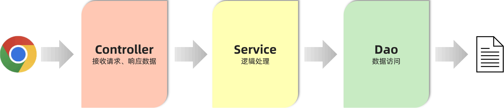
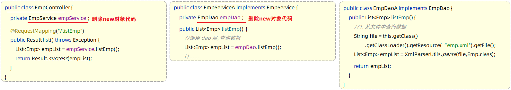
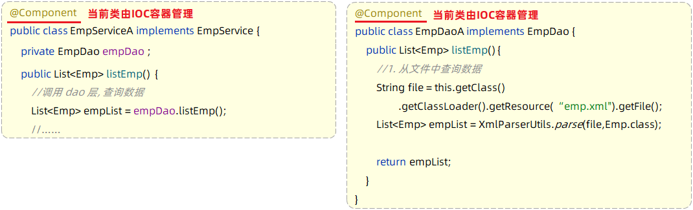
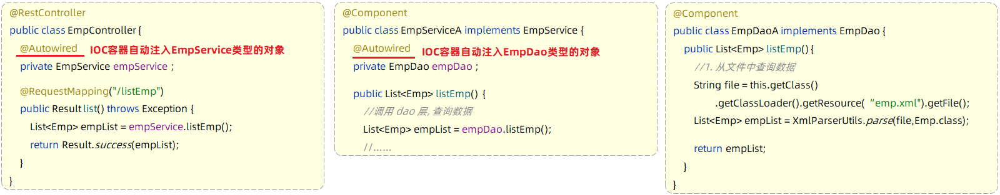

## ****三层架构****


### ******介绍******


三层架构将程序分为三个部分：

- **Controller（控制层）：** 接收前端发送的请求，对请求进行处理，并响应数据。
- **Service（业务逻辑层）：** 处理具体的业务逻辑。
- **Dao（数据访问层）：** 负责数据访问操作，包括数据的增、删、改、查。

**程序执行流程：**

1. 前端发起的请求，由 Controller 层接收（Controller 响应数据给前端）。
2. Controller 层调用 Service 层来进行逻辑处理（Service 层处理完后，把处理结果返回给 Controller 层）。
3. Service 层调用 Dao 层（逻辑处理过程中需要用到的一些数据要从 Dao 层获取）。
4. Dao 层操作文件中的数据（Dao 拿到的数据会返回给 Service 层）。




**优点：** 程序的扩展性、维护性变得更好。


### ******代码拆分******


控制层包名：`xxxx.controller`


业务逻辑层包名：`xxxx.service`


数据访问层包名：`xxxx.dao`

- **数据访问接口**

```java
// 数据访问层接口（制定标准）
public interface EmpDao {
    // 获取员工列表数据
    public List<Emp> listEmp();
}
```

- **数据访问实现类**

```java
// 数据访问实现类
public class EmpDaoA implements EmpDao {
    @Override
    public List<Emp> listEmp() {
        // 1. 加载并解析emp.xml
        String file = this.getClass().getClassLoader().getResource("emp.xml").getFile();
        System.out.println(file);
        List<Emp> empList = XmlParserUtils.parse(file, Emp.class);
        return empList;
    }
}
```

- **业务接口**

```java
// 业务逻辑接口（制定业务标准）
public interface EmpService {
    // 获取员工列表
    public List<Emp> listEmp();
}
```

- **业务实现类**

```java
// 业务逻辑实现类（按照业务标准实现）
public class EmpServiceA implements EmpService {
    // dao层对象
    private EmpDao empDao = new EmpDaoA();

    @Override
    public List<Emp> listEmp() {
        // 1. 调用dao, 获取数据
        List<Emp> empList = empDao.listEmp();
        // 2. 对数据进行转换处理 - gender, job
        empList.stream().forEach(emp -> {
            // 处理 gender 1: 男, 2: 女
            String gender = emp.getGender();
            if ("1".equals(gender)) {
                emp.setGender("男");
            } else if ("2".equals(gender)) {
                emp.setGender("女");
            }
            // 处理job - 1: 讲师, 2: 班主任 , 3: 就业指导
            String job = emp.getJob();
            if ("1".equals(job)) {
                emp.setJob("讲师");
            } else if ("2".equals(job)) {
                emp.setJob("班主任");
            } else if ("3".equals(job)) {
                emp.setJob("就业指导");
            }
        });
        return empList;
    }
}
```

- **Controller**

```java
@RestController
public class EmpController {
    // 业务层对象
    private EmpService empService = new EmpServiceA();

    @RequestMapping("/listEmp")
    public Result list() {
        // 1. 调用service层, 获取数据
        List<Emp> empList = empService.listEmp();
        // 3. 响应数据
        return Result.success(empList);
    }
}
```


**优点：**

1. 复用性强
2. 便于维护
3. 利用扩展

## ****分层解耦****


### ******耦合问题******


**内聚：** 软件中各个功能模块内部的功能联系。


**耦合：** 衡量软件中各个层/模块之间的依赖、关联的程度。


**软件设计原则：** 高内聚低耦合。

- **高内聚：** 一个模块中各个元素之间的联系的紧密程度越高。
- **低耦合：** 软件中各个层、模块之间的依赖关联程序越低越好。

**目的：** 使程序模块的可重用性、移植性大大增强。


### ******解耦思路******


使用 Spring 中的两个核心概念：

- **控制反转（IOC）：** 对象的创建控制权由程序自身转移到外部（容器）。
- **依赖注入（DI）：** 容器为应用程序提供运行时所依赖的资源。

## ****IOC&DI****


### ******IOC&DI 入门******


**任务：** 完成 Controller 层、Service 层、Dao 层的代码解耦。


**思路：**

1. 删除 Controller 层、Service 层中 `new` 对象的代码。
2. Service 层及 Dao 层的实现类，交给 IOC 容器管理。
3. 为 Controller 及 Service 注入运行时依赖的对象。

**代码实现：**


**第 1 步：删除 Controller 层、Service 层中** `new` **对象的代码。**





**第 2 步：Service 层及 Dao 层的实现类，交给 IOC 容器管理。**使用 Spring 提供的注解：`@Component` ，就可以实现类交给 IOC 容器管理。





**第 3 步：为 Controller 及 Service 注入运行时依赖的对象。**使用 Spring 提供的注解：`@Autowired` ，就可以实现程序运行时IOC容器自动注入需要的依赖对象。




- **Controller 层：**

```java
@RestController
public class EmpController {
    @Autowired // 运行时,从IOC容器中获取该类型对象,赋值给该变量
    private EmpService empService;

    @RequestMapping("/listEmp")
    public Result list() {
        // 1. 调用service, 获取数据
        List<Emp> empList = empService.listEmp();
        // 3. 响应数据
        return Result.success(empList);
    }
}
```

- **Service 层：**

```java
@Component // 将当前对象交给IOC容器管理,成为IOC容器的bean
public class EmpServiceA implements EmpService {
    @Autowired // 运行时,从IOC容器中获取该类型对象,赋值给该变量
    private EmpDao empDao;

    @Override
    public List<Emp> listEmp() {
        // 1. 调用dao, 获取数据
        List<Emp> empList = empDao.listEmp();
        // 2. 对数据进行转换处理 - gender, job
        empList.stream().forEach(emp -> {
            // 处理 gender 1: 男, 2: 女
            String gender = emp.getGender();
            if ("1".equals(gender)) {
                emp.setGender("男");
            } else if ("2".equals(gender)) {
                emp.setGender("女");
            }
            // 处理job - 1: 讲师, 2: 班主任 , 3: 就业指导
            String job = emp.getJob();
            if ("1".equals(job)) {
                emp.setJob("讲师");
            } else if ("2".equals(job)) {
                emp.setJob("班主任");
            } else if ("3".equals(job)) {
                emp.setJob("就业指导");
            }
        });
        return empList;
    }
}
```

- **Dao 层：**

```java
@Component // 将当前对象交给IOC容器管理,成为IOC容器的bean
public class EmpDaoA implements EmpDao {
    @Override
    public List<Emp> listEmp() {
        // 1. 加载并解析emp.xml
        String file = this.getClass().getClassLoader().getResource("emp.xml").getFile();
        System.out.println(file);
        List<Emp> empList = XmlParserUtils.parse(file, Emp.class);
        return empList;
    }
}
```


**代码解释：**

- `@Component`：将该类交给 IOC 容器管理，成为 IOC 容器的 bean。
- `@Autowired`：运行时，从 IOC 容器中获取该类型对象，赋值给该变量。

### ******IOC 详解******


#### ******bean 的声明******


前面我们提到 IOC 控制反转，就是将对象的控制权交给 Spring 的 IOC 容器，由 IOC 容器创建及管理对象。IOC 容器创建的对象称为 bean 对象。


在之前的入门案例中，要把某个对象交给 IOC 容器管理，需要在类上添加一个注解：`@Component` 。
而 Spring 框架为了更好的标识 Web 应用程序开发当中，bean 对象到底归属于哪一层，又提供了
 `@Component` 的衍生注解：

- `@Controller`：标注在控制层类上。
- `@Service`：标注在业务层类上。
- `@Repository`：标注在数据访问层类上。
- `@Component`：声明 bean 的基础注解，不属于以上三类时，用此注解。

#### ******组件扫描******


使用四大注解声明的 bean，要想生效，还需要被组件扫描注解 `@ComponentScan` 扫描。`@ComponentScan` 默认扫描的范围是 SpringBoot 启动类所在包及其子包。


### ******DI 详解******


`@Autowired` 注解默认是按照类型进行自动装配的。


如果在 IOC 容器中，存在多个相同类型的 bean 对象，程序运行会报错。


**解决方案：**

- `@Primary`：当存在多个相同类型的 Bean 注入时，加上 `@Primary` 注解，来确定默认的实现。
- `@Qualifier`：指定当前要注入的 bean 对象。在 `@Qualifier` 的 `value` 属性中，指定注入的 bean 的名称。`@Qualifier` 注解不能单独使用，必须配合 `@Autowired` 使用。
- `@Resource`：按照 bean 的名称进行注入。通过 `name` 属性指定要注入的 bean 的名称。

**面试题：@Autowired 与 @Resource 的区别**

- `@Autowired` 是 Spring 框架提供的注解，而 `@Resource` 是 JDK 提供的注解。
- `@Autowired` 默认是按照类型注入，而 `@Resource` 是按照名称注入。
