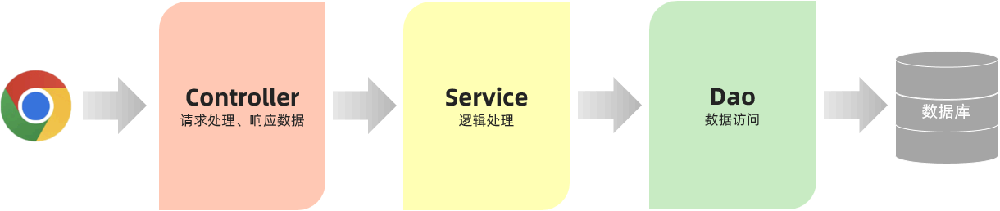
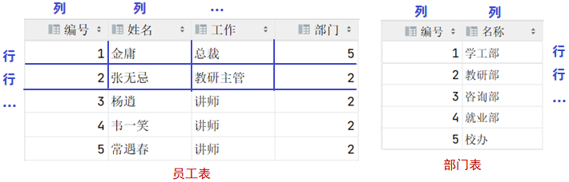
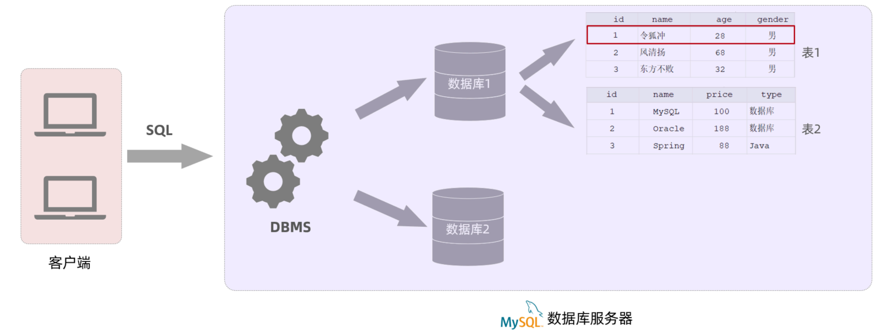
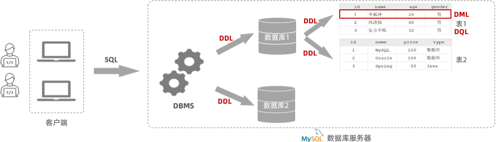

在 Web 开发中，为了应用程序职责单一和方便维护，通常将 Web 应用程序分为三层：Controller、Service、Dao。数据通常存储在数据库中，而不是 XML 文件中，以便于管理和维护。Web 开发的调用流程通常是：浏览器 -> Controller -> Service -> Dao -> 数据库。

**数据库**（DataBase，DB）：存储和管理数据的仓库。例如，电商网站京东、企业管理系统 OA、ERP、CRM，以及头条、抖音等 App 的数据都存储在数据库中。

**数据库管理系统**（DataBase Management System，DBMS）：操作和管理数据库的大型软件。

**SQL**（Structured Query Language）：结构化查询语言，用于操作关系型数据库。是操作关系型数据库的统一标准。

程序员通过给数据库管理系统 (DBMS) 发送 SQL 语句，来操作数据库中的数据。

目前主流数据库：

- **Oracle**：大型收费数据库，价格昂贵。
- **MySQL**：开源免费的中小型数据库，被 Oracle 收购，有社区版（免费）和商业版（收费）。
- **SQL Server**：Microsoft 公司的收费中型数据库，常用于 C#、.NET 等语言。
- **PostgreSQL**：开源免费的中小型数据库。
- **DB2**：IBM 公司的大型收费数据库产品。
- **SQLLite**：嵌入式微型数据库，Android 内置数据库。
- **MariaDB**：开源免费的中小型数据库，MySQL 的分支，与 MySQL 兼容。

学习 MySQL 即可，因为关系型数据库的操作都基于 SQL 语句，学会 SQL 语句就可以操作 MySQL、Oracle 或 SQL Server。

## ******数据模型******

在介绍 MySQL 的数据模型之前，需要先了解一个概念：关系型数据库。

### ******关系型数据库** ****

**关系型数据库（RDBMS）**：建立在关系模型基础上，由多张相互连接的二维表组成的数据库。二维表由行和列组成，如下图。

**二维表的优点**：

- 使用表存储数据，格式统一，便于维护。
- 使用 SQL 语言操作，标准统一，使用方便，可用于复杂查询。

MySQL、Oracle、DB2、SQL Server 都是关系型数据库，基于二维表存储数据。

### ******MySQL 数据模型******

下图展示了 MySQL 的数据模型：

使用 MySQL 客户端向数据库管理系统发送一条 SQL 语句，由数据库管理系统根据 SQL 语句指令去操作数据库中的表结构及数据。

在 MySQL 数据库服务器中存储数据，需要：

1. 创建数据库（可以创建多个数据库，之间是相互独立的）。
2. 在数据库下创建数据表（一个数据库下可以创建多张表）。
3. 将数据存放在数据表中（一张表可以存储多行数据）。

## ******SQL 简介******

**SQL**：结构化查询语言，操作关系型数据库的编程语言，定义了操作所有关系型数据库的统一标准。

### ******SQL 通用语法******

1. SQL 语句可以单行或多行书写，以分号结尾。
2. SQL 语句可以使用空格或缩进来增强语句的可读性。
3. MySQL 数据库的 SQL 语句不区分大小写。
4. 注释：
	- 单行注释：`- 注释内容` 或 `## 注释内容` (MySQL 特有)
	- 多行注释：`/* 注释内容 */`

### ******分类******

SQL 语句根据其功能被分为四大类：DDL、DML、DQL、DCL。

| 分类  | 全称                         | 说明                          |
| --- | -------------------------- | --------------------------- |
| DDL | Data Definition Language   | 数据定义语言，用来定义数据库对象 (数据库，表，字段) |
| DML | Data Manipulation Language | 数据操作语言，用来对数据库表中的数据进行增删改     |
| DQL | Data Query Language        | 数据查询语言，用来查询数据库中表的记录         |
| DCL | Data Control Language      | 数据控制语言，用来创建数据库用户、控制数据库的访问权限 |

