## ******项目开发流程******

1. 需求文档：产品经理提供页面原型及需求文档。
2. 设计：包括概要设计、详细设计、接口设计、**数据库设计**。
	- **数据库设计**：根据产品原型和需求文档，分析各个模块涉及到的表结构以及表结构之间的关系，以及表结构的详细信息。最终需要将数据库以及数据库当中的表结构设计创建出来。
3. 开发/测试：参照页面原型和需求进行编码，实现业务功能。需要操作设计出来的数据库表结构，完成业务的增删改查等操作。
4. 部署上线：项目上线运行，后期优化包括数据库的优化，如索引、SQL 优化、分库分表等。

针对于数据库来说，主要包括三个阶段：

1. 数据库设计阶段：参照页面原型以及需求文档设计数据库表结构。
2. 数据库操作阶段：根据业务功能的实现，编写 SQL 语句对数据表中的数据进行增删改查操作。
3. 数据库优化阶段：通过数据库的优化来提高数据库的访问性能。优化手段：索引、SQL 优化、分库分表等。

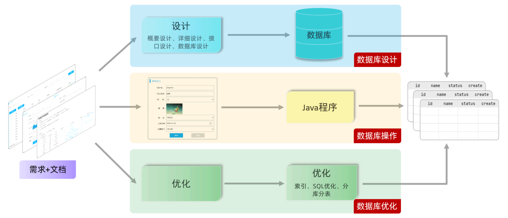


## ******数据库操作******


**DDL (Data Definition Language)**：数据定义语言，用来定义数据库对象（数据库、表）。


### ******查询数据库******

- 查询所有数据库：

	```sql
	show databases;
	```


	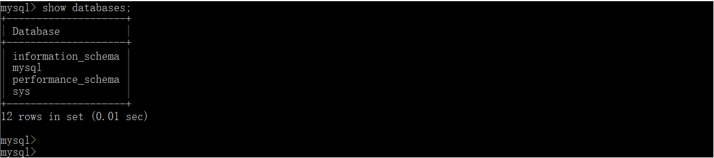

- 查询当前数据库：

	```sql
	select database();
	```


	当前没有使用任何数据库：


	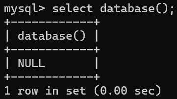


	当前使用的数据库是 db01 ：


	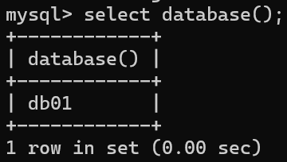


要操作某一个数据库，必须要切换到对应的数据库中。


### ******创建数据库******

- 语法：

	```sql
	create database [if not exists] 数据库名;
	```

- 案例：创建一个 `itcast` 数据库。

	```sql
	create database itcast;
	-- 数据库不存在,则创建该数据库；如果存在则不创建
	create database if not exists itcast;
	```


	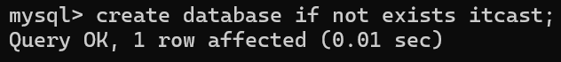


**注意**：在同一个数据库服务器中，不能创建两个名称相同的数据库，否则将会报错。


### ******使用数据库******

- 语法：

	```sql
	use 数据库名;
	```

- 案例：切换到 `itcast` 数据库。

	```sql
	use itcast;
	```


	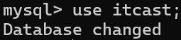


要操作某一个数据库下的表时，就需要通过该指令，切换到对应的数据库下，否则不能操作。


### ******删除数据库******

- 语法：

	```sql
	drop database [if exists] 数据库名;
	```

- 案例：删除 `itcast` 数据库。

	```sql
	drop database if exists itcast; -- itcast数据库存在时删除
	```


	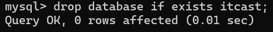


如果删除一个不存在的数据库，将会报错。可以加上参数 `if exists` ，如果数据库存在，再执行删除，否则不执行删除。


**说明**：上述语法中的 `database`，也可以替换成 `schema`。


## ******图形化工具******


为了提高开发效率，通常使用图形化管理工具来操作数据库。


目前 MySQL 主流的图形化界面工具有：


- DataGrip：JetBrains 旗下的一款数据库管理工具，管理和开发 MySQL、Oracle、PostgreSQL 的理想解决方案。

DataGrip 的功能已经集成到了 IDEA 当中，所以可以使用 IDEA 来作为一款图形化界面工具来操作 MySQL 数据库。


### ******使用******


#### ******连接数据库******

1. 打开 IDEA 自带的 Database（社区版不支持该工具）。

	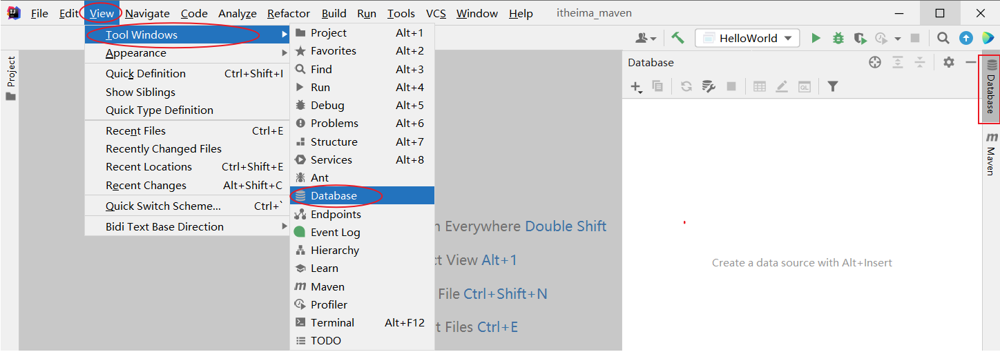

2. 配置 MySQL。

	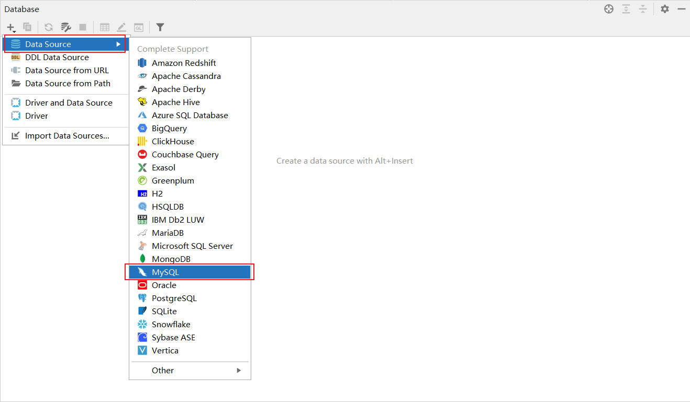

3. 输入相关信息。

	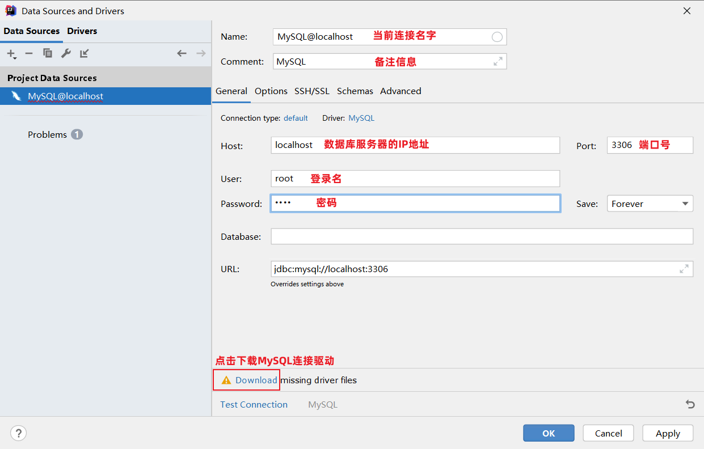

4. 下载 MySQL 连接驱动。

	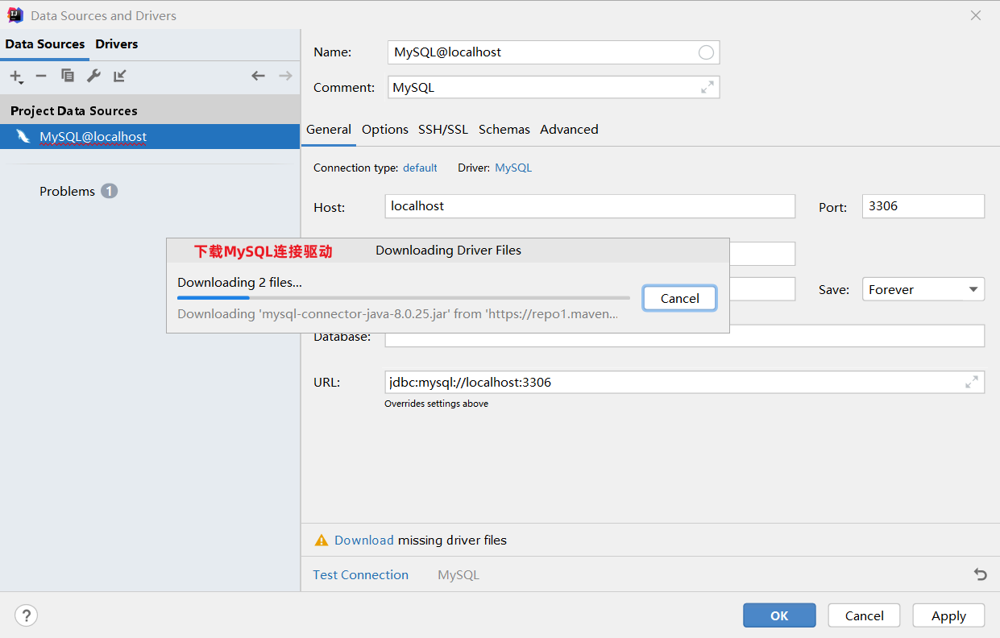

5. 测试数据库连接。

	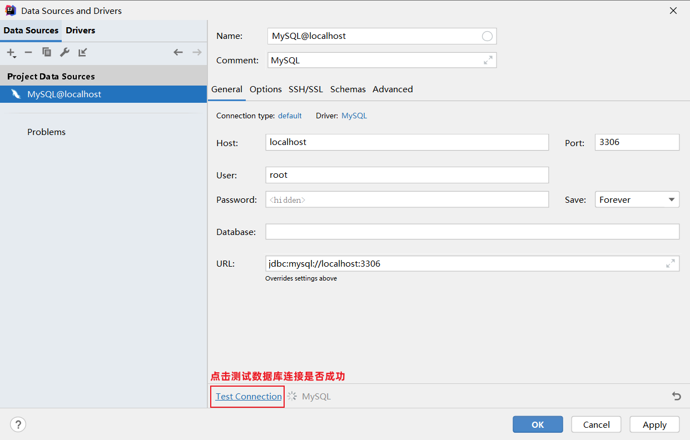

6. 保存配置。

	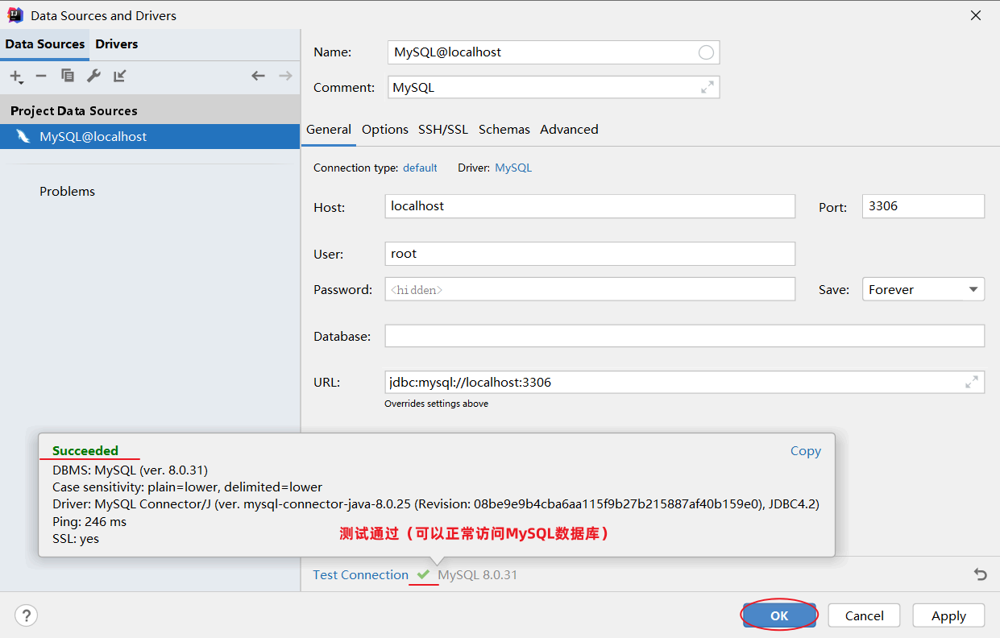


默认情况下，连接上了 MySQL 数据库之后，数据库并没有全部展示出来。需要选择要展示哪些数据库。


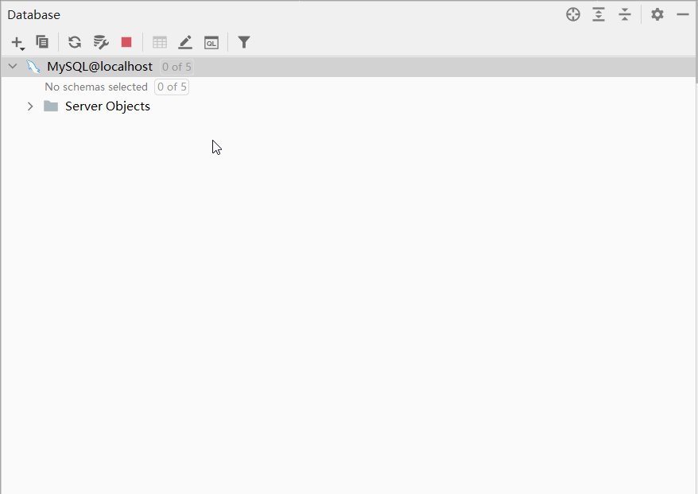


#### ******操作数据库******

- 创建数据库

	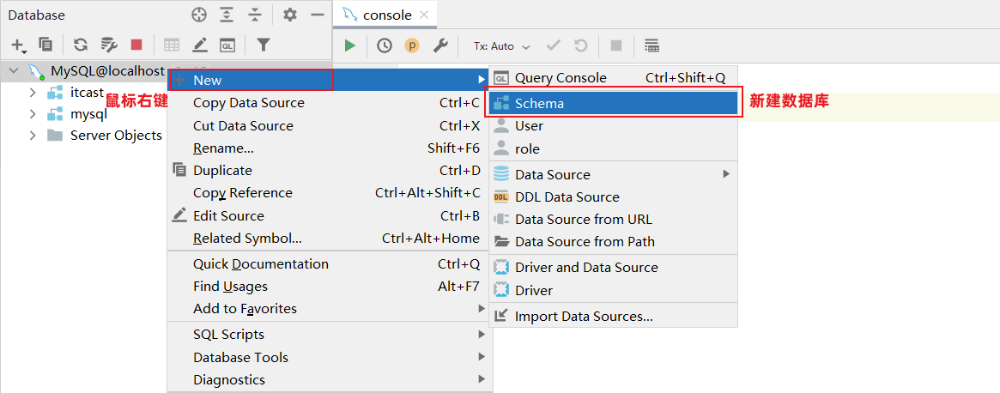


	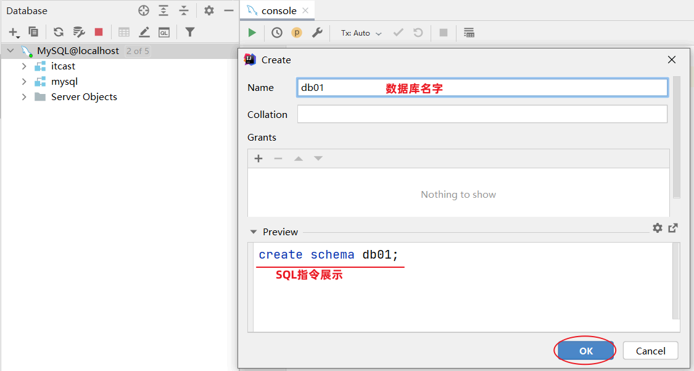

- 查看所有数据库

	```sql
	show databases;
	```


	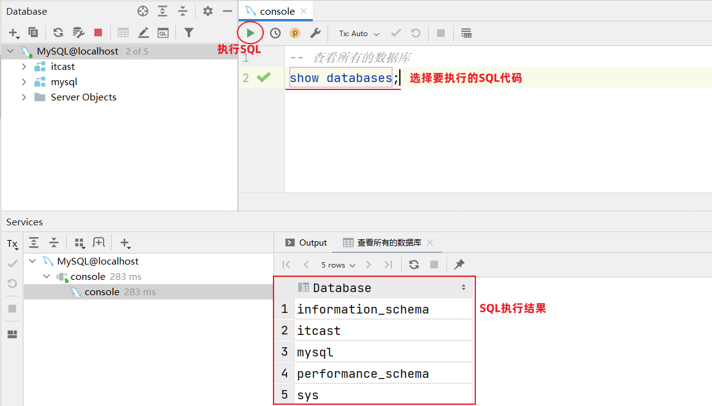


## ******表操作******


学习完了 DDL 语句当中关于数据库的操作之后，接下来继续学习 DDL 语句当中关于表结构的操作。


关于表结构的操作也是包含四个部分：创建表、查询表、修改表、删除表。


### ******创建******

- **语法**

	```sql
	create table 表名(
	    字段1 字段1类型 [约束] [comment 字段1注释],
	    字段2 字段2类型 [约束] [comment 字段2注释],
	    ......
	    字段n 字段n类型 [约束] [comment 字段n注释]
	) [comment 表注释];
	```


	注意：`[]` 中的内容为可选参数； 最后一个字段后面没有逗号。

- 案例：创建 `tb_user` 表。

	对应的结构如下：


	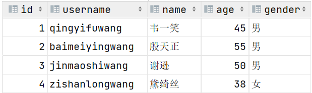


	建表语句：


	```sql
	create table tb_user (
	    id int comment 'ID,唯一标识',   ## id是一行数据的唯一标识（不能重复）
	    username varchar(20) comment '用户名',
	    name varchar(10) comment '姓名',
	    age int comment '年龄',
	    gender char(1) comment '性别'
	) comment '用户表';
	```


数据表创建完成，接下来我们还需要测试一下是否可以往这张表结构当中来存储数据。双击打开 `tb_user` 表结构，发现里面没有数据：


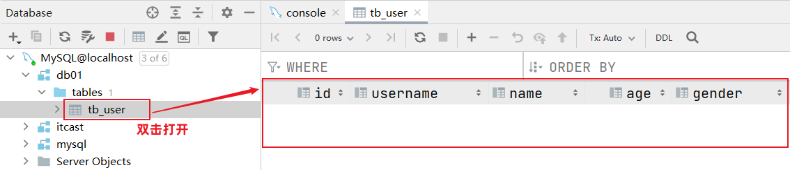


添加数据：


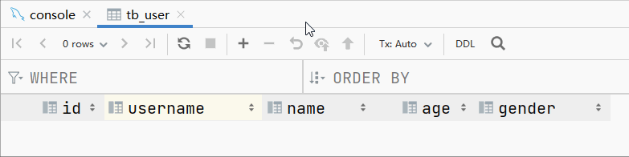


此时我们再插入一条数据：


在创建表结构时， `id` 字段只添加备注信息说明其为唯一标识，但是在数据库层面并没有限制字段存储的数据。因此 `id` 字段没有起到唯一标识的作用。


想要限制字段所存储的数据，就需要用到数据库中的约束。


#### ******约束******


概念：所谓约束就是作用在表中字段上的规则，用于限制存储在表中的数据。


作用：就是来保证数据库当中数据的正确性、有效性和完整性。


在 MySQL 数据库当中，提供了以下 5 种约束：


| 约束   | 描述                               | 关键字           |
| ---- | -------------------------------- | ------------- |
| 非空约束 | 限制该字段值不能为 `null`                 | `not null`    |
| 唯一约束 | 保证字段的所有数据都是唯一、不重复的               | `unique`      |
| 主键约束 | 主键是一行数据的唯一标识，要求非空且唯一             | `primary key` |
| 默认约束 | 保存数据时，如果未指定该字段值，则采用默认值           | `default`     |
| 外键约束 | 让两张表的数据建立连接，保证数据的一致性和完整性（后续课程讲解） | `foreign key` |


注意：约束是作用于表中字段上的，可以在创建表/修改表的时候添加约束。


**案例**：创建带有约束的 `tb_user` 表。


对应的结构如下：


在上述的表结构中:

- `id` 是一行数据的唯一标识
- `username` 用户名字段是非空且唯一的
- `name` 姓名字段是不允许存储空值的
- `gender` 性别字段是有默认值，默认为男

建表语句：


```sql
create table tb_user (
    id int primary key comment 'ID,唯一标识',
    username varchar(20) not null unique comment '用户名',
    name varchar(10) not null comment '姓名',
    age int comment '年龄',
    gender char(1) default '男' comment '性别'
) comment '用户表';
```


`id` 字段下存储的值，如果手动维护会比较麻烦（必须保证值的唯一性）。MySQL 数据库为了解决这个问题，给我们提供了一个关键字：`auto_increment`（自动增长）。


每次插入新的行记录时，数据库自动生成 `id` 字段（主键）下的值。具有 `auto_increment` 的数据列是一个正数序列开始增长（从 1 开始自增）。


```sql
create table tb_user (
    id int primary key auto_increment comment 'ID,唯一标识', #主键自动增长
    username varchar(20) not null unique comment '用户名',
    name varchar(10) not null comment '姓名',
    age int comment '年龄',
    gender char(1) default '男' comment '性别'
) comment '用户表';
```


#### ******数据类型******


MySQL 中的数据类型有很多，主要分为三类：数值类型、字符串类型、日期时间类型。

- **数值类型**

	| 类型          | 大小                 | 有符号 (SIGNED) 范围                                      | 无符号 (UNSIGNED) 范围                                       | 描述         |
	| ----------- | ------------------ | ---------------------------------------------------- | ------------------------------------------------------- | ---------- |
	| TINYINT     | 1 byte             | (-128，127)                                           | (0，255)                                                 | 小整数值       |
	| SMALLINT    | 2 bytes            | (-32768，32767)                                       | (0，65535)                                               | 大整数值       |
	| MEDIUMINT   | 3 bytes            | (-8388608，8388607)                                   | (0，16777215)                                            | 大整数值       |
	| INT/INTEGER | 4 bytes            | (-2147483648，2147483647)                             | (0，4294967295)                                          | 大整数值       |
	| BIGINT      | 8 bytes            | (-2^63，2^63-1)                                       | (0，2^64-1)                                              | 极大整数值      |
	| FLOAT       | 4 bytes            | (-3.402823466 E+38，3.402823466351 E+38)              | 0 和 (1.175494351 E-38，3.402823466 E+38)                 | 单精度浮点数值    |
	| DOUBLE      | 8 bytes            | (-1.7976931348623157 E+308，1.7976931348623157 E+308) | 0 和 (2.2250738585072014 E-308，1.7976931348623157 E+308) | 双精度浮点数值    |
	| DECIMAL     | 依赖于 M （精度）和 D （标度） | 依赖于 M 和 D                                            | 依赖于 M 和 D                                               | 小数值（精确定点数） |


	示例:


	```sql
	-- 年龄字段 ---不会出现负数, 而且人的年龄不会太大
	age tinyint unsigned
	
	-- 分数 ---总分100分, 最多出现一位小数
	score double(4,1)
	```

- **字符串类型**

	| 类型         | 大小                    | 描述                |
	| ---------- | --------------------- | ----------------- |
	| CHAR       | 0-255 bytes           | 定长字符串 (需要指定长度)    |
	| VARCHAR    | 0-65535 bytes         | 变长字符串 (需要指定长度)    |
	| TINYBLOB   | 0-255 bytes           | 不超过 255 个字符的二进制数据 |
	| TINYTEXT   | 0-255 bytes           | 短文本字符串            |
	| BLOB       | 0-65 535 bytes        | 二进制形式的长文本数据       |
	| TEXT       | 0-65 535 bytes        | 长文本数据             |
	| MEDIUMBLOB | 0-16 777 215 bytes    | 二进制形式的中等长度文本数据    |
	| MEDIUMTEXT | 0-16 777 215 bytes    | 中等长度文本数据          |
	| LONGBLOB   | 0-4 294 967 295 bytes | 二进制形式的极大文本数据      |
	| LONGTEXT   | 0-4 294 967 295 bytes | 极大文本数据            |


	示例：


	```sql
	-- 用户名 username ---长度不定, 最长不会超过50
	username varchar(50)
	
	-- 手机号 phone ---固定长度为11
	phone char(11) q
	```


	`char` 与 `varchar` 都可以描述字符串，`char` 是定长字符串，指定长度多长，就占用多少个字符，和字段值的长度无关 。而 `varchar` 是变长字符串，指定的长度为最大占用长度 。相对来说，`char` 的性能会更高些。

- **日期时间类型**

	| 类型        | 大小 | 范围                                        | 格式                  | 描述           |
	| --------- | -- | ----------------------------------------- | ------------------- | ------------ |
	| DATE      | 3  | 1000-01-01 至 9999-12-31                   | YYYY-MM-DD          | 日期值          |
	| TIME      | 3  | -838:59:59 至 838:59:59                    | HH:MM:SS            | 时间值或持续时间     |
	| YEAR      | 1  | 1901 至 2155                               | YYYY                | 年份值          |
	| DATETIME  | 8  | 1000-01-01 00:00:00 至 9999-12-31 23:59:59 | YYYY-MM-DD HH:MM:SS | 混合日期和时间值     |
	| TIMESTAMP | 4  | 1970-01-01 00:00:01 至 2038-01-19 03:14:07 | YYYY-MM-DD HH:MM:SS | 混合日期和时间值，时间戳 |


	示例:


	```sql
	-- 生日字段  birthday ---生日只需要年月日
	birthday date
	
	-- 创建时间 createtime --- 需要精确到时分秒
	createtime datetime
	```


#### ******案例******


需求：参考页面原型，设计员工管理模块的表结构。暂不考虑所属部门字段。


页面原型及需求如下：


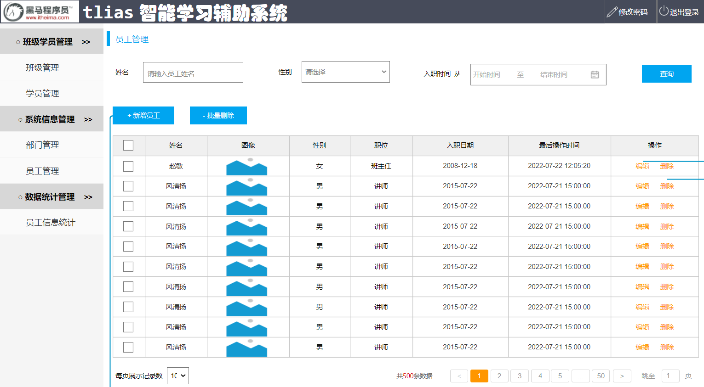


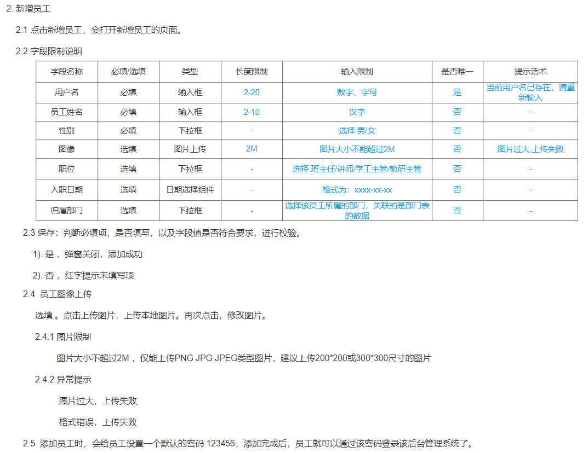


使用 SQL 创建表：


```sql
create table emp (
  id int unsigned primary key auto_increment comment 'ID',
  username varchar(20) not null unique comment '用户名',
  password varchar(32) default '123456' comment '密码',
  name varchar(10) not null comment '姓名',
  gender tinyint unsigned not null comment '性别, 说明: 1 男, 2 女',
  image varchar(300) comment '图像',
  job tinyint unsigned comment '职位, 说明: 1 班主任,2 讲师, 3 学工主管, 4 教研主管',
  entrydate date comment '入职时间',
  create_time datetime not null comment '创建时间',
  update_time datetime not null comment '修改时间'
) comment '员工表';
```


除了使用 SQL 语句创建表外，我们还可以借助于图形化界面来创建表结构，这种创建方式会更加直观、更加方便。


### ******查询******

- 查询当前数据库所有表

	```sql
	show tables;
	```


	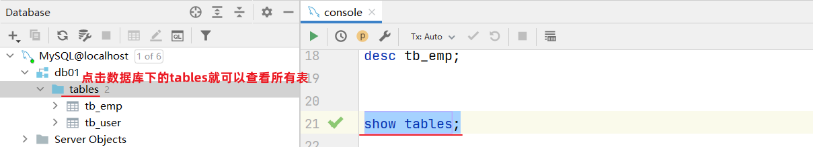

- 查看指定表结构

	```sql
	desc 表名; #可以查看指定表的字段、字段的类型、是否可以为NULL、是否存在默认值等信息
	```


	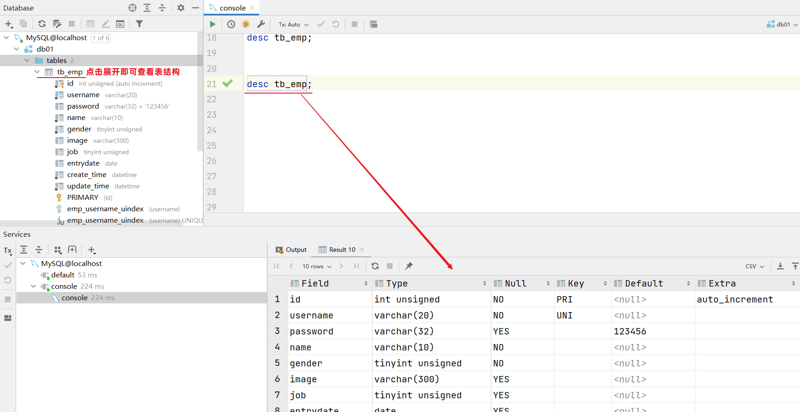

- 查询指定表的建表语句

	```sql
	show create table 表名;
	```


	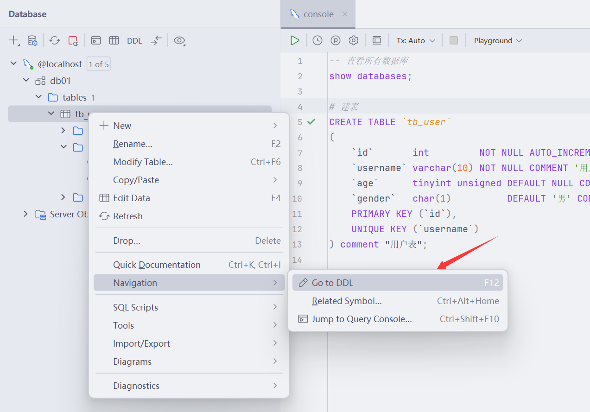


### ******修改******

- 添加字段。

	案例： 为 `tb_emp` 表添加字段 `qq`，字段类型为 `varchar(11)`


	```sql
	alter table 表名 add 字段名 类型(长度) [comment 注释] [约束];
	```


	SQL 语句：


	```sql
	alter table tb_emp add qq varchar(11) comment 'QQ号码';
	```


	图形化操作：添加字段。


	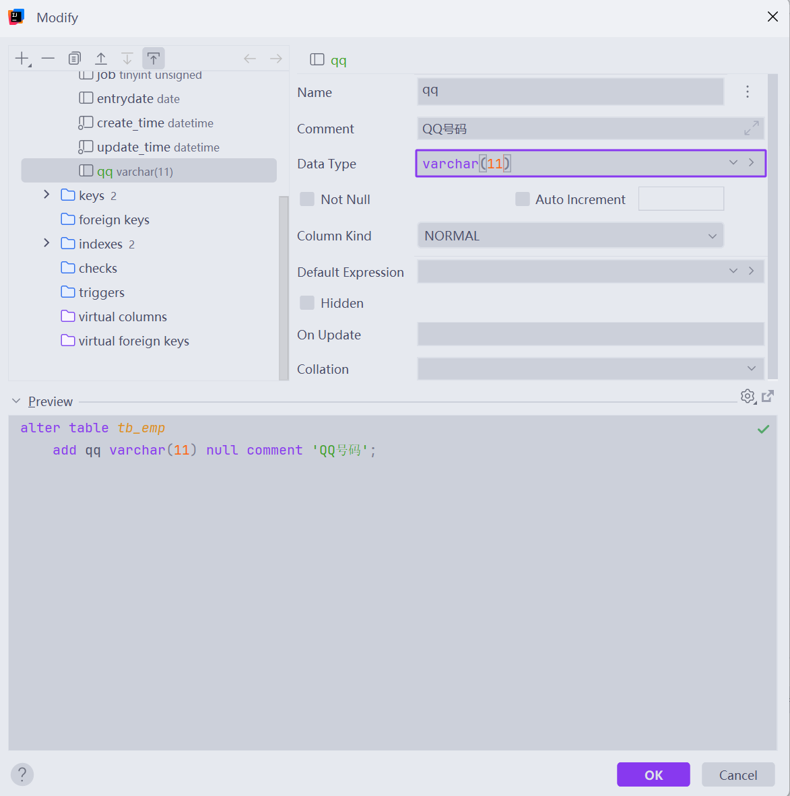

- 修改数据类型。

	修改字段类型：


	```sql
	alter table 表名 modify 字段名 新数据类型(长度);
	```


	修改字段名称：


	```sql
	alter table 表名 change 旧字段名 新字段名 类型(长度) [comment 注释] [约束];
	```


	案例：修改 `qq` 字段的字段类型，将其长度由 11 修改为 13。


	```sql
	alter table tb_emp modify qq varchar(13) comment 'QQ号码';
	```


	案例：修改 `qq` 字段名为 `qq_num`，字段类型 `varchar(13)` 。


	```sql
	alter table tb_emp change qq qq_num varchar(13) comment 'QQ号码';
	```

- 删除字段

	```sql
	alter table 表名 drop 字段名;
	```


	案例：删除 `tb_emp` 表中的 `qq_num` 字段


	```sql
	alter table tb_emp drop qq_num;
	```

- 修改表名

	```sql
	rename table 表名 to 新表名;
	```


	案例：将当前的 `tb_emp` 表的表名修改为 `emp`


	```sql
	rename table tb_emp to emp;
	```


### ******删除******

- 删除表语法：

	```sql
	drop table [if exists] 表名;
	```


	`if exists`：只有表名存在时才会删除该表，表名不存在，则不执行删除操作（如果不加该参数项，删除一张不存在的表，执行将会报错）。


	案例：如果 `tb_emp` 表存在，则删除 `tb_emp` 表


	```sql
	drop table if exists tb_emp;  -- 在删除表时，表中的全部数据也会被删除。
	```

