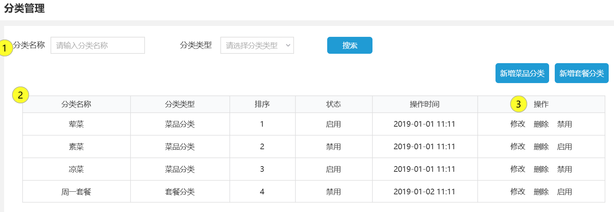
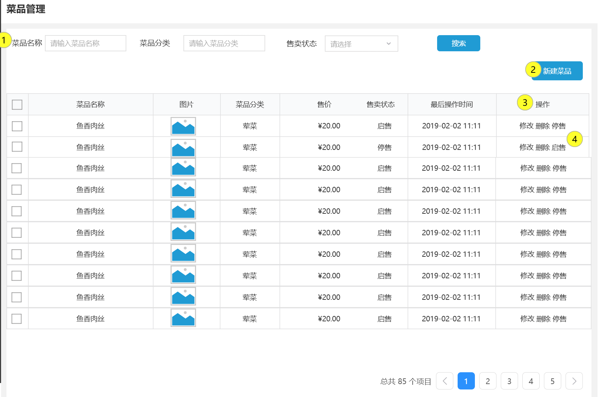
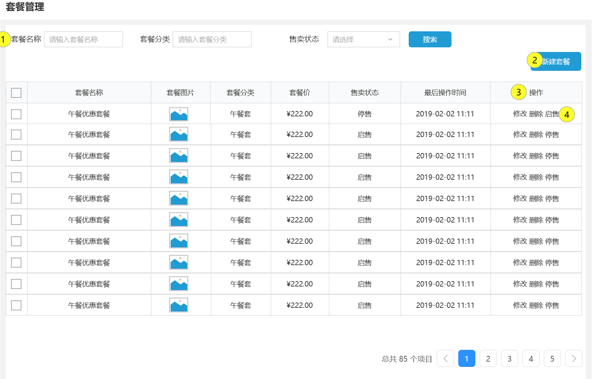
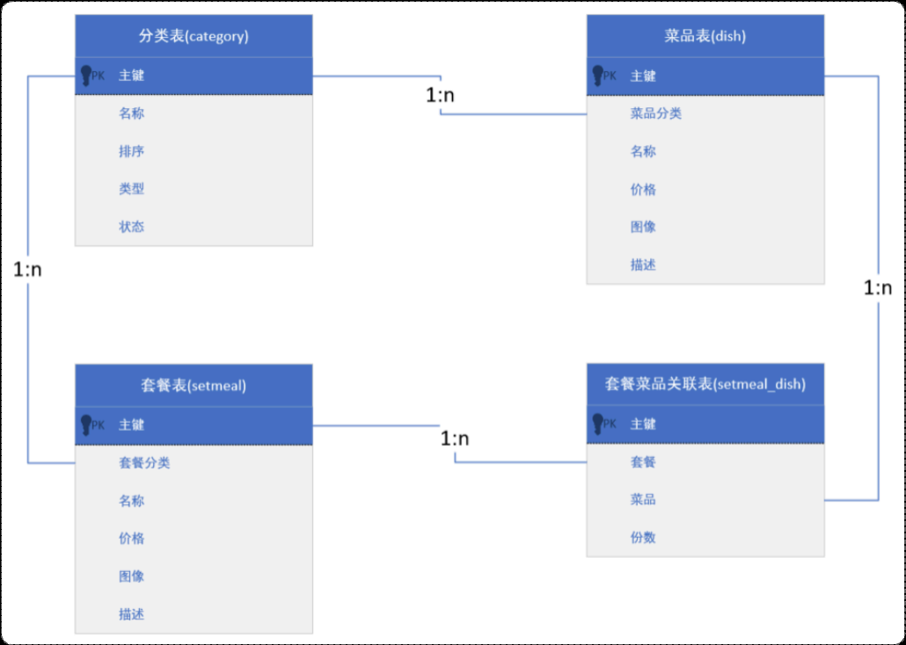

在学习完单表的操作后，我们开始学习多表操作。首先学习多表的设计。项目开发中，在进行数据库表结构设计时，会根据业务需求及业务模块之间的关系，分析并设计表结构。由于业务之间相互关联，所以各个表结构之间也存在着各种联系，基本上分为三种：

- 一对多（多对一）。
- 多对多。
- 一对一。

## ****一对多****


### ****表设计****


需求：完成部门及员工的表结构设计。其中部门表结构：

- 业务字段：部门名称
- 基础字段：id（主键）、创建时间、修改时间

**部门表 SQL 语句：**


```sql
## ****建议：创建新的数据库（多表设计存放在新数据库下）****
create database db03;
use db03;

-- 部门表
create table tb_dept
(
    id int unsigned primary key auto_increment comment '主键ID',
    name varchar(10) not null unique  comment '部门名称',
    create_time datetime not null comment '创建时间',
    update_time datetime not null comment '修改时间'
) comment '部门表';
```


部门表创建好之后，还需要再修改下员工表。因为之前设计员工表(单表)的时候，并没有考虑员工的归属部门。


**员工表：添加归属部门字段**


```sql
-- 员工表
create table tb_emp
(
    id          int unsigned primary key auto_increment comment 'ID',
    username    varchar(20)      not null unique comment '用户名',
    password    varchar(32) default '123456' comment '密码',
    name        varchar(10)      not null comment '姓名',
    gender      tinyint unsigned not null comment '性别, 说明: 1 男, 2 女',
    image       varchar(300) comment '图像',
    job         tinyint unsigned comment '职位, 说明: 1 班主任,2 讲师, 3 学工主管, 4 教研主管',
    entrydate   date comment '入职时间',
    dept_id     int unsigned comment '部门ID', -- 员工的归属部门
    create_time datetime         not null comment '创建时间',
    update_time datetime         not null comment '修改时间'
) comment '员工表';
```


**测试数据：**


```sql
-- 部门表测试数据
insert into tb_dept (id, name, create_time, update_time)
values (1, '学工部', now(), now()),
       (2, '教研部', now(), now()),
       (3, '咨询部', now(), now()),
       (4, '就业部', now(), now()),
       (5, '人事部', now(), now());

-- 员工表测试数据
INSERT INTO tb_emp
(id, username, password, name, gender, image, job, entrydate, dept_id, create_time, update_time)
VALUES (1, 'jinyong', '123456', '金庸', 1, '1.jpg', 4, '2000-01-01', 2, now(), now()),
       (2, 'zhangwuji', '123456', '张无忌', 1, '2.jpg', 2, '2015-01-01', 2, now(), now()),
       (3, 'yangxiao', '123456', '杨逍', 1, '3.jpg', 2, '2008-05-01', 2, now(), now()),
       (4, 'weiyixiao', '123456', '韦一笑', 1, '4.jpg', 2, '2007-01-01', 2, now(), now()),
       (5, 'changyuchun', '123456', '常遇春', 1, '5.jpg', 2, '2012-12-05', 2, now(), now()),
       (6, 'xiaozhao', '123456', '小昭', 2, '6.jpg', 3, '2013-09-05', 1, now(), now()),
       (7, 'jixiaofu', '123456', '纪晓芙', 2, '7.jpg', 1, '2005-08-01', 1, now(), now()),
       (8, 'zhouzhiruo', '123456', '周芷若', 2, '8.jpg', 1, '2014-11-09', 1, now(), now()),
       (9, 'dingminjun', '123456', '丁敏君', 2, '9.jpg', 1, '2011-03-11', 1, now(), now()),
       (10, 'zhaomin', '123456', '赵敏', 2, '10.jpg', 1, '2013-09-05', 1, now(), now()),
       (11, 'luzhangke', '123456', '鹿杖客', 1, '11.jpg', 1, '2007-02-01', 1, now(), now()),
       (12, 'hebiweng', '123456', '鹤笔翁', 1, '12.jpg', 1, '2008-08-18', 1, now(), now()),
       (13, 'fangdongbai', '123456', '方东白', 1, '13.jpg', 2, '2012-11-01', 2, now(), now()),
       (14, 'zhangsanfeng', '123456', '张三丰', 1, '14.jpg', 2, '2002-08-01', 2, now(), now()),
       (15, 'yulianzhou', '123456', '俞莲舟', 1, '15.jpg', 2, '2011-05-01', 2, now(), now()),
       (16, 'songyuanqiao', '123456', '宋远桥', 1, '16.jpg', 2, '2010-01-01', 2, now(), now()),
       (17, 'chenyouliang', '123456', '陈友谅', 1, '17.jpg', NULL, '2015-03-21', NULL, now(), now());
```


员工表 - 部门表之间的关系：


在一对多关系中，通常在多的一方（员工表）添加一个外键字段（`dept_id`）来关联属于一的一方（部门表）的主键（`id`）。


### ****外键约束****


外键约束用于保证数据的一致性和完整性。


**外键约束的语法：**


```sql
-- 创建表时指定
create table 表名(
    字段名    数据类型,
    ...
    [constraint]   [外键名称]  foreign  key (外键字段名)   references   主表 (主表列名)
);
-- 建完表后，添加外键
alter table  表名  add constraint  外键名称  foreign key(外键字段名) references 主表(主表列名);
```


可以修改员工表，为 `dept_id` 字段添加外键约束，使其关联到部门表的 `id` 字段：


```sql
-- 修改表： 添加外键约束
alter table tb_emp
add  constraint  fk_dept_id  foreign key (dept_id)  references  tb_dept(id);
```


添加外键约束后，如果删除部门表中被员工表引用的记录，数据库会报错，从而保证数据的一致性。


#### ****物理外键和逻辑外键****

- **物理外键：** 使用 `FOREIGN KEY` 定义外键关联另一张表。
	- 缺点：影响增、删、改的效率；仅适用于单节点数据库，不适用于分布式、集群场景；容易引发数据库的死锁问题，消耗性能。
- **逻辑外键：** 在业务层逻辑中解决外键关联。

在现代企业开发中，很少使用物理外键，而是使用逻辑外键。


## ****一对一****


一对一关系通常用于单表的拆分，将一张大表拆分成两张小表，提高数据操作效率。


一对一关系可以看作一种特殊的一对多关系，可以通过外键来体现。在任意一方加入外键，关联另外一方的主键，并且设置外键为唯一的（`UNIQUE`）。


### ****表设计****


需求：假设有用户基本信息表和用户身份信息表，一个用户只能对应一个身份证，而一个身份证也只能关联一个用户。


**用户基本信息表 (tb_user) - SQL 脚本：**


```sql
-- 用户基本信息表
create table tb_user(
    id int unsigned  primary key auto_increment comment 'ID',
    name varchar(10) not null comment '姓名',
    gender tinyint unsigned not null comment '性别, 1 男  2 女',
    phone char(11) comment '手机号',
    degree varchar(10) comment '学历'
) comment '用户基本信息表';
```


**用户身份信息表 (tb_user_card) - SQL 脚本：**


```sql
-- 用户身份信息表
create table tb_user_card(
    id int unsigned  primary key auto_increment comment 'ID',
    nationality varchar(10) not null comment '民族',
    birthday date not null comment '生日',
    idcard char(18) not null comment '身份证号',
    issued varchar(20) not null comment '签发机关',
    expire_begin date not null comment '有效期限-开始',
    expire_end date comment '有效期限-结束',
    user_id int unsigned not null unique comment '用户ID'
) comment '用户身份信息表';
```


添加 `user_id` 与 `id` 之间的物理外键：


```sql
alter table tb_user_card
    add constraint fk_user_id
        foreign key (user_id) references tb_user (id);
```


## ****多对多****


多对多关系也比较常见。比如，学生和课程的关系，一个学生可以选修多门课程，一个课程也可以供多个学生选修。


实现多对多关系需要建立第三张中间表，中间表至少包含两个外键，分别关联两方主键。


### ****表设计****


案例：学生与课程的关系。

- 关系：一个学生可以选修多门课程，一门课程也可以供多个学生选择。
- 实现关系：建立第三张中间表，中间表至少包含两个外键，分别关联两方主键。

**学生表 (tb_student) - SQL 脚本：**


```sql
-- 学生表
create table tb_student(
    id int auto_increment primary key comment '主键ID',
    name varchar(10) comment '姓名',
    no varchar(10) comment '学号'
) comment '学生表';
```


**课程表 (tb_course) - SQL 脚本：**


```sql
-- 课程表
create table tb_course(
   id int auto_increment primary key comment '主键ID',
   name varchar(10) comment '课程名称'
) comment '课程表';
```


建立 学生 - 课程表 之间的第三张表：


**学生课程表 (tb_student_course) - SQL 脚本：**


```sql
-- 学生课程表（中间表）
create table tb_student_course(
   id int auto_increment comment '主键' primary key,
   student_id int not null comment '学生ID',
   course_id  int not null comment '课程ID',
   constraint fk_courseid foreign key (course_id) references tb_course (id),
   constraint fk_studentid foreign key (student_id) references tb_student (id)
)comment '学生课程中间表';

insert into tb_student_course(student_id, course_id) values (1,1),(1,2),(1,3),(2,2),(2,3),(3,4);
```


## ****案例****


根据《[苍穹外卖管理后台](https://app.mockplus.cn/app/share-e928208474edd220b75e9faff1380e4ashare-VaH7dpoIaqRr/preview/BlJ_BHC42AEaa/tKNB7Tamh14B54?allowShare=1&cps=expand&ha=1&sr=collapse)》页面原型，设计分类管理、菜品管理、套餐管理模块的表结构。

- **分类表 (category)：**

	

	- 业务字段：分类名称、分类类型、分类排序、分类状态。
	- 基础字段：id（主键）、创建时间、修改时间。
- **菜品表 (dish)：**

	

	- 业务字段：菜品名称、菜品图片、菜品分类、菜品售价、菜品售卖状态。
	- 基础字段：id（主键）、创建时间、修改时间。
- **套餐表 (setmeal)：**

	

	- 业务字段：套餐名称、套餐图片、套餐分类、套餐价格、套餐售卖状态。
	- 基础字段：id（主键）、创建时间、修改时间。

**表结构之间的关系：**

- 分类表 - 菜品表：一对多（分类名称 - 菜品名称）。
- 菜品表 - 套餐表：多对多（菜品名称 - 套餐名称）。
- 套餐表 - 分类表：一对多（套餐名称 - 分类名称）。

	


**SQL 脚本：**

- 在菜品表中添加 `category_id` 字段，关联分类表。
- 在套餐表中添加 `category_id` 字段，关联分类表。
- 创建第三张中间表 `setmeal_dish`，包含 `dish_id` 和 `setmeal_id` 字段

```sql
-- 分类表
create table category
(
    id          int unsigned primary key auto_increment comment '主键ID',
    name        varchar(20)      not null unique comment '分类名称',
    type        tinyint unsigned not null comment '类型 1 菜品分类 2 套餐分类',
    sort        tinyint unsigned not null comment '顺序',
    status      tinyint unsigned not null default 0 comment '状态 0 禁用，1 启用',
    create_time datetime         not null comment '创建时间',
    update_time datetime         not null comment '更新时间'
) comment '菜品及套餐分类';

-- 菜品表
create table dish
(
    id          int unsigned primary key auto_increment comment '主键ID',
    name        varchar(20)      not null unique comment '菜品名称',
    category_id int unsigned     not null comment '菜品分类ID',   -- 逻辑外键
    price       decimal(8, 2)    not null comment '菜品价格',
    image       varchar(300)     not null comment '菜品图片',
    description varchar(200) comment '描述信息',
    status      tinyint unsigned not null default 0 comment '状态, 0 停售 1 起售',
    create_time datetime         not null comment '创建时间',
    update_time datetime         not null comment '更新时间'
) comment '菜品';

-- 套餐表
create table setmeal
(
    id          int unsigned primary key auto_increment comment '主键ID',
    name        varchar(20)      not null unique comment '套餐名称',
    category_id int unsigned     not null comment '分类id',       -- 逻辑外键
    price       decimal(8, 2)    not null comment '套餐价格',
    image       varchar(300)     not null comment '图片',
    description varchar(200) comment '描述信息',
    status      tinyint unsigned not null default 0 comment '状态 0:停用 1:启用',
    create_time datetime         not null comment '创建时间',
    update_time datetime         not null comment '更新时间'
) comment '套餐';

-- 套餐菜品关联表
create table setmeal_dish
(
    id         int unsigned primary key auto_increment comment '主键ID',
    setmeal_id int unsigned     not null comment '套餐id ',    -- 逻辑外键
    dish_id    int unsigned     not null comment '菜品id',     -- 逻辑外键
    copies     tinyint unsigned not null comment '份数'
) comment '套餐菜品关联表';
```

