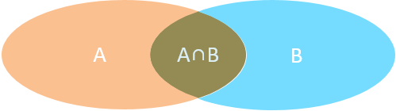
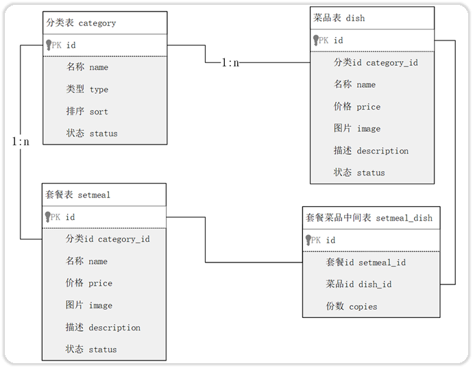

## ****概述****


多表查询是指从多个表中获取所需的数据。


### ******数据准备******


首先，我们需要准备一些数据，使用以下 SQL 脚本创建数据库和表，并插入一些测试数据。


```sql
create database db04;
use db04;
-- 部门管理
create table tb_dept
(
    id          int unsigned primary key auto_increment comment '主键ID',
    name        varchar(10) not null unique comment '部门名称',
    create_time datetime    not null comment '创建时间',
    update_time datetime    not null comment '修改时间'
) comment '部门表';

insert into tb_dept (id, name, create_time, update_time)
values (1, '学工部', now(), now()),
       (2, '教研部', now(), now()),
       (3, '咨询部', now(), now()),
       (4, '就业部', now(), now()),
       (5, '人事部', now(), now());


-- 员工管理
create table tb_emp
(
    id          int unsigned primary key auto_increment comment 'ID',
    username    varchar(20)      not null unique comment '用户名',
    password    varchar(32) default '123456' comment '密码',
    name        varchar(10)      not null comment '姓名',
    gender      tinyint unsigned not null comment '性别, 说明: 1 男, 2 女',
    image       varchar(300) comment '图像',
    job         tinyint unsigned comment '职位, 说明: 1 班主任,2 讲师, 3 学工主管, 4 教研主管, 5 咨询师',
    entrydate   date comment '入职时间',
    dept_id     int unsigned comment '部门ID',
    create_time datetime         not null comment '创建时间',
    update_time datetime         not null comment '修改时间'
) comment '员工表';

INSERT INTO tb_emp
(id, username, password, name, gender, image, job, entrydate, dept_id, create_time, update_time)
VALUES (1, 'jinyong', '123456', '金庸', 1, '1.jpg', 4, '2000-01-01', 2, now(), now()),
       (2, 'zhangwuji', '123456', '张无忌', 1, '2.jpg', 2, '2015-01-01', 2, now(), now()),
       (3, 'yangxiao', '123456', '杨逍', 1, '3.jpg', 2, '2008-05-01', 2, now(), now()),
       (4, 'weiyixiao', '123456', '韦一笑', 1, '4.jpg', 2, '2007-01-01', 2, now(), now()),
       (5, 'changyuchun', '123456', '常遇春', 1, '5.jpg', 2, '2012-12-05', 2, now(), now()),
       (6, 'xiaozhao', '123456', '小昭', 2, '6.jpg', 3, '2013-09-05', 1, now(), now()),
       (7, 'jixiaofu', '123456', '纪晓芙', 2, '7.jpg', 1, '2005-08-01', 1, now(), now()),
       (8, 'zhouzhiruo', '123456', '周芷若', 2, '8.jpg', 1, '2014-11-09', 1, now(), now()),
       (9, 'dingminjun', '123456', '丁敏君', 2, '9.jpg', 1, '2011-03-11', 1, now(), now()),
       (10, 'zhaomin', '123456', '赵敏', 2, '10.jpg', 1, '2013-09-05', 1, now(), now()),
       (11, 'luzhangke', '123456', '鹿杖客', 1, '11.jpg', 5, '2007-02-01', 3, now(), now()),
       (12, 'hebiweng', '123456', '鹤笔翁', 1, '12.jpg', 5, '2008-08-18', 3, now(), now()),
       (13, 'fangdongbai', '123456', '方东白', 1, '13.jpg', 5, '2012-11-01', 3, now(), now()),
       (14, 'zhangsanfeng', '123456', '张三丰', 1, '14.jpg', 2, '2002-08-01', 2, now(), now()),
       (15, 'yulianzhou', '123456', '俞莲舟', 1, '15.jpg', 2, '2011-05-01', 2, now(), now()),
       (16, 'songyuanqiao', '123456', '宋远桥', 1, '16.jpg', 2, '2007-01-01', 2, now(), now()),
       (17, 'chenyouliang', '123456', '陈友谅', 1, '17.jpg', NULL, '2015-03-21', NULL, now(), now());
```


### ******介绍******


单表查询的 SQL 语句是


```sql
select 字段列表 from 表名;
```


多表查询则使用逗号分隔多个表，例如


```sql
select 字段列表 from 表1, 表2;
```


如果直接执行多表查询，可能会产生笛卡尔积，即两个集合的所有组合情况。在多表查询中，我们需要消除无效的笛卡尔积，只保留表关联部分的数据。这可以通过在 SQL 语句中添加连接查询的条件来实现。


例如，查询用户表和部门表中的数据：


```sql
select * from tb_emp , tb_dept;
```


该查询结果包含了大量的记录，总共 85 条，这是员工表（17 行）和部门表（5 行）的所有组合情况，即笛卡尔积。


通过增加 `where` 条件，可以消除笛卡尔积：


```sql
select * from tb_emp , tb_dept where tb_emp.dept_id = tb_dept.id ;
```


### ******分类******


多表查询可以分为以下几类：

1. **连接查询**
	- 内连接。

	

	- 外连接。
		- 左外连接：查询左表所有数据（包括两张表交集部分数据）。
		- 右外连接：查询右表所有数据（包括两张表交集部分数据）。
2. **子查询**

## ****内连接****


内连接查询用于查询两表或多表中交集部分的数据。内连接分为隐式内连接和显式内连接。

- **隐式内连接语法:**

```sql
select 字段列表 from 表1 , 表2 where 条件 ... ;
```

- **显式内连接语法:**

```sql
select 字段列表 from 表1 [ inner ] join 表2 on 连接条件 ... ;
```


**案例：查询员工的姓名及所属的部门名称**

- **隐式内连接实现**

```sql
select tb_emp.name , tb_dept.name -- 分别查询两张表中的数据
from tb_emp , tb_dept -- 关联两张表
where tb_emp.dept_id = tb_dept.id; -- 消除笛卡尔积
```

- **显式内连接实现**

```sql
select tb_emp.name , tb_dept.name
from tb_emp inner join tb_dept
on tb_emp.dept_id = tb_dept.id;
```


在多表查询时，可以使用 `as` 关键字为表起别名，简化 SQL 语句。


```sql
tableA  as  别名1  ,  tableB  as  别名2 ;
tableA  别名1  ,  tableB  别名2 ;
```


**使用了别名的多表查询：**


```sql
select emp.name , dept.name
from tb_emp emp inner join tb_dept dept
on emp.dept_id = dept.id;
```


**注意事项:** 一旦为表起了别名，就不能再使用表名来指定对应的字段了，此时只能够使用别名来指定字段。


## ****外连接****


外连接分为左外连接和右外连接。

- **左外连接语法结构：**

```sql
select  字段列表   from   表1  left  [ outer ]  join 表2  on  连接条件 ... ;
```


左外连接相当于查询表 1（左表）的所有数据，包括表 1 和表 2 交集部分的数据。

- **右外连接语法结构：**

```sql
select  字段列表   from   表1  right  [ outer ]  join 表2  on  连接条件 ... ;
```


右外连接相当于查询表 2（右表）的所有数据，包括表 1 和表 2 交集部分的数据。


**案例：查询员工表中所有员工的姓名, 和对应的部门名称**


```sql
-- 左外连接：以 left join 关键字左边的表为主表，查询主表中所有数据，以及和主表匹配的右边表中的数据
select emp.name , dept.name
from tb_emp AS emp left join tb_dept AS dept
     on emp.dept_id = dept.id;
```


**案例：查询部门表中所有部门的名称, 和对应的员工名称**


```sql
-- 右外连接
select dept.name , emp.name
from tb_emp AS emp right join  tb_dept AS dept
     on emp.dept_id = dept.id;
```


**注意事项：** 左外连接和右外连接是可以相互替换的，只需要调整连接查询时 SQL 语句中表的先后顺序就可以了。在日常开发使用时，更偏向于左外连接。


## ****子查询****


### ******介绍******


SQL 语句中嵌套 `select` 语句，称为嵌套查询，又称子查询。子查询外部的语句可以是 `insert / update / delete / select` 的任何一个，最常见的是 `select`。


```sql
SELECT  *  FROM   t1   WHERE  column1 =  ( SELECT  column1  FROM  t2 ... );
```


根据子查询结果的不同，子查询可以分为：

1. 标量子查询（子查询结果为单个值[一行一列]）。
2. 列子查询（子查询结果为一列，但可以是多行）。
3. 行子查询（子查询结果为一行，但可以是多列）。
4. 表子查询（子查询结果为多行多列[相当于子查询结果是一张表]）。

子查询可以书写的位置：

1. `where` 之后
2. `from` 之后
3. `select` 之后

### ******标量子查询******


子查询返回的结果是单个值（数字、字符串、日期等），最简单的形式，这种子查询称为标量子查询。


常用的操作符：`= <> > >= < <=`


**案例1：查询"教研部"的所有员工信息**


可以将需求分解为两步：

1. 查询 "教研部" 部门 ID
2. 根据 "教研部" 部门 ID，查询员工信息

```sql
-- 1.查询"教研部"部门ID
select id from tb_dept where name = '教研部';    #查询结果：2
-- 2.根据"教研部"部门ID, 查询员工信息
select * from tb_emp where dept_id = 2;
-- 合并出上两条SQL语句
select * from tb_emp where dept_id = (select id from tb_dept where name = '教研部');
```


**案例2：查询在 "方东白" 入职之后的员工信息**


可以将需求分解为两步：

1. 查询 方东白 的入职日期
2. 查询 指定入职日期之后入职的员工信息

```sql
-- 1.查询"方东白"的入职日期
select entrydate from tb_emp where name = '方东白';     #查询结果：2012-11-01
-- 2.查询指定入职日期之后入职的员工信息
select * from tb_emp where entrydate > '2012-11-01';
-- 合并以上两条SQL语句
select * from tb_emp where entrydate > (select entrydate from tb_emp where name = '方东白');
```


### ******列子查询******


子查询返回的结果是一列（可以是多行），这种子查询称为列子查询。


常用的操作符：


| 操作符    | 描述             |
| ------ | -------------- |
| IN     | 在指定的集合范围之内，多选一 |
| NOT IN | 不在指定的集合范围之内    |
| ANY    | 只要满足内层子查询的任意一个 |
| SOME   | 与 ANY 等同       |
| ALL    | 满足内层子查询的所有值    |


**案例：查询"教研部"和"咨询部"的所有员工信息**


分解为以下两步：

1. 查询 "教研部" 和 "咨询部" 的部门 ID
2. 根据部门 ID, 查询员工信息

```sql
-- 1.查询"销售部"和"市场部"的部门ID
select id from tb_dept where name = '教研部' or name = '咨询部';    #查询结果：3,2
-- 2.根据部门ID, 查询员工信息
select * from tb_emp where dept_id in (3,2);
-- 合并以上两条SQL语句
select * from tb_emp where dept_id in (select id from tb_dept where name = '教研部' or name = '咨询部');
```


### ******行子查询******


子查询返回的结果是一行（可以是多列），这种子查询称为行子查询。


常用的操作符：`= 、<> 、IN 、NOT IN`


**案例：查询与"韦一笑"的入职日期及职位都相同的员工信息**


可以拆解为两步进行：

1. 查询 "韦一笑" 的入职日期 及 职位
2. 查询与"韦一笑"的入职日期及职位相同的员工信息

```sql
-- 查询"韦一笑"的入职日期 及 职位
select entrydate , job from tb_emp where name = '韦一笑';  #查询结果： 2007-01-01 , 2
-- 查询与"韦一笑"的入职日期及职位相同的员工信息
select * from tb_emp where (entrydate,job) = ('2007-01-01',2);
-- 合并以上两条SQL语句
select * from tb_emp where (entrydate,job) = (select entrydate , job from tb_emp where name = '韦一笑');
```


### ******表子查询******


子查询返回的结果是多行多列，常作为临时表，这种子查询称为表子查询。


**案例：查询入职日期是 "2006-01-01" 之后的员工信息 , 及其部门信息**


分解为两步执行：

1. 查询入职日期是 "2006-01-01" 之后的员工信息
2. 基于查询到的员工信息，在查询对应的部门信息

```sql
select * from emp where entrydate > '2006-01-01';
select e.*, d.* from (select * from emp where entrydate > '2006-01-01') e left join dept d on e.dept_id = d.id ;
```


## ****案例****


首先需要准备环境，将多表查询的数据准备的 SQL 脚本导入数据库中，创建以下四张表：

- 分类表：`category`
- 菜品表：`dish`
- 套餐表：`setmeal`
- 套餐菜品关系表：`setmeal_dish`

```sql
-- 分类表
create table category(
    id int unsigned primary key auto_increment comment '主键ID',
    name varchar(20) not null unique comment '分类名称',
    type tinyint unsigned not null comment '类型 1 菜品分类 2 套餐分类',
    sort tinyint unsigned not null comment '顺序',
    status tinyint unsigned not null default 0 comment '状态 0 禁用，1 启用',
    create_time datetime not null comment '创建时间',
    update_time datetime not null comment '更新时间'
) comment '分类' ;

-- 菜品表
create table dish(
    id int unsigned primary key auto_increment comment '主键ID',
    name varchar(20) not null unique comment '菜品名称',
    category_id int unsigned not null comment '菜品分类ID',
    price decimal(8, 2) not null comment '菜品价格',
    image varchar(300) not null comment '菜品图片',
    description varchar(200) comment '描述信息',
    status tinyint unsigned not null default 0 comment '状态, 0 停售 1 起售',
    create_time datetime not null comment '创建时间',
    update_time datetime not null comment '更新时间'
) comment '菜品';

-- 套餐表
create table setmeal(
    id int unsigned primary key auto_increment comment '主键ID',
    name varchar(20) not null unique comment '套餐名称',
    category_id int unsigned not null comment '分类id',
    price decimal(8, 2) not null comment '套餐价格',
    image varchar(300) not null comment '图片',
    description varchar(200) comment '描述信息',
    status tinyint unsigned not null default 0 comment '状态 0:停用 1:启用',
    create_time datetime not null comment '创建时间',
    update_time datetime not null comment '更新时间'
)comment '套餐' ;

-- 套餐菜品关联表
create table setmeal_dish(
    id int unsigned primary key auto_increment comment '主键ID',
    setmeal_id int unsigned not null comment '套餐id ',
    dish_id int unsigned not null comment '菜品id',
    copies tinyint unsigned not null comment '份数'
)comment '套餐菜品中间表';

-- ================================== 导入测试数据 ====================================
-- category
insert into category (id, type, name, sort, status, create_time, update_time) values (1, 1, '酒水饮料', 10, 1, '2022-08-09 22:09:18', '2022-08-09 22:09:18');
insert into category (id, type, name, sort, status, create_time, update_time) values (2, 1, '传统主食', 9, 1, '2022-08-09 22:09:32', '2022-08-09 22:18:53');
insert into category (id, type, name, sort, status, create_time, update_time) values (3, 2, '人气套餐', 12, 1, '2022-08-09 22:11:38', '2022-08-10 11:04:40');
insert into category (id, type, name, sort, status, create_time, update_time) values (4, 2, '商务套餐', 13, 1, '2022-08-09 22:14:10', '2022-08-10 11:04:48');
insert into category (id, type, name, sort, status, create_time, update_time) values (5, 1, '经典川菜', 6, 1, '2022-08-09 22:17:42', '2022-08-09 22:17:42');
insert into category (id, type, name, sort, status, create_time, update_time) values (6, 1, '新鲜时蔬', 7, 1, '2022-08-09 22:18:12', '2022-08-09 22:18:28');
insert into category (id, type, name, sort, status, create_time, update_time) values (7, 1, '汤类', 11, 1, '2022-08-10 10:51:47', '2022-08-10 10:51:47');

-- dish
insert into dish (id, name, category_id, price, image, description, status, create_time, update_time) values (1,'王老吉', 1, 6.00, 'https://reggie-itcast.oss-cn-beijing.aliyuncs.com/41bfcacf-7ad4-4927-8b26-df366553a94c.png', '', 1, '2022-06-09 22:40:47', '2022-06-09 22:40:47');
insert into dish (id, name, category_id, price, image, description, status, create_time, update_time) values (2,'北冰洋', 1, 4.00, 'https://reggie-itcast.oss-cn-beijing.aliyuncs.com/4451d4be-89a2-4939-9c69-3a87151cb979.png', '还是小时候的味道', 1, '2022-06-10 09:18:49', '2022-06-10 09:18:49');
insert into dish (id, name, category_id, price, image, description, status, create_time, update_time) values (3,'雪花啤酒', 1, 4.00, 'https://reggie-itcast.oss-cn-beijing.aliyuncs.com/bf8cbfc1-04d2-40e8-9826-061ee41ab87c.png', '', 1, '2022-06-10 09:22:54', '2022-06-10 09:22:54');
insert into dish (id, name, category_id, price, image, description, status, create_time, update_time) values (4,'米饭', 2, 2.00, 'https://reggie-itcast.oss-cn-beijing.aliyuncs.com/76752350-2121-44d2-b477-10791c23a8ec.png', '精选五常大米', 1, '2022-06-10 09:30:17', '2022-06-10 09:30:17');
insert into dish (id, name, category_id, price, image, description, status, create_time, update_time) values (5,'馒头', 2, 1.00, 'https://reggie-itcast.oss-cn-beijing.aliyuncs.com/475cc599-8661-4899-8f9e-121dd8ef7d02.png', '优质面粉', 1, '2022-06-10 09:34:28', '2022-06-10 09:34:28');
insert into dish (id, name, category_id, price, image, description, status, create_time, update_time) values (6,'老坛酸菜鱼', 5, 56.00, 'https://reggie-itcast.oss-cn-beijing.aliyuncs.com/4a9cefba-6a74-467e-9fde-6e687ea725d7.png', '原料：汤，草鱼，酸菜', 1, '2022-06-10 09:40:51', '2022-06-10 09:40:51');
insert into dish (id, name, category_id, price, image, description, status, create_time, update_time) values (7,'经典酸菜鮰鱼', 5, 66.00, 'https://reggie-itcast.oss-cn-beijing.aliyuncs.com/5260ff39-986c-4a97-8850-2ec8c7583efc.png', '原料：酸菜，江团，鮰鱼', 1, '2022-06-10 09:46:02', '2022-06-10 09:46:02');
insert into dish (id, name, category_id, price, image, description, status, create_time, update_time) values (8,'蜀味水煮草鱼', 5, 38.00, 'https://reggie-itcast.oss-cn-beijing.aliyuncs.com/a6953d5a-4c18-4b30-9319-4926ee77261f.png', '原料：草鱼，汤', 1, '2022-06-10 09:48:37', '2022-06-10 09:48:37');
insert into dish (id, name, category_id, price, image, description, status, create_time, update_time) values (9,'清炒小油菜', 6, 18.00, 'https://reggie-itcast.oss-cn-beijing.aliyuncs.com/3613d38e-5614-41c2-90ed-ff175bf50716.png', '原料：小油菜', 1, '2022-06-10 09:51:46', '2022-06-10 09:51:46');
insert into dish (id, name, category_id, price, image, description, status, create_time, update_time) values (10,'蒜蓉娃娃菜', 6, 18.00, 'https://reggie-itcast.oss-cn-beijing.aliyuncs.com/4879ed66-3860-4b28-ba14-306ac025fdec.png', '原料：蒜，娃娃菜', 1, '2022-06-10 09:53:37', '2022-06-10 09:53:37');
insert into dish (id, name, category_id, price, image, description, status, create_time, update_time) values (11,'清炒西兰花', 6, 18.00, 'https://reggie-itcast.oss-cn-beijing.aliyuncs.com/e9ec4ba4-4b22-4fc8-9be0-4946e6aeb937.png', '原料：西兰花', 1, '2022-06-10 09:55:44', '2022-06-10 09:55:44');
insert into dish (id, name, category_id, price, image, description, status, create_time, update_time) values (12,'炝炒圆白菜', 6, 18.00, 'https://reggie-itcast.oss-cn-beijing.aliyuncs.com/22f59feb-0d44-430e-a6cd-6a49f27453ca.png', '原料：圆白菜', 1, '2022-06-10 09:58:35', '2022-06-10 09:58:35');
insert into dish (id, name, category_id, price, image, description, status, create_time, update_time) values (13,'清蒸鲈鱼', 5, 98.00, 'https://reggie-itcast.oss-cn-beijing.aliyuncs.com/c18b5c67-3b71-466c-a75a-e63c6449f21c.png', '原料：鲈鱼', 1, '2022-06-10 10:12:28', '2022-06-10 10:12:28');
insert into dish (id, name, category_id, price, image, description, status, create_time, update_time) values (14,'东坡肘子', 5, 138.00, 'https://reggie-itcast.oss-cn-beijing.aliyuncs.com/a80a4b8c-c93e-4f43-ac8a-856b0d5cc451.png', '原料：猪肘棒', 1, '2022-06-10 10:24:03', '2022-06-10 10:24:03');
insert into dish (id, name, category_id, price, image, description, status, create_time, update_time) values (15,'梅菜扣肉', 5, 58.00, 'https://reggie-itcast.oss-cn-beijing.aliyuncs.com/6080b118-e30a-4577-aab4-45042e3f88be.png', '原料：猪肉，梅菜', 1, '2022-06-10 10:26:03', '2022-06-10 10:26:03');
insert into dish (id, name, category_id, price, image, description, status, create_time, update_time) values (16,'剁椒鱼头', 5, 66.00, 'https://reggie-itcast.oss-cn-beijing.aliyuncs.com/13da832f-ef2c-484d-8370-5934a1045a06.png', '原料：鲢鱼，剁椒', 1, '2022-06-10 10:28:54', '2022-06-10 10:28:54');
insert into dish (id, name, category_id, price, image, description, status, create_time, update_time) values (17,'馋嘴牛蛙', 5, 98.00, 'https://reggie-itcast.oss-cn-beijing.aliyuncs.com/7a55b845-1f2b-41fa-9486-76d187ee9ee1.png', '配料：鲜活牛蛙，丝瓜，黄豆芽', 1, '2022-06-10 10:37:52', '2022-06-10 10:37:52');
insert into dish (id, name, category_id, price, image, description, status, create_time, update_time) values (18,'鸡蛋汤', 7, 4.00, 'https://reggie-itcast.oss-cn-beijing.aliyuncs.com/c09a0ee8-9d19-428d-81b9-746221824113.png', '配料：鸡蛋，紫菜', 1, '2022-06-10 10:54:25', '2022-06-10 10:54:25');
insert into dish (id, name, category_id, price, image, description, status, create_time, update_time) values (19,'平菇豆腐汤', 7, 6.00, 'https://reggie-itcast.oss-cn-beijing.aliyuncs.com/16d0a3d6-2253-4cfc-9b49-bf7bd9eb2ad2.png', '配料：豆腐，平菇', 1, '2022-06-10 10:55:02', '2022-06-10 10:55:02');

-- setmeal
insert into setmeal (id, category_id, name, price, status, description, image, create_time, update_time) values (1, 4, '商务套餐A', 20.00, 1, '', 'https://reggie-itcast.oss-cn-beijing.aliyuncs.com/21a5ed3a-97f6-447a-af9d-53deabfb5661.png', '2022-06-10 10:58:09', '2022-06-10 10:58:09');
insert into setmeal (id, category_id, name, price, status, description, image, create_time, update_time) values (2, 4, '商务套餐B', 22.00, 1, '', 'https://reggie-itcast.oss-cn-beijing.aliyuncs.com/8d0075f8-9008-4390-94ca-2ca631440304.png', '2022-06-10 11:00:13', '2022-06-10 11:11:37');
insert into setmeal (id, category_id, name, price, status, description, image, create_time, update_time) values (3, 3, '人气套餐A', 49.00, 1, '', 'https://reggie-itcast.oss-cn-beijing.aliyuncs.com/8979566b-0e17-462b-81d8-8dbace4138f4.png', '2022-06-10 11:11:23', '2022-06-10 11:11:23');

-- setmeal_dish
insert into setmeal_dish (id, setmeal_id, dish_id, copies) values (1, 1, 1, 1);
insert into setmeal_dish (id, setmeal_id, dish_id, copies) values (2, 1, 4, 1);
insert into setmeal_dish (id, setmeal_id, dish_id, copies) values (3, 1, 11, 1);
insert into setmeal_dish (id, setmeal_id, dish_id, copies) values (4, 2, 2, 1);
insert into setmeal_dish (id, setmeal_id, dish_id, copies) values (5, 2, 4, 1);
insert into setmeal_dish (id, setmeal_id, dish_id, copies) values (6, 2, 9, 1);
insert into setmeal_dish (id, setmeal_id, dish_id, copies) values (7, 3, 2, 1);
insert into setmeal_dish (id, setmeal_id, dish_id, copies) values (8, 3, 6, 1);
insert into setmeal_dish (id, setmeal_id, dish_id, copies) values (9, 3, 5, 1);
```





**需求实现**

1. **查询价格低于 10 元的菜品的名称、价格及其菜品的分类名称**

	```sql
	/*查询技巧：
	     明确1：查询需要用到哪些字段
	        菜品名称、菜品价格 、 菜品分类名
	     明确2：查询的字段分别归属于哪张表
	        菜品表：[菜品名称、菜品价格]
	        分类表：[分类名]
	     明确3：如查多表，建立表与表之间的关联
	        菜品表.caategory_id = 分类表.id
	     其他：（其他条件、其他要求）
	        价格 < 10
	*/
	select d.name , d.price , c.name
	from dish AS d , category AS c
	where d.category_id = c.id
	      and d.price < 10;
	```

2. **查询所有价格在 10 元(含)到 50 元(含)之间 且 状态为"起售"的菜品名称、价格及其分类名称 (即使菜品没有分类 , 也要将菜品查询出来)**

	```sql
	select d.name , d.price, c.name
	from dish AS d left join category AS c on d.category_id = c.id
	where d.price between 10 and 50
	      and d.status = 1;
	```

3. **查询每个分类下最贵的菜品, 展示出分类的名称、最贵的菜品的价格**

	```sql
	select c.name , max(d.price)
	from dish AS d , category AS c
	where d.category_id = c.id
	group by c.name;
	```

4. **查询各个分类下 菜品状态为 "起售" , 并且 该分类下菜品总数量大于等于 3 的 分类名称**

	```sql
	/*查询技巧：
	     明确1：查询需要用到哪些字段
	        分类名称、菜品总数量
	     明确2：查询用到的字段分别归属于哪张表
	        分类表：[分类名]
	        菜品表：[菜品状态]
	     明确3：如查多表，建立表与表之间的关联
	        菜品表.caategory_id = 分类表.id
	     其他：（其他条件、其他要求）
	        条件：菜品状态 = 1 (1表示起售)
	        分组：分类名
	        分组后条件： 总数量 >= 3
	*/
	select c.name , count(*)
	from dish AS d , category AS c
	where d.category_id = c.id
	      and d.status = 1 -- 起售状态
	group by c.name  -- 按照分类名分组
	having count(*)>=3; -- 各组后筛选菜品总数据>=3
	```

5. **查询出 "商务套餐 A" 中包含了哪些菜品（展示出套餐名称、价格, 包含的菜品名称、价格、份数）**

	```sql
	select s.name, s.price, d.name, d.price, sd.copies
	from setmeal AS s , setmeal_dish AS sd , dish AS d
	where s.id = sd.setmeal_id and sd.dish_id = d.id
	      and s.name='商务套餐A';
	```

6. **查询出低于菜品平均价格的菜品信息（展示出菜品名称、菜品价格）**

	```sql
	-- 1.计算菜品平均价格
	select avg(price) from dish;    -- 查询结果：37.736842
	-- 2.查询出低于菜品平均价格的菜品信息
	select * from dish where price < 37.736842;
	-- 合并以上两条SQL语句
	select * from dish where price < (select avg(price) from dish);
	```

