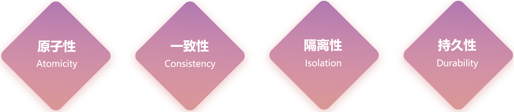

**场景：** 学工部整个部门解散了，该部门及部门下的员工都需要删除了。


**操作：**

- 删除学工部
- 删除学工部的员工

**问题：** 如果删除部门成功了，而删除该部门的员工时失败了，此时就造成了数据的不一致。


要解决上述的问题，就需要通过数据库中的事务来解决。


## ****介绍****


在实际的业务开发中，有些业务操作要多次访问数据库。需要将多次访问数据库的操作视为一个整体来执行，要么所有的 SQL 语句全部执行成功。如果其中有一条 SQL 语句失败，就进行事务的回滚，所有的 SQL 语句全部执行失败。


简而言之：事务是一组操作的集合，它是一个不可分割的工作单位。事务会把所有的操作作为一个整体一起向系统提交或撤销操作请求，即这些操作要么同时成功，要么同时失败。


**事务作用：** 保证在一个事务中多次操作数据库表中数据时，要么全都成功，要么全都失败。


## ****操作****


MySQL 中有两种方式进行事务的操作：

1. **自动提交事务：** 即执行一条 sql 语句提交一次事务。（默认 MySQL 的事务是自动提交）
2. **手动提交事务：** 先开启，再提交

事务操作有关的 SQL 语句：


| SQL 语句               | 描述       |
| -------------------- | -------- |
| `start transaction;` | 开启手动控制事务 |
| `begin ;`            | 开启手动控制事务 |
| `commit;`            | 提交事务     |
| `rollback;`          | 回滚事务     |


手动提交事务使用步骤：

1. 开启事务 => 执行 SQL 语句 => 成功 => 提交事务
2. 开启事务 => 执行 SQL 语句 => 失败 => 回滚事务

**使用事务控制删除部门和删除该部门下的员工的操作：**


```sql
-- 开启事务
start transaction ;
-- 删除学工部
delete from tb_dept where id = 1;
-- 删除学工部的员工
delete from tb_emp where dept_id = 1;
```


上述的这组 SQ L语句，如果如果执行成功，则提交事务：


```sql
-- 提交事务 (成功时执行)
commit ;
```


否则回滚事务：


```sql
-- 回滚事务 (出错时执行)
rollback ;
```


## ****四大特性****


事务具有以下四个关键特性，通常称为 ACID 特性：

- **原子性（Atomicity）：** 原子性是指事务包装的一组 SQL 语句是一个不可分割的工作单元，事务中的操作要么全部成功，要么全部失败。
- **一致性（Consistency）：** 一个事务完成之后数据都必须处于一致性状态。
	- 如果事务成功的完成，那么数据库的所有变化将生效。
	- 如果事务执行出现错误，那么数据库的所有变化将会被回滚（撤销），返回到原始状态。
- **隔离性（Isolation）：** 多个用户并发的访问数据库时，一个用户的事务不能被其他用户的事务干扰，多个并发的事务之间要相互隔离。
	- 一个事务的成功或者失败对于其他的事务是没有影响。
- **持久性（Durability）：** 一个事务一旦被提交或回滚，它对数据库的改变将是永久性的，哪怕数据库发生异常，重启之后数据亦然存在。



