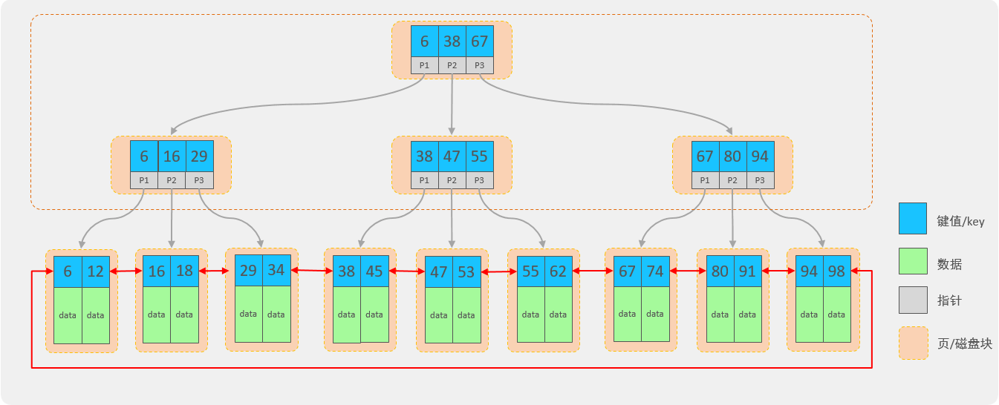

## ****介绍****


索引 (index) 是帮助数据库高效获取数据的数据结构。简单来说，就是使用索引可以提高查询的效率。


**优点：**

1. 提高数据查询的效率，降低数据库的 IO 成本。
2. 通过索引列对数据进行排序，降低数据排序的成本，降低 CPU 消耗。

**缺点：**

1. 索引会占用存储空间。
2. 索引大大提高了查询效率，同时却也降低了 insert、update、delete 的效率。

使用索引与不使用索引的查询对比如下：


```sql
-- 添加索引
create index idx_sku_sn on tb_sku (sn);  #在添加索引时，也需要消耗时间
-- 查询数据（使用了索引）
select * from tb_sku where sn = '100000003145008';
```


## ****结构****


MySQL 数据库支持的索引结构有很多，如：Hash 索引、B+Tree 索引、Full-Text 索引等。如果没有特别指明，通常所说的索引，都是指默认的 B+Tree 结构组织的索引。


二叉树结构：


- 二叉查找树：左边的子节点比父节点小，右边的子节点比父节点大

当向二叉查找树保存数据时，如果按照从大到小（或从小到大）的顺序保存，此时就会形成一个单向链表，搜索性能会打折扣。


此时可以选择平衡二叉树或者是红黑树来解决上述问题。但是在 MySQL 数据库中并没有使用二叉搜索数或二叉平衡数或红黑树来作为索引的结构。


**思考：采用二叉搜索树或者是红黑树来作为索引的结构有什么问题？**


说明： 如果数据结构采用红黑树，那么查询 1000 万条数据时，根据计算，树的高度大约为 23 左右。这种方式确实比之前的方法快很多。
然而，在高并发访问的情况下（例如 100 万用户访问），仍然可能会导致效率降低。


因此，为了减少红黑树的高度，需要增加树的宽度，即不再像红黑树那样，每个节点只能保存一个数据。
可以引入另外一种数据结构，允许一个节点保存多个数据，这样就可以增加宽度，从而降低树的高度。
这种数据结构的一个例子就是 B+Tree，它可以满足上述需求。


B+Tree 结构：




- 每一个节点，可以存储多个 key（有 n 个 key，就有 n 个指针）。
- 节点分为：叶子节点、非叶子节点。
- 叶子节点，就是最后一层子节点，所有的数据都存储在叶子节点上。
- 非叶子节点，不是树结构最下面的节点，用于索引数据，存储的的是：key 和指针。
- 为了提高范围查询效率，叶子节点形成了一个双向链表，便于数据的排序及区间范围查询。

## ****语法****


**创建索引**


```sql
create  [ unique ]  index 索引名 on  表名 (字段名,... ) ;
```


**案例：为 tb_emp 表的 name 字段建立一个索引**


```sql
create index idx_emp_name on tb_emp(name);
```


在创建表时，如果添加了主键和唯一约束，就会默认创建：主键索引、唯一约束。


**查看索引**


```sql
show  index  from  表名;
```


**案例：查询 tb_emp 表的索引信息**


```sql
show  index  from  tb_emp;
```


**删除索引**


```sql
drop  index  索引名  on  表名;
```


**案例：删除 tb_emp 表中 name 字段的索引**


```sql
drop index idx_emp_name on tb_emp;
```


**注意事项：**

- 主键字段，在建表时，会自动创建主键索引。
- 添加唯一约束时，数据库实际上会添加唯一索引。
