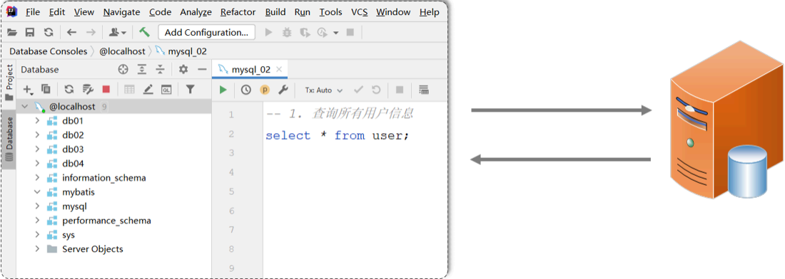
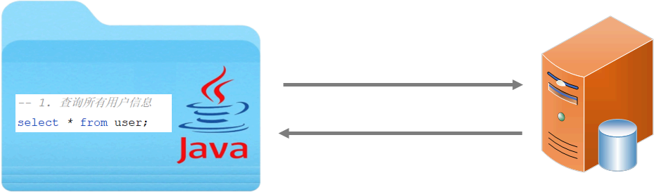
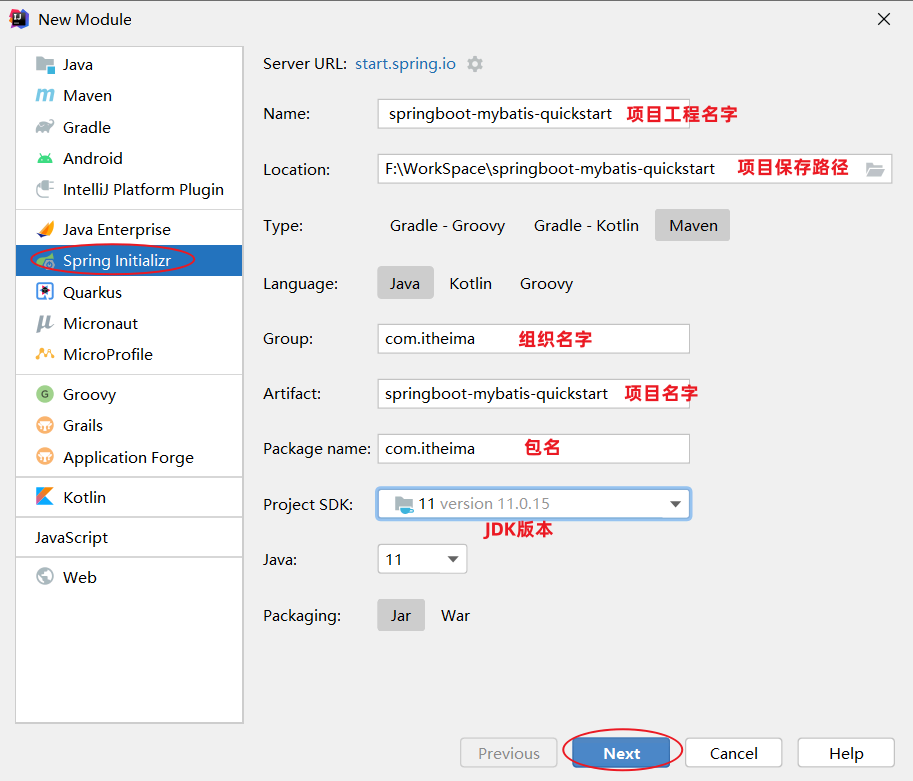
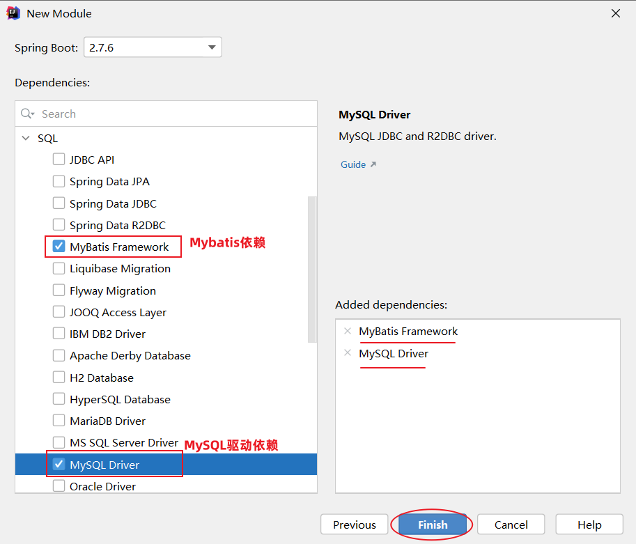
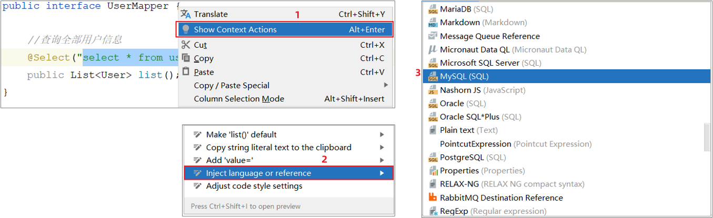
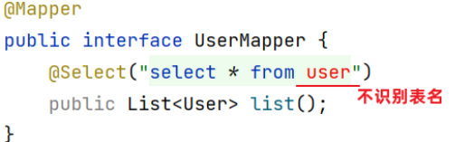
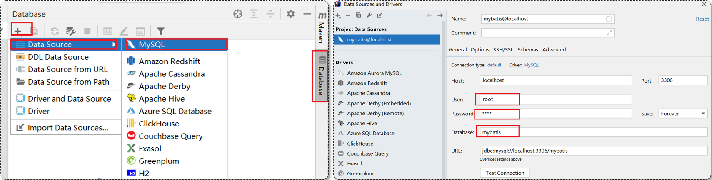

在学习 MySQL 数据库时，我们通常使用图形化客户端工具（如 IDEA、DataGrip）来操作数据库。在客户端工具中，编写增删改查的 SQL 语句，并将其发送给 MySQL 数据库管理系统执行，数据库管理系统执行 SQL 语句并返回执行结果。

- 增删改操作：返回受影响行数
- 查询操作：返回结果集（查询的结果）

作为后端程序开发人员，通常会使用 Java 程序来完成对数据库的操作，而 Mybatis 是目前主流的 Java 程序操作数据库的方式。


## ******什么是 MyBatis?******


MyBatis 是一款优秀的**持久层**框架，用于简化 JDBC 的开发。MyBatis 本是 Apache 的一个开源项目 iBatis，2010 年这个项目由 apache 迁移到了 google code，并且改名为 MyBatis。2013 年 11 月迁移到 Github。


**持久层**：指的是就是数据访问层 (DAO)，是用来操作数据库的。


**框架**：是一个半成品软件，是一套可重用的、通用的、软件基础代码模型。在框架的基础上进行软件开发更加高效、规范、通用、可拓展。


接下来，我们将通过一个入门程序，让大家快速感受一下通过 Mybatis 如何来操作数据库。


## ****入门程序分析****


**需求**：使用 Mybatis 查询所有用户数据。


以前我们是在图形化客户端工具中编写 SQL 查询代码，发送给数据库执行，数据库执行后返回操作结果。





现在使用 Mybatis 操作数据库，就是在 Mybatis 中编写 SQL 查询代码，发送给数据库执行，数据库执行后返回结果。





**Mybatis 操作数据库的步骤**：

1. 准备工作 (创建 SpringBoot 工程、数据库表 user、实体类 User)
2. 引入 Mybatis 的相关依赖，配置 Mybatis (数据库连接信息)
3. 编写 SQL 语句 (注解/XML)

## ****入门程序实现****


### ****准备工作****


#### ****创建 SpringBoot 工程****


创建 SpringBoot 工程，并导入 Mybatis 的起步依赖、MySQL 的驱动包。项目工程创建完成后，会自动在 pom.xml 文件中，导入 Mybatis 依赖和 MySQL 驱动依赖。








#### ****数据准备****


创建用户表 `user`，并创建对应的实体类 `User`。


**用户表**：


```sql
create database if not exists mybatis;

use mybatis;

-- 用户表
create table user
(
    id     int unsigned primary key auto_increment comment 'ID',
    name   varchar(100) comment '姓名',
    age    tinyint unsigned comment '年龄',
    gender tinyint unsigned comment '性别, 1:男, 2:女',
    phone  varchar(11) comment '手机号'
) comment '用户表';
-- 测试数据
insert into user(id, name, age, gender, phone)
VALUES (null, '白眉鹰王', 55, '1', '18800000000');
insert into user(id, name, age, gender, phone)
VALUES (null, '金毛狮王', 45, '1', '18800000001');
insert into user(id, name, age, gender, phone)
VALUES (null, '青翼蝠王', 38, '1', '18800000002');
insert into user(id, name, age, gender, phone)
VALUES (null, '紫衫龙王', 42, '2', '18800000003');
insert into user(id, name, age, gender, phone)
VALUES (null, '光明左使', 37, '1', '18800000004');
insert into user(id, name, age, gender, phone)
VALUES (null, '光明右使', 48, '1', '18800000005');
```


**实体类**：


实体类的属性名与表中的字段名一一对应。


```java
package com.itheima.pojo;

public class User {
    private Integer id;   //id（主键）
    private String name;  //姓名
    private Short age;    //年龄
    private Short gender; //性别
    private String phone; //手机号

    public void setId(Integer id) {
        this.id = id;
    }

    public void setName(String name) {
        this.name = name;
    }

    public void setAge(Short age) {
        this.age = age;
    }

    public void setGender(Short gender) {
        this.gender = gender;
    }

    public void setPhone(String phone) {
        this.phone = phone;
    }

    public Integer getId() {
        return id;
    }

    public String getName() {
        return name;
    }

    public Short getAge() {
        return age;
    }

    public Short getGender() {
        return gender;
    }

    public String getPhone() {
        return phone;
    }

    @Override
    public String toString() {
        return "User{" +
                "id=" + id +
                ", name='" + name + '\'' +
                ", age=" + age +
                ", gender=" + gender +
                ", phone='" + phone + '\'' +
                '}';
    }

    public User() {
    }

    public User(Integer id, String name, Short age, Short gender, String phone) {
        this.id = id;
        this.name = name;
        this.age = age;
        this.gender = gender;
        this.phone = phone;
    }
}
```


### ****配置 Mybatis****


在使用 IDEA 客户端工具连接 MySQL 数据库时，需要配置：

- MySQL 驱动类
- 登录名
- 密码
- 数据库连接字符串

基于上述分析，在 Mybatis 中要连接数据库，同样也需要以上 4 个参数配置。


在 SpringBoot 项目中，可以编写 `application.properties` 文件，配置数据库连接信息。我们需要配置数据库连接的基本信息，包括：`driver-class-name`、`url` 、`username`，`password`。


```plain text
## ****驱动类名称****
spring.datasource.driver-class-name=com.mysql.cj.jdbc.Driver
## ****数据库连接的 url****
spring.datasource.url=jdbc:mysql://localhost:3306/mybatis
## ****连接数据库的用户名****
spring.datasource.username=root
## ****连接数据库的密码****
spring.datasource.password=1234
```

- `spring.datasource.driver-class-name`: 数据库驱动类名，用于加载数据库驱动。
- `spring.datasource.url`: 数据库连接 URL，指定数据库的地址、端口和数据库名。
- `spring.datasource.username`: 连接数据库的用户名。
- `spring.datasource.password`: 连接数据库的密码。

### ****编写 SQL 语句****


在创建出来的 SpringBoot 工程中，在引导类所在包下，再创建一个包 `mapper`。在 `mapper` 包下创建一个接口 `UserMapper` ，这是一个持久层接口（Mybatis 的持久层接口规范一般都叫 `XxxMapper`）。


**UserMapper**：


```java
package com.itheima.mapper;

import com.itheima.pojo.User;
import org.apache.ibatis.annotations.Mapper;
import org.apache.ibatis.annotations.Select;

import java.util.List;

@Mapper
public interface UserMapper {
    // 查询所有用户信息
    @Select("select * from user")
    public List<User> list();
}
```

- `@Mapper` 注解：表示是 Mybatis 中的 Mapper 接口。程序运行时：框架会自动生成接口的实现类对象 (代理对象)，并给交 Spring 的 IOC 容器管理。
- `@Select` 注解：代表的就是 select 查询，用于书写 select 查询语句。
- `List<User> list()`: 定义了一个查询所有用户的接口方法，Mybatis 会根据 `@Select` 注解中的 SQL 语句，自动生成该方法的实现。

### ****单元测试****


在创建出来的 SpringBoot 工程中，在 `src` 下的 `test` 目录下，已经自动帮我们创建好了测试类 
`SpringbootMybatisQuickstartApplicationTests.java`，并且在测试类上已经添加了注解 `@SpringBootTest`，代表该测试类已经与 SpringBoot 整合。该测试类在运行时，会自动通过引导类加载 Spring 的环境（IOC 容器）。我们要测试哪个 bean 对象，就可以直接通过 `@Autowired` 注解直接将其注入进行，然后就可以测试了。


**测试类代码如下**：


```java
package com.itheima;

import com.itheima.mapper.UserMapper;
import com.itheima.pojo.User;
import org.junit.jupiter.api.Test;
import org.springframework.beans.factory.annotation.Autowired;
import org.springframework.boot.test.context.SpringBootTest;

import java.util.List;

@SpringBootTest
class SpringbootMybatisQuickstartApplicationTests {
    @Autowired
    private UserMapper userMapper;

    @Test
    public void testSelect() {
        List<User> users = userMapper.list();
        for (User user : users) {
            System.out.println(user);
        }
    }
}
```

- `@SpringBootTest`: SpringBoot 的测试注解，用于指定测试类，并加载 SpringBoot 环境。
- `@Autowired`: Spring 的自动装配注解，用于将 `UserMapper` 接口的实现类对象注入到测试类中。
- `userMapper.list()`: 调用 `UserMapper` 接口的 `list()` 方法，查询所有用户数据。

**运行结果**：


```plain text
User{id=1, name='白眉鹰王', age=55, gender=1, phone='18800000000'}
User{id=2, name='金毛狮王', age=45, gender=1, phone='18800000001'}
User{id=3, name='青翼蝠王', age=38, gender=1, phone='18800000002'}
User{id=4, name='紫衫龙王', age=42, gender=2, phone='18800000003'}
User{id=5, name='光明左使', age=37, gender=1, phone='18800000004'}
User{id=6, name='光明右使', age=48, gender=1, phone='18800000005'}
```


## ****解决 SQL 警告与提示****


默认我们在 `UserMapper` 接口上加的 `@Select` 注解中编写 SQL 语句是没有提示的。 如果想让 IDEA 给我们提示对应的 SQL 语句，需要在 IDEA 中配置与 MySQL 数据库的链接。





配置完成之后，发现SQL语句中的关键字有提示了，但还存在不识别表名(列名)的情况：





这是因为 IDEA 和数据库没有建立连接，无法识别表信息。在 IDEA 中配置 MySQL 数据库连接即可解决：





在配置的时候指定连接那个数据库，如上图所示连接的就是 Mybatis 数据库。

