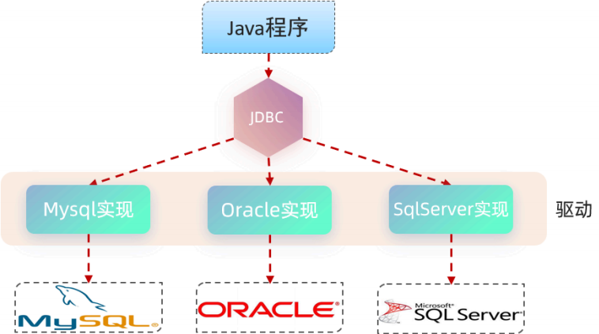

## ****介绍****


通过 Mybatis 的快速入门，我们明白了，通过 Mybatis 可以很方便的进行数据库的访问操作。但是大家要明白，其实 java 语言操作数据库呢，只能通过一种方式：使用 Sun Microsystems 公司提供的 JDBC 规范。Mybatis 框架，就是对原始的 JDBC 程序的封装。


**JDBC (Java DataBase Connectivity)** ，是 Java 语言中用来规范客户端程序如何来访问数据库的应用程序接口，提供了诸如查询和更新数据库中数据的方法。





**本质**：

- Sun Microsystems 公司官方定义的一套操作所有关系型数据库的规范，即接口。
- 各个数据库厂商去实现这套接口，提供数据库驱动 jar 包。
- 我们可以使用这套接口 (JDBC) 编程，真正执行的代码是驱动 jar 包中的实现类。

## ****代码****


下面我们看看原始的 JDBC 程序是如何操作数据库的。操作步骤如下：

1. 注册驱动
2. 获取连接对象
3. 执行 SQL 语句，返回执行结果
4. 处理执行结果
5. 释放资源

在 `pom.xml` 文件中已引入 MySQL 驱动依赖，我们直接编写 JDBC 代码即可。


**JDBC 具体代码实现**：


```java
import com.itheima.pojo.User;
import org.junit.jupiter.api.Test;
import java.sql.Connection;
import java.sql.DriverManager;
import java.sql.ResultSet;
import java.sql.Statement;
import java.util.ArrayList;
import java.util.List;

public class JdbcTest {
    @Test
    public void testJdbc() throws Exception {
        //1. 注册驱动
        Class.forName("com.mysql.cj.jdbc.Driver");
        //2. 获取数据库连接
        String url="jdbc:mysql://127.0.0.1:3306/mybatis";
        String username = "root";
        String password = "1234";
        Connection connection = DriverManager.getConnection(url, username, password);
        //3. 执行 SQL
        Statement statement = connection.createStatement(); //操作 SQL 的对象
        String sql="select id,name,age,gender,phone from user";
        ResultSet rs = statement.executeQuery(sql);//SQL 查询结果会封装在 ResultSet 对象中
        List<User> userList = new ArrayList<>();//集合对象（用于存储 User 对象）
        //4. 处理 SQL 执行结果
        while (rs.next()){
            //取出一行记录中 id、name、age、gender、phone 下的数据
            int id = rs.getInt("id");
            String name = rs.getString("name");
            short age = rs.getShort("age");
            short gender = rs.getShort("gender");
            String phone = rs.getString("phone");
            //把一行记录中的数据，封装到 User 对象中
            User user = new User(id,name,age,gender,phone);
            userList.add(user);//User 对象添加到集合
        }
        //5. 释放资源
        statement.close();
        connection.close();
        rs.close();
        //遍历集合
        for (User user : userList) {
            System.out.println(user);
        }
    }
}
```

- `Class.forName("com.mysql.cj.jdbc.Driver")`: 注册 MySQL 驱动，将 MySQL 驱动加载到 JVM 中。
- `DriverManager.getConnection(url, username, password)`: 获取数据库连接对象 `Connection`，`url` 指定数据库连接的 URL，`username` 和 `password` 指定连接数据库的用户名和密码。
- `connection.createStatement()`: 创建 SQL 语句执行对象 `Statement`，用于执行 SQL 语句。
- `statement.executeQuery(sql)`: 执行 SQL 查询语句，并将查询结果封装到 `ResultSet` 对象中。
- `rs.next()`: 将光标移动到下一行，判断是否还有数据。
- `rs.getInt("id")`, `rs.getString("name")` 等：从 `ResultSet` 对象中获取指定列的数据。
- `statement.close()`, `connection.close()`, `rs.close()`: 释放资源，关闭 SQL 语句执行对象、数据库连接对象和结果集对象。

**DriverManager(类)**：数据库驱动管理类。


作用：

1. 注册驱动
2. 创建 java 代码和数据库之间的连接，即获取 Connection 对象

**Connection(接口)**：建立数据库连接的对象


作用：用于建立 java 程序和数据库之间的连接


**Statement(接口)**：数据库操作对象 (执行 SQL 语句的对象)。


作用：用于向数据库发送 sql 语句


**ResultSet(接口)**：结果集对象（一张虚拟表）


作用：sql 查询语句的执行结果会封装在 ResultSet 中


通过上述代码，我们看到直接基于 JDBC 程序来操作数据库，代码实现非常繁琐，所以在项目开发中，我们很少使用。 在项目开发中，通常会使用 Mybatis 这类的高级技术来操作数据库，从而简化数据库操作、提高开发效率。


## ****问题分析****


原始的 JDBC 程序，存在以下几点问题：

1. 数据库链接的四要素 (驱动、链接、用户名、密码) 全部硬编码在 java 代码中
2. 查询结果的解析及封装非常繁琐
3. 每一次查询数据库都需要获取连接, 操作完毕后释放连接, 资源浪费, 性能降低

## ****技术对比****


分析了 JDBC 的缺点之后，我们再来看一下在 Mybatis 中，是如何解决这些问题的：

1. 数据库连接四要素 (驱动、链接、用户名、密码)，都配置在 SpringBoot 默认的配置文件 `application.properties` 中。
2. 查询结果的解析及封装，由 Mybatis 自动完成映射封装，我们无需关注。
3. 在 Mybatis 中使用了数据库连接池技术，从而避免了频繁的创建连接、销毁连接而带来的资源浪费。

使用 SpringBoot + Mybatis 的方式操作数据库，能够提升开发效率、降低资源浪费。


而对于 Mybatis 来说，我们在开发持久层程序操作数据库时，需要重点关注以下两个方面：

1. `application.properties`

	```plain text
	## 驱动类名称
	spring.datasource.driver-class-name=com.mysql.cj.jdbc.Driver
	## 数据库连接的 url
	spring.datasource.url=jdbc:mysql://localhost:3306/mybatis
	## 连接数据库的用户名
	spring.datasource.username=root
	## 连接数据库的密码
	spring.datasource.password=1234
	```

2. Mapper 接口（编写 SQL 语句）

	```java
	@Mapper
	public interface UserMapper {
	    @Select("select id, name, age, gender, phone from user")
	    public List<User> list();
	}
	```

