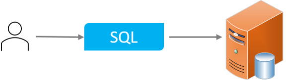
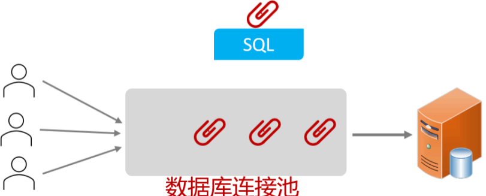

在前面我们所讲解的 Mybatis 中，使用了数据库连接池技术，避免频繁的创建连接、销毁连接而带来的资源浪费。下面我们就具体的了解下数据库连接池。


## ****介绍****


**没有使用数据库连接池**：


客户端执行 SQL 语句：要先创建一个新的连接对象，然后执行 SQL 语句，SQL 语句执行后又需要关闭连接对象从而释放资源，每次执行 SQL 时都需要创建连接、销毁链接，这种频繁的重复创建销毁的过程是比较耗费计算机的性能。





**数据库连接池**：


数据库连接池是一个容器，它负责分配和管理数据库连接（Connection）。程序启动时，会在数据库连接池（容器）中创建一定数量的 `Connection` 对象。 这样做允许应用程序重复使用现有的数据库连接，而不是每次都重新建立连接。


当客户端需要执行 SQL 时，它首先从连接池中获取一个 `Connection` 对象，然后执行 SQL 语句。 SQL 语句执行完毕后，释放 `Connection` 对象时，该对象会被归还给连接池（`Connection` 对象可以被复用）。


如果客户端获取到 `Connection` 对象后，该对象一直处于空闲状态，即没有访问数据库， 并且数据库连接池检测到 `Connection` 对象的空闲时间超过了连接池中预设的最大空闲时间，此时数据库连接池会自动释放掉该连接对象，以优化资源利用。





**数据库连接池的好处**：

1. 资源重用
2. 提升系统响应速度
3. 避免数据库连接遗漏

## ****产品****


要怎么样实现数据库连接池呢？


官方 (Sun Microsystems) 提供了数据库连接池标准（`javax.sql.DataSource` 接口）

- 功能：获取连接。

	```java
	public Connection getConnection() throws SQLException;
	```

- 第三方组织必须按照 DataSource 接口实现。

**常见的数据库连接池**：

- C3P0
- DBCP
- Druid
- Hikari (SpringBoot 默认)

现在使用更多的是：Hikari、Druid （性能更优越）

- **Hikari**（追光者） [默认的连接池]
- **Druid**（德鲁伊）

Druid 连接池是阿里巴巴开源的数据库连接池项目。功能强大，性能优秀，是 Java 语言最好的数据库连接池之一。


如果我们想把默认的数据库连接池切换为 Druid 数据库连接池，只需要完成以下两步操作即可：

1. 在 pom.xml 文件中引入依赖

	```xml
	<dependency>
	    <!-- Druid 连接池依赖 -->
	    <groupId>com.alibaba</groupId>
	    <artifactId>druid-spring-boot-starter</artifactId>
	    <version>1.2.8</version>
	</dependency>
	```

2. 在 application.properties 中引入数据库连接配置

	**方式 1**：


	```plain text
	spring.datasource.druid.driver-class-name=com.mysql.cj.jdbc.Driver
	spring.datasource.druid.url=jdbc:mysql://localhost:3306/mybatis
	spring.datasource.druid.username=root
	spring.datasource.druid.password=1234
	```


	**方式 2**：


	```plain text
	spring.datasource.driver-class-name=com.mysql.cj.jdbc.Driver
	spring.datasource.url=jdbc:mysql://localhost:3306/mybatis
	spring.datasource.username=root
	spring.datasource.password=1234
	```

