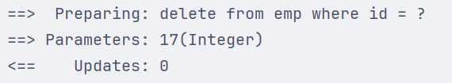

## ****需求****


基于《tlias 智能学习辅助系统》原型，完成员工管理的需求开发，包含以下功能：

1. **查询**：根据主键 ID 查询、条件查询
2. **新增**
3. **更新**
4. **删除**：根据主键 ID 删除、根据主键 ID 批量删除

## ****准备****


在实施开发前，需要进行以下准备工作：

1. **准备数据库表**：创建 `dept`（部门表）和 `emp`（员工表）

	```sql
	-- 部门管理
	create table dept
	(
	    id          int unsigned primary key auto_increment comment '主键ID',
	    name        varchar(10) not null unique comment '部门名称',
	    create_time datetime    not null comment '创建时间',
	    update_time datetime    not null comment '修改时间'
	) comment '部门表';
	
	insert into dept (id, name, create_time, update_time)
	values (1, '学工部', now(), now()),
	       (2, '教研部', now(), now()),
	       (3, '咨询部', now(), now()),
	       (4, '就业部', now(), now()),
	       (5, '人事部', now(), now());
	
	
	-- 员工管理
	create table emp
	(
	    id          int unsigned primary key auto_increment comment 'ID',
	    username    varchar(20)      not null unique comment '用户名',
	    password    varchar(32) default '123456' comment '密码',
	    name        varchar(10)      not null comment '姓名',
	    gender      tinyint unsigned not null comment '性别, 说明: 1 男, 2 女',
	    image       varchar(300) comment '图像',
	    job         tinyint unsigned comment '职位, 说明: 1 班主任,2 讲师, 3 学工主管, 4 教研主管, 5 咨询师',
	    entrydate   date comment '入职时间',
	    dept_id     int unsigned comment '部门ID',
	    create_time datetime         not null comment '创建时间',
	    update_time datetime         not null comment '修改时间'
	) comment '员工表';
	
	INSERT INTO emp
	(id, username, password, name, gender, image, job, entrydate, dept_id, create_time, update_time)
	VALUES (1, 'jinyong', '123456', '金庸', 1, '1.jpg', 4, '2000-01-01', 2, now(), now()),
	       (2, 'zhangwuji', '123456', '张无忌', 1, '2.jpg', 2, '2015-01-01', 2, now(), now()),
	       (3, 'yangxiao', '123456', '杨逍', 1, '3.jpg', 2, '2008-05-01', 2, now(), now()),
	       (4, 'weiyixiao', '123456', '韦一笑', 1, '4.jpg', 2, '2007-01-01', 2, now(), now()),
	       (5, 'changyuchun', '123456', '常遇春', 1, '5.jpg', 2, '2012-12-05', 2, now(), now()),
	       (6, 'xiaozhao', '123456', '小昭', 2, '6.jpg', 3, '2013-09-05', 1, now(), now()),
	       (7, 'jixiaofu', '123456', '纪晓芙', 2, '7.jpg', 1, '2005-08-01', 1, now(), now()),
	       (8, 'zhouzhiruo', '123456', '周芷若', 2, '8.jpg', 1, '2014-11-09', 1, now(), now()),
	       (9, 'dingminjun', '123456', '丁敏君', 2, '9.jpg', 1, '2011-03-11', 1, now(), now()),
	       (10, 'zhaomin', '123456', '赵敏', 2, '10.jpg', 1, '2013-09-05', 1, now(), now()),
	       (11, 'luzhangke', '123456', '鹿杖客', 1, '11.jpg', 5, '2007-02-01', 3, now(), now()),
	       (12, 'hebiweng', '123456', '鹤笔翁', 1, '12.jpg', 5, '2008-08-18', 3, now(), now()),
	       (13, 'fangdongbai', '123456', '方东白', 1, '13.jpg', 5, '2012-11-01', 3, now(), now()),
	       (14, 'zhangsanfeng', '123456', '张三丰', 1, '14.jpg', 2, '2002-08-01', 2, now(), now()),
	       (15, 'yulianzhou', '123456', '俞莲舟', 1, '15.jpg', 2, '2011-05-01', 2, now(), now()),
	       (16, 'songyuanqiao', '123456', '宋远桥', 1, '16.jpg', 2, '2010-01-01', 2, now(), now()),
	       (17, 'chenyouliang', '123456', '陈友谅', 1, '17.jpg', NULL, '2015-03-21', NULL, now(), now());
	```

2. **创建 SpringBoot 工程**：引入 MyBatis Framework, MySQL Driver 和 lombok 依赖。
3. **配置数据库连接信息**：在 `application.properties` 中配置数据库连接信息。

	```plain text
	## 驱动类名称
	spring.datasource.driver-class-name=com.mysql.cj.jdbc.Driver
	## 数据库连接的url
	spring.datasource.url=jdbc:mysql://localhost:3306/mybatis
	## 连接数据库的用户名
	spring.datasource.username=root
	## 连接数据库的密码
	spring.datasource.password=1234
	```

4. **创建实体类** **`Emp`**：实体类属性采用驼峰命名。

	```java
	package com.itheima.pojo;
	
	import lombok.AllArgsConstructor;
	import lombok.Data;
	import lombok.NoArgsConstructor;
	
	import java.time.LocalDate;
	import java.time.LocalDateTime;
	
	@Data
	@NoArgsConstructor
	@AllArgsConstructor
	public class Emp {
	    private Integer id;
	    private String username;
	    private String password;
	    private String name;
	    private Short gender;
	    private String image;
	    private Short job;
	    private LocalDate entrydate;     // LocalDate类型对应数据表中的date类型
	    private Integer deptId;
	    private LocalDateTime createTime;// LocalDateTime类型对应数据表中的datetime类型
	    private LocalDateTime updateTime;
	}
	```

5. **创建 Mapper 接口** **`EmpMapper`**：

	```java
	/*@Mapper注解：表示当前接口为mybatis中的Mapper接口
	  程序运行时会自动创建接口的实现类对象(代理对象)，并交给Spring的IOC容器管理
	*/
	package com.itheima.mapper;
	
	import org.apache.ibatis.annotations.Mapper;
	
	@Mapper
	public interface EmpMapper {
	}
	```


	`@Mapper` 注解：Mybatis 会在程序运行时自动创建该接口的实现类对象（代理对象），并交给 Spring 的 IOC 容器管理。


## ****删除****


本节主要讲解如何使用 Mybatis 实现根据主键删除数据的功能。


### ******功能实现******

- **SQL 语句**：`delete from emp where id = 17;`
- **Mapper 接口方法**：

	```java
	@Mapper
	public interface EmpMapper {
	
	    /**
	     * 根据id删除数据
	     * @param id    用户id
	     */
	    @Delete("delete from emp where id = #{id}")//使用#{key}方式获取方法中的参数值
	    public void delete(Integer id);
	
	}
	```

	- `@Delete` 注解：用于编写 delete 操作的 SQL 语句。
	- `#{id}`：用于获取方法中的参数值，`id` 是参数名。如果 mapper 接口方法形参只有一个普通类型的参数，`#{...}` 里面的属性名可以随便写，如：`#{id}`、`#{value}`。但是建议保持名字一致。
- **测试**：

	```java
	@SpringBootTest
	class SpringbootMybatisCrudApplicationTests {
	    @Autowired //从Spring的IOC容器中，获取类型是EmpMapper的对象并注入
	    private EmpMapper empMapper;
	    @Test
	    public void testDel(){
	        //调用删除方法
	        empMapper.delete(16);
	    }
	}
	```


	使用 `@Autowired` 注解注入 `EmpMapper` 对象，并调用 `delete` 方法删除数据。


### ******日志输出******


Mybatis 可以通过配置日志，查看 SQL 语句的执行情况、传递的参数以及执行结果。

- 在 `application.properties` 文件中添加以下配置：

	```plain text
	#指定mybatis输出日志的位置, 输出控制台
	mybatis.configuration.log-impl=org.apache.ibatis.logging.stdout.StdOutImpl
	```


	开启日志后，再次运行单元测试，可以在控制台中看到输出的 SQL 语句信息。

- **预编译 SQL**

	输出的 SQL 语句类似于 `delete from emp where id = ?`，其中 `?` 是占位符，这种 SQL 语句称为预编译 SQL。


	


	预编译 SQL 有两个优势：

	1. **性能更高**：预编译 SQL 只编译一次，后续执行时直接使用缓存的编译结果。
	2. **更安全（防止 SQL 注入）**：预编译 SQL 会将参数进行转义，防止 SQL 注入。

### ******预编译 SQL******


#### ******介绍******


预编译SQL有两个优势：

1. **性能更高：**预编译SQL，编译一次之后会将编译后的SQL语句缓存起来，后面再次执行这条语句时，不会再次编译。（只是输入的参数不同）
2. **更安全**（防止 SQL 注入）：将敏感字进行转义，保障SQL的安全性。

#### ******SQL 注入******


SQL 注入是通过操作输入的数据来修改事先定义好的 SQL 语句，以达到执行代码对服务器进行攻击的方法。


由于没有对用户输入进行充分检查，而 SQL 又是拼接而成，在用户输入参数时，在参数中添加一些 SQL 关键字，达到改变 SQL 运行结果的目的，也可以完成恶意攻击。


#### ******参数占位符******


Mybatis 提供的参数占位符有两种：`#{...}` 、`${...}`

- `#{...}`
	- 执行 SQL 时，会将 `#{...}` 替换为 `?`，生成预编译 SQL，会自动设置参数值
	- 使用时机：参数传递，都使用 `#{...}`
- `${...}`
	- 拼接 SQL。直接将参数拼接在 SQL 语句中，存在 SQL 注入问题
	- 使用时机：如果对表名、列表进行动态设置时使用

注意事项：在项目开发中，建议使用 `#{...}`，生成预编译 SQL，防止 SQL 注入安全。


## ****新增****


本节主要讲解如何使用 Mybatis 实现新增员工信息的功能。


### ******基本新增******

- **SQL 语句**：

	```sql
	insert into emp(username, name, gender, image, job, entrydate, dept_id, create_time, update_time) values ('songyuanqiao','宋远桥',1,'1.jpg',2,'2012-10-09',2,'2022-10-01 10:00:00','2022-10-01 10:00:00');
	```

- **Mapper 接口方法**：

	```java
	@Mapper
	public interface EmpMapper {
	    @Insert("insert into emp(username, name, gender, image, job, entrydate, dept_id, create_time, update_time) values (#{username}, #{name}, #{gender}, #{image}, #{job}, #{entrydate}, #{deptId}, #{createTime}, #{updateTime})")
	    public void insert(Emp emp);
	}
	```


	`#{...}` 里面写的名称是对象的属性名。

- **测试类**：

	```java
	import com.itheima.mapper.EmpMapper;
	import com.itheima.pojo.Emp;
	import org.junit.jupiter.api.Test;
	import org.springframework.beans.factory.annotation.Autowired;
	import org.springframework.boot.test.context.SpringBootTest;
	import java.time.LocalDate;
	import java.time.LocalDateTime;
	@SpringBootTest
	class SpringbootMybatisCrudApplicationTests {
	    @Autowired
	    private EmpMapper empMapper;
	    @Test
	    public void testInsert(){
	        //创建员工对象
	        Emp emp = new Emp();
	        emp.setUsername("tom");
	        emp.setName("汤姆");
	        emp.setImage("1.jpg");
	        emp.setGender((short)1);
	        emp.setJob((short)1);
	        emp.setEntrydate(LocalDate.of(2000,1,1));
	        emp.setCreateTime(LocalDateTime.now());
	        emp.setUpdateTime(LocalDateTime.now());
	        emp.setDeptId(1);
	        //调用添加方法
	        empMapper.insert(emp);
	    }
	}
	```


### ******主键返回******


在数据添加成功后，有时需要获取插入数据库数据的主键。


**业务场景**：例如，在添加套餐数据时，还需要维护套餐与菜品的关系表数据。在添加套餐的过程中，我们需要在用户界面 (UI) 中录入套餐的基本信息，同时还需要录入套餐与菜品的关联信息。在完成这些信息的录入后，我们需要将套餐的信息以及套餐与菜品的关联信息一并保存到数据库中。


	具体而言，这个过程包括以下两个步骤：首先，我们需要保存套餐的基本信息；然后，再保存套餐与菜品的关联信息。套餐与菜品的关联信息通过向中间表中插入数据来实现，以维护套餐与菜品之间的关系。这个中间表包含两个外键字段：一个是菜品的 `ID`（即当前菜品的 `ID`），另一个是套餐的 `ID`，而这个套餐的 `ID` 指的是此次添加的套餐的 `ID`。因此，在第一步保存完套餐的基本信息后，我们需要将套餐的主键值返回，以供第二步使用。此时，便需要用到主键返回功能。


默认情况下，执行插入操作时，是不会主键值返回的。如果我们想要拿到主键值，需要在 `Mapper` 接口中的方法上添加一个 `Options` 注解，并在注解中指定属性 `useGeneratedKeys=true` 和 `keyProperty="实体类属性名"` 。


**主键返回代码实现**：


	```java
	@Mapper
	public interface EmpMapper {
	
	    //会自动将生成的主键值，赋值给emp对象的id属性
	    @Options(useGeneratedKeys = true,keyProperty = "id")
	    @Insert("insert into emp(username, name, gender, image, job, entrydate, dept_id, create_time, update_time) values (#{username}, #{name}, #{gender}, #{image}, #{job}, #{entrydate}, #{deptId}, #{createTime}, #{updateTime})")
	    public void insert(Emp emp);
	}
	```

	- `@Options(useGeneratedKeys = true,keyProperty = "id")`：
		- `useGeneratedKeys = true`：表示使用数据库自增主键。
		- `keyProperty = "id"`：表示将生成的主键值赋值给 `Emp` 对象的 `id` 属性。
- **测试**：

	```java
	@SpringBootTest
	class SpringbootMybatisCrudApplicationTests {
	    @Autowired
	    private EmpMapper empMapper;
	    @Test
	    public void testInsert(){
	        //创建员工对象
	        Emp emp = new Emp();
	        emp.setUsername("jack");
	        emp.setName("杰克");
	        emp.setImage("1.jpg");
	        emp.setGender((short)1);
	        emp.setJob((short)1);
	        emp.setEntrydate(LocalDate.of(2000,1,1));
	        emp.setCreateTime(LocalDateTime.now());
	        emp.setUpdateTime(LocalDateTime.now());
	        emp.setDeptId(1);
	        //调用添加方法
	        empMapper.insert(emp);
	        System.out.println(emp.getDeptId());
	    }
	}
	```


## ****更新****


本节主要讲解如何使用 Mybatis 实现修改员工信息的功能。

- **SQL 语句**：

	```sql
	update emp set username = 'linghushaoxia', name = '令狐少侠', gender = 1 , image = '1.jpg' , job = 2, entrydate = '2012-01-01', dept_id = 2, update_time = '2022-10-01 12:12:12' where id = 18;
	```

- **Mapper 接口方法**：

	```java
	@Mapper
	public interface EmpMapper {
	    /**
	     * 根据id修改员工信息
	     * @param emp
	     */
	    @Update("update emp set username=#{username}, name=#{name}, gender=#{gender}, image=#{image}, job=#{job}, entrydate=#{entrydate}, dept_id=#{deptId}, update_time=#{updateTime} where id=#{id}")
	    public void update(Emp emp);
	
	}
	```

- **测试类**：

	```java
	@SpringBootTest
	class SpringbootMybatisCrudApplicationTests {
	    @Autowired
	    private EmpMapper empMapper;
	    @Test
	    public void testUpdate(){
	        //要修改的员工信息
	        Emp emp = new Emp();
	        emp.setId(23);
	        emp.setUsername("songdaxia");
	        emp.setPassword(null);
	        emp.setName("老宋");
	        emp.setImage("2.jpg");
	        emp.setGender((short)1);
	        emp.setJob((short)2);
	        emp.setEntrydate(LocalDate.of(2012,1,1));
	        emp.setCreateTime(null);
	        emp.setUpdateTime(LocalDateTime.now());
	        emp.setDeptId(2);
	        //调用方法，修改员工数据
	        empMapper.update(emp);
	    }
	}
	```


## ****查询****


本节主要讲解如何使用 Mybatis 实现查询员工信息的功能。


### ******根据 ID 查询******

- **SQL 语句**：

	```sql
	select id, username, password, name, gender, image, job, entrydate, dept_id, create_time, update_time from emp;
	```

- **Mapper 接口方法**：

	```java
	@Mapper
	public interface EmpMapper {
	    @Select("select id, username, password, name, gender, image, job, entrydate, dept_id, create_time, update_time from emp where id=#{id}")
	    public Emp getById(Integer id);
	}
	```

- **测试类**：

	```java
	@SpringBootTest
	class SpringbootMybatisCrudApplicationTests {
	    @Autowired
	    private EmpMapper empMapper;
	    @Test
	    public void testGetById(){
	        Emp emp = empMapper.getById(1);
	        System.out.println(emp);
	    }
	}
	```


	在测试过程中，可能会发现有几个字段（`deptId`、`createTime`、`updateTime`）是没有数据值的，这是因为实体类属性名和数据库表查询返回的字段名不一致，Mybatis 无法自动封装。


### ******数据封装******


当实体类属性名和数据库表查询返回的字段名不一致时，Mybatis 无法自动封装数据。解决方案有以下几种：

1. **起别名**：在 SQL 语句中，对不一样的列名起别名，别名和实体类属性名一样

	```java
	@Select("select id, username, password, name, gender, image, job, entrydate, " +
	        "dept_id AS deptId, create_time AS createTime, update_time AS updateTime " +
	        "from emp " +
	        "where id=#{id}")
	public Emp getById(Integer id);
	```

2. **手动结果映射**：通过 `@Results` 及 `@Result` 进行手动结果映射

	```java
	@Results({@Result(column = "dept_id", property = "deptId"),
	          @Result(column = "create_time", property = "createTime"),
	          @Result(column = "update_time", property = "updateTime")})
	@Select("select id, username, password, name, gender, image, job, entrydate, dept_id, create_time, update_time from emp where id=#{id}")
	public Emp getById(Integer id);
	```

	- `@Results`：用于定义多个结果映射。
	- `@Result`：用于定义单个结果映射，`column` 属性指定数据库表的字段名，`property` 属性指定实体类的属性名。
3. **开启驼峰命名**（推荐）：如果字段名与属性名符合驼峰命名规则，Mybatis 会自动通过驼峰命名规则映射

	```plain text
	## 在application.properties中添加：
	mybatis.configuration.map-underscore-to-camel-case=true
	```

	- 驼峰命名规则：`abc_xyz` => `abcXyz`
	- 要使用驼峰命名前提是 实体类的属性 与 数据库表中的字段名严格遵守驼峰命名。

### ******条件查询******

- **SQL 语句**：

	```sql
	select id, username, password, name, gender, image, job, entrydate, dept_id, create_time, update_time
	from emp
	where name like '%张%'
	      and gender = 1
	      and entrydate between '2010-01-01' and '2020-01-01 '
	order by update_time desc;
	```

- **Mapper 接口方法**：

	**方式一**


	```java
	@Mapper
	public interface EmpMapper {
	    @Select("select * from emp " +
	            "where name like '%${name}%' " +
	            "and gender = #{gender} " +
	            "and entrydate between #{begin} and #{end} " +
	            "order by update_time desc")
	    public List<Emp> list(String name, Short gender, LocalDate begin, LocalDate end);
	}
	```


	以上方式注意事项：

	1. 方法中的形参名和 SQL 语句中的参数占位符名保持一致
	2. 模糊查询使用 `${...}` 进行字符串拼接，这种方式呢，由于是字符串拼接，并不是预编译的形式，所以效率不高、且存在 sql 注入风险。

	**方式二（解决 SQL 注入风险）**


	使用 MySQL 提供的字符串拼接函数：`concat('%' , '关键字' , '%')`


	```java
	@Mapper
	public interface EmpMapper {
	    @Select("select * from emp " +
	            "where name like concat('%',#{name},'%') " +
	            "and gender = #{gender} " +
	            "and entrydate between #{begin} and #{end} " +
	            "order by update_time desc")
	    public List<Emp> list(String name, Short gender, LocalDate begin, LocalDate end);
	}
	```


### ******参数名说明******


在条件查询功能中，需要保证接口中方法的形参名和 SQL 语句中的参数占位符名相同。当方法中的形参名和 SQL 语句中的占位符参数名不相同时，就会出现问题。

- **SpringBoot 2.x 版本**：SpringBoot 的父工程对 compiler 编译插件进行了默认的参数 parameters 配置，使得在编译时，会在生成的字节码文件中保留原方法形参的名称，所以 `#{...}` 里面可以直接通过形参名获取对应的值。
- **SpringBoot 1.x 版本/单独使用 Mybatis**：在编译时，生成的字节码文件当中，不会保留 Mapper 接口中方法的形参名称，而是使用 `var1`、`var2`、... 这样的形参名字，此时要获取参数值时，就要通过 `@Param` 注解来指定 SQL 语句中的参数名。
