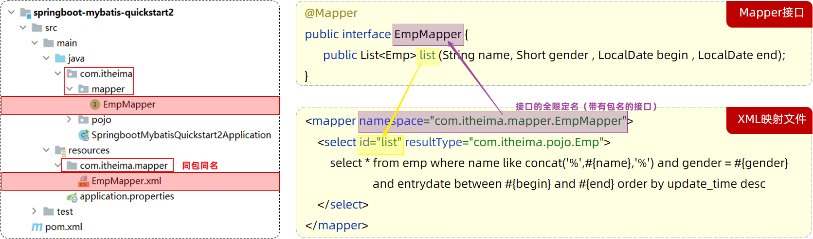
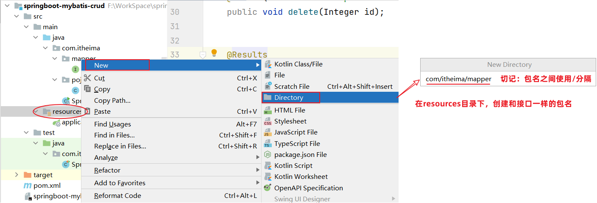
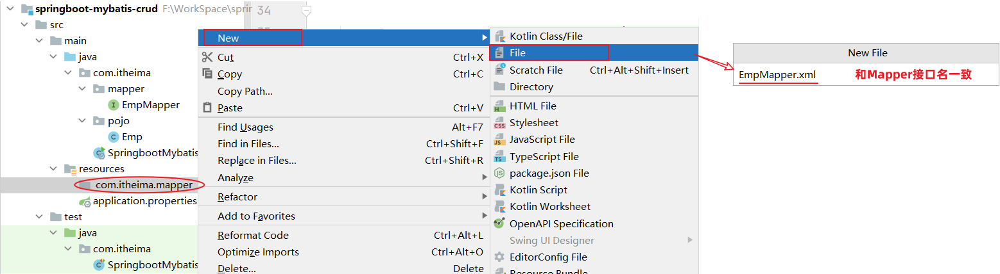
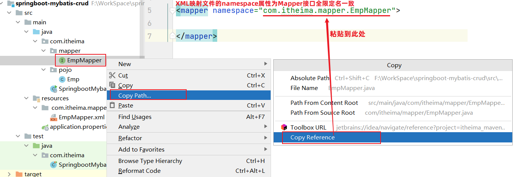
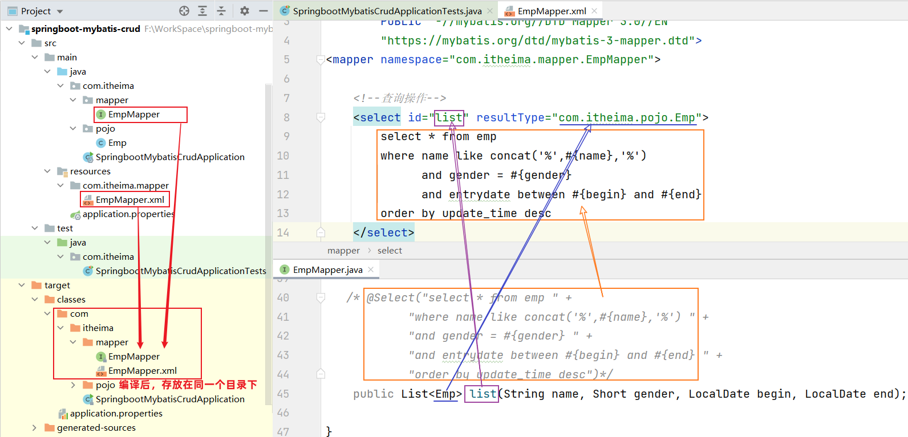

Mybatis 的开发有两种方式：

1. 注解
2. XML

## ****XML 配置文件规范****


使用 Mybatis 的注解方式，主要是来完成一些简单的增删改查功能。如果需要实现复杂的 SQL 功能，建议使用 XML 来配置映射语句，也就是将 SQL 语句写在 XML 配置文件中。


在 Mybatis 中使用 XML 映射文件方式开发，需要符合一定的规范：

1. XML 映射文件的名称与 Mapper 接口名称一致，并且将 XML 映射文件和 Mapper 接口放置在相同包下（同包同名）。
2. XML 映射文件的 namespace 属性为 Mapper 接口全限定名一致。
3. XML 映射文件中 sql 语句的 id 与 Mapper 接口中的方法名一致，并保持返回类型一致。




## ****XML 配置文件实现****


**第 1 步：创建 XML 映射文件**


XML 映射文件的名称与 Mapper 接口名称一致，并且将 XML 映射文件和 Mapper 接口放置在相同包下（同包同名）。








**第 2 步：编写 XML 映射文件**


XML 映射文件中的 DTD 约束，直接从 Mybatis 官网的 [示例](https://mybatis.org/mybatis-3/zh_CN/getting-started.html) 中复制即可。


```xml
<?xml version="1.0" encoding="UTF-8" ?>
<!DOCTYPE mapper
  PUBLIC "-//mybatis.org//DTD Mapper 3.0//EN"
  "https://mybatis.org/dtd/mybatis-3-mapper.dtd">
<mapper namespace="">

</mapper>
```


配置：XML映射文件的 namespace 属性为 Mapper 接口全限定名。





```xml
<?xml version="1.0" encoding="UTF-8" ?>
<!DOCTYPE mapper
        PUBLIC "-//mybatis.org//DTD Mapper 3.0//EN"
        "https://mybatis.org/dtd/mybatis-3-mapper.dtd">
<mapper namespace="com.itheima.mapper.EmpMapper">
</mapper>
```


配置：XML映射文件中sql语句的id与Mapper接口中的方法名一致，并保持返回类型一致。





```xml
<?xml version="1.0" encoding="UTF-8" ?>
<!DOCTYPE mapper
        PUBLIC "-//mybatis.org//DTD Mapper 3.0//EN"
        "https://mybatis.org/dtd/mybatis-3-mapper.dtd">
<mapper namespace="com.itheima.mapper.EmpMapper">
    <!--查询操作-->
    <select id="list" resultType="com.itheima.pojo.Emp">
        select * from emp
        where name like concat('%',#{name},'%')
              and gender = #{gender}
              and entrydate between #{begin} and #{end}
        order by update_time desc
    </select>
</mapper>
```


## ****MybatisX 的使用****


MybatisX 是一款基于 IDEA 的快速开发 Mybatis 的插件，为效率而生。


学习了 Mybatis 中 XML 配置文件的开发方式了，大家可能会存在一个疑问：到底是使用注解方式开发还是使用 XML 方式开发？

- 官方说明：[https://mybatis.net.cn/getting-started.html](https://mybatis.net.cn/getting-started.html)
- 结论：使用 Mybatis 的注解，主要是来完成一些简单的增删改查功能。如果需要实现复杂的 SQL 功能，建议使用 XML 来配置映射语句。
